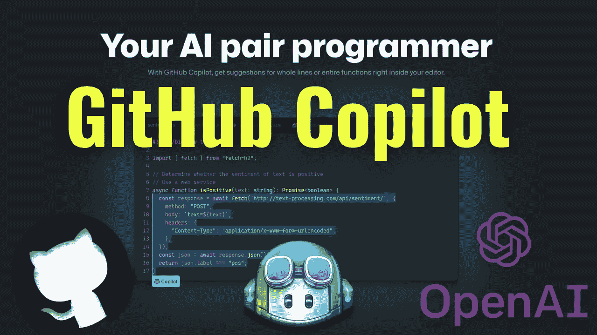
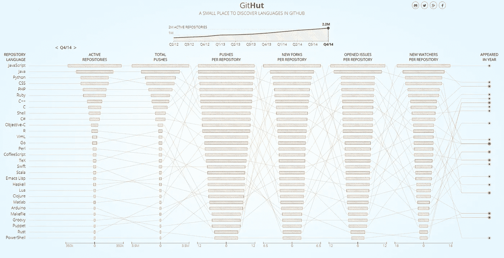
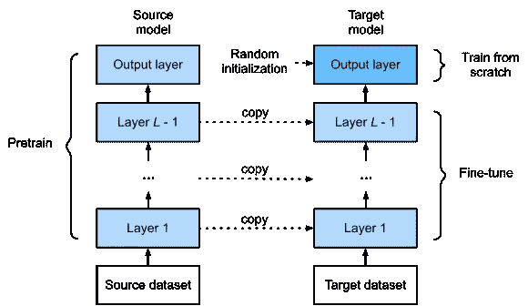

# OpenAI 的新代码生成器:GitHub Copilot(和 Codex)

> 原文：<https://pub.towardsai.net/openais-new-code-generator-github-copilot-and-codex-6031d65e47c1?source=collection_archive---------1----------------------->

## [人工智能](https://towardsai.net/p/category/artificial-intelligence)

## 了解这个人工智能如何从单词中生成代码

> 原载于 [louisbouchard.ai](https://www.louisbouchard.ai/github-copilot/) ，前两天在[我的博客](https://www.louisbouchard.ai/github-copilot/)上看到的！

你可能听说过 GitHub 最近推出的 Copilot 工具，它可以为你生成代码。您可以将这个工具视为代码的自动完成++工具。你给它一个函数名和一些额外的信息，它会非常准确地为你生成代码！但是它不会自动完成你的功能。相反，它会试图理解你试图做什么来产生它。它还能够生成比传统的自动完成工具更大更完整的功能。这是因为它使用了与 GPT 3 相似的模型，这是一个非常强大的自然语言模型，你肯定知道。

如果你不确定或不记得它是如何工作的，你应该读一读一年前 GPT-3 问世时我写的文章。

 [## GPT-3 真的能帮助你和你的公司吗？

### 人工智能如果你想知道 GPT-3 是什么，它对你或你的公司有什么用…

www.louisbouchard.ai](https://www.louisbouchard.ai/can-gpt-3-really-help-you/) 

好的，如你所知，GPT-3 是一个语言模型，所以它不是在代码上训练的，而是自然人类语言。如果你试图从 OpenAI 的 API 中用主要的 GPT-3 模型生成代码，那是行不通的。事实上，在他们为 GitHub copilot 发布的新论文中，OpenAI 在没有任何进一步代码培训的情况下测试了 GPT-3，它准确地解决了 0 个 Python 代码编写问题。那么，他们是如何采用这样一个对代码生成完全无用的强大语言生成模型，并对其进行改造以适应生成代码的新任务的呢？

第一部分很简单。它必须理解用户想要什么，这一点 GPT-3 已经很擅长了(见我上面的文章)。第二部分很难实现，因为 GPT-3 以前从未见过代码，嗯，不是很多。如你所知，作为一个如此强大的语言模型，GPT-3 几乎是基于整个互联网的文本进行训练的。现在，OpenAI 和 GitHub 正试图建立一个类似的模型，但用于代码生成。如果不考虑 GitHub 培训代码的版权问题所带来的隐私困境，你显然不会有比这更好的地方了。我将在最后回到这些隐私问题！

GitHub 统计显示有多少公共存储库。[https://githut.info/](https://githut.info/)

由于 GPT 3 是目前存在的最强大的语言模型，他们从那里开始。他们使用一个非常相似的模型，通过在数十亿行公开可用的 GitHub 代码而不是互联网上的随机文本上训练这个 GPT 模型，来解决问题的第二部分，即生成代码。GPT-3 的强大之处在于它可以学习大量的信息，所以做同样的事情，但专攻代码，肯定会产生一些惊人的结果。更准确地说，他们在 GitHub 上托管的 5400 万个公共软件库上训练了这个改编的 GPT 模型！现在，我们有了一个巨大的模型，它由大量的代码示例训练而成。问题是，如你所知，一个模型只能和它被训练的数据一样好。那么，如果数据是从 GitHub 中随机抽取的，你怎么能确定它是有效的并且写得很好呢？你真的不能确定，这可能会导致很多问题，但他们发现了一个进一步提高模型编码技能的好方法，就是在来自竞争编程网站和持续集成的存储库的代码上进行微调。这意味着代码很可能是好的，写得很好，但是数量较少。

图片来自“潜入深度学习”，图 13.2.1 微调。([https://d2l.ai/](https://d2l.ai/)

他们以监督的方式用这个新的训练数据集对模型进行了微调。这意味着他们在一个更小、更具体的精选样本数据集上第二次训练了同一个模型。微调是一种强大的技术，通常用于改善我们特定需求的结果，而不是从零开始。当用更多的数据训练时，一个模型通常更强大，即使它对我们的任务没有用，并进一步适应我们的任务，而不是用很少的精选数据从零开始训练一个新的模型。说到数据和深度学习，往往是越多越好。

这个模型的后代就是 GitHub Copilot 和 OpenAI API 中的 Codex 模型。当然，Copilot 还不完善，有很多局限性。它不会很快取代程序员，但它显示了惊人的结果，可以加快许多程序员编写简单但乏味的函数和类的工作。正如我提到的，他们在数十亿行公共代码上训练了 copilot 的模型，但来自任何许可证，因为它是与 OpenAI 合作制作的，他们当然会销售这种产品。

他们想从自己开发的强大工具中赚钱，这很酷，但如果是用你的带有限制性许可的代码开发的话，可能会有些复杂。如果你想了解更多关于版权法、GPL 许可和服务条款的问题，我强烈建议你观看 Yannic Kilcher 几天前制作的视频。它在下面的参考文献中有链接。

感谢您的阅读！

## 观看视频中的更多副驾驶示例:

如果你喜欢我的工作，并想与人工智能保持同步，你绝对应该关注我的其他社交媒体账户( [LinkedIn](https://www.linkedin.com/in/whats-ai/) 、 [Twitter](https://twitter.com/Whats_AI) )并订阅我的每周人工智能[简讯](http://eepurl.com/huGLT5) ！

## 支持我:

*   支持我的最好方式是成为这个网站的成员，或者如果你喜欢视频格式，在[**YouTube**](https://www.youtube.com/channel/UCUzGQrN-lyyc0BWTYoJM_Sg)**上订阅我的频道。**
*   **在经济上支持我在 T21 的工作**
*   **跟我来这里上 [**中**](https://whats-ai.medium.com/)**

## **参考资料:**

*   **GitHub 副驾驶:[https://copilot.github.com/](https://copilot.github.com/)**
*   **抄本/副驾驶员文件:[https://arxiv.org/pdf/2107.03374.pdf](https://arxiv.org/pdf/2107.03374.pdf)**
*   **Yannic 关于 GitHub 副驾驶的视频:[https://youtu.be/TrLrBL1U8z0](https://youtu.be/TrLrBL1U8z0)**