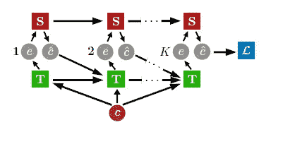

# OpenAI 的可解释机器学习教学方法

> 原文：<https://pub.towardsai.net/openais-pedagogical-method-for-interpretable-machine-learning-dcc833ae1974?source=collection_archive---------1----------------------->

## 一篇试图为理解神经网络如何决策奠定教学基础的论文。

来源:[https://www . LinkedIn . com/learning/learning-xai-explaible-artificial-intelligence/explaible-ai-expanding-the-frontiers-of-artificial-intelligence？autoplay=true](https://www.linkedin.com/learning/learning-xai-explainable-artificial-intelligence/explainable-ai-expanding-the-frontiers-of-artificial-intelligence?autoplay=true)

> 我最近创办了一份专注于人工智能的教育时事通讯，已经有超过 125，000 名订户。《序列》是一份无废话(意思是没有炒作，没有新闻等)的 ML 导向时事通讯，需要 5 分钟阅读。目标是让你与机器学习项目、研究论文和概念保持同步。请通过订阅以下内容来尝试一下:

 [## 序列

### 与机器学习、人工智能和数据发展保持同步的最佳资源…

thesequence.substack.com](https://thesequence.substack.com/) 

解释和诠释知识是现代深度学习系统中最困难的问题之一。在有监督的深度学习系统中，训练模型的过程和模型中建立的知识几乎是无法解释的。然而，对知识的解释是人类学习方式中的一个关键因素。让我们来看一个经典的师生场景，在这个场景中，老师试图用一系列的例子向学生传达一个特定的概念。根据学生的反馈，老师将调整他的解释，并试图选择最合适的例子来提高学生的知识。这种教学过程对人类非常有效，但对神经网络来说却非常失败。

深度学习系统中一些最有趣的场景需要人类和神经网络之间的无缝协作。然而，在大多数情况下，由于双方使用不同的协议，建立协作非常困难。这方面最有趣的论文之一是几年前 OpenAI 发表的。在标题[可解释和教育示例](https://arxiv.org/abs/1711.00694)下，OpenAI 提出了一种方法，试图通过提出一种更具教育意义的方式来解决这一挑战，以技术深度学习系统。

在标题[“可解释的和教学的例子”](https://arxiv.org/abs/1711.00694)下，OpenAI 的研究人员阐述了一个有趣的论文，关于是什么使得理解深度学习系统的知识如此困难。在他们看来，挑战的一部分是大多数深度学习架构依赖于教师和学生的神经网络共同训练，这阻止了两者之间的任何反馈循环。OpenAI 团队没有采用这种模型，而是提出了一种结构，在这种结构中，教师和学生网络可以被迭代训练，从而产生更多可解释的教学策略。

# 可解释的机器学习

OpenAI 可解释教学策略可以被视为两个神经网络(学生和教师)之间的博弈动态。游戏的目标是让学生根据概念的例子来猜测特定的概念，而教师的目标是学会为学生选择最能说明问题的例子。使用图像识别场景作为类比，学生应该尝试猜测特定图像中的概念，而教师应该尝试选择最合适的图像来提高学生的知识。

来源:https://arxiv.org/abs/1711.00694

可解释教学的两阶段技术是这样工作的:“学生”神经网络被给予随机选择的概念输入示例，并使用传统的监督学习方法从这些示例中训练以猜测正确的概念标签。在第二步中,“教师”网络——它有一个要教授的预期概念，并可以访问将概念与例子联系起来的标签——在学生身上测试不同的例子，并查看学生给它们分配了哪些概念标签，最终集中在它需要给出的最小例子集上，让学生猜测预期的概念。

OpenAI 方法的关键是教师和学生网络被迭代训练，而不是联合训练。在传统模型中，两个神经网络将一起训练，选择人类难以解释的例子。OpenAI 技术的目标是产生更多可解释的教学策略，但我们如何真正量化可解释的教学策略？为了评估模型的性能，OpenAI 团队以两个基本指标为中心:

1.评估在每项任务中，所选择的策略与人类设计的过于直观的策略有多相似。

2.评估人类教学中所选策略的有效性。

OpenAI 的研究人员在各种各样的场景中应用了可解释的策略，产生了显著的结果，大大改善了传统技术。更具体地说，可解释教学引导学生模型学习可解释的学习策略，然后约束教师学习可解释的教学策略。