# OpenCV 101 和 Instagram 滤镜

> 原文：<https://pub.towardsai.net/opencv-101-and-instagram-filters-44ae54512aba?source=collection_archive---------2----------------------->

## [计算机视觉](https://towardsai.net/p/category/computer-vision)

## 本教程将是对 OpenCV 和一些基本 Instagram 滤镜的基本介绍

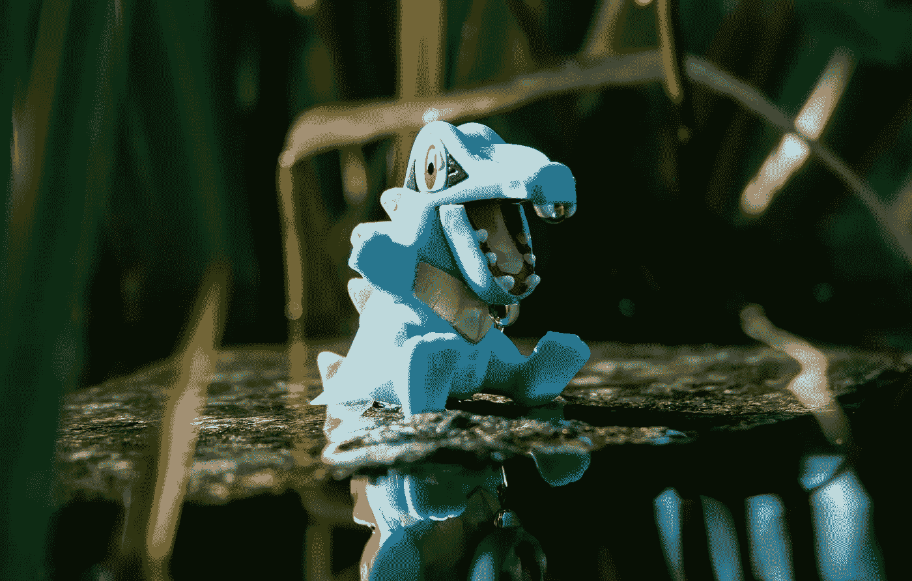

由 [Janis Fasel](https://unsplash.com/@janisfasel?utm_source=unsplash&utm_medium=referral&utm_content=creditCopyText) 在 [Unsplash](https://unsplash.com/s/photos/pokemon?utm_source=unsplash&utm_medium=referral&utm_content=creditCopyText) 上拍摄的照片

OpenCV 是一个主要为计算机视觉而构建的库。你不需要成为图像处理方面的专家来构建一些简单的图像过滤器，如 Instagram 的棕褐色效果、浮雕效果等。我们将讨论以下内容。

*   图像是如何存储的？
*   卷积和滤波器的工作原理
*   阅读和显示图像
*   阅读视频截图和使用网络摄像头
*   一些过滤器和图像处理

# 图像是如何存储的？

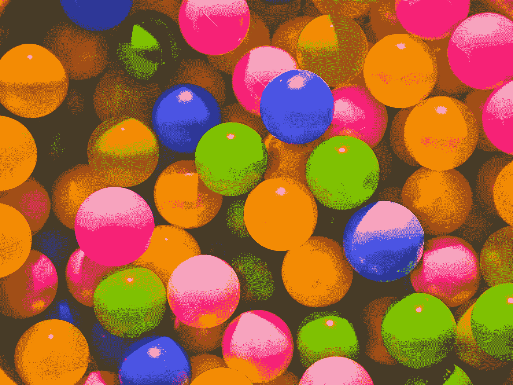

照片由 [Unsplash](https://unsplash.com/s/photos/color?utm_source=unsplash&utm_medium=referral&utm_content=creditCopyText) 上的 [Greyson Joralemon](https://unsplash.com/@greysonjoralemon?utm_source=unsplash&utm_medium=referral&utm_content=creditCopyText) 拍摄

每个图像都是由像素组成的。图像中的像素数量由图像的宽度和高度决定。上面的图像是 3776 x 2832，因此它总共有 3776 x 2832 个像素。对于黑白图像，图像将只有一个通道，但对于彩色图像，如上图所示，将有三个通道，即红色、蓝色和绿色。

> O penCV 以 BGR 格式存储像素。

所有的通道将合并形成最终的图像。因此，要回答这个问题，图像是如何存储的？它以具有 shape (2832，3776，3)的 3D 数组的形式存储。黑色图像将具有全为 0 的 3D 阵列，而白色图像将具有全为 256 的 3D 阵列。

# 卷积和滤波器如何工作？

卷积本质上是将图像矩阵分解成小部分，并在其上放置滤波器矩阵。然后我们处理它并计算输出。下面列出了一些过滤器矩阵。这些矩阵的值需要多年的研究。Instagram 滤镜基本都是这种低级滤镜的组合，比如模糊、对比度变化、颜色变化等。

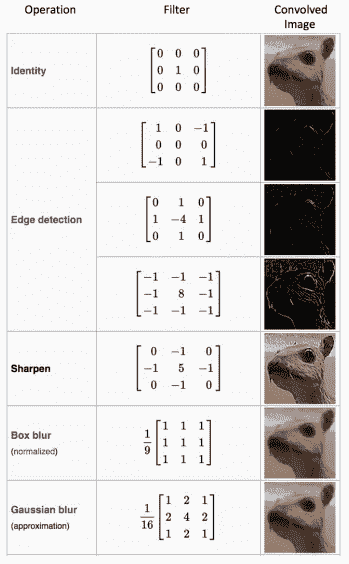

[https://medium . com/@ RaghavPrabhu/understanding-of-convolutionary-neural-network-CNN-deep-learning-99760835 f148](https://medium.com/@RaghavPrabhu/understanding-of-convolutional-neural-network-cnn-deep-learning-99760835f148)

我在下面链接了一个电脑爱好者的视频。它更深入地讲述了卷积以及滤波器如何工作的例子。

OpenCV 已经为我们提供了应用模糊、边缘检测和更多滤镜的功能。对于某些其他过滤器，如棕褐色，我们将不得不开发矩阵，并使用核卷积。

# 安装 OpenCV

```
pip install opencv
```

要导入库，请键入。

```
import cv2
```

我们讨论的所有函数都将是 cv2 包的一部分。

# 阅读和显示图像

```
img = cv2.imread('mainImage.jpg')
```

**imread()** 将图像的路径作为参数，并返回像素值

```
cv2.imshow('Image Display' , img)
cv2.waitKey(5000)
```

**imshow()** 在新窗口中显示图像。第一个参数是窗口的名称，第二个参数是包含像素值的图像对象。默认情况下，窗口弹出后立即关闭，因此我们看不到它。为了解决这个问题，我们手动添加一个等待时间。 **waitKey()** 接收自动关闭窗口前等待的毫秒数。如果传递值 0，窗口将显示无限毫秒，即永远显示，直到您手动关闭它。

# 阅读视频截图和使用网络摄像头

```
cap = cv2.VideoCapture("testvideo.mp4")
```

我们使用 **VideoCapture()** 来阅读视频和使用网络摄像头。它非常类似于 imread()。它接受一个视频路径并读取它。要使用您的网络摄像头，需要将参数设置为 0。这使它能够访问您的默认网络摄像头。

```
webCam = cv2.VideoCapture(0)
```

您还可以使用网络摄像头设置窗口的宽度和高度。您需要知道参数 id 来设置值。我们将使用 **set()** 函数。

```
webCam.set(3 ,500) # id 3 is width
webCam.set(4,500) # id 4 is height
webCam.set(10, 100) #id 10 is brightness
```

视频基本上是一系列图像的集合；因此，我们将需要一个 while 循环和 **imread()** 函数来显示视频。同样的方法也可以用来显示网络摄像头。

```
while True:
    try:
        success , img = cap.read()
        cv2.imshow("Video", img)
        if cv2.waitKey(10) == ord('q'):
            break
    except:
        print('Video End')
        break
```

传递给 **waitkey()** 的值决定了视频的速度。数字越大，速度越慢。如果您输入 0，这意味着无限的等待时间，您将只能看到第一帧。if 语句主要检查用户是否按了“q”键。如果按下“q”键，窗口关闭，然后我们退出 while 循环。

# 常见过滤器

## 原象

```
import cv2

img = cv2.imread('ogImage.jpg')
print(img.shape)
cv2.imshow('Original Picture' , img)
cv2.waitKey(0)
```

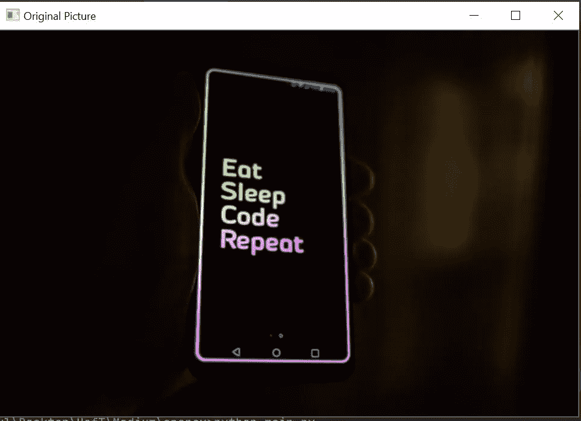

由 [Roman Synkevych](https://unsplash.com/@synkevych?utm_source=unsplash&utm_medium=referral&utm_content=creditCopyText) 在 [Unsplash](https://unsplash.com/s/photos/code?utm_source=unsplash&utm_medium=referral&utm_content=creditCopyText) 上拍摄的照片

图像的形状是

```
(427, 640, 3)
```

像素以 BGR 格式存储。

## 灰度图像

```
img_gray = cv2.cvtColor(img , cv2.COLOR_BGR2GRAY)
cv2.imshow('GrayScale' , img_gray)
```

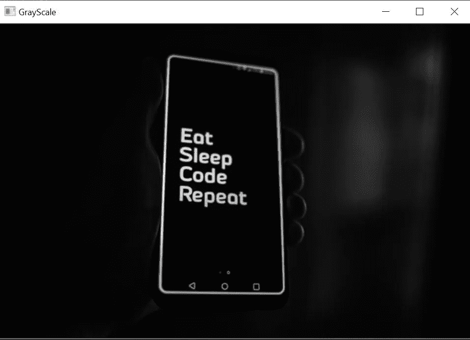

在 [Unsplash](https://unsplash.com/s/photos/code?utm_source=unsplash&utm_medium=referral&utm_content=creditCopyText) 上由 [Roman Synkevych](https://unsplash.com/@synkevych?utm_source=unsplash&utm_medium=referral&utm_content=creditCopyText) 拍摄的照片(灰度)

## 模糊图像

```
img_blur = cv2.GaussianBlur(img , (15,15) , 0)
cv2.imshow('Blur Image', img_blur)
```

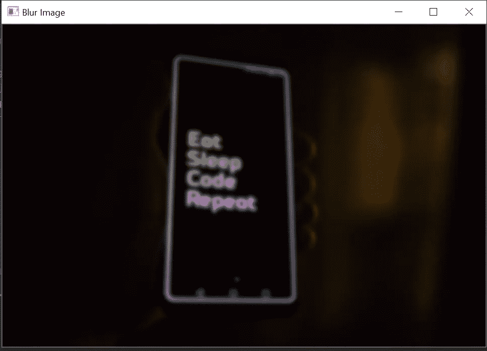

由 [Roman Synkevych](https://unsplash.com/@synkevych?utm_source=unsplash&utm_medium=referral&utm_content=creditCopyText) 在 [Unsplash](https://unsplash.com/s/photos/code?utm_source=unsplash&utm_medium=referral&utm_content=creditCopyText) 上拍摄的照片(使用内核大小 15 的模糊)

内核越大，图片就越模糊

```
img_blur = cv2.GaussianBlur(img , (25,25) , 0)
cv2.imshow('Blur Image', img_blur)
```

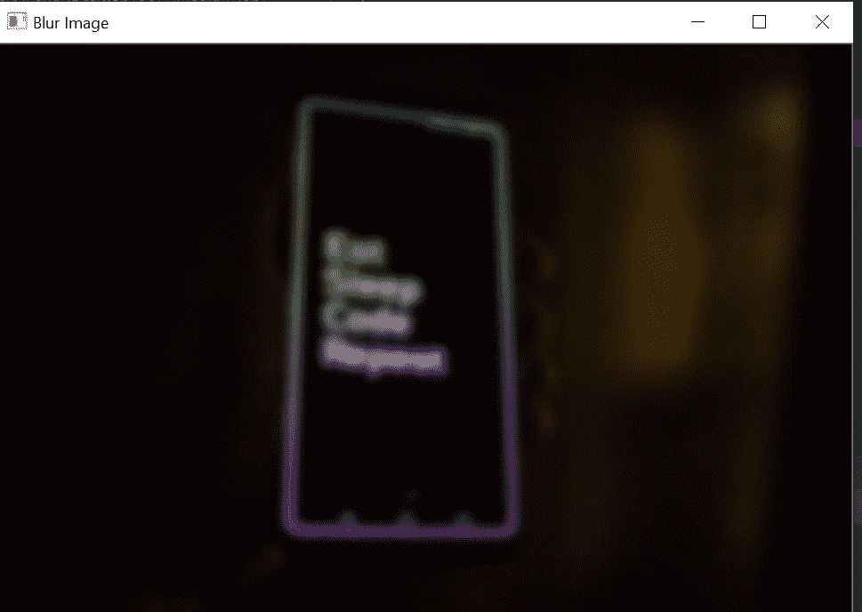

照片由 [Roman Synkevych](https://unsplash.com/@synkevych?utm_source=unsplash&utm_medium=referral&utm_content=creditCopyText) 在 [Unsplash](https://unsplash.com/s/photos/code?utm_source=unsplash&utm_medium=referral&utm_content=creditCopyText) 上拍摄

## 聪明

```
img_bright = cv2.convertScaleAbs(img, beta=100)
cv2.imshow('Less Bright Image', img_bright)
```

随着β值的增加，画面变得更加明亮。要降低亮度，请使用负值。

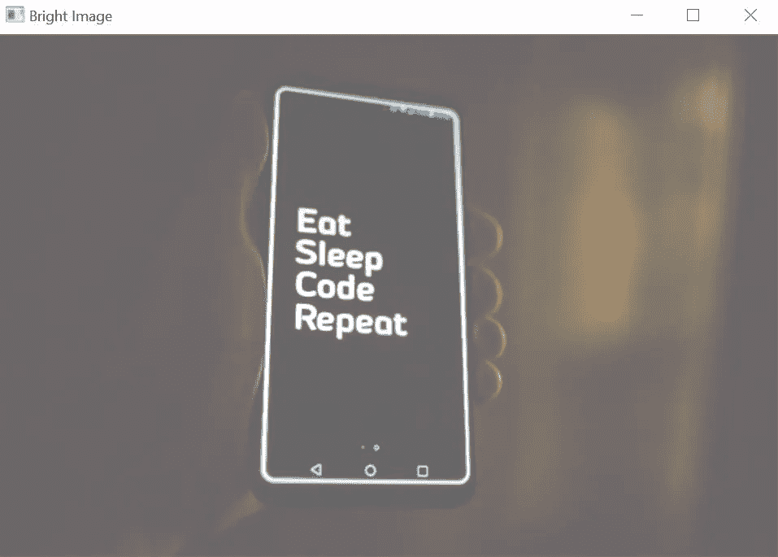

由 [Roman Synkevych](https://unsplash.com/@synkevych?utm_source=unsplash&utm_medium=referral&utm_content=creditCopyText) 在 [Unsplash](https://unsplash.com/s/photos/code?utm_source=unsplash&utm_medium=referral&utm_content=creditCopyText) 上拍摄的照片(Beta = 100)

```
img_bright = cv2.convertScaleAbs(img, beta=-50)
cv2.imshow('Less Bright Image', img_bright)
```

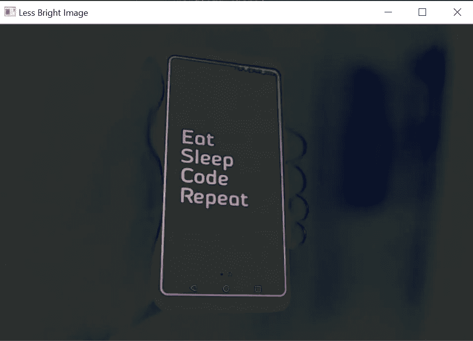

照片由 [Roman Synkevych](https://unsplash.com/@synkevych?utm_source=unsplash&utm_medium=referral&utm_content=creditCopyText) 在 [Unsplash](https://unsplash.com/s/photos/code?utm_source=unsplash&utm_medium=referral&utm_content=creditCopyText) 上拍摄(Beta = 100)

## 边缘检测

```
img_canny = cv2.Canny(img , 100 ,100)
cv2.imshow('Edge Detection Image', img_canny)
```

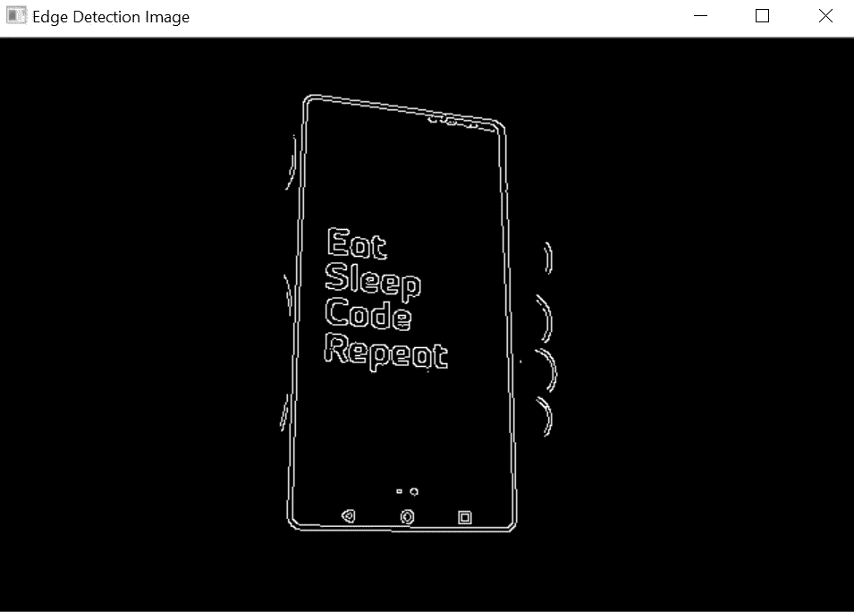

罗曼·辛克维奇在 [Unsplash](https://unsplash.com/s/photos/code?utm_source=unsplash&utm_medium=referral&utm_content=creditCopyText) 上拍摄的照片(Beta = 100)

## 浮雕效果

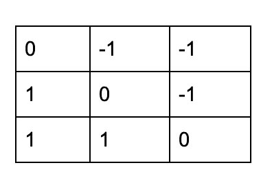

[https://towards data science . com/python-opencv-building-insta gram-like-image-filters-5c 482 C1 c 5079](https://towardsdatascience.com/python-opencv-building-instagram-like-image-filters-5c482c1c5079)

```
kernel = np.array([[0, -1, -1], [1, 0, -1], [1, 1, 0]])
img_sharpen = cv2.filter2D(img, -1, kernel)
cv2.imshow('Embossed Image', img_sharpen)
```

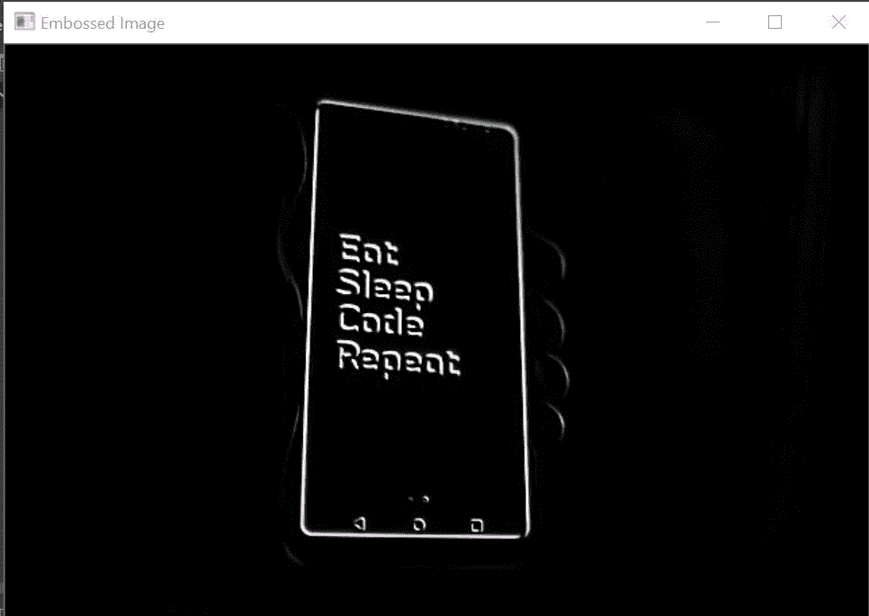

罗曼·辛克维奇在 [Unsplash](https://unsplash.com/s/photos/code?utm_source=unsplash&utm_medium=referral&utm_content=creditCopyText) 上拍摄的照片(浮雕)

## 图像锐化

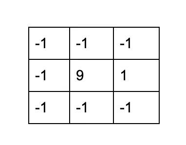

https://towardsdatascience . com/python-opencv-building-insta gram-like-image-filters-5c 482 C1 c 5079

```
kernel = np.array([[-1, -1, -1], [-1, 9, -1], [-1, -1, -1]])
img_sharpen = cv2.filter2D(img, -1, kernel)
cv2.imshow('Sharpened Image', img_sharpen)
```

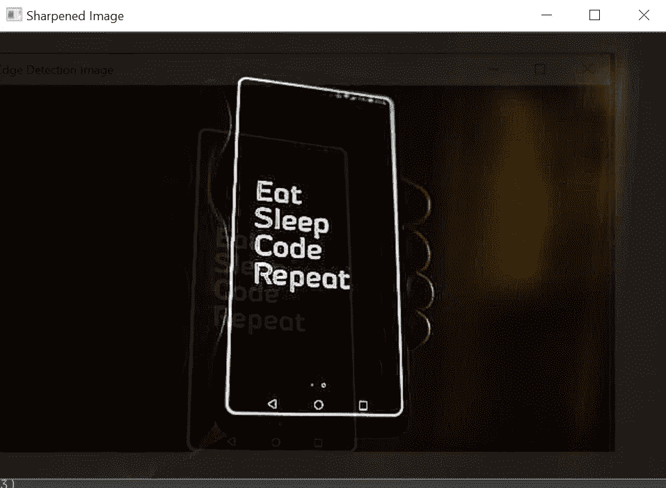

照片由[罗曼·辛克维奇](https://unsplash.com/@synkevych?utm_source=unsplash&utm_medium=referral&utm_content=creditCopyText)在 [Unsplash](https://unsplash.com/s/photos/code?utm_source=unsplash&utm_medium=referral&utm_content=creditCopyText) 上拍摄(锐化)

## 棕褐色效果

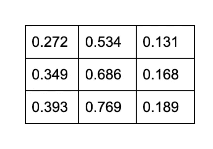

[https://towards data science . com/python-opencv-building-insta gram-like-image-filters-5c 482 C1 c 5079](https://towardsdatascience.com/python-opencv-building-instagram-like-image-filters-5c482c1c5079)

```
kernel = np.array([[0.272, 0.534, 0.131],
                   [0.349, 0.686, 0.168],
                   [0.393, 0.769, 0.189]])
img_sepia = cv2.filter2D(img, -1, kernel)
cv2.imshow('Sharpened Image', img_sepia)
```

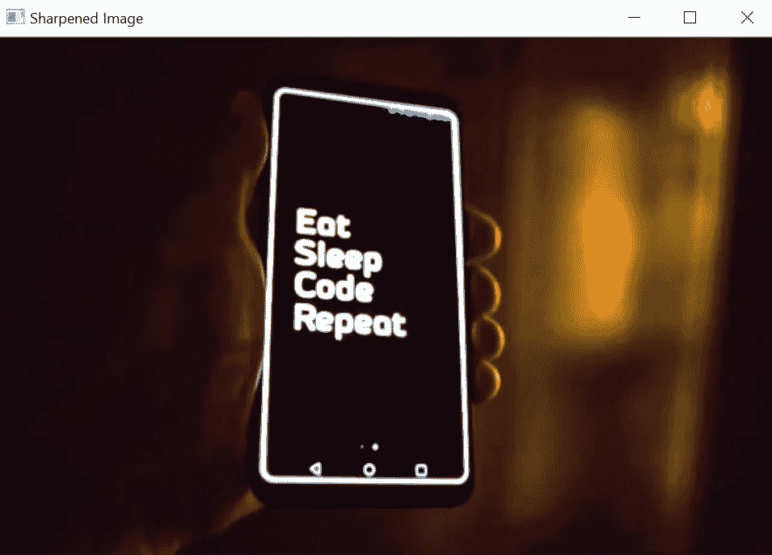

由 [Roman Synkevych](https://unsplash.com/@synkevych?utm_source=unsplash&utm_medium=referral&utm_content=creditCopyText) 在 [Unsplash](https://unsplash.com/s/photos/code?utm_source=unsplash&utm_medium=referral&utm_content=creditCopyText) 上拍摄的照片(棕褐色效果)

# 图像处理

## 图像大小调整

```
img_resize = cv2.resize(img,(200,200))
cv2.imshow('Resized Image', img_resize)
cv2.waitKey(0)
```

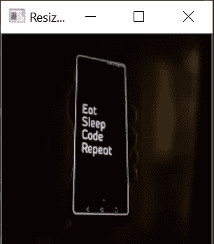

[Roman Synkevych](https://unsplash.com/@synkevych?utm_source=unsplash&utm_medium=referral&utm_content=creditCopyText) 在 [Unsplash](https://unsplash.com/s/photos/code?utm_source=unsplash&utm_medium=referral&utm_content=creditCopyText) 上拍摄的照片(已调整大小)

## 图像裁剪

```
img_cropped = img[0:256 , 0:256]
cv2.imshow('Cropped Image', img_cropped)
```

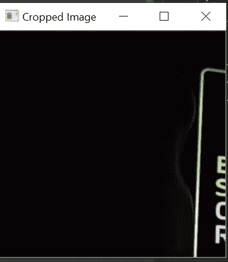

照片由 [Roman Synkevych](https://unsplash.com/@synkevych?utm_source=unsplash&utm_medium=referral&utm_content=creditCopyText) 在 [Unsplash](https://unsplash.com/s/photos/code?utm_source=unsplash&utm_medium=referral&utm_content=creditCopyText) 拍摄(已裁剪)

由于图像是以矩阵的形式存储的，我们可以对其进行切片来裁剪图像。

# 资源

[](https://towardsdatascience.com/python-opencv-building-instagram-like-image-filters-5c482c1c5079) [## Python OpenCV:构建类似 Instagram 的图像过滤器

### Python OpenCV 教程，使用图像变换技术构建图像过滤器。

towardsdatascience.com](https://towardsdatascience.com/python-opencv-building-instagram-like-image-filters-5c482c1c5079) [](https://medium.com/@RaghavPrabhu/understanding-of-convolutional-neural-network-cnn-deep-learning-99760835f148) [## 理解卷积神经网络(CNN) —深度学习

### 在神经网络中，卷积神经网络(ConvNets 或 CNN)是进行图像处理的主要类别之一

medium.com](https://medium.com/@RaghavPrabhu/understanding-of-convolutional-neural-network-cnn-deep-learning-99760835f148) 

如果你发现任何更酷的过滤器或功能，请告诉我。我很想试试它们！😃

我最近用 WordPress 创建了一个博客，如果你能看看的话，我会很高兴的😃

 [## Python 项目教程-使用这些 Python 项目教程改进您的简历/作品集。

### 使用 Streamlit 共享部署您的机器学习 Web 应用程序在我以前的文章中，我谈到过构建一个…

realpythonproject.com](https://realpythonproject.com/) 

在 LinkedIn 上与我联系

[](https://www.linkedin.com/in/rahulbanerjee2699/) [## Rahul baner JEE——产品工程实习生——EY | LinkedIn

### 查看 Rahul Banerjee 在世界上最大的职业社区 LinkedIn 上的个人资料。拉胡尔有 4 个工作列在他们的…

www.linkedin.com](https://www.linkedin.com/in/rahulbanerjee2699/) 

在 Twitter 上与我联系