# OpenCV:Python 图像处理中的不同色彩空间

> 原文：<https://pub.towardsai.net/opencv-different-color-spaces-in-image-processing-with-python-17bbed3592ad?source=collection_archive---------0----------------------->

## [机器学习](https://towardsai.net/p/category/machine-learning)

## 特征提取和目标检测的预处理技术

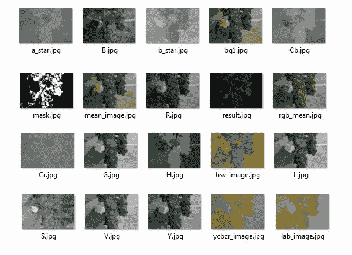

作者的照片

> ***图像处理***

图像处理从捕获图像开始。图像中包含的信息量取决于所获取图像的质量。因此，确保系统的输入图像符合适当的标准。水果的视觉检测意味着通过智能机器人或计算机视觉系统对数字图像或数字视频进行处理。

在任何领域，图像处理都涉及到两个需要颜色和形状的基本原理。该系统包括 pi 摄像头采集的数字图像和点击水果区域。通过一些图像处理技术，该系统从图像中提取一些特征，如下所述:

> ***图像预处理方法***

预处理技术可以提高图像处理方法的性能，如图像变换、分割、特征提取和对象检测。图像采集是预处理和质量控制的一个非常重要的基本步骤，因为进一步的处理需要输入数据。

图像的收集由光学传感器执行，该光学传感器总是提供静止图像的摄像机。图像质量与局部照明有关，因为它直接影响图像的可见度和图案。

> ***颜色空间的类型***

颜色是非常本能和有用的。颜色空间在图像处理中的应用旨在帮助用图像处理算法区分不同对象之间的颜色的过程。

研究人员工作并随机选择图像处理应用的色彩空间。研究人员为特定应用选择合适的色彩空间。最常用的色彩空间是 RGB、HSI、Lab、YCbCr 等。

颜色空间模型及其应用

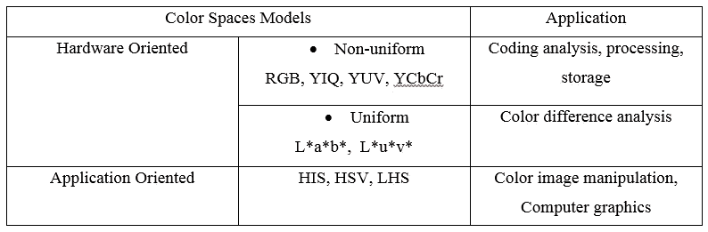

作者的照片

[](/drawing-bounding-box-method-in-image-processing-ec7487393cfa) [## 图像处理中的包围盒绘制方法

### 用 OpenCV 实现图像中物体的标注

pub.towardsai.net](/drawing-bounding-box-method-in-image-processing-ec7487393cfa) [](/data-wrangling-with-python-part-2-12165f68f372) [## 用 Python 处理数据——第 2 部分

### 数据科学中有用的转换方法

pub.towardsai.net](/data-wrangling-with-python-part-2-12165f68f372) 

输入图像如下所示

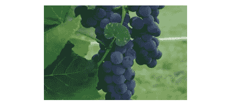

输入图像。作者的照片

## RGB(红色、绿色、蓝色)

RGB 模型被称为加色，是图像处理中最常用的颜色空间。它由三个普通通道组成，R 属于红色，G 属于绿色，B 属于蓝色，它们以不同的方式放在一起，生成一个广泛的颜色矢量。在数字图像中经常使用 RGB 颜色空间。

然而，这些颜色通道之间的高度互连是由于非线性、工具支持和亮度点的混合使得该颜色通道不是数字图像处理的非常好的选择。

图一。1 RGB 颜色空间的表示

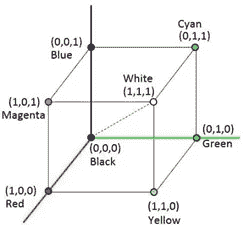

图像[来源](http://wwweic.eri.u-tokyo.ac.jp/computer/manual/eic2015/doc/intel/en_US/ipp/ipp_manual/GUID-AE698C04-81DB-402B-88E7-2BEED820D4DF.htm)

RGB 色彩空间的 Python 代码如下所示:

```
import cv2image = cv2.imread('bg1.jpg')rgb_image = cv2.cvtColor(image, cv2.COLOR_BGR2RGB)r, g, b = cv2.split(rgb_image)cv2.imwrite('R.jpg',r)
cv2.imwrite('G.jpg',g)
cv2.imwrite('B.jpg',b)
```

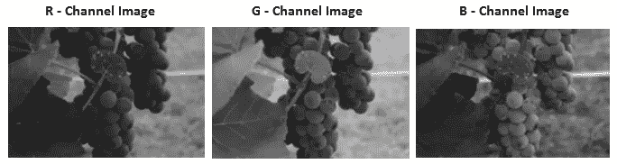

它在计算上也很复杂。因此需要在图像处理中更理想的其他颜色空间。

## HSV/HSI(色调饱和度值/强度)

HSV 色彩空间是 RGB 色彩空间的非线性强度分量。颜色信息的亮度点存在差异，这使得它可用于数字图像处理。然而，由于它的非线性，它被广泛用于色觉应用的主题中。

HSV 颜色空间由三个颜色通道组成，色调、饱和度和值。h 和 S 代表颜色，值由亮度表示。由于亮度和颜色之间的精确偏差，它在颜色分类或分割中很受欢迎。

图 1.2 HSV 颜色空间的表示

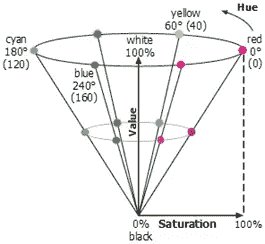

图片[来源](http://wwweic.eri.u-tokyo.ac.jp/computer/manual/eic2015/doc/intel/en_US/ipp/ipp_manual/GUID-AE698C04-81DB-402B-88E7-2BEED820D4DF.htm)

```
import cv2image = cv2.imread('bg1.jpg')rgb_image = cv2.cvtColor(image, cv2.COLOR_BGR2RGB)
hsv_image = cv2.cvtColor(rgb_image, cv2.COLOR_RGB2HSV)h, s, v = cv2.split(hsv_image)cv2.imwrite('H.jpg',h)
cv2.imwrite('S.jpg',s)
cv2.imwrite('V.jpg',v)
```

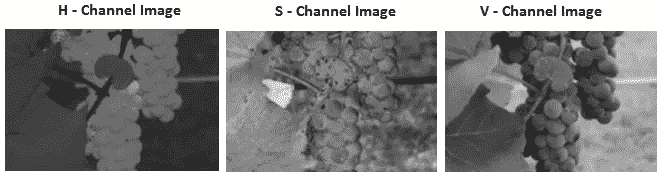

## 亮度颜色通道

这个颜色通道由三个通道组成，明度通道属于 L，双色通道属于 A 和 b。L 通道的范围从 0 开始到 100，对应于与黑/白比率不同的颜色。

A 通道的范围从 128 到+127，即红/绿比。B 通道的范围为 128 至+127，即黄色/蓝色比率。图 1.3 表示 LAB 颜色空间。

图 1.3 LAB 色彩空间的表示

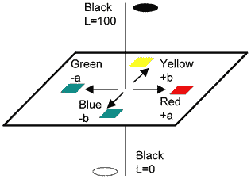

图片[来源](http://wwweic.eri.u-tokyo.ac.jp/computer/manual/eic2015/doc/intel/en_US/ipp/ipp_manual/GUID-AE698C04-81DB-402B-88E7-2BEED820D4DF.htm)

```
import cv2image = cv2.imread('bg1.jpg')rgb_image = cv2.cvtColor(image, cv2.COLOR_BGR2RGB)
lab_image = cv2.cvtColor(rgb_mean, cv2.COLOR_RGB2Lab)L, a, b = cv2.split(lab_image)cv2.imwrite('L.jpg',L)
cv2.imwrite('b_star.jpg',b)
cv2.imwrite('a_star.jpg',a)
```

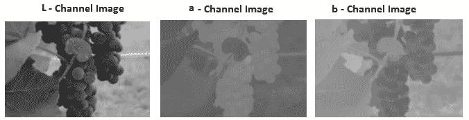[](https://medium.com/pythoneers/opencv-count-of-objects-in-blood-image-with-python-3d82de1c83a9) [## OpenCV:使用 Python 对血液图像中的对象进行计数

### OpenCV 库的图像处理概念

medium.com](https://medium.com/pythoneers/opencv-count-of-objects-in-blood-image-with-python-3d82de1c83a9) 

## YCbCr(亮度色度值)

YCbCr 由三个亮度颜色通道和一个双色通道组成。Y 表示亮度通道(亮度)，Cb 表示蓝色亮度(B-Y)，Cr 表示红色亮度(R-Y)通道。YCbCr 用于 DVD、Led 电视和 CD 等。

就灵敏度而言，Y 分量对人眼更敏感，而 Cb、Cr 对人眼不太敏感。所以精度应该不需要很精确。

图 1.4 色彩空间的表示

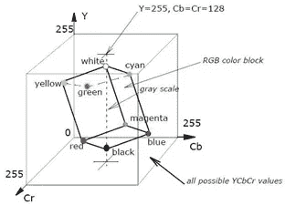

图片[来源](http://wwweic.eri.u-tokyo.ac.jp/computer/manual/eic2015/doc/intel/en_US/ipp/ipp_manual/GUID-AE698C04-81DB-402B-88E7-2BEED820D4DF.htm)

```
import cv2image = cv2.imread('bg1.jpg')rgb_image = cv2.cvtColor(image, cv2.COLOR_BGR2RGB)
ycbcr_image = cv2.cvtColor(rgb_mean, cv2.COLOR_RGB2YCrCb)Y, Cr, Cb = cv2.split(ycbcr_image)cv2.imwrite('Y.jpg',Y)
cv2.imwrite('Cr.jpg',Cr)
cv2.imwrite('Cb.jpg',Cb)
```

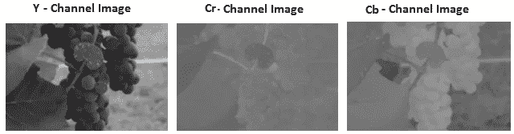

> ***结论***

颜色空间是图像处理应用中非常有用的预处理方法。

我希望你喜欢这篇文章。通过我的 [LinkedIn](https://www.linkedin.com/in/data-scientist-95040a1ab/) 和 [twitter](https://twitter.com/amitprius) 联系我。

# 推荐文章

[1。NLP —零到英雄用 Python](https://medium.com/towards-artificial-intelligence/nlp-zero-to-hero-with-python-2df6fcebff6e?sk=2231d868766e96b13d1e9d7db6064df1)
2。 [NumPy:图像上的线性代数](/numpy-linear-algebra-on-images-ed3180978cdb?source=friends_link&sk=d9afa4a1206971f9b1f64862f6291ac0)
3。[Python 中的异常处理概念](/exception-handling-concepts-in-python-4d5116decac3?source=friends_link&sk=a0ed49d9fdeaa67925eac34ecb55ea30)
4。[用 Python 进行主成分分析降维](/principal-component-analysis-in-dimensionality-reduction-with-python-1a613006d531?source=friends_link&sk=3ed0671fdc04ba395dd36478bcea8a55)
5。[用 Python 全面讲解 K-means 聚类](https://medium.com/towards-artificial-intelligence/fully-explained-k-means-clustering-with-python-e7caa573176a?source=friends_link&sk=9c5c613ceb10f2d203712634f3b6fb28)
6。[用 Python 充分解释了线性回归](https://medium.com/towards-artificial-intelligence/fully-explained-linear-regression-with-python-fe2b313f32f3?source=friends_link&sk=53c91a2a51347ec2d93f8222c0e06402)
7。[用 Python](https://medium.com/towards-artificial-intelligence/fully-explained-logistic-regression-with-python-f4a16413ddcd?source=friends_link&sk=528181f15a44e48ea38fdd9579241a78)
充分解释了 Logistic 回归 8。[concat()、merge()和 join()与 Python](/differences-between-concat-merge-and-join-with-python-1a6541abc08d?source=friends_link&sk=3b37b694fb90db16275059ea752fc16a)
9 的区别。[与 Python 的数据角力—第一部分](/data-wrangling-with-python-part-1-969e3cc81d69?source=friends_link&sk=9c3649cf20f31a5c9ead51c50c89ba0b)10。[机器学习中的混淆矩阵](https://medium.com/analytics-vidhya/confusion-matrix-in-machine-learning-91b6e2b3f9af?source=friends_link&sk=11c6531da0bab7b504d518d02746d4cc)