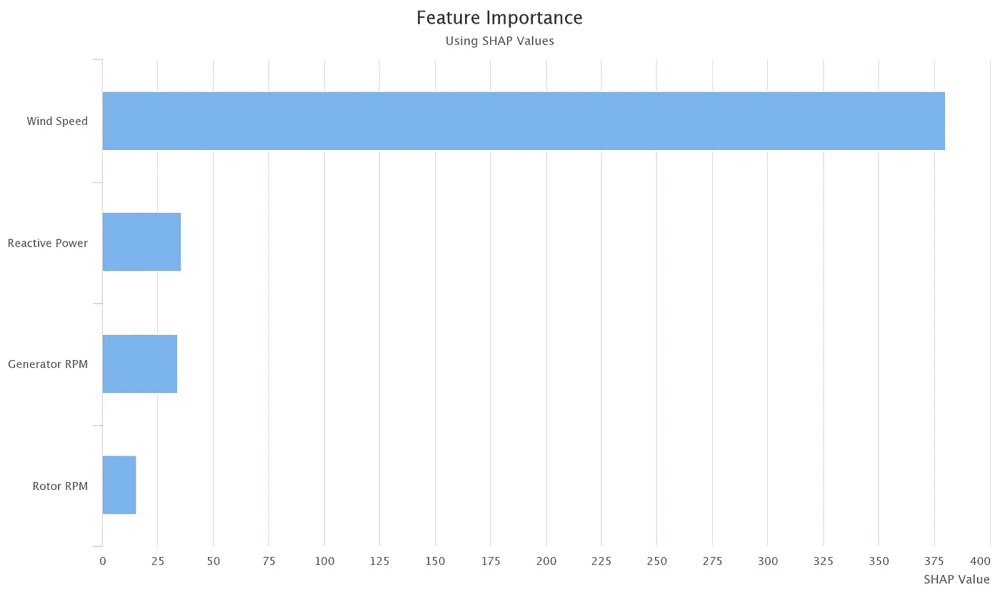
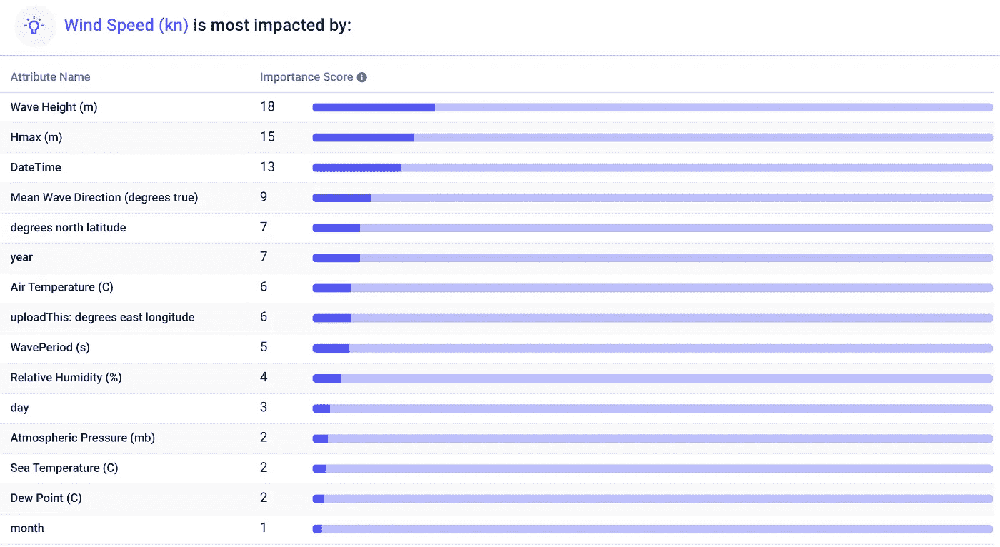
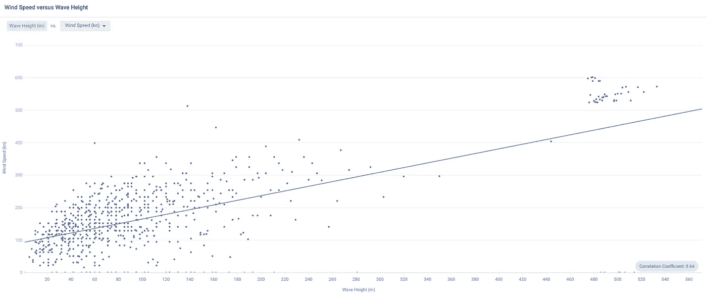
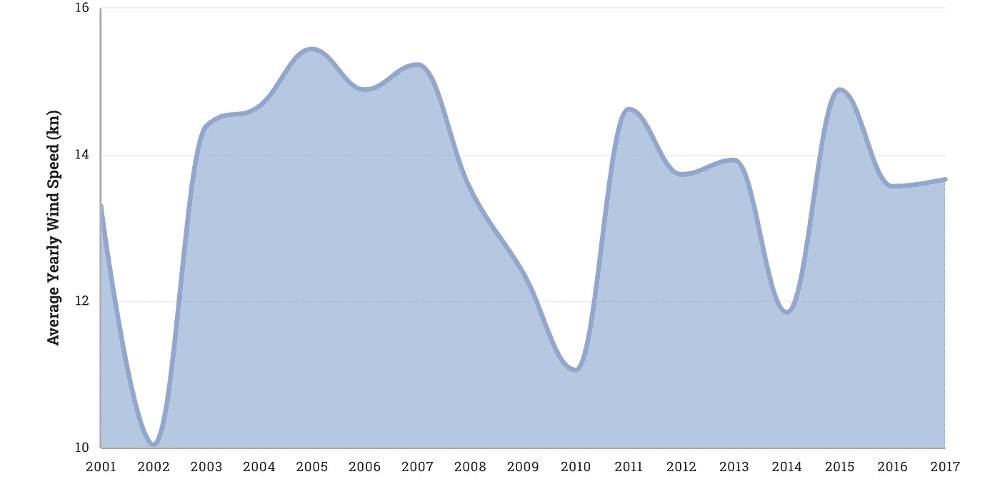
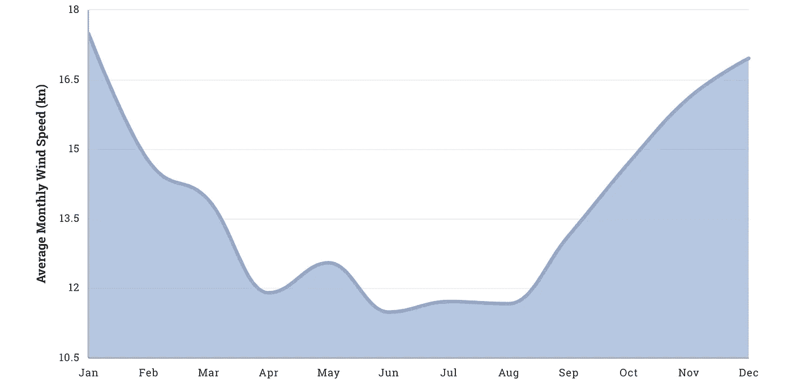
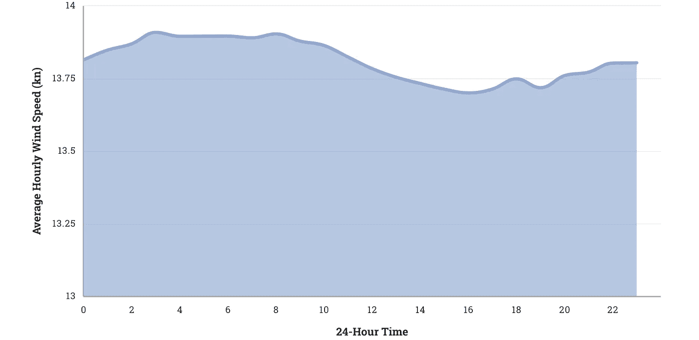
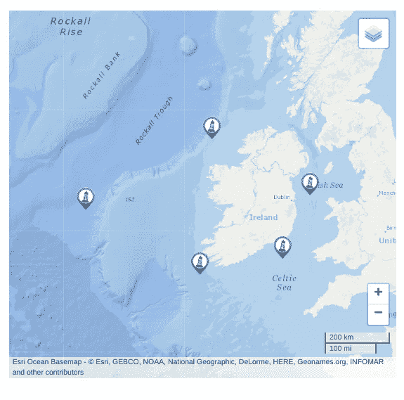

# 用可解释的人工智能打开黑匣子

> 原文：<https://pub.towardsai.net/opening-the-black-box-with-explainable-ai-hands-on-d9446fe0978f?source=collection_archive---------2----------------------->

## [人工智能](https://towardsai.net/p/category/artificial-intelligence)

## 解释预测风能产量的人工智能。

由[劳拉·乔伊特](https://unsplash.com/@laurachouette?utm_source=unsplash&utm_medium=referral&utm_content=creditCopyText)在 [Unsplash](https://unsplash.com/s/photos/black-box?utm_source=unsplash&utm_medium=referral&utm_content=creditCopyText) 上拍摄的照片

人工智能经常被称为“黑匣子”——一种不透明、几乎神秘的东西，我们并不真正理解。把数据扔进黑匣子，然后出来一个预测，或者他们这么说。然而，许多人工智能并不是不透明的，它只是一个复杂的系统，与我们(认为我们)的“推理”不同。

例如，孩子们通过首先尝试字母来学习写作，并找到单词的模式。 [GPT-3](https://towardsdatascience.com/will-gpt-3-kill-coding-630e4518c04d) 通过在整个互联网上训练生成文本算法来学习写作，产生了一个具有 1750 亿个参数的模型，从本质上来说，该模型预测“互联网”将如何完成一个提示。

你可以通过指着一辆车说:“那是一辆车”来教别人什么是汽车，而人工智能需要大量的例子来学习并减少其预测功能的错误。

尽管如此，我们有许多工具来帮助解释这些功能和它们做出的决定。我们以预测风能数据为例。

# 预测风力发电功率

预测风力的方法有很多[。您可以使用来自风车的数据，可以使用卫星数据—包括大气和地形数据，可以使用记录风数据的气象地图，等等。首先，让我们使用](https://medium.com/dataseries/exciting-machine-learning-use-cases-1927448e6e9e)[风车数据](https://www.kaggle.com/theforcecoder/wind-power-forecasting)。

## 动机

这是一项重要的任务，因为深入了解风能的驱动因素有助于实现更可持续的未来。

## 数据

看第一排和最后一排，可以看到有 2017 年 12 月 31 日到 2020 年 3 月 30 日的风车读数，应该都是 10 分钟间隔。在这些日期之间有 [1，182，240](https://www.timeanddate.com/date/durationresult.html?d1=31&m1=12&y1=2017&d2=30&m2=3&y2=2020&ti=on) 分钟，所以如果日期时间是正确的，那么我们应该有 118，224 行——确实如此。

## 建立一个可解释的模型

我们要预测的列叫做`ActivePower`。

构建随机森林预测模型时，我们可以使用 SHAP 值(SHapley 附加解释)等技术来计算各种属性的相对重要性。SHAP 值是所有排列中每个属性的平均边际贡献。

前四个属性——风速、无功功率、发电机转速和转子转速——比其他属性的贡献大得多，因此我将重点放在这些属性上。特别是，风速是*到目前为止*最重要的属性。

由于风力驱动发电机和转子的转速，进而驱动无功功率，这三列并不是有功功率的有意义的预测指标。最终，这个可解释的人工智能向我们表明，`wind speed`作为`ActivePower`的预测器是没用的。我们还没有预测未来的风速，所以根据*已知的*风速预测功率是没有意义的，即使我们获得了极高的精度。

因此，我们需要预测风速，我们需要另一个数据集。

# 预测风速

为了预测风速，我们将在 9 个爱尔兰气象浮标上使用这个数据集。

让我们将数据上传到 [Apteo](http://apteo.co) 并选择`wind speed`作为我们想要预测的 KPI。在后台，“ [AutoML](https://towardsdatascience.com/will-automl-be-the-end-of-data-scientists-9af3e63990e0) ”自动创建机器学习模型，选择其中最好的一个模型供我们进行预测。

我们将排除测站 ID，因为我们希望发现可概括的见解，我们还将排除描述阵风和风向的列，因为这些与风速一样都是“未知”。

除去这些列，这里是每个属性在预测风速中的相对重要性。

波高和其他波浪特征是风速的主要预测因素，这是有道理的。风生浪。事实上，研究人员已经使用波高来预测风速。

进一步研究，我们可以看到风速和浪高有相当强的相关系数 0.64，P 值远低于 0.05。

空气和海水温度的影响有点复杂。温暖的海水蒸发，将水抽入低层大气，当汇聚的风碰撞并转向上方时上升，在更高的高度凝结成云并变成雨，释放热量使周围的空气变暖并使其上升，不断被来自下方的温暖潮湿的空气取代。所有这些运动产生了风。如果不受凉爽天气或高空风的影响，这甚至会引发飓风。

波浪周期和大气压力都与风速呈负相关。短而起伏的波浪与更快的风有关，风从高压移动到低压。

## 时间和地点

让我们用简单的绘图来理解时间的影响。

下面，我画出了年平均风速。这不是很有见地，但如果我们有一个非常长的(历史)数据集，我们可能会看到变化的气候如何影响风速。

以下是平均月风速。这要有用得多:冬天的风速更高，尤其是在 12 月和 1 月，而 4 月至 8 月的风速最低。

平均每小时风速(以 24 小时为单位)与逐月风速没有太大差异，但我们可以看到风速在午夜最高，下午最低。

东经度范围从-15.88135 到-5.424046，而北纬度范围从 51.215958 到 54.999966。爱尔兰系泊气象浮标网络的 9 个不同气象站有 9 个唯一的坐标对，其中 5 个目前是实时浮标，正如我们在 [IMOS 站点](http://www.marine.ie/Home/site-area/data-services/real-time-observations/irish-weather-buoy-network-imos#:~:text=The%20Irish%20Marine%20Weather%20Buoy,general%20public%20information%20and%20research.)上看到的。

仅仅用几个浮标(9 对坐标)，我们不能在任何给定的坐标下在*创建风力的“风地图”。为了让这种分析更上一层楼，我们需要更多的地理数据。*

# 外卖食品

只要我们知道风速，建立一个模型来预测风力几乎是微不足道的。更有趣也更具挑战性的是预测风速。无论哪种情况，我们的模型都不是黑盒。

我们可以看到，像浪高、海温这样的变量与风速正相关，而波浪周期、气压与风速负相关。此外，风速在夜间和冬季最高。我们的模型使用这些见解进行预测。

当然，一旦我们进入深度学习、集成和其他更复杂的人工智能领域，这将是一个更大的挑战，但在这些层面上也有用于解释的[工具](https://towardsdatascience.com/what-explainable-ai-fails-to-explain-and-how-we-fix-that-1e35e37bee07)。