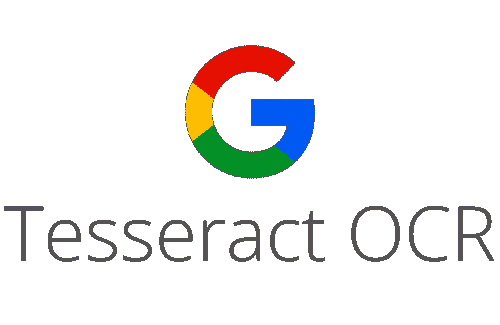
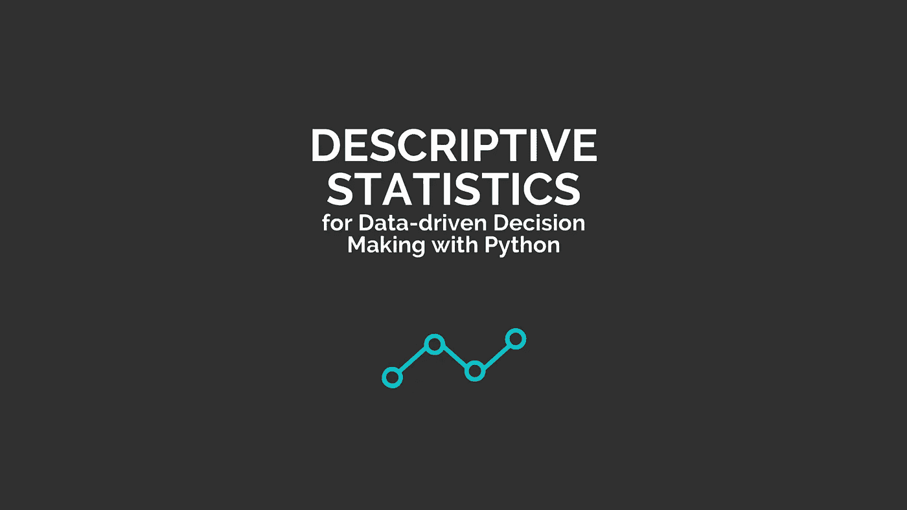
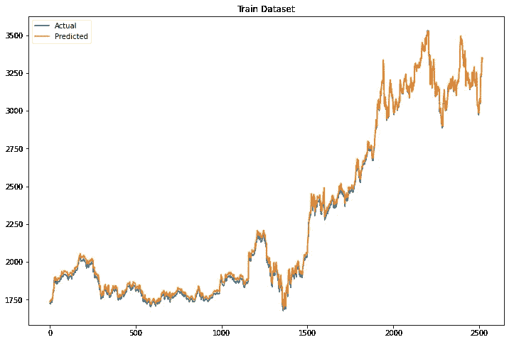
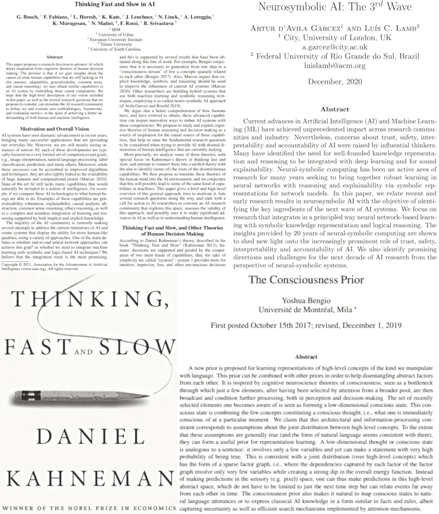

# 用于文本定位、检测等的光学字符识别(OCR )!

> 原文：<https://pub.towardsai.net/optical-character-recognition-ocr-for-text-localization-detection-and-more-9018fa171324?source=collection_archive---------2----------------------->

## [新闻](https://towardsai.net/p/category/news)，[快讯](https://towardsai.net/p/category/newsletter)

## 人工智能新闻，研究和更新，令人兴奋的[自然语言 API](https://ws.towardsai.net/nlapi) ，我们第一本关于描述性统计的[书](https://news.towardsai.net/descriptive-statistics)，以及我们每月的编辑精选！

***如果你阅读这封邮件有困难，请在*** [***网络浏览器上查看。***](https://news.towardsai.net/f21)

H appy 周二，向着艾家！距离我们上次发送简讯已经有一段时间了。在本期节目中，我们将为您带来一些我们认为您会喜欢的令人兴奋的美食。首先，这篇由麻省理工学院的 Ramin Hasani 等人领导的关于液态时间常数网络 的 [**研究论文展示了新颖的递归神经网络模型，这些模型可以改变它们的基本方程以适应新的数据输入，从而持续大幅降低复杂性。**](https://mktg.best/cy730)

你试用过 expert.ai 的 [**自然语言 API**](https://ws.towardsai.net/nlapi) demo 吗(不需要注册就可以试用！).简单来说，选择一种语言，选择一个文档或使用一个长达 10000 个字符的样本文本，点击分析，你会看到不同类型的 [**自然语言分析**](https://ws.towardsai.net/nlapi) expert.ai 执行。

我们最近用 Python 在 [**上推出了我们的**](https://gumroad.com/l/descriptive-statistics) **[**书**](https://news.towardsai.net/descriptive-statistics) ，如果你还没有查看的话。这篇 [**文章**](https://news.towardsai.net/descriptive-statistics-book-sample) 或者这篇 [**PDF**](https://github.com/towardsai/tutorials/blob/master/descriptive-statistics/descriptive-statistics-pdf-book-sample.pdf) 提供了本书前 36 页的样本。请不要忘记，成为**会员，你就可以接触到这部作品、更多的书籍和其他好东西。****

**这部 [**作品**](https://mktg.best/m2mbx) 关于由[**minell**](https://mktg.best/iytix)领导的强化学习令人着迷。他们在推进和开发用于 [**机器学习**](https://mld.ai/mldcmu) 研究的突破性 RL 方法方面引领着最先进的工作。看看它们，尤其是如果你对《我的世界》和强化学习感兴趣的话。**

**接下来，如果你对 [**计算机视觉**](https://towardsai.net/p/computer-vision) 感兴趣，可以看看这个 [**研究**](https://mktg.best/f2yqf) 来自卡耐基梅隆大学由 Mihir Prabhudesai，Xiao-Yu Fish Tung 等人领导的，他们的模型可以识别新的物体，并从微小的标记数据集提供复杂视觉问题的答案。**

**每年年初，Gradient Flow 都会收集当年在大数据、分析、机器学习和人工智能领域的一些技术发展基础，并在一份 [**趋势报告**](https://ws.towardsai.net/sut) 上分享他们的预测。如果你没查过，他们的 [**2021 趋势报告**](https://ws.towardsai.net/sut) 很全面。**

**接下来在 [**NLP**](https://towardsai.net/p/category/nlp) 中，强大的语言模型(LM)如 GPT-3 和 T5 具有令人印象深刻的能力，可以通过持续的文本提示来回答复杂场景中的查询。然而，他们有多大的自信呢？姜等人在这篇 [**论文**](https://mktg.best/5yk7o) 中详细讨论了这个 LM 问题。**

**现在进入月度精选！我们根据读者、粉丝和某篇文章的浏览量来挑选这些文章。我们希望你和我们一样喜欢阅读它们。此外，我们开始做一些新的东西！我们将选出我们表现最好的文章，我们的编辑将选择几篇表现不突出的文章，但由于它们的质量，它们进入了本月的名单。**

**如果可以，请与您的朋友、同事和熟人分享我们的 [**订阅链接**](https://towardsai.net/subscribe) 。每月一封电子邮件；随时退订！**如果您对我们如何改进有任何反馈，请随时向我们发送** [**电子邮件**](mailto:pub@towardsai.net) **。****

# **📚编辑选择每月精选文章↓📚**

****

## **[用于文本定位和检测的 tesse ract OCR](https://mktg.best/a9fdh)作者 [Sharon Lim](https://medium.com/u/2ffb6e30076e?source=post_page-----9018fa171324--------------------------------)**

**光学字符识别(“OCR”)系统已被广泛用于向计算机化系统提供自动文本输入。然而，传统的 OCR 系统不能读取多种字体和页面格式的问题仍然没有解决。因此，传统的 OCR 对需要转换成数字形式的文档总数的影响微乎其微。**

****[**阅读更多**](https://mktg.best/a9fdh)****

************

## ******[使用 Python 进行数据驱动决策的描述性统计](https://news.towardsai.net/descriptive-statistics-book-sample)作者普拉蒂克·舒克拉、罗伯特·伊里翁多******

******描述性统计对于基于数据的决策是必不可少的。使用描述性统计会给你一种方法，让你在没有复杂方法的情况下直接做出决定。描述统计学构成了每一种定量数据分析的基础平台。《 [**用 Python**](https://news.towardsai.net/descriptive-statistics) 进行数据驱动决策的描述性统计》是普拉蒂克·舒克拉和罗伯特·伊里翁多合著的一本书。在过去的一年里，我们共同努力，创建了这份材料，并为您做好了直接、数据驱动的决策准备。******

******[**阅读更多**](https://news.towardsai.net/descriptive-statistics-book-sample)******

************

## ******[人工智能将如何终结人类评估中的一刀切](https://mktg.best/q7imv)作者[奥莰·布鲁特](https://medium.com/u/422ba82c0de7?source=post_page-----9018fa171324--------------------------------)******

******假设你走进一家商店为自己买一套漂亮的衣服。你在商店里逛了一会儿，终于找到了一个你真正喜欢的好商店。当你请销售助理帮你找到合适的尺码时，她/他会说:“我们只卖均码的衣服。你可以在试衣间试穿这套衣服，看看它是否真的适合你。”这个故事对你来说可能听起来像反乌托邦小说，因为今天，世界上大多数服装店都提供不同尺寸的衣服和额外的裁剪/修改服务。因此，你可能永远不会买一刀切的西装。******

********[**阅读更多**](https://mktg.best/q7imv)********

************

## ******[遗传算法在 Python 中的交易策略优化](https://mktg.best/oyv0t)作者 [Louis Chan](https://medium.com/u/6d585e26760a?source=post_page-----9018fa171324--------------------------------)******

******如果你听说过系统交易或算法交易，你一定知道策略的优化是决定策略是否盈亏平衡的最重要因素之一。最糟糕的是:优化的计算量非常大。想象一个简单的 MACD 交叉策略，至少有 3 个参数:快速、慢速和信号移动平均周期，每个参数有数百个可能的值，有一百万种可能的组合。******

********[**阅读更多**](https://mktg.best/oyv0t)********

************

## ******[py torch 中自定义图像数据的 GANs 分步实施:第 2 部分](https://mktg.best/8rpen)作者 [Varshita Sher](https://medium.com/u/f8ca36def59?source=post_page-----9018fa171324--------------------------------)******

******在关于 GANs 的 [**第一部分**](https://medium.com/swlh/how-i-would-explain-gans-from-scratch-to-a-5-year-old-part-1-ce6a6bccebbb) 中，我们开始建立直觉，关于 GANs 是什么，我们为什么需要它们，以及训练 GANs 背后的整个要点是如何创建一个生成器模型，该模型知道如何将随机噪声向量转换成(漂亮的)*几乎真实的图像。因为我们已经在第 1 部分中深入讨论了伪代码，所以一定要查看一下，因为会有很多对它的引用！*******

*******[**阅读更多**](https://mktg.best/8rpen)*******

**************

## *******[使用 TensorFlow、谷歌云平台和 Firebase 创建人工智能网络应用](https://towardsai.net/p/machine-learning/creating-ai-web-apps-using-tensorflow-google-cloud-platform-and-firebase)*******

*******为具有 ML 功能的 web 应用程序训练机器学习模型只是整个项目开发范围的一部分。一个经常被忽视的方面是超越沙盒，进入生产环境。本文将展示如何使用谷歌云平台(GCP)人工智能平台和云功能，通过预测服务轻松服务于张量流模型。之后，我将展示如何使用 Firebase 部署和托管 web 客户机，以使用 HTTP 请求查询模型。*******

*********[**阅读更多**](https://towardsai.net/p/machine-learning/creating-ai-web-apps-using-tensorflow-google-cloud-platform-and-firebase)*********

**************

## *******[如何和 LSTM 一起预测股票价格](https://mktg.best/0mvel)作者[乔治·皮皮斯](https://medium.com/u/e57dfcb92bb0?source=post_page-----9018fa171324--------------------------------)*******

*******长短期记忆(LSTM)是一种人工递归神经网络(RNN)架构，用于具有反馈连接的深度学习。不仅可以处理图像等单个数据点，还可以处理语音或视频等整个数据序列。例如，LSTM 应用于诸如未分段的、连接的手写识别、语音识别、机器翻译、异常检测、时间序列分析等任务。*******

*********[**阅读更多**](https://mktg.best/0mvel)*********

**************

## *******[使用 Python 的时间序列基础知识](https://mktg.best/lsizg)作者 [Amit Chauhan](https://medium.com/u/502d63083812?source=post_page-----9018fa171324--------------------------------)*******

*******时间序列分析是我们周围发生的与时间有关的日常活动的一部分。随着日、月、年的流逝，我们周围的观察留下了一些信息。我们从统计分析中获得帮助，以某些格式制作数据/信息，并进行分析以获得这些信息。随着各地产生的数据越来越多，使用简单的低级分析工具并不容易。因此，新的工具和算法被开发出来，使得大量的数据以合适的格式存在，并解决我们获取信息的目的。*******

*********[**阅读更多**](https://mktg.best/lsizg)*********

**************

## *******[思维的快慢与第三波艾](https://mktg.best/8i7m0)由[路易(什么艾)布沙尔](https://medium.com/u/f34bfe2bbaec?source=post_page-----9018fa171324--------------------------------)*******

*******这就是为什么 Francesca Rossi 和她的 IBM 团队发表了这篇论文，提出了推进人工智能的研究方向。人类决策认知理论的启示。其中的前提是:如果我们获得了人工智能中仍然缺乏的人类能力的洞察力，如适应性、鲁棒性、抽象性、概括能力、常识和因果推理，我们可能会获得与人工智能系统中类似的能力。*******

*********[**阅读更多**](https://mktg.best/8i7m0)*********

**************

## *******如果你一直在网上申请工作，你将永远不会成功*******

*******人们雇佣人们。公司不会。
我意识到我很快就要大学毕业了。我不确定接下来会发生什么。我决定，我需要一份工作。数据科学似乎很酷。我开始在网上申请。我想我申请的公司越多，我被关注的机会就越大。批量申请是一个数字游戏。我需要为每一个列出的机会努力。我没有时间为每份工作都量身定做求职信和简历，所以我会用同一个通用的求职信。毕竟，它拥有我的一切。*******

*********[**阅读更多**](https://mktg.best/uy5ad)*********

**************

## *******[Rutuja shiv Raj Pawar](https://towardsai.net/p/deep-learning/deep-hashing-for-similarity-search-9273aac054db)进行相似性搜索的深度哈希*******

*******近年来**近似最近邻(ANN)**【1】搜索已经成为一个突出的研究课题，以有效地处理现实世界应用中不断增长的数据量。人工神经网络有各种应用，包括模式识别、推荐系统、相似性搜索、聚类分析等。然而，在本文中，我们将主要关注**相似性搜索**的应用。此外，在现有的人工神经网络技术中，**散列法**因其快速的查询速度和低内存成本而在管理、存储和处理高维数据方面变得非常流行[2–10]。*******

*******[**阅读更多**](https://towardsai.net/p/deep-learning/deep-hashing-for-similarity-search-9273aac054db)*******

**************

## *******[收集推文的方法、挑战和危险](https://towardsai.net/p/nlp/methods-challenges-and-hazards-of-collecting-tweets-9e3e7805095a)作者[Stephen defer ari](https://medium.com/u/c6cb000e8ba8?source=post_page-----9018fa171324--------------------------------)*******

*******在完成了一个关于 Covid 疫苗相关推文的情绪分析项目后，我觉得我只看到了图片的一小部分。我利用别人好心收集并发布在**上的推特建立了这个项目。收集的标准是过滤掉带有转发的标签“#CovidVaccine”。*********

*********[**阅读更多**](https://towardsai.net/p/nlp/methods-challenges-and-hazards-of-collecting-tweets-9e3e7805095a)*********

**************

## *******[使用深度学习的图像去噪](https://towardsai.net/p/deep-learning/image-de-noising-using-deep-learning)作者 [Chintan Dave](https://medium.com/u/709bc4af44dd?source=post_page-----9018fa171324--------------------------------)*******

*******图像去噪是研究人员几十年来试图解决的一个经典问题。在早期，研究人员使用*过滤器*来减少图像中的噪音。它们过去对于具有合理噪声水平的图像工作得相当好。但是，应用这些滤镜会使图像变得模糊。如果图像噪音太大，那么最终的图像会非常模糊，以至于图像的大部分关键细节都会丢失。*******

*********[**阅读更多**](https://towardsai.net/p/deep-learning/image-de-noising-using-deep-learning)*********

**************

## *******[通过](https://mktg.best/r2w81) [Nikolas Malamas](https://medium.com/u/f8712d2f271b?source=post_page-----9018fa171324--------------------------------) 快速设置您的树莓派*******

*******Raspberry Pi 是一款易于使用的单板计算机，专为教授计算机科学基础知识而开发。这是一个很好的工具，可以开始尝试小项目，如物联网、家庭自动化、网站、游戏等等。你可以在这里找到[树莓派基金会](https://www.raspberrypi.org/documentation/) [展示的很多项目。最后发布的型号是](https://projects.raspberrypi.org/en/projects) [Raspberry Pi 4 Model B](https://www.raspberrypi.org/products/raspberry-pi-4-model-b/?resellerType=home) ，相当便宜但功能强大的选择。*******

*********[**阅读更多**](https://mktg.best/r2w81)*********

**************

## *******[推文主题建模第 1 部分:使用 Twint 抓取推文](https://mktg.best/v87n8)由 [John Bica](https://medium.com/u/2e36f6a6040c?source=post_page-----9018fa171324--------------------------------)*******

*******主题建模是一种无监督的机器学习方法，用于发现文本文档集合(语料库)中的“隐藏”主题(或聚类)。它真正的优势在于不需要带标签或带注释的数据，而是只接受原始文本数据作为输入，这也是它不受监督的原因。换句话说，模型在看到数据时并不知道主题是什么，而是使用所有文档中单词之间的统计关系来生成它们。*******

*********[**阅读更多**](https://mktg.best/v87n8)*********

******* [## 店铺↓

### 发布最好的技术、科学和工程|社论→https://towardsai.net/p/editorial |订阅→…

ws.towardsai.net](https://ws.towardsai.net/shop)  [## 加入我们吧↓ |向着 AI 会员

### “走向人工智能”是一个讨论人工智能、数据科学、数据可视化、深度学习的社区

members.towardsai.net](https://members.towardsai.net) 

**🙏感谢您成为** [**订阅者**](https://towardsai.net/subscribe) **同** [**向着艾**](https://towardsai.net/) **！🙏**

*关注我们↓*

*[***脸书***](https://www.facebook.com/towardsAl/)***】|***[***推特***](https://twitter.com/towards_ai?lang=en)***]|***[***insta gram***](https://www.instagram.com/towards_ai/)***]|***[***LinkedIn***](https://www.linkedin.com/company/towards-artificial-intelligence)********