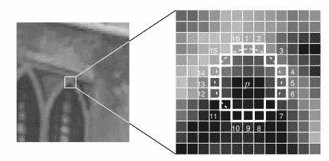

# 定向快速旋转简报(ORB)

> 原文：<https://pub.towardsai.net/oriented-fast-and-rotated-brief-orb-1da5b2840768?source=collection_archive---------1----------------------->

## ORB | [对 AI](https://towardsai.net) 的基础

## *学习如何使用最快、最有效的方法筛选*

> 所以首先让我们大致了解一下它做什么&它是如何工作的。然后我们将分别看到这两种算法，即**快速和简洁。**快速和简洁，分别是矢量生成算法中的一个特征检测。

ORB 从寻找图像中称为关键点的特殊区域开始。关键点是图像中非常独特的位置。例如，图像的边缘(亮度变化的地方，即像素值变化剧烈的地方)。

关键点(绿点){图片提供: [OpenCV](https://docs.opencv.org/3.0-beta/doc/py_tutorials/py_feature2d/py_orb/py_orb.html) }

## **ORB 是如何工作的？**

1.  首先，它使用 FAST 来寻找关键点，然后应用 Harris 角点度量来寻找其中的前 N 个点。FAST 代表加速段测试的特征，它通过比较给定像素区域的亮度水平来快速选择关键点。
2.  简而言之，创建特征向量。

# 使用 FAST 的特征检测(来自加速段测试的特征):

1.  在图像中选择一个像素 p，该像素 p 将被识别为感兴趣点或不被识别为感兴趣点。设其强度为 I。
2.  选择合适的阈值 t
3.  考虑一个围绕被测像素的 16 像素的圆。(见下图)。

图片提供: [OpenCV](https://docs.opencv.org/3.0-beta/doc/py_tutorials/py_feature2d/py_fast/py_fast.html)

如果至少有一对比 p 更亮或更暗的连续像素，则选择像素“p”作为关键点。这种优化将在整个图像中搜索关键点所需的时间减少了四分之一。
因此，FAST 找到的关键点为我们提供了定义图像边缘的对象的位置信息。
一个问题是 FAST 不计算方向。那么旋转不变性呢？答案是:[机器学习一个角点检测器和非极大抑制。](https://docs.opencv.org/3.0-beta/doc/py_tutorials/py_feature2d/py_fast/py_fast.html)

# 简要(二进制鲁棒独立基本特征):

ORB 算法的第二部分是获取 FAST 算法找到的关键点，并将这些关键点转化为可以一起表示对象的特征向量。为了创建特征向量，ORB 使用了一种简单的算法。

它基本上从一组关键点创建二元特征向量。我们已经知道二进制特征向量，也称为二进制描述符，它只是一个只包含 1 和 0 的特征向量。

BRIEF 提供了直接查找二进制字符串的快捷方式。它采用平滑的图像块并以独特的方式选择一组 nd(x，y)位置对，然后在这些位置对上进行像素强度比较。数学方面，可以查: [OpenCV 文档](https://docs.opencv.org/3.0-beta/doc/py_tutorials/py_feature2d/py_brief/py_brief.html)

简而言之，BRIEF 是一种更快的特征描述符计算和匹配方法。它还提供了高识别率，除非存在大的平面内旋转。

在 [GitHub](https://github.com/Garima13a/ORB) 上查看它的实现代码。