# 我们应该如何检测和处理异常值？

> 原文：<https://pub.towardsai.net/outlier-detection-and-treatment-9a9f41df0fb2?source=collection_archive---------2----------------------->

## 什么是离群值？我们需要如何检测异常值？我们需要如何处理异常值？


作者照片

```
**Table of Contents:**· [What are Outliers?](#cada)
· [Outlier Detection and Removal Techniques:](#4191)
· [Z Score-based method](#be3e)
· [IQR technique](#8d1c)
· [Percentile Method](#cacd)
```

# 什么是离群值？

> 异常值是指与其他数据表现非常不同的数据点或观察值。

> 如果我们在寻找一群人的平均净资产，如果我们在那个群体中找到了埃隆·马斯克，那么完整的分析就会因为一个异常值而出错。这就是为什么在建立机器学习模型之前应该正确处理离群值的原因。

[](https://medium.com/@gowthamsr37/pattern-programming-in-python-23d5af04211e) [## 用 Python 编写复杂模式的简单方法，仅需 4 分钟。

### 用 python 编写复杂模式程序的简单方法

medium.com](https://medium.com/@gowthamsr37/pattern-programming-in-python-23d5af04211e) 

如果我们正在构建一个线性回归模型，该模型具有独立特征、**、**和非独立特征、**、【得分】、**，如果数据的分布如下所示，那么该模型将表现良好。

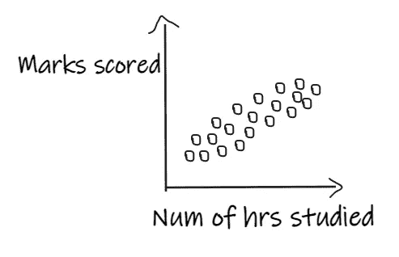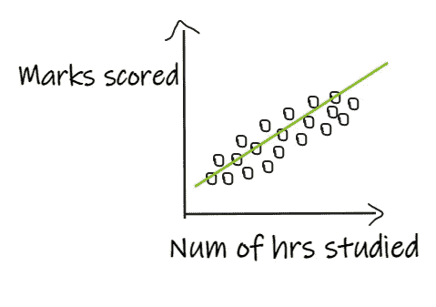

如果我们有 3 名学生即使在学习时间更少的情况下也取得了好成绩，那么回归线会移动以拟合异常点，如下所示，导致实际数据的结果不佳。

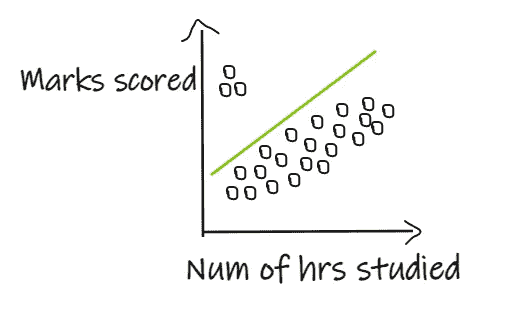

涉及权重计算的机器学习算法，如线性回归、逻辑回归、Ada boost 和深度学习模型，会受到离群值的影响。像决策树、随机森林这样的基于树的算法受离群值的影响会更小。

[](/how-to-verify-the-assumptions-of-linear-regression-54ba4d17c231) [## 我如何验证线性回归的假设？

### 线性回归的假设有哪些？以及如何用 python 来验证它们？

pub.towardsai.net](/how-to-verify-the-assumptions-of-linear-regression-54ba4d17c231) 

在**异常检测**算法中，如保险欺诈检测或信用卡欺诈检测，我们需要捕捉异常值，在这种情况下，目的是捕捉异常值。

所以我们需要小心对待异常值，


**修剪:**在训练机器学习模型之前，从数据集中移除离群值。例如，在上面的例子中从数据集中移除学生。

**封顶:**保持最大或最小阈值，并相应地给数据点赋值。例如，如果我们正在处理年龄特征，我们可以保持阈值 85，并将值 85 分配给年龄大于 85 的所有人。

**离散化:**这是使用箱将数字特征转换为离散的方法。例如，如果年龄 80–90 被认为是一个单独的条柱，那么 80 到 90 之间的所有年龄都将被同等对待。

# 异常值检测和去除技术；

# 1.基于 z 分数的方法

该技术的主要假设是数据应该是正态分布的或接近正态分布的。

如果数据呈正态分布，经验法则表示 **68.2%** 的数据点位于第一个标准差之间， **95.4%** 的数据点位于第二个标准差之间， **99.7%** 的数据点将位于第三个标准差之间。

位于第三标准偏差之外的数据点可被视为异常值。

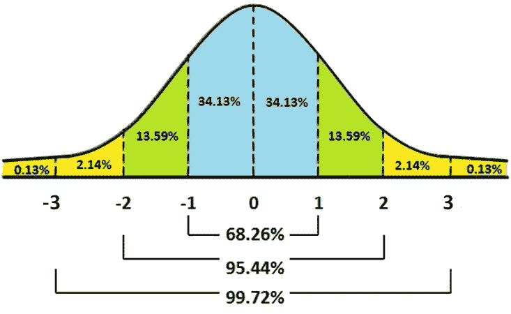

由于 99.7%的数据将位于 3 个标准差内，我们可以将位于 3 个标准差外的其余数据视为异常值。


标准化**这通常被称为 Z 分数归一化。结果数据的**平均值为 0，标准偏差为 1。****

[](https://medium.com/@gowthamsr37/which-feature-scaling-technique-to-use-standardization-vs-normalization-9dcf8eafdf8c) [## 标准化与规范化

### 特征缩放是强制性的吗？什么时候使用标准化？何时使用规范化？会发生什么……

medium.com](https://medium.com/@gowthamsr37/which-feature-scaling-technique-to-use-standardization-vs-normalization-9dcf8eafdf8c) 

让我们看看这项技术的实际实现。

```
import pandas as pd
import numpy as np
import seaborn as sns
import matplotlib.pyplot as plt
import warnings
warnings.filterwarnings('ignore')df = pd.read_csv('placement_dataset.csv')
```

数据集有两个独立的特征 **cgpa** 和 **placement_exam_marks。**

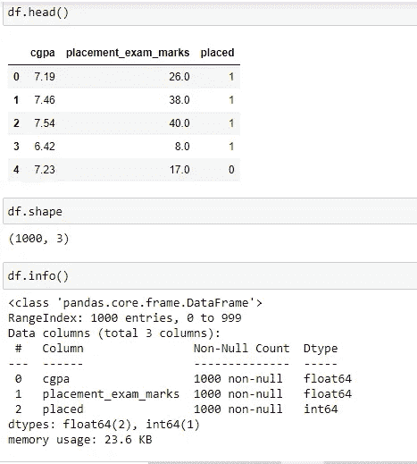

```
plt.figure(figsize=(10,5))plt.subplot(1,2,1)
sns.distplot(df['cgpa'])plt.subplot(1,2,2)
sns.distplot(df['placement_exam_marks'])
```

数据的分布显示特征 **cgpa** 呈正态分布，另一个特征 placemet_exam_marks 呈偏态分布。

因此，特征 **cgpa** 符合离群点检测技术的 **Z 评分法**。

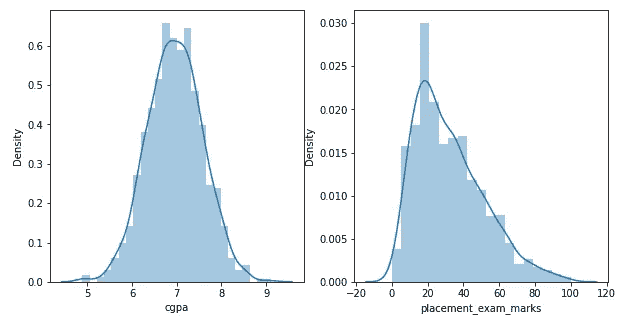

```
print('Mean value of CGPA {}'.format(df['cgpa'].mean()))
print('Min value of CGPA {}'.format(df['cgpa'].min()))
print('Max value of CGPA {}'.format(df['cgpa'].max()))
print('Standard deviation value of CGPA {}'.format(round(df['cgpa'].std(),2)))
```

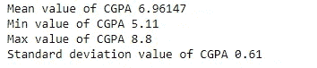

```
**# the boundary values are:**print('Highest value of cgpa', round(df['cgpa'].mean()+3*df['cgpa'].std(),3))
print('Lowest value of cgpa', round(df['cgpa'].mean()-3*df['cgpa'].std(),3))
```

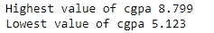

以下是被检测为异常值的 5 个数据点。

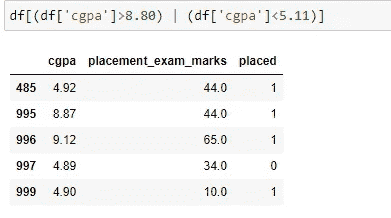

这也可以使用 Z 得分公式来实现，如下所示。

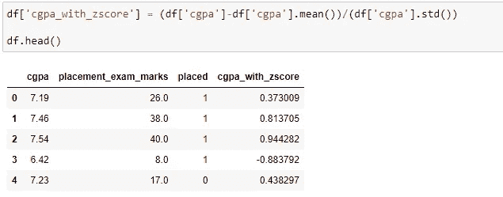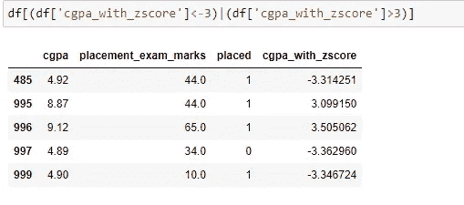

## 异常值处理:

**修整:**在这种方法中，我们可以移除 3 个标准差之外的所有数据点。

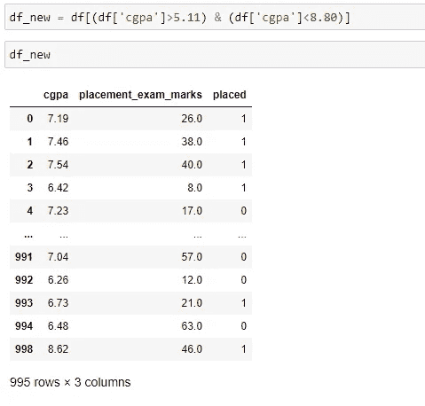

有时，如果数据集有大量离群值，那么我们会丢失大量数据。

**封顶:**在此方法中，离群数据点用最高或最低值封顶，如下图所示。

[](https://medium.com/@gowthamsr37/why-multicollinearity-is-a-problem-4c273d1d1f2e) [## 为什么多重共线性是一个问题？

### 什么是多重共线性？为什么我们要在创建机器学习模型之前处理多重共线性？

medium.com](https://medium.com/@gowthamsr37/why-multicollinearity-is-a-problem-4c273d1d1f2e) 

# 2.IQR 技术

当数据分布不均匀时，使用这种方法。

IQR **描述了从最低到最高排序的中间 50%的值**。要计算四分位距(IQR)，首先要计算数据上下半部分的中间值。这些值是四分位数 1 (Q1)和四分位数 3 (Q3)。IQR 是 Q3 和 Q1 之间的差值。

**IQR = Q3-Q1**

**最小值= Q1–1.5 * IQR**

**最大值= Q3+1.5*IQR**

小于**最小值**的数据点和大于**最大值**的数据点被视为异常值。

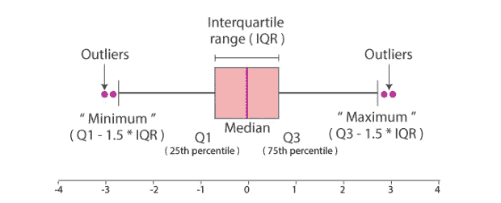

让我们看看这项技术的实际实现。

```
plt.figure(figsize=(10,5))plt.subplot(1,2,1)
sns.distplot(df['cgpa'])plt.subplot(1,2,2)
sns.distplot(df['placement_exam_marks'])
```

特征 **placement_exam_marks** 是偏斜的，并且符合离群点检测的 IQR 方法。

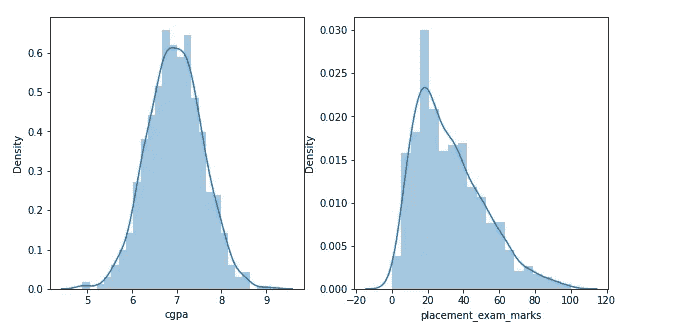

```
df['placement_exam_marks'].skew()
0.8356419499466834
```

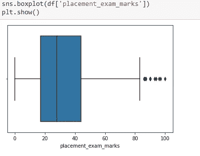

```
#Finding the IQRQ1 = df['placement_exam_marks'].quantile(0.25)
Q3 = df['placement_exam_marks'].quantile(0.75)IQR = Q3-Q1upper_limit = Q3+1.5*IQR
lower_limit = Q1-1.5*IQRprint('lower limit: ', lower_limit)
print('upper limit: ', upper_limit)
print('IQR:' , IQR)**lower limit:  -23.5
upper limit:  84.5
IQR: 27.0**
```

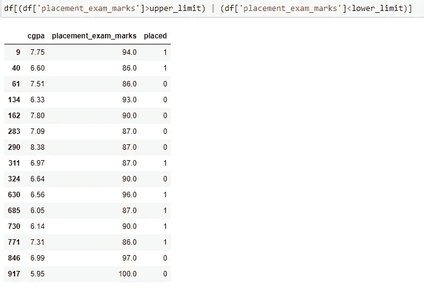

上述 15 个数据点被检测为异常值。

## 修整:

在这种方法中，我们可以删除最小和最大限制之外的所有数据点。

```
df_new = df[~(df['placement_exam_marks']>upper_limit) | (df['placement_exam_marks']<lower_limit)]df_new
```

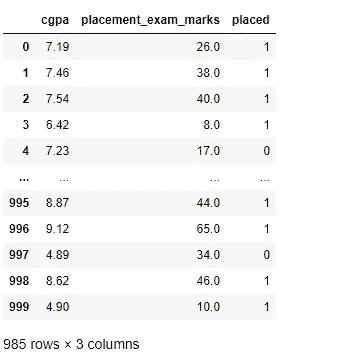

```
plt.figure(figsize=(15,5))plt.subplot(2,2,1)
sns.distplot(df['placement_exam_marks'])plt.subplot(2,2,2)
sns.boxplot(df['placement_exam_marks'])plt.subplot(2,2,3)
sns.distplot(df_new['placement_exam_marks'])plt.subplot(2,2,4)
sns.boxplot(df_new['placement_exam_marks'])
```

修剪特征后，查看数据分布和箱线图。

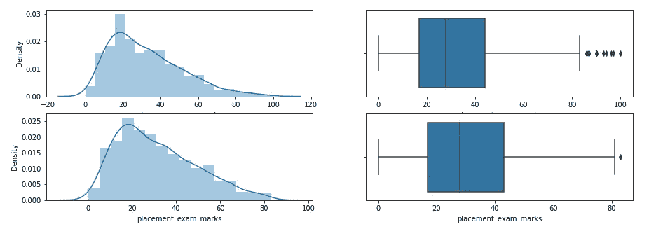

**加盖:**

在这种方法中，异常数据点以最高或最低值为上限，如下所示。

```
upper_limit = 84.5
lower_limit = -23.5df_cap = df.copy()df_cap['placement_exam_marks'] = np.where(df_cap['placement_exam_marks']>upper_limit, upper_limit , df_cap['placement_exam_marks']) 
df_cap['placement_exam_marks'] = np.where(df_cap['placement_exam_marks']<lower_limit , lower_limit , df_cap['placement_exam_marks'])df_cap['placement_exam_marks'].max()
**84.5**df_cap['placement_exam_marks'].min()
**0.0**
```

我们可以比较要素封顶前后的数据分布。

```
plt.figure(figsize=(15,5))plt.subplot(2,2,1)
sns.distplot(df['placement_exam_marks'])plt.subplot(2,2,2)
sns.boxplot(df['placement_exam_marks'])plt.subplot(2,2,3)
sns.distplot(df_cap['placement_exam_marks'])plt.subplot(2,2,4)
sns.boxplot(df_cap['placement_exam_marks'])
```

查看要素封顶后的数据分布和箱线图。

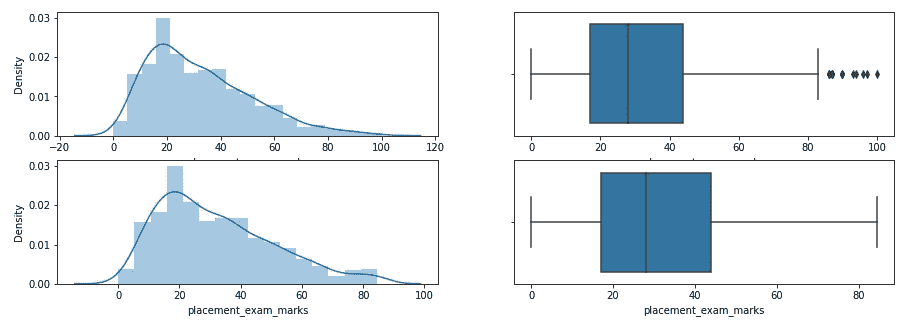[](https://medium.com/@gowthamsr37/how-do-i-analyze-the-data-before-building-a-machine-learning-model-c14a58df36b7) [## 在建立机器学习模型之前，我如何分析数据？

### 目录:

medium.com](https://medium.com/@gowthamsr37/how-do-i-analyze-the-data-before-building-a-machine-learning-model-c14a58df36b7) 

# 3.百分位数法

简而言之，百分位数可以被视为数据百分比低于该值的值。如果我的分数是 90 %,那么这意味着我的分数比参加考试的 90%的学生都要好。

如果你得了最高分，正好是 95 分，那么就是 100 分，也就是说你的分数超过了参加考试的 100%的学生。

这是用来检测数据集中异常值的最简单的技术之一。我们只需要决定阈值，例如，如果我们决定 1 个百分点，那么这意味着我们将所有高于 99 个百分点和低于 1 个百分点的值视为异常值。

让我们看看如何实际实施这种方法。

```
df = pd.read_csv('weight-height.csv')
df.head()
```

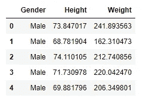

让我们将百分位数法应用于特征**“身高”。**

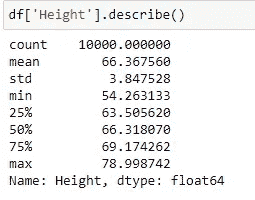

```
plt.figure(figsize=(15,5))plt.subplot(1,2,1)
sns.distplot(df['Height'])plt.subplot(1,2,2)
sns.boxplot(df['Height'])
```

查看数据的分布和特征的箱线图。

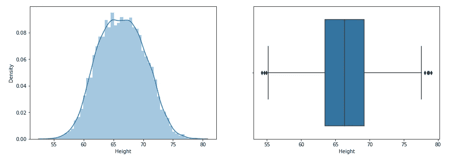

```
#Finding the upper and lower limitupper_limit = df['Height'].quantile(0.99)
lower_limit = df['Height'].quantile(0.01)print('lower limit: ', lower_limit)
print('upper limit: ', upper_limit)**lower limit:  58.13441158671655
upper limit:  74.7857900583366**
```

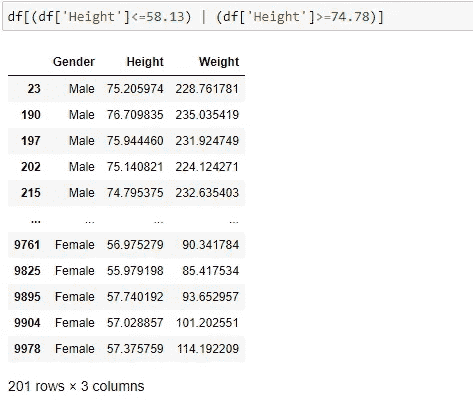

上述 201 个数据点被检测为异常值。

[](/step-by-step-approach-to-building-a-recommendation-system-a65be5a54045) [## 一个完整的基于端到端机器学习的推荐项目

### 基于协同过滤和流行度过滤的机器学习推荐方案

pub.towardsai.net](/step-by-step-approach-to-building-a-recommendation-system-a65be5a54045) 

## 整理

在这种方法中，我们可以删除最小和最大限制之外的所有数据点。

```
df_new = df[(df['Height']>=58.13) & (df['Height']<=74.78)]
df_new
```

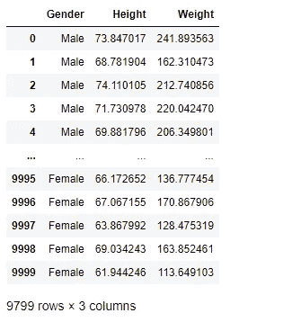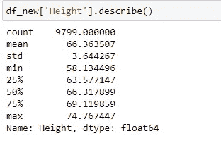

```
plt.figure(figsize=(15,5))plt.subplot(1,2,1)
sns.distplot(df_new['Height'])plt.subplot(1,2,2)
sns.boxplot(df_new['Height'])
```

修剪特征后，查看数据分布和箱线图。


## 封顶(也称为 Winsorization)

在这种方法中，异常数据点以最高或最低值为上限，如下所示。

```
upper_limit = df['Height'].quantile(0.99)
lower_limit = df['Height'].quantile(0.01)df_cap = df.copy()df_cap['Height'] = np.where(df_cap['Height']>upper_limit , upper_limit , df_cap['Height'])
df_cap['Height'] = np.where(df_cap['Height']<lower_limit , lower_limit , df_cap['Height'])
```

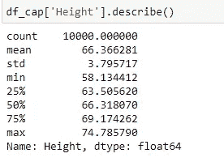

```
plt.figure(figsize=(15,5))plt.subplot(1,2,1)
sns.distplot(df_cap['Height'])plt.subplot(1,2,2)
sns.boxplot(df_cap['Height'])
```

查看要素封顶后的数据分布和箱线图。

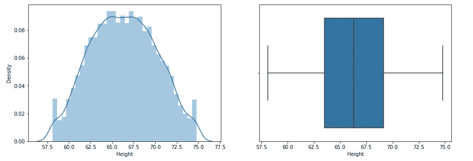

请访问 [GitHub](https://github.com/gowthamsr37/Outlier-Detection-and-Removal-Techniques/tree/main) 链接获取完整代码。

你可以通过 [LinkedIn](https://www.linkedin.com/in/gowtham-s-r-78120a127/) 和我联系