# 异常值检测和处理:初学者指南

> 原文：<https://pub.towardsai.net/outlier-detection-and-treatment-a-beginners-guide-c44af0699754?source=collection_archive---------0----------------------->

## [数据科学](https://towardsai.net/p/category/data-science)


数据预处理中最重要的步骤之一是异常值的检测和处理。机器学习算法对数据点的范围和分布非常敏感。数据异常值会欺骗训练过程，导致训练时间更长，模型更不准确。离群值被定义为与剩余数据显著不同的样本。这些点位于分布的整体模式之外。均值、方差和相关性等统计指标很容易受到异常值的影响。

这里有一个简单的异常值的例子，一个偏离整体模式的点。

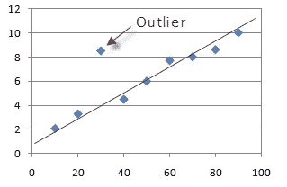

## 异常值的性质:

由于以下原因之一，数据集中可能会出现异常值，

1.  数据集中真正的极高值和极低值
2.  由于人为或机械错误而引入
3.  通过替换缺失值引入

在某些情况下，异常值的存在是有益的，需要进一步研究。例如，异常值在与事务管理相关的用例中非常重要，在这些用例中，异常值可能用于识别潜在的欺诈性事务。

在本文中，我将讨论以下方法来识别数据集中的异常值并处理它们。

## 离群点检测

*   极值分析
*   z 分数法
*   k 表示基于聚类的方法
*   可视化数据

## 异常值处理

*   均值/中值或随机插补
*   整理
*   顶部、底部和零编码
*   [数]离散化

然而，这些方法都不能提供关于哪些观察值是异常值的客观事实。对于什么构成异常值，没有严格的数学定义；确定一个观察值是否是异常值最终是一项主观的工作，这在很大程度上取决于业务问题。因此，本文中讨论的方法可以作为识别数据中应该被视为异常值的点的起点。

# 检测异常值的方法:

有多种方法可以识别数据集中的异常值。我将在本文中讨论以下类型。

1.  极值分析
2.  z 分数法
3.  k 表示基于聚类的方法
4.  可视化数据

重要的是要重申，这些方法不应该机械地使用。它们应该用于探索数据。它们让你知道哪些点可能值得仔细观察。

## 数据集:

我将使用来自 Kaggle 的 [Lending Club 贷款数据集](https://www.kaggle.com/wendykan/lending-club-loan-data)来演示本文中的示例。

**导入库**

```
import pandas as pd
import numpy as np 
import seaborn as sns
import matplotlib.pyplot as plt
%matplotlib inline
```

**导入数据集**

现在，让我们从 CSV 文件中导入*年收入(annual_inc)* 列，并识别离群值。

```
use_cols = ['annual_inc']
data = pd.read_csv('loan.csv', usecols=use_cols, nrows = 30000)
```

## 极值分析:

异常值检测的最基本形式是极值分析。这种方法的关键是确定变量基本分布的统计尾部，并找到尾部最末端的值。

在高斯分布的情况下，异常值将位于变量标准偏差的平均值正或负 3 倍之外。

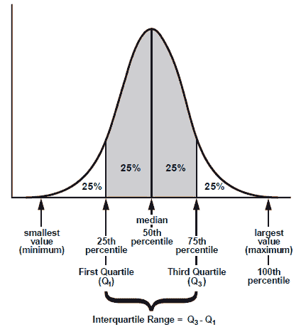

如果变量不是正态分布(非高斯分布)，通常的方法是计算分位数，然后计算四分位间距。

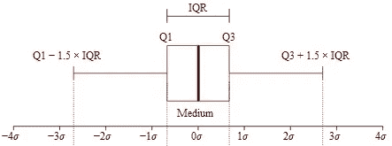

```
IQR (Inter quantiles range)= 75th quantile — 25th quantile
```

异常值将位于以下上限和下限:

```
Upper Boundary = 75th quantile +(IQR * 1.5)Lower Boundary = 25th quantile — (IQR * 1.5)
```

或者在极端情况下:

```
Upper Boundary = 75th quantile +(IQR * 3)Lower Boundary = 25th quantile — (IQR * 3)
```

如果数据点在上边界之上或在下边界之下，它可以被认为是异常值。

**代码:**

首先，让我们计算数据集的分位数区间，

```
IQR = data.annual_inc.quantile(0.75) - data.annual_inc.quantile(0.25)
```

使用 IQR，我们使用上面提到的公式计算上边界，

```
upper_limit = data.annual_inc.quantile(0.75) + (IQR * 1.5)
upper_limit_extreme = data.annual_inc.quantile(0.75) + (IQR * 3)upper_limit, upper_limit_extreme
```


现在，让我们看看高于上限&极端上限的数据点的比率。即异常值。

```
total = np.float(data.shape[0])
print('Total borrowers: {}'.format(data.annual_inc.shape[0]/total))
print('Borrowers that earn > 178k: {}'.format(data[data.annual_inc>178000].shape[0]/total))
print('Borrowers that earn > 256k: {}'.format(data[data.annual_inc>256000].shape[0]/total))
```

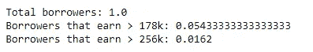

我们可以看到，大约有 5%的数据在上限以上，1%的数据在极限上限以上。

## 标准分数(Z 分数):

Z 分数(或标准分数)表示给定测量值偏离平均值的标准偏差。换句话说，它只是重新调整或标准化您的数据。Z 值用于指定分布中每个观测值的精确位置。Z 分数的符号(+或—)表示分数是高于平均值(+)还是低于平均值(—)。

获取 Z 分数的目的是消除数据的位置和比例的影响，从而可以直接比较不同的数据集。异常值检测的 Z 分数方法背后的直觉是，一旦我们对数据进行了居中和重新调整，任何离零太远的东西(阈值通常是 3 或-3 的 Z 分数)都应被视为异常值。

计算 Z 分数的公式是:

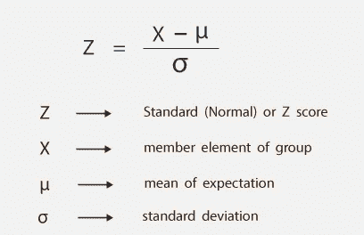

**代号:**

导入库

```
from scipy import stats
```

计算 Z 分数

```
z = stats.zscore(data)
print(z)
```

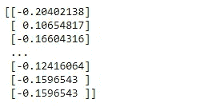

阈值> 3

```
threshold = 3
print(np.where(z > 3))
```

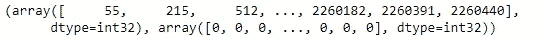

在上面的输出中，第一个数组包含行号列表，第二个数组包含相应的列号。

## 聚类方法:

聚类是一种流行的技术，用于将相似的数据点或对象分组或聚类。它也可以作为异常值分析的重要工具。在这种方法中，我们首先将相似种类的对象分组。

我们将使用 K-Means 聚类，这将帮助我们对数据点(在我们的例子中是年收入值)进行聚类。我们将用于 KMeans 的实现使用欧几里德距离来对相似的对象进行分组。让我们开始吧。

**代号:**

**导入库**

我们现在将从 scipy.cluster.vq 导入 kmeans 模块。

SciPy 代表 *Sci* entific Python，为执行科学实验提供了各种方便的实用程序。

```
from scipy.cluster.vq import kmeans
from scipy.cluster.vq import vq
```

现在，让我们将数据转换成一个 numpy 数组，并应用 K-Means 函数。我们必须给出两个输入——数据和要形成的集群的数量。

```
data_raw = data['disbursed_amount'].value
centroids, avg_distance = kmeans(data_raw, 4)
groups, cdist = vq(data_raw, centroids)
```

质心是由 means()生成的聚类的中心，avg_distance 是数据点和由 kmeans()生成的质心之间的平均欧氏距离。下一步是调用 vq()方法。它返回数据点的组(聚类)以及数据点与其最近的组之间的距离。

现在让我们画出我们得到的组。

```
y = np.arange(0,30000)
plt.scatter(data_raw,  y , c=groups)
plt.xlabel('Salaries')
plt.ylabel('Indices')
plt.show()
```

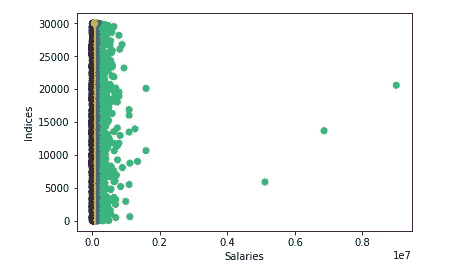

我相信你能够从上面的图表中找出异常值。

## 图形方法:

正如我在我的[上一篇文章](https://towardsdatascience.com/exploratory-data-analysis-in-python-ebdf643a33f6)中提到的，箱线图、直方图和散点图主要用于识别数据集中的异常值。

**箱线图**

箱线图，也称为晶须图，是一种图形方法，通常用四分位数和四分位数间距来描述，有助于定义上限和下限，超出上限和下限的任何数据都将被视为异常值。

简而言之，分位数是分布中与该分布中值的等级顺序相关的点。对于给定的样本，您可以通过对样本进行排序来找到任何分位数。排序样本的中间值是中间分位数或第 50 个百分位数(也称为样本的中位数)。

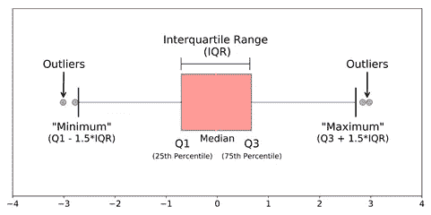

箱线图的真正目的是在进行任何进一步分析之前识别数据序列中的异常值，以便从研究中得出的结论给出更准确的结果，不受任何极端值或异常值的影响。

```
sns.boxplot(y='annual_inc', data = data)
```


在这里，异常值是在数值上远离其余数据的观察值。查看箱线图时，异常值是指位于箱线图围栏(“须”)之外的数据点。

**直方图**

直方图是最常用的图表之一，用于显示数字数据和查找数据集的分布。离群值是位于总体分布模式之外的观察值。

```
fig = data.annual_inc.hist(bins=500)
fig.set_xlim(0,500000)
```


这里，x 轴最右端的数据点可以视为异常值。

**散点图**

散点图用于寻找两个变量之间的关联，这种关联通常有一个模式。如果一个数据点不符合模式，我们称之为异常值。

```
data_raw **= d**ata['annual_inc'].values
y = np.arange(0,30000)
plt.scatter(data_raw,  y)
plt.xlabel('Annual Income')
plt.ylabel('Indices')
plt.show()
```

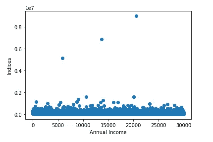

# 预处理异常值的方法:

1.  均值/中值或随机插补
2.  整理
3.  顶部、底部和零编码
4.  [数]离散化

## 平均值/中间值/随机抽样:

假设我们有理由相信异常值是由于测量过程中的机械误差或问题造成的。这意味着，离群值在本质上类似于缺失数据，那么任何用于缺失数据插补的方法都可以用来替换离群值。离群值的数量很小(否则，它们就不会被称为离群值)，使用均值/中值/随机插补来代替它们是合理的。

我将在另一篇专门讨论缺失值的文章中讨论缺失值的插补。与此同时，如果你需要同样的任何来源，[看看这个](https://towardsdatascience.com/6-different-ways-to-compensate-for-missing-values-data-imputation-with-examples-6022d9ca0779)。

## 修整:

在这种方法中，我们完全丢弃了异常值。也就是说，消除被认为是异常值的数据点。在不需要从数据集中移除大量值的情况下，修剪是一种快速有效的方法。

```
index = data[(data['annual_inc'] >= 256000)].index
data.drop(index, inplace=True)
```

这里，我们使用 pandas 的 drop 方法删除所有超过上限值的记录，这些记录是使用极值分析找到的。

## 顶部/底部/零编码:

**顶部编码**是指将分布的最大值限制在任意设定值。顶部编码变量是指上限以上的数据点被删除的变量。通过实施 top 编码，异常值被限制在某个最大值，看起来像许多其他观察值。

**底部编码**类似，但在分布的左侧。也就是说，低于某个阈值的所有值都以该阈值为上限。如果阈值为零，则称为**零编码**。例如，对于像“年龄”或“收入”这样的变量，不可能有负值。因此，将最低值限制为零是合理的。

**代码:**

```
print('Annual Income > 256000: {}'.format(data[data.annual_inc>256000].shape[0]))
print('Percentage of outliers: {}'.format(data[data.annual_inc>256000].shape[0]/np.float(data.shape[0])))
```


在这一步中，我们用大于 256000 到 256000 的值来限制数据点。

```
data.loc[data.annual_inc>256000,'annual_inc'] = 256000
data.annual_inc.max()
```

现在，最大值将显示为 256000。

## 离散化:

离散化是通过创建一组跨越变量值范围的连续区间，将连续变量转换为离散变量的过程。因此，这些异常值不再与分布尾部的其余值不同，因为它们现在都在同一区间/时段中。

有几种方法可以将连续变量转化为离散变量。这个过程也被称为**宁滨**，每个面元就是每个区间。

## 离散化方法

*   等宽宁滨
*   等频宁滨

## **等频率离散化**

等频宁滨将变量的可能值分成 N 个箱，每个箱携带相同数量的观测值。这对于偏斜变量特别有用，因为它将观察值平均分布在不同的条柱上。通常，我们通过确定分位数来找到区间边界。这将有助于最大限度地减少信息损失，并产生更好的结果。

这里，我们使用 pandas qcut 函数(基于分位数的离散化函数)创建 5 个箱

```
income_discretised, intervals = pd.qcut(data.annual_inc, 5, labels=None, retbins=True, precision=3, duplicates='raise')
pd.concat([income_discretised, data.annual_inc], axis=1).head(5)
```

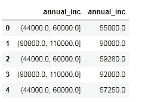

间隔是，

```
intervals
```


下面我们可以看到，在每个区间中几乎有相同数量的观测值。

```
temp = pd.concat([income_discretised, data.annual_inc], axis=1)
temp.columns = ['income_discretised', 'annual_inc']
temp.groupby('income_discretised')['annual_inc'].count()
```

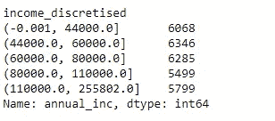

## 等宽离散化

等宽宁滨将可能值的范围划分为 N 个等宽的条柱。宽度由变量中值的范围和我们希望用来划分变量的箱数决定。

宽度=(最大值-最小值)/ N

例如，如果变量的值在 0 和 100 之间变化，我们创建 5 个这样的容器:宽度=(100–0)/5 = 20。第一个和最后一个箱(0–20 和 80–100)可以扩展以容纳异常值(也就是说，小于 0 或大于 100 的值也将放入这些箱中)。

没有定义 n 的经验法则，它取决于用例。

代码:

```
income_range = data.annual_inc.max() - data.annual_inc.min()
min_value = int(np.floor(data.annual_inc.min()))
max_value = int(np.ceil(data.annual_inc.max()))

# let's round the bin width
inter_value = int(np.round(income_range/5))

min_value, max_value, inter_value
```

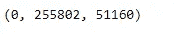

现在我们正在计算间隔，

```
intervals = [i for i in range(min_value, max_value+inter_value, inter_value)]
labels = ['Bin_'+str(i) for i in range(1,len(intervals))]
print(intervals)
print(labels)
```

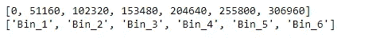

最后，我们使用 pandas cut 函数对数据值进行分段和分类。

```
data['annual_inc_labels'] = pd.cut(x = data.annual_inc, bins=intervals, labels=labels, include_lowest=True)
data['annual_inc_interval'] = pd.cut(x = data.annual_inc, bins=intervals, include_lowest=True)
data.head(5)
```

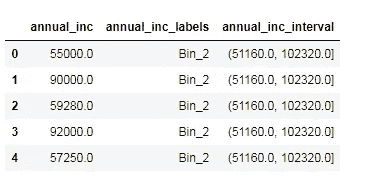

我们可以使用计数图对每个箱中的数据进行计数，如下所示。我们可以看到，在给定的样本数据集中，大多数人的年收入低于 10000 英镑

```
sns.countplot(data.annual_inc_labels)
```

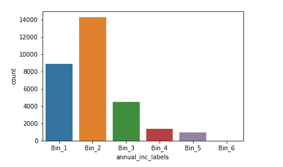

我希望这篇文章对你有用。随意留下你的想法！

参考资料:

1.  [https://www . udemy . com/feature-engineering-for-machine-learning/](https://www.udemy.com/feature-engineering-for-machine-learning/)
2.  [https://blog . floydhub . com/introduction-to-anomaly-detection-in-python/](https://blog.floydhub.com/introduction-to-anomaly-detection-in-python/)