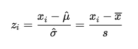
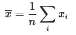
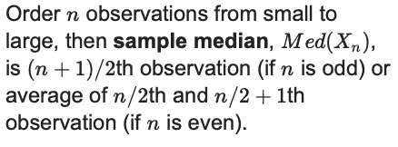
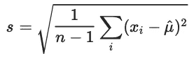
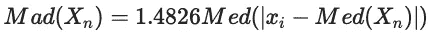
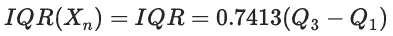
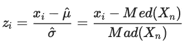
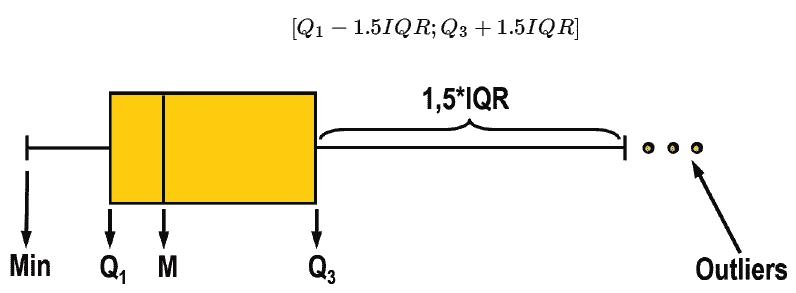
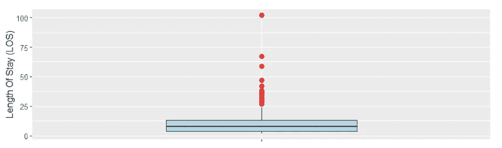
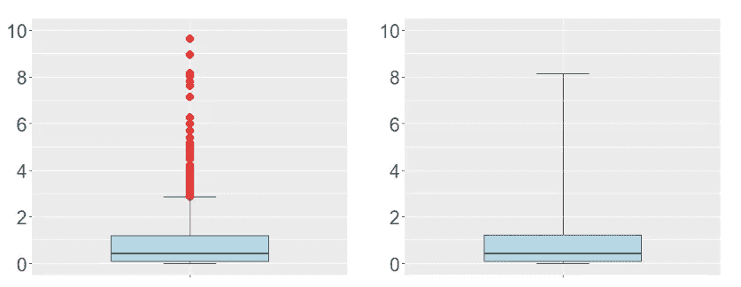

# 异常值检测(第 1 部分):单变量

> 原文：<https://pub.towardsai.net/outlier-detection-part-1-univariate-f40621b0bc?source=collection_archive---------0----------------------->


## 更好地分析—做出更明智的决策

## 稳健统计:R 中的例子


# 表明观点

一个**流行的离群点检测工具**是

1.  计算每次观察的 z 得分。
2.  如果 z 得分的绝对值大于 3，则将观察标记为异常值



z 分数计算

**例如:**让我们看一个名为 log_inc 的对数转换数据集，它是 10 个人的月收入。如果你仔细观察，最后的观察结果显然是一个异常值。

```
7.876638 7.681560 7.628518 … 7.764296 9.912943
```

***计算每次观察的 z 值:***

```
 Mean <- mean(log_inc)
Sd <- sd(log_inc)
z_score <- abs((log_inc — Mean)/Sd) 
```

***检查 z 分数的绝对值是否大于 3:***

```
abs(z_score) > 3
 [1] FALSE FALSE FALSE FALSE FALSE FALSE FALSE FALSE FALSE FALSE 
```

> ***未发现异常值。***

使用同一个数据集，我们将展示使用 ***稳健统计*** 将最后一个变量检测为异常值

# 稳健统计

经典的统计方法依赖于(正态)假设，但即使是一个孤立点也会对结论产生重大影响，并可能导致误导性结果。

当数据包含异常值时，稳健统计也会产生可靠的结果，并产生自动异常值检测工具。

> 常规地使用经典方法和稳健方法是完美的，只有当它们的差异大到有影响时才担心……但是当它们有差异时，你应该认真思考— **J.W .图基(1979)**

## X *n* 位置的估计值:

***样的意思是***



采样平均

***中间值***



中位数

**规模的估计量:**



样品标准偏差



中位数绝对偏差



四分位数范围(标准化)，其中 Q1 和 Q3 是数据的第一个和第三个四分位数

**异常值检测的稳健 z 值**

我们插入稳健估计量来计算**稳健 z 值**:



计算稳健 z 得分的稳健估计量

***演示***

让我们使用开始时作为示例看到的相同数据集。

```
data <- c(7.876638, 7.681560, 7.628518,7.234543,7.465769,
          7.135876, 7.895643, 7.793432, 7.764296, 9.912943)Mean <- mean(data); Sd <- sd(data); Med <- median(data); Mad <- mad(data)
```

*Z 分数输出*

```
> abs(z_score) > 3
[1] FALSE FALSE FALSE FALSE FALSE FALSE FALSE FALSE FALSE FALSE
```

*稳定的 Z 分数输出*

```
> abs(rob_z_score) > 3
 [1] FALSE FALSE FALSE FALSE FALSE FALSE FALSE FALSE FALSE  TRUE
> which(abs(rob_z_score) > 3)
[1] 10
```

# 箱线图

用来识别异常值的一个流行工具是 Tukey 的箱线图。如果观察值在箱线图围栏之外，则标记为异常值。



图基箱线图

让我们用一个例子数据 0.02%的“ [(LOS)住院时间](https://www.kaggle.com/jonasalmeida/2015-deidentified-ny-inpatient-discharge-sparcs)”数据和 plot boxplot 来理解。

```
library(ggplot2)ggplot(data.frame(los), aes(x = "", y = los)) + geom_boxplot(outlier.colour = "red", outlier.shape = 16, outlier.size = 3,fill = "lightblue", width = 0.5) + xlab("") + ylab("Length Of Stay (LOS)") + theme(text = element_text(size = 25))
```



有异常值的箱线图

## 调整后的箱线图(休伯特和范德维伦，2008 年)

1.  在**不对称分布中，**箱线图可能会将许多**规则点标记为异常值**。
2.  偏斜度调整箱线图通过在确定围栏时使用稳健的偏斜度度量来校正这一点。

```
library(robustbase)adjbox_stats <- adjboxStats(los)$statsggplot(data.frame(los), aes(x = "", y = los)) + stat_boxplot(geom = "errorbar", width = 0.2, coef = 1.5*exp(3*mc(los))) + geom_boxplot(ymin = adjbox_stats[1],ymax = adjbox_stats[5],middle = adjbox_stats[3],upper = adjbox_stats[4],lower = adjbox_stats[2],outlier.shape = NA,fill = "lightblue",width = 0.5) +
geom_point(data=subset(data.frame(los),los < adjbox_stats[1] | los > adjbox_stats[5]),col = "red", size = 3, shape = 16) +xlab("") + ylab("Length Of Stay (LOS)") +theme(text = element_text(size = 25))
```



偏斜度调整的箱线图中栅栏线的比较

# 总结:

与仅使用经典方法相比，稳健统计的使用增强了我们的异常值检测能力。