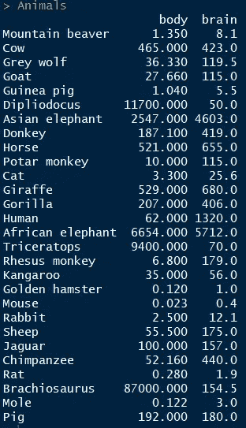
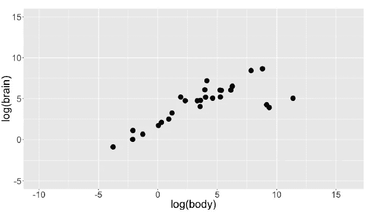
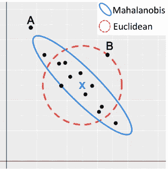
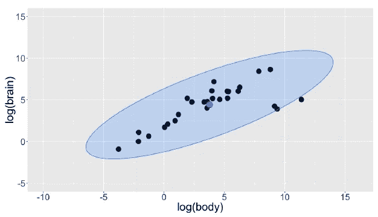
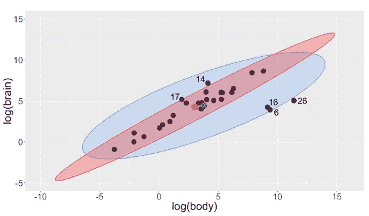
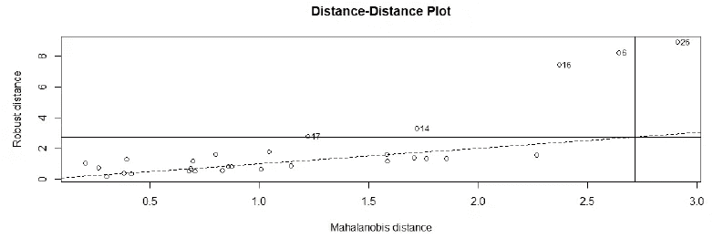

# 异常值检测(第 2 部分):多元

> 原文：<https://pub.towardsai.net/outlier-detection-part-2-multivariate-df486f658d09?source=collection_archive---------0----------------------->


## 更好地分析—做出更明智的决策

## 马氏距离|稳健估计(MCD):R 中的示例


原始图像见[此处](https://images.app.goo.gl/Z7FnPjqYZS77FDZ46)

在 [第一部分( ***异常值检测:单变量*** )](https://medium.com/towards-artificial-intelligence/outlier-detection-part-1-univariate-f40621b0bc) 中，我们学习了如何使用稳健的方法来检测单变量异常值。这一部分我们将看到如何更好地识别多元异常值。

> 多元统计——同时观察和分析一个以上的结果变量

我们将使用来自 R 中的" **MASS"** 包的" **Animals "** 数据进行演示。



R 中批量包装的动物数据

用于演示的变量是动物的体重和大脑重量，它们被转换成对数形式*(使高度偏斜的分布不那么偏斜)*

```
Y <- data.frame(body = log(Animals$body), brain = log(Animals$brain))plot_fig <- ggplot(Y, aes(x = body, y = brain)) + geom_point(size = 5) +
  xlab("log(body)") + ylab("log(brain)") + ylim(-5, 15) +
  scale_x_continuous(limits = c(-10, 16), breaks = seq(-15, 15, 5))
```



在进入分析部分之前。让我们试着理解一些基础知识。

# 马哈拉诺比斯距离

> 观测的 Mahalanobis(或广义)距离是从该观测到中心的距离，考虑了协方差矩阵。



1.  ***经典马氏距离* :** **样本均值**作为位置估计，**样本协方差矩阵**作为散布估计。
2.  为了检测多元异常值，将 Mahalanobis 距离与从卡方分布导出的截止值进行比较
3.  在二维空间中，我们可以构建相应的 97.5%容差椭球体，该椭球体由 Mahalanobis 距离不超过截止值的那些观察值定义。

```
Y_center <- colMeans(Y)
Y_cov <- cov(Y)
Y_radius <- sqrt(qchisq(0.975, df = ncol(Y)))library(car)
Y_ellipse <- data.frame(ellipse(center = Y_center,
                                 shape = Y_cov,radius = Y_radius, segments = 100, draw = FALSE))
colnames(Y_ellipse) <- colnames(Y)plot_fig <- plot_fig +
  geom_polygon(data=Y_ellipse, color = "dodgerblue",
               fill = "dodgerblue", alpha = 0.2) +
  geom_point(aes(x = Y_center[1], y = Y_center[2]),
             color = "blue", size = 6)
plot_fig
```



上面的方法给了我们 3 个潜在的异常值观察值，它们接近椭圆线。

这是否足够强大？或者，如果我们使用不同的方法，我们会看到更多的异常值吗？

## 位置和散布的稳健估计

***最小协方差行列式(MCD)***rousse uw 估计量是一种流行的多元位置和散度的稳健估计量。

1.  MCD 寻找那些经典协方差矩阵具有*最低可能行列式*的 ***h*** 观测值。
2.  MCD 对位置的估计是这些 ***h*** *观察值*的平均值
3.  分散的 MCD 估计是这些 ***h*** *点*的*样本协方差矩阵(乘以一致性因子)。*
4.  应用重新加权步骤来提高正常数据的效率。
5.  MCD 的计算是困难的，但是提出了几种快速算法。

## 使用 MCD 的位置和散布的稳健估计

```
library(robustbase)
Y_mcd <- covMcd(Y)
# Robust estimate of location
Y_mcd$center
# Robust estimate of scatter
Y_mcd$cov
```

通过在马哈拉诺比斯距离的定义中插入这些位置和散布的稳健估计，我们获得稳健的距离，并且可以创建稳健的容差椭球(RTE)。

## 强健耐受椭球:动物

```
Y_mcd <- covMcd(Y)ellipse_mcd <- data.frame(ellipse(center = Y_mcd$center,
                                  shape = Y_mcd$cov,
                                  radius= Y_radius, 
                                  segments=100,draw=FALSE))colnames(ellipse_mcd) <- colnames(Y)plot_fig <- plot_fig +
  geom_polygon(data=ellipse_mcd, color="red", fill="red", 
  alpha=0.3) +
  geom_point(aes(x = Y_mcd$center[1], y = Y_mcd$center[2]),
             color = "red", size = 6)
plot_fig
```



## 距离-距离图

**距离-距离图**显示了每次观测的稳健距离与其经典 Mahalanobis 距离的对比，后者是从 MCD 物体直接获得的。

```
plot(Y_mcd, which = "dd")
```



## 检查异常值


# **总结**

***最小协方差行列式*** 插有**马氏距离**的估计为我们提供了比我们的经典方法更好的异常值检测能力。