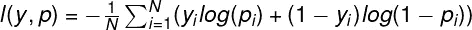
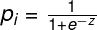
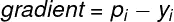
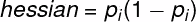
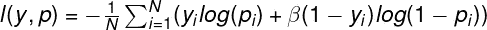
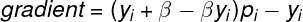
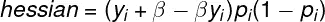
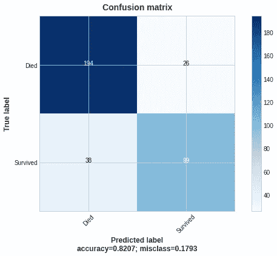
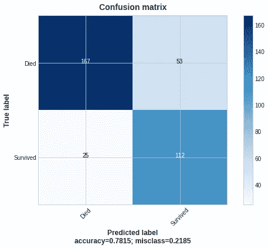

# 用自定义损失函数概述一个较小的类

> 原文：<https://pub.towardsai.net/outline-a-smaller-class-with-the-custom-loss-function-94ff00359698?source=collection_archive---------2----------------------->

## 处理不平衡数据集时充分利用分类的简短指南

(**左**)照片由[麦克·劳伦斯](https://www.flickr.com/photos/157270154@N05/)在 [Flickr](https://www.flickr.com) | ( **中**)照片由[杰奈杰·弗曼](https://www.flickr.com/people/91261194@N06/)在 [Flickr](https://www.flickr.com) | ( **右**)照片由[伦纳德·J·马修斯](https://www.flickr.com/people/mythoto/)在 [Flickr](https://www.flickr.com)

## 为什么要使用自定义损失函数？

可能会出现准确性度量不足以获得预期结果的情况。我们可能希望降低假阴性(FN)或假阳性(FP)率。当数据集不平衡并且我们寻求的结果属于较小的类时，这可能是有益的。

**哪里适用**

1.欺诈检测。我们希望减少假阴性样本(例如，当交易可疑时，模型会照常处理交易)。目标是最小化不被注意的欺诈交易的风险(即使假阳性率会增加)。

2.**疾病识别**。逻辑是一样的。我们希望增加感染这种疾病的机会，即使我们将来会有更多的 FP 病例需要处理。

3.**在体育比赛中挑一个局外人**。让我们假设一个有两种结果的游戏(赢/输一个最喜欢的)。但是我们想知道一个局外人是否有机会。一个平衡的模型将会在大多数时候执行“樱桃采摘”,因为这是一个预测最喜欢的获胜的简单方法。解决的办法是惩罚假阴性(当一个模型预测一个更强的团队的胜利，但准确的标签是一个最喜欢的损失)。

我们不希望在前两种情况下出现高 FP 率，因为这将增加资源使用量，以确认样本不是欺诈/疾病。因此，模型优化仍然是必要的。

## **原始日志和定制日志之间的桥梁损耗**

普通的梯度增强算法(该算法)进行以下步骤。它获得预测值(让我们称之为“predt”，根据我们使用的库，以 logit 或 logitraw 的形式)和相应的真实标签(让我们称之为“y”)，然后它估计 logloss 函数的值。它逐行执行这些操作来计算累积损失函数值。

logloss 具有以下公式:

其中`N` —样本数，`y` —真标签，log —自然对数。

`p_i` —第 I 个样本为`1`的概率(sigmoid 函数):

其中 m 是特征的数量，`z`是线性回归，其中`w`是特征的权重，`x`是特征值。

下一步是更新要素的权重以最小化损失。该算法计算梯度和 hessian 来选择改变权重的方向和功率。

梯度的公式为:

黑森的公式:

> 我们通过将链式法则应用于对数损失函数`l`来计算关于自变量`z`变化的导数。

我们可以把这个过程想象成一场高尔夫球赛。一个高尔夫球手(一种算法)试图把球打入洞内(一个正确的预测，使损失最小化)；要做到这一点，他可以选择击球的方向和力量(梯度)，并采取各种球杆来控制击球(黑森)。

照片由[大卫·乔伊斯](https://www.flickr.com/photos/deapeajay/)在 [Flickr](https://www.flickr.com) 上拍摄

算法的主要目标是使累积 logloss 尽可能的小(一个奇怪的高尔夫球手，他追逐的是进洞球的数量，而不是用最少的击球数得出结果)。如果我们有一个不平衡的数据集，并且特征没有提供明确的分类，那么它倾向于预测一个样本属于一个更大的组(某种类型的挑选)。

让我们想象一场改变了规则的高尔夫球赛；大多数孔都有一个标准值，但也有比普通孔更有意义的额外值。高尔夫球手事先不了解目标的价格。如果一个玩家多打了一洞，他会得到更高的奖励。如果他错误地将球洞识别为标准球洞，并拒绝接近球洞，他会损失时间并得到较少的补偿。

基本算法无法意识到规则的变化，所以它继续进行更简单的规则，并且无法识别和评分额外的规则。让我们引入“beta”(一个没有上限的正数)来扭转局面。它的目标是，如果算法做出不正确的预测，就会大幅增加累积损失。基本算法也有“beta”，等于 1。

β-log loss 有以下公式:

梯度和 hessian 公式:

自定义损失是通过将算法“beta”更改为小于 1 以惩罚 FN 或大于 1 以使 FP 花费更多来实现的。我们应该用新的“beta”重新计算梯度和 hessian，迫使 algo 改变损失计算策略。

## **咱们码自定义损耗**

我用 Python 实现了 scikit-learn API for XGboost 中的代码(版本 1.0.2)。我们可以在梯度提升包(XGBoost，LightGBM，Catboost)或深度学习包(如 TensorFlow)中使用自定义损失函数。

有四个用户定义的函数来实现自定义损失函数。第一步是计算修正的 logloss 函数的一阶导数(梯度)，第二步是计算二阶导数，第三步是获得目标函数，第四步是计算修正的评估度量。

此后，`y`参数包含一个实际类别值，`predt`获取要评估的预测值。

`logreg_err_beta_sklearn`函数根据数据集计算 logloss 以进行评估。它根据看不见的数据检查性能。即使我们应用 sklearn API，这个自定义函数接收的是`dmat`参数，是 DMatrix 数据类型(XGBoost 的内部数据结构)。

## **基于泰坦尼克号数据集的示例**

泰坦尼克号数据集是一个不平衡数据集的例子，存活率只有 38%。

让我们跳过建模前的预处理步骤，直接进入分类任务。您可以在本文末尾引用的我的 GitHub 资源库中找到一个整体。

基本算法的结果是下面的混淆矩阵:

作者图片

基本算法给出了 38 个 FN 案例。假设我们的目标是减少 FN 的数量。让我们将目标函数更改为自定义函数，相应地修改评估指标，并将“beta”设置为. 4。

对基本算法的更改包括禁用默认评估指标、明确引入自定义 logloss 函数以及相应的评估指标。

贝塔对数损失算法的混淆矩阵；

作者图片

beta 算法将 FN 病例减少到 25 (-34%)，真阳性(TP)增加到 112 (+13%)，FP 增加到 53 (+103%)，真阴性(TN)减少到 167 (-14%)。FN 下降导致 TP 和 FP 都上升。整体准确率下降。

我们可以很容易地应用同样的逻辑，通过选择大于 1 的“beta”来惩罚 FP。

## **结论**

贝塔对数损失有一些独特的优点，也有缺点。我已经列出了最明显的几个。

**优点**

*   易于快速应用(使用四个用户定义的函数和测试版，仅此而已)。
*   在建模之前，不需要对底层数据进行操作(如果数据集不是高度不平衡的话)
*   它可以作为数据探索的一部分或模型叠加的一部分来应用。
*   我们可以将它添加到最流行的机器学习包中。

**快捷键**

*   我们应该调整“β”,以获得最佳的 FN 与 FP 的平衡。
*   当数据集高度不平衡时(次要类别少于所有样本的 10%的数据集)，它可能不会提供有意义的结果。探索性数据分析对于模型的运行至关重要。
*   如果我们惩罚 FN，通常会导致 FP 大幅增长，反之亦然。您可能需要额外的资源来弥补这种增长。

**参考文献**

1.  二元交叉熵(logloss)概述:[https://towards data science . com/understanding-binary-cross-entropy-log-loss-a-visual-explain-a3ac 6025181](https://towardsdatascience.com/understanding-binary-cross-entropy-log-loss-a-visual-explanation-a3ac6025181a)
2.  回归任务自定义损失函数概述:[https://towards data science . com/custom-loss-functions-for-gradient-boosting-f 79 C1 b 40466d](https://towardsdatascience.com/custom-loss-functions-for-gradient-boosting-f79c1b40466d)
3.  自定义损耗函数相关的 XGBoost 文档:[https://XGBoost . readthedocs . io/en/latest/tutorials/custom _ metric _ obj . html](https://xgboost.readthedocs.io/en/latest/tutorials/custom_metric_obj.html)
4.  `Plot_confusion_matrix` 功能来源:[https://www.kaggle.com/grfiv4/plot-a-confusion-matrix](https://www.kaggle.com/grfiv4/plot-a-confusion-matrix)
5.  链接到我的 GitHub 资源库:[https://GitHub . com/kpluzhnikov/binary _ class ification _ custom _ loss](https://github.com/kpluzhnikov/binary_classification_custom_loss)

如果你喜欢这篇文章，请毫不犹豫地喜欢、评论并分享它。或者甚至:

 [## 通过我的推荐链接-康斯坦丁·普鲁申尼科夫加入媒体

### 阅读康斯坦丁·普鲁申尼科夫的每一个故事(以及媒体上成千上万的其他作家)。您的会员费直接…

medium.com](https://medium.com/@kplz/membership)