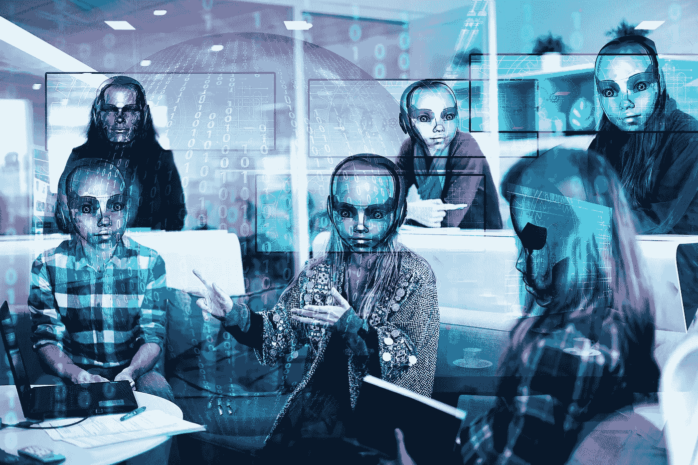
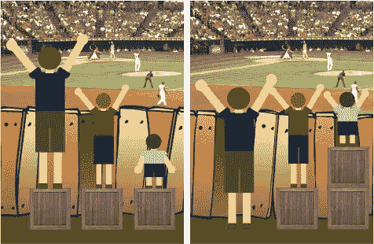

# 彩虹之上

> 原文：<https://pub.towardsai.net/over-the-rainbow-3cd96fef8b54?source=collection_archive---------4----------------------->

## [人工智能](https://towardsai.net/p/category/artificial-intelligence)、[公平](https://towardsai.net/p/category/artificial-intelligence/fairness)

人们期望人工智能是公正的；这是不对的。如果底层数据反映了刻板印象，你会发现这些东西。
这是一个关于平等、公平、正义和人工智能黑暗面的故事。

[来源](https://pixabay.com/illustrations/workplace-digitization-robot-binary-1616459/)

> “彩虹之上的某个地方，天空是蓝色的，
> 你敢于梦想的梦想真的实现了。”
> 
> (哈罗德·阿伦&叶·哈伯格为《绿野仙踪》而作)

# 第一部分:正义的真理

> *“贫穷的反面是正义”(布莱恩·史蒂文森)*

众所周知，我是儿童书籍的狂热爱好者。简单和天真是天才的边界，众所周知，简单是天才的标志。耶尔·毕然的《篱笆、一些羊和一个有大问题的小家伙》无疑被列为解决问题的最佳儿童故事之一。

对于那些不熟悉这个故事的人来说，它是关于一个有睡眠问题的小家伙，正如老把戏所暗示的，他开始数羊。但是，这些羊并没有让他无聊地睡着，而是找到了有趣而独特的方式来穿越围栏；每个人都有自己的方式。

**解决障碍:**
最初，这本书旨在向孩子们传授我们看待世界的不同方式，但它简单明了的插图在管理研讨会上变得非常受欢迎，因为它形象化了解决问题的各种创造性方式，并鼓励了创造性思维。

这些羊找到了各种越过栅栏的方法:跳过栅栏，试图突破，忽视栅栏，过度思考最佳方式，或者爬过一堆没通过任务的死羊。故事的结尾是一只羊退后一步，意识到有一个非常简单的方法可以越过栅栏；她在栅栏附近找到了一条自由的路(你可以在书的[记录](https://www.youtube.com/watch?v=dGta6M8vLr8)处看到图形，第 2 分 23 秒)。

对我来说，正如你可能已经猜到的，这不是一个关于 c-suite 类创造性问题解决的故事，而是我们处理平等、公平和真正的正义的方式的重要一课，当然，我们会有一点人工智能。

**平等还是公平:**T21*前阵子，我偶然发现了 Craig Froehle* 的一幅图，表现了平等和公平的区别。

原创迷因作者[克雷格](https://medium.com/u/4963f86596bb?source=post_page-----5b3426a07489----------------------)2012 年 12 月 19 日

这个图形有很多迭代，所以你可能会碰到它的一个版本。基本上，它展示了三个人越过栅栏看棒球比赛。人们有不同的高度，所以那些不高的人很难看清。

在第一张图片中，三个人都站在一个板条箱上。换句话说，有‘平等’，因为每个人的板条箱数量都是一样的。虽然这对中等身高的人来说是有帮助的，但对身材较小的人来说是不够的，对身材最高的人来说是多余的。相比之下，在第二张图中，有“公平”——每个人都有他们最大限度享受游戏所需的确切数量的箱子。

**赤字思维:**
我对这幅图最大的问题是，最初的不平等在哪里。有些人需要更多的支撑才能越过栅栏，因为他们没有那么高，这是人本身固有的问题。它植根于压迫的历史，从殖民、奴隶制到“隔离但平等”以及红线。它是由系统性的种族主义和该国日益增长的经济不平等维持的。

“缺陷思维”指的是学生，尤其是低收入或少数民族背景的学生，因为内在缺陷而在学校失败的观念。这种内生理论指责受害者，而不是检查学校是如何阻止某些学生学习的。

这张图片和其他一些图片——比如动物不得不爬树的图片，或者摘水果的人，都有同样的问题。赤字思维使种族主义和压迫的系统形式看不见。

伸张正义:这不是公平与平等的问题。这是为了伸张正义。
首先，重要的是要认识到，高度不是一些人比其他人更难看清的原因，而是他们周围的环境——作为一种隐喻，栅栏。在这种特殊情况下，真正的正义应该是拆除围墙。

罗伯特·弗罗斯特有一句名言:“在你知道竖起篱笆的原因之前，永远不要拆掉它”。抱歉，弗罗斯特先生，但是如果栅栏被毫无理由地竖起来，那么现在肯定是拆除它们的最佳时机。

如果我们想解决真正的问题，我们确实需要首先看看为什么栅栏会在那里，以及可以实现什么替代方案来使情况更加和谐。这就是正义。

平等是对每个人一视同仁，而公平是给予每个人成功或取得成就所需的东西。虽然平等旨在促进公平，但只有当每个人都从同一个地方开始，并需要相同的帮助时，它才能发挥作用。公平看似不公平，但它通过创造公平的竞争环境，积极推动每个人向成功靠近。但是，正如我们所知，不是每个人都从同一个地方开始，也不是每个人都有相同的需求。

**孩子不是天生的种族主义者:**
“孩子是无辜的，热爱正义，而我们大多数人是邪恶的，天生喜欢仁慈”。(切斯特顿)

一项新的研究给人类带来了一些希望。它报告说，美国五岁和六岁的孩子大多不相信一个人的肤色决定了一个人的个性和能力。纽约大学的心理学家马乔里·罗德说，“种族偏见需要很长时间才能形成，而且这种偏见的形成在某种程度上取决于孩子成长的环境”。

**我们的差异不是障碍:**
“那不公平”，是我们从孩子那里听到的比我们想象的更多的话。公平的游戏规则是“我得到两块饼干，你得到两块饼干”，孩子们在纯粹的意义上理解，公平不等于平等。因为事情是这样的:对每个人一视同仁是不公平的。平等待遇所做的是消除我们的差异，促进特权。

因为每个人都是不同的，我们认为这些差异是独一无二的，所以我们也必须在这些个体差异的基础上重新定义我们对公平的基本期望。我们需要认识到我们的差异是独特的，而不是达到一个定义和平等待遇。当我们揭开平等的毯子，我们可以看到，并不是每个人的需求都得到了满足。

我们通过把每个人带到我们认为他们应该在的地方，积极地消除我们的差异或试图“修复”它们。但是，在一个公平的社会中，每个人都很重要，每个人都为社会的发展做出贡献，这是整个社会的胜利之道。

**特权对拥有特权的人来说是看不见的:**
通常，我们意识不到自己的特权，因为这个系统通常对我们有利。但是，特权的另一面是什么感觉呢？我曾经听到过一个很好的解释:“这就像在为汽车建造的道路上行驶”。

汽车和自行车是不同的。但事实是，整个交通基础设施给了汽车特权。对于一个骑自行车的人来说，道路是危险的(以一个被汽车撞过几次的公路自行车手为例)。当然，不是故意的。大多数司机并不想成为混蛋(或者至少，我想这么认为)。只是交通规则和道路系统并没有让汽车和自行车和平共处。

每个人在某些方面都有特权；一个男人永远不会理解一个努力向上爬的女人，就像一个双腿健全的健康人不会理解残疾一样。但是，这并不意味着差异使一个人更优越或更好。这并不意味着这些都是障碍。我们都是独一无二的，不同的，尝试一刀切的解决方案是错误的，也是有害的。但可悲的是，我们很难改变整个有缺陷的系统。我们能做的是促进公平，并通过帮助消除过时的界限来为寻求正义付出额外的努力。

# 第 2 部分:人工智能的黑暗面

> “人们期望人工智能没有偏见；那是错误的。如果底层数据反映了刻板印象，或者如果你从人类文化中训练 AI，你会发现这些东西。”(人工智能研究员乔安娜·布赖森)

因此，也许一个由人工智能(AI)驱动的世界的解决方案，并不是那么糟糕。机器不会有偏见，更不会有种族主义者，对吧？—我们倾向于认为它们的吸引力是巨大的；机器可以使用冰冷、干燥的数据，做出有时比人更准确的决策。嗯，这不一定是真的。

我最近写道，人工智能与创造它的人一样聪明，这解释了人工智能如果使用不当的危险。它可以做出延续社会中存在的种族偏见的决定。这不是因为计算机是种族主义者，而是因为人类创造了它们，而人类是有偏见的。他们被现实世界的数据所训练，而不是现实世界的数据。

人权数据分析小组的首席统计师克里斯汀·卢姆说:“如果你不小心，你就有可能自动化这些程序应该消除的偏见。”。

**Garbage In—Garbage Out:**
2016 年，ProPublica 公布的一项关于一款犯罪风险评估软件的调查发现，该软件被法院用来预测某人在被预订后犯罪的可能性，该程序对黑人有偏见。

讽刺的是，这敲响了警钟；我们使用这些系统是因为我们认为它们没有人类偏见，因此它们可以做出公正的决定。ProPublica 写道——“如果计算机可以准确预测哪些被告可能会犯下新的罪行，刑事司法系统就可以更公平、更有选择性地决定谁会被监禁以及监禁多长时间”。

这不仅仅是刑事评估。美国最近的一项研究发现，大多数商业面部识别系统表现出偏见。该系统错误识别非裔美国人和亚洲人的比例为 1:10。

识别女性和老年人也是如此。麻省理工学院媒体实验室[的研究发现](https://www.nytimes.com/2018/02/09/technology/facial-recognition-race-artificial-intelligence.html)一些面部识别软件可以以近乎完美的精度识别一个白人男性，但在识别一个肤色较深的女性时却令人惊讶地失败了。这一问题在老牌公司中依然存在。2015 年，谷歌照片给黑人贴上了“大猩猩”的标签。[的正式道歉](https://eu.usatoday.com/story/tech/2015/07/01/google-apologizes-after-photos-identify-black-people-as-gorillas/29567465/)是:“我们对此事感到震惊和由衷的抱歉”。

最近，当一所美国大学声称拥有一个“没有种族偏见”的软件时，争论[重新开始了。剑桥大学计算机科学研究员克里蒂卡·德席尔瓦警告说，使用这种软件会带来严重的危害。她说，认为机器可以根据一个人的脸来预测犯罪是不负责任的。](https://www.bbc.co.uk/news/technology-53165286)

“大量研究表明，机器学习算法，特别是人脸识别软件，存在种族、性别和年龄偏见”。虽然它仍然被广泛用于低执法，但对其危险性的认识正在上升，旧金山成为第一个禁止警察和其他执法机构使用面部识别的美国主要城市。

旧金山在这场斗争中并不孤单。[几个月前](https://www.bbc.co.uk/news/technology-51673296)，微软和 IBM 与梵蒂冈联手，创立了人脸识别和道德人工智能的学说。在 2020 年 2 月 28 日发布的一份名为“[罗马呼吁人工智能伦理](http://www.academyforlife.va/content/dam/pav/documenti%20pdf/2020/CALL%2028%20febbraio/AI%20Rome%20Call%20x%20firma_DEF_DEF_.pdf)”的联合文件中，他们陈述了自己的使命:“必须鼓励新形式的监管，以促进透明度和对伦理原则的遵守，特别是对影响人权风险较高的先进技术，如面部识别”。此外，“人工智能系统必须被构想、设计和实施，以服务和保护人类及其生活的环境”。

各种公司声称拥有一个具有复杂人脸识别算法的人工智能，以检测恐怖分子或预测谁是罪犯。这是一个可怕的事实，因为不管算法有多强大，它都是关于你给算法提供什么样的数据来教它们辨别。如果你喂它垃圾，你会得到垃圾。正如我们所说，“垃圾进，垃圾出”。

模式行为:
挑战当然是确保计算机正确无误。如果一个方向错了，一个危险的罪犯就可能逍遥法外(假阴性)。如果它在另一个方向出错，它可能导致某人不公平地接受更严厉的判决或等待假释的时间超过适当的时间(假阳性)。

当然，还有“性别歧视人工智能”，这方面的一个很好的例子是亚马逊的机器学习程序，用于过滤潜在候选人的简历，这些简历带有性别偏见。但是，真正的危险似乎出现在医疗保健领域人工智能应用的兴起。健康数据充满了历史偏见，这可能会导致人类死亡。

解决办法可能是像我们人类一样，向机器传授人类行为，包括偏见以及如何识别偏见，以对抗种族主义。“如果你把种族主义的定义换成一种行为模式——就像一种算法本身——那就完全不同了。你可以看到什么在重复出现，然后模式就会弹出来。突然间，不仅仅是我是种族主义者；这是一切。人工智能专家 Mike Bugembe 对 Metro[说,*它需要在更大的范围内得到解决。*](https://metro.co.uk/2020/04/01/race-problem-artificial-intelligence-machines-learning-racist-12478025/)

**双重挑战:**
我们面临的挑战是双向的:
使用这些程序的人实际上是在倾听和接受机器的决定。他们在听一些延续甚至加重社会中已经存在的偏见的东西。他们应该意识到这个问题，并对机器的决定持保留态度。

与此同时，数据科学家和人工智能研究人员正面临一个新的、陌生的挑战，这个挑战超越了统计数据和复杂的数学；带着我们过去的古老包袱，努力塑造未来。

# 第三部分:失败者

> “和平不会来自于武装冲突，而是来自于手无寸铁的国家在困难面前所实践的正义”——(圣雄甘地)

既然我们已经确定即使是人工智能也无济于事，我们就有义务确保人类的未来尽可能远离偏见，确保我们的偏见不被植入机器。我们认为我们所做的是追求正义，但事实并非如此。我们所做的一切都是通过给不太高的人额外的箱子来寻求公平或公正。

在我们自己舒适的客厅里做一些事情或者从我们的储蓄账户中向慈善机构捐款是非常容易和几乎毫不费力的。这些都是非凡的，自我满足的，让我们感觉圣洁，它们不会让我们花费太多，它也让我们继续自己的生活，但我们真的在乎吗？—如果我们真的有——到现在为止，我们在哪里？

特殊的日子、运动、抗议和标签有它们的位置，但它们几乎是平等的。这就像给不太高的人额外的箱子，强调他们的缺点。这是正义之外的一切。贴一张照片，挥舞一面彩色的旗帜，或者穿一件特定颜色的衬衫，很容易让人觉得我们在改变什么，而实际上我们所做的只是走过场。

这就像在门上挂一个牌子，说明这个房子是素食主义者，但在那扇关着的门后面，实际上是一个肉类节日。或者服用一种神奇的减肥药，希望用吞咽药丸的最小努力减掉一些多余的脂肪，但是，不改变不良的饮食习惯，也不缺乏药丸有效所需的锻炼。你猜怎么着；我有一些突发新闻要告诉你；它不会也不会起作用！

请不要误会；我敢肯定，有些人真的在乎，有些非常诚实的房子，门上的文字和背后的行动是紧密相连的。我只是指越来越多的伪君子和道貌岸然的人，他们随波逐流，以获得一些名声或声望，但当现实击中他们的脸时，他们就会露出他们的真实面目(在这种情况下，这句话是多么讽刺)。

**失败者:**
去年上映的心理惊悚片《小丑》，围绕它进行了一场声势浩大的宣传。谷歌将它评为“有史以来最好的电影”之一，你会发现《小丑》与其他有史以来的经典电影如《教父》、《低俗小说》、《指环王》和其他一些杰出的电影一起。所以在感受到一点同龄人的压力后，我去看了。我讨厌它有几个原因，但我会在这里提到，只有一个是相关的，我想说的。

在我看来，这部电影完美地反映了我们生活的世界。我们都同情弱者，尽管他们的行为——(在小丑的例子中，是“谋杀”)。暴力解决不了问题；它创造了他们。在唯一可行的解决办法是杀戮的地方，这将是一个巨大的失败。非暴力不仅需要身体上的勇气，还需要巨大的智慧。其他任何事情，无论从道德上还是从实践上都是失败的)。

同情弱者是很容易的，人们会毫不犹豫地与弱者站在一起，这种现象被称为“弱者效应”，但同情会去同情弱者，同情很容易被误认为是正义的必要条件。失败者效应也有公平的一面。如果我们认为一个人得到了不公平的优势，我们倾向于支持他们，可能是为了抵消不公平。

**社交羞耻:**
我在这里不是要谈论小丑，而是用它作为我们天性中不公平的另一个例子。我们支持弱者寻求公平，但这是错误的方法，我们应该问自己的真正问题是——“为什么我们一开始就称他们为弱者？”——在我看来，这是一种‘社会耻辱’，它嵌入了差异，把责任推到受害者身上，而不是社会本身。我们给他们起了一个绰号，因为我们认为他们不符合我们对常态的看法，所以我们试图让他们与我们平起平坐，但这是公平，而不是正义。

它还有另一个方面，我们在未来可能会面对，因为。“每个人都喜欢受压迫者，然后他们把受压迫者变成英雄，然后又讨厌他”(弗里德·杜斯特)，一旦社会通过支持受压迫者而获得‘公平’，我们往往会把他们变成胜利者。小丑最终扮演了一个比他来时更重要的角色。但憎恨和批评成功和英雄主义是人的本性(或许是暴发户的一个元素？).

***我有一个梦想———***
我希望知道如何才能伸张正义的答案，但遗憾的是我没有。我在这里只是为了提高某种形式的意识，给我们的脸照一面镜子，但是，希望这是改变事情的第一步。

**色彩理论:**
问题的答案，“黑色和白色是颜色吗？”，是关于颜色最有争议的问题之一。问一个科学家，你会得到一个关于光的频率和加色与减色理论的讲座，结论性的回答是:“黑色不是一种颜色，白色是一种颜色。”然而，如果你用蜡笔问一位艺术家或一个孩子，情况就变了(减色法理论):“黑色是一种颜色，白色不是一种颜色。”

作为一名科学家，当我听到“黑人的生命至关重要”这个词时，我感到疑惑。因为在一个理想完美的正义世界里，每个人都是色盲，这将不是关于“黑人的生命很重要”，而是关于“生命很重要”。

黑人要求的是正义，而不是施舍。他们不是仅仅因为黑人而要求雇佣黑人。他们要求公司不要仅仅因为他们是黑人就雇佣他们。因为即使是一模一样的学历和简历，挡人的东西也是一个听起来很黑的名字。我们对待他人的方式定义了我们，他人对待我们的方式也定义了他们。让我们用常识、人类价值观、尊重、尊严和同情心对待这个星球上的每一个人(直到我们殖民火星)。

> “有一天我会对着星星许愿，醒来时发现乌云在我身后很远的地方
> ，在那里烦恼像柠檬糖一样融化
> 远离烟囱顶端，那就是你会找到我的地方。”
> 
> (《绿野仙踪》的哈罗德·阿伦和伊普·哈勃格)