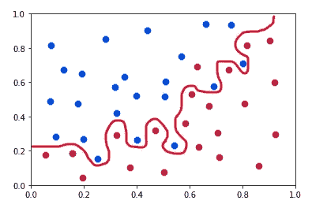
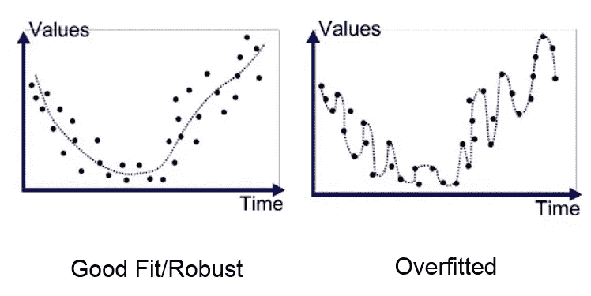
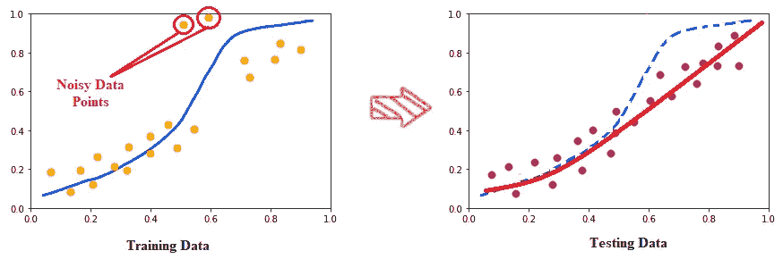
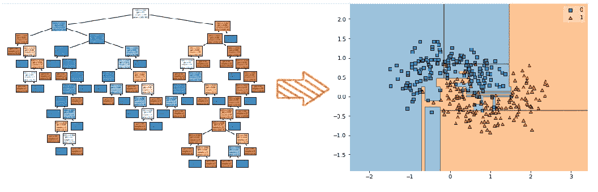
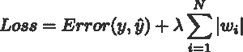
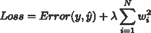
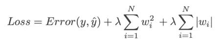
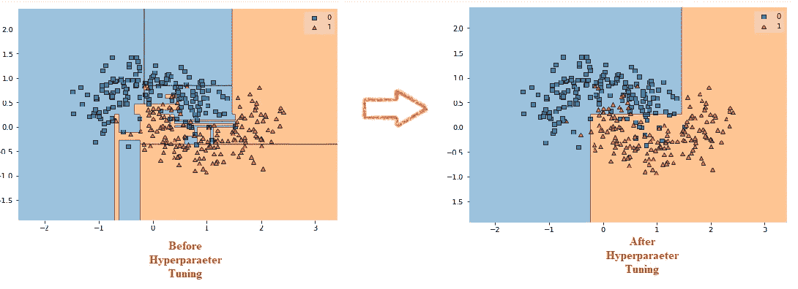

# 过度拟合:原因和补救措施

> 原文：<https://pub.towardsai.net/overfitting-causes-and-remedies-5a3853f6f1e6?source=collection_archive---------2----------------------->

在本文中，我们将通过回答以下问题来理解机器学习领域中的过拟合概念

*   什么是偏差和方差？
*   什么是过度拟合？
*   过度拟合的原因是什么？
*   我们如何解决过度拟合的问题？

# 什么是偏差和方差？

## 偏见:

偏差是对模型无法捕捉因变量和自变量之间真实关系的度量。更简单地说，偏差是我们的实际值和预测值之间的差异。

**高偏差:**这是指模型无法捕捉因变量和自变量之间的相关关系，导致训练数据本身的预测结果不佳。

**低偏差:**这意味着模型对因变量的假设较少。简而言之，当模型在训练数据时。

## 差异:

方差是对目标函数的估计值在不同的数据点下会改变多少的度量。方差是偏差的反义词。

**高方差:**这意味着模型在训练数据期间表现良好，因为它已经看到了因变量，但是当我们引入新的数据点时，模型表现不佳。

**低方差:**这意味着当我们引入新的数据点时，模型表现良好，因为模型可以使用更一般化的预测函数来预测。

当我们理解偏差和方差时，理想情况下，对于一个好的机器学习模型，我们希望实现低偏差和低方差。但是这很难实现，因为在偏差和方差之间有一个平衡。

## 偏差和方差之间的权衡:

偏差和方差之间的关系是成反比的，这意味着当我们试图减少偏差时，方差会自动增加，反之亦然。这种现象导致了两个主要问题，第一个是欠拟合，第二个是过拟合，这是本文的主题。

# 什么是过度拟合？

过度拟合

过度拟合是一个问题，或者你可以说是我们在模型训练过程中面临的一个挑战。当模型给出非常低的偏差和非常高的方差时，就会发生这种情况。让我们用更简单的话来理解，当我们的模型很好地限制了训练数据，以至于它也在我们的数据集中的噪声和不准确的数据条目上得到训练时，就会发生过度拟合，这在训练数据集上提供了高精度和低损失(低偏差的理想情况)。当我们用新的测试数据引入相同的模型时，会导致非常差的准确性和非常高的损失(高方差的理想情况)。

过度拟合对任何机器学习模型都没有好处，因为机器的最终目标是预测新的即将到来的场景，这是以前没有人见过的。但是过度拟合会导致模型对新数据点的预测非常差。因此，我们必须了解导致模型过度拟合训练数据的原因。

# 过度拟合的原因是什么？

## 1.有噪音的数据或不准确的数据

如果我们在有噪声的数据或不准确的数据中训练我们的模型，那么它可能会在该数据上给出良好的结果，并且也具有较低的偏差。但是，如果我们再次引入新的看不见的数据来预测模型，那么它可能会降低准确性和增加方差。

上图我们可以观察到，在训练数据中，有一些嘈杂的数据点，由于模型的过拟合倾向，它甚至在试图拟合那些点。但是当我们用测试数据测试时，这条红线与数据完全吻合。

## 2.训练数据量小

过度拟合是由数据的大小引起的。我们知道，数据越多，模型学习的就越多，因此，我们试图给出更好的预测。如果训练数据很少，那么模型将不能探索所有的场景或可能性。这使得模型只适合给定的数据，但当我们引入看不见的数据时，预测的准确性就会下降，方差也会增加。

## 3.模型的复杂性

过度拟合也是由模型预测结果所形成的预测函数的复杂性造成的。模型越复杂，就越容易过度拟合数据。因此，偏差会很低，方差会变得更高。

完全成长的决策树

上图是一棵完全成长的决策树生成的决策边界。正如我们所看到的，边界并不是那么平滑，并且它清楚地显示了过度拟合，因为决策树非常复杂。

# 我们如何解决过度拟合的问题？

## 1.增加训练数据的大小

正如我们上面讨论的，低训练数据导致过度拟合，因为模型无法探索所有的可能性。所以，通过增加训练数据的大小将有助于减少过拟合问题。

## **2。尽可能多地清理数据**

在训练之前，我们总是要清理和预处理数据。清理是指从数据中移除异常值、处理自变量之间的多重共线性、处理缺失值等。

## 3.使用正则化方法

正则化是一种用于通过在成本函数中引入一些惩罚项来限制机器学习模型的学习的技术。它有助于概括整个模型的功能，从而减少过拟合问题。

有三种正则化方法:

1.  L1 正则化
2.  L2 正则化
3.  弹性网正则化

**L1 正则化:**也叫拉索正则化。它代表最小绝对和选择运算符。我们可以通过用λ乘以每个单独特征的权重来计算它。这一项将被添加到成本函数中。

岭回归中成本函数的等式为:

**L2 正则化:**也叫岭正则化。我们可以通过将λ乘以每个单独特征的平方权重来计算它。这一项将被添加到成本函数中。

岭回归中成本函数的等式为:

**弹性网正则化:**这种正则化无非是将 L1 和 L2 的大量项结合到成本函数中。岭回归中成本函数的等式为:

## **4。超参数调谐**

我们还可以通过调整相应模型的超参数来解决过度拟合的问题。例如，决策树最常面临过拟合的问题。因此，如果我们使用模型提供的不同超参数，就像限制树的深度或限制树的子节点等。

在深度神经网络的情况下，我们可以使用早期停止和退出等技术来克服过度拟合。

## 5.采用集成技术

集成技术有助于减少偏差和方差，从而减少过拟合问题。如果你想了解更多的合奏技巧，请点击下面的链接。

 [## 关于合奏技巧的一切

### 在本文中，我们将通过回答以下问题来尝试理解机器学习环境中的集成思想

pub.towardsai.net](/all-about-ensemble-techniques-821a8957fab2) 

喜欢并分享如果你觉得这篇文章有帮助。还有，关注我的 medium，了解更多机器学习和深度学习相关的内容。