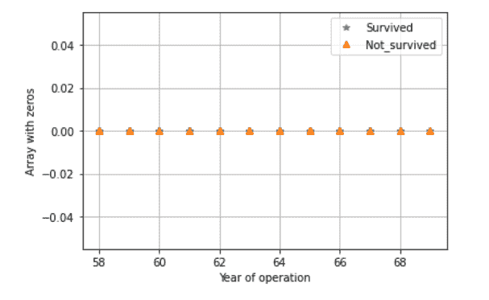
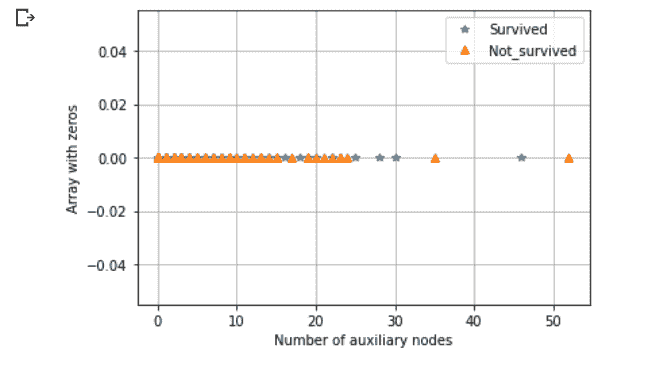
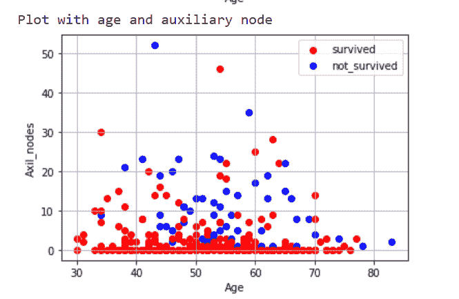
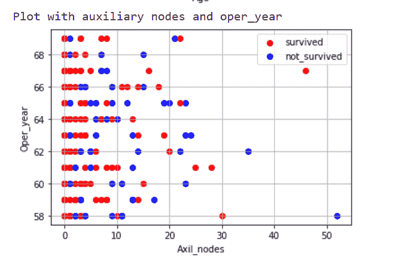
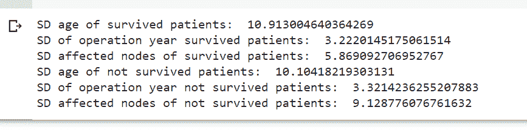
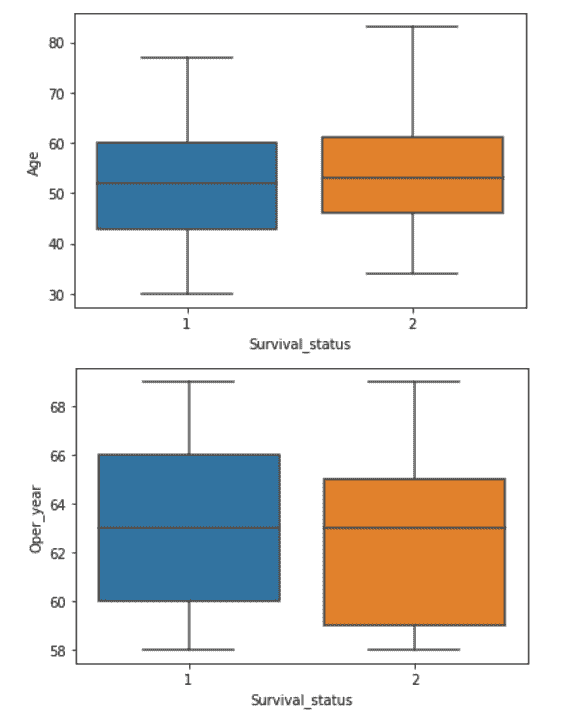
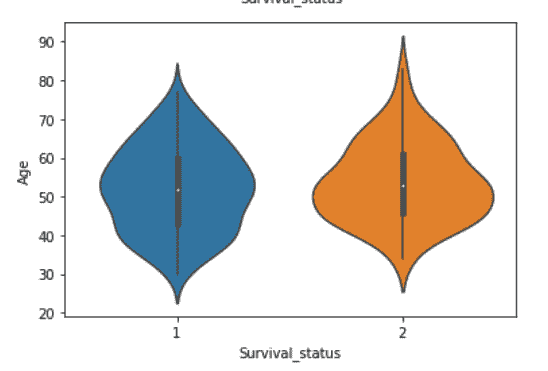
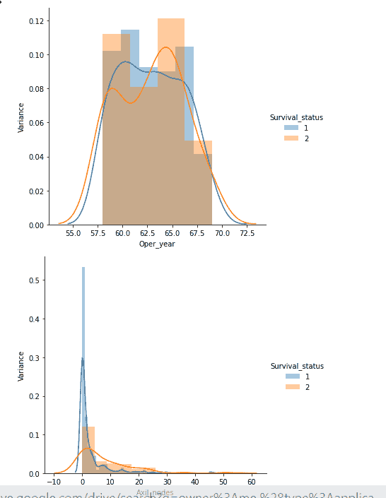
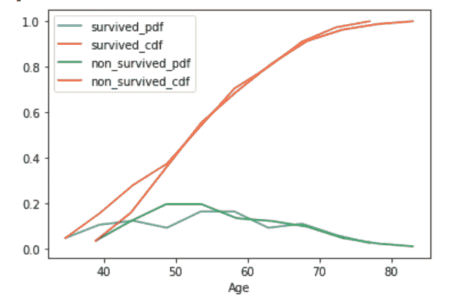

# 使用 Haberman 数据集的探索性数据分析(EDA)概述

> 原文：<https://pub.towardsai.net/overview-of-exploratory-data-analysis-with-haberman-dataset-6b7e2cf73a58?source=collection_archive---------2----------------------->

## [数据分析](https://towardsai.net/p/category/data-analysis)

## 从数据中获取洞察力的实用指南。

参考: [mc.ai](https://mc.ai/how-to-do-exploratory-data-analysis/)

> “数据会说话，如果你愿意倾听。”——吉姆·贝吉森

通过正确使用数据，人们可以获得洞察力并将其用于多种目的。原始数据没有故事可讲。因此，为了从数据中理解和获得洞察力，在数据收集过程之后，探索性的数据分析就开始了。识别模式和理解数据以准备模型是至关重要的过程。

本文分为以下几个部分:

1.  数据探索分析(EDA)概述
2.  哈伯曼数据集的 EDA

# **数据探索性分析(EDA)概述:**

## **EDA 是什么？**

探索和理解数据以从数据中获得洞察力的过程。它可以被理解为解决任何数据科学问题的“第一眼”。它离解决手头问题的目标更近了一步。

## **为什么要应用 EDA？**

通过分析和可视化来总结重要特征、识别模式和分布曲线、检测异常值和异常值、找出数据/类的多个类或分布、测试潜在假设等。基本上是为了知道数据想说什么！

## **EDA 过程**

1.  问题
2.  核实
3.  写
4.  重复

# **哈伯曼生存数据集的 EDA:**

这个数据集有助于 EDA 的起步。要下载数据集，点击[链接](https://www.kaggle.com/gilsousa/habermans-survival-data-set)。在执行 EDA 时，最重要的是牢记项目的目标。在这种情况下，目标是预测一个人是否能从手术中存活下来。

第一步，我们将通过询问以下问题来尝试了解数据集及其内容:

**这是什么样的数据？**

**输出数据(y 标签)如何表示？**

**类(生存状态或非生存状态)是否均匀分布？**

**包括多少特征来预测类别？**

现在，在提出正确的问题后，我们将编写一些代码并知道答案，很多时候通过查看数据，人们可以知道一些答案，然后在这一步中验证你的答案或直觉假设是很重要的。

接下来，了解你的输出并记下观察结果。

比如说；从上面的代码中，人们可以理解:

**观察:**

1.  手术成功(1)的存活率几乎是失败(2)的 2.5 倍
2.  **数据分布不均匀**

对于下一步，

**数据集的哪些特征很重要？**

**这些特性是如何与每个类相关联的？**

**一个类和特性/功能有什么模式吗？**

这可以通过单变量、双变量绘图或基于数据集绘制各种图表来回答，如箱线图、直方图、小提琴图等。在这里，我展示了一些解决方案，要了解更多，请查看 [Github](https://github.com/rajviishah/Exploratory-Data-Analysis/blob/master/Haberman-dataset.ipynb) (它包含了哈伯曼数据集上所有详细的 EDA)。

**单变量绘图:**

输出:

**观察:**

1.  这两个类别相互重叠，因此年龄属性对于存活率或无存活率不应给予太多的重视。
2.  该数据集包含的年龄范围从 58 岁到 70 岁。

输出:

**观察:**

1.  两个类的值大部分是重叠的，不能只依据辅助来预测什么。
2.  大多数存活病例和非存活病例的范围在 0 到 25 之间。

**双变量绘图:**

输出:

**观察:**

1.  不可能用决策边界来区分任何一种生存状态，因为所有生存状态都分散在整个图中。
2.  在该图中，随着年龄值和节点数量的增加，年龄与辅助节点的关系-除了极少数例外，观察到存活状态的机会减少。

为了检测异常值，**使用了基本的统计概念**，如平均值、中位数、众数、百分位数、四分位数等:

比如说；

输出:

**观察:**

1.不一定，随着受影响节点数量的增加，不存活的可能性更大。

同样，尝试应用各种统计概念来了解您的数据集。我已经在最终的 ipynb 中应用了一些概念。

一般来说，平均值在检测异常值时是没有用的，在很多情况下，中值是有用的。

**胡须和小提琴剧情:**

这有助于了解特定特性的值的范围。

输出:

**CDF 和 PDF:**

累积密度函数和概率密度函数—给出数值百分比/帮助找出误差百分比。

输出:

**观察:**

1.两个类是重叠的；无法辨认。

现在，绘制基于特征的 CDF 和 PDF

输出:

**观察:**

1.  很难解释病人的一种状态，并且数据是非均匀分布的。
2.  不知何故，有可能辅助节点的数量和年龄增加，存活率降低。

仅此而已。

我已经介绍了探索数据的基本方法。执行 EDA 有许多不同的方法，这完全取决于数据集和观察结果。

你可以从 [Github](https://github.com/rajviishah/Exploratory-Data-Analysis/blob/master/Haberman-dataset.ipynb) 中找到源代码

如果你对这个库的任何函数/类有任何疑惑，那么我请求你查看文档。此外，在代码中，我使用了许多我没有解释的概念。我请求你理解一些统计学和概率的基础知识，因为这两个主题都是数据分析的核心。

更多信息，请访问:

https://www.youtube.com/watch?v=YXLVjCKVP7U

[https://medium . com/analytics-vid hya/pdf-PMF-and-CDF-in-machine-learning-225 b 41242 Abe](https://medium.com/analytics-vidhya/pdf-pmf-and-cdf-in-machine-learning-225b41242abe)

[https://seaborn.pydata.org/](https://seaborn.pydata.org/)

[https://towards data science . com/ways-to-detect-and-remove-the-outliers-404d 16608 DBA](https://towardsdatascience.com/ways-to-detect-and-remove-the-outliers-404d16608dba)

[https://medium . com/technology-nine leaps/basics-of-statistics-for-machine-learning-engineers-ii-d 25 C5 a5 DAC 67](https://medium.com/technology-nineleaps/basics-of-statistics-for-machine-learning-engineers-ii-d25c5a5dac67)

[https://medium . com/@ srimalashish/why-EDA-is-required-for-machine-learning-233 B6 E4 d 5083](https://medium.com/@srimalashish/why-eda-is-necessary-for-machine-learning-233b6e4d5083)

如果有任何更正和改进的余地，或者如果您有任何疑问，请随时通过 [LinkedIn](https://www.linkedin.com/in/rajviishah/) 联系我。