# 多标签分类综述

> 原文：<https://pub.towardsai.net/overview-of-multilabel-classifications-3680fe3833d6?source=collection_archive---------1----------------------->


欧文·史密斯在 [Unsplash](https://unsplash.com/collections/1918687/ai-and-machine-learning?utm_source=unsplash&utm_medium=referral&utm_content=creditCopyText) 上的照片

## [机器学习](https://towardsai.net/p/category/machine-learning)

## 如何将一个实例划分为多个类？

我们非常熟悉单标签分类问题。我们通常会遇到二元和多元分类。但是，随着机器学习的应用越来越多，我们面临着不同的问题，如电影类型分类、医疗报告分类和根据某些给定主题的文本分类。使用单标签分类器无法解决这些问题，因为一个实例可能同时属于几个类或标签。例如，一部电影可以同时是动作片和冒险片。这就是多标签分类介入的地方。在本文中，我们将介绍一些处理多标签问题的常用方法，在后面的部分中，我们还将介绍一些应用。

在我们进入方法之前，让我们看一下在这样的问题中使用的度量。

## 韵律学

在二分类或多分类中，我们通常使用准确性作为我们的主要评估指标，此外还有 F1 得分和 ROC 度量。在多标签分类中，我们需要不同的度量标准，因为当数据集中的一条记录有多个标签时，结果有可能部分正确或完全正确。

根据问题的不同，有 3 种主要的度量类别:

**a .评估分区**

**b .评估排名**

**c .使用标签层级**

## 划分

为了捕获部分正确性，这种策略对实际标签和预测标签之间的平均差异进行处理。我们从数据集中提取样本，并使用模型预测这些样本。我们一次获得一个样本的实际和预测标记的差异，然后找到所有样本的平均差异。这种方法被称为**基于实例的评估**。

另一种方法是预测所有的测试数据集，并逐标签评估差异，即，将结果的每个标签视为单个向量，并找出特定标签的预测值和实际值之间的差异。一旦我们发现每个标签的不同之处。我们取误差的平均值。这被称为**基于标签的评估**。

因此，我们可以说，基于示例的方法是一种行或样本方式来寻找差异，它将样本的所有预测标签视为一个整体，每次寻找一个样本的差异，而基于标签的方法是一种列或标签方式，它将每个标签视为一个整体，即考虑该特定标签的所有样本的值。我们找到了该标签的预测值和实际值之间的差异，并对所有标签进行了平均。

这种基于标签的独立处理每个标签的方法不能解决不同类别标签之间的相关性。

## 1.基于示例的指标

*   **精确匹配率**:这种方法不考虑部分正确，认为它们是不正确的。因此，它将多标签预测表示为单标签预测。主要问题是它没有区分部分正确和完全不正确。在下面的等式中，Y 是实际标签向量，Z 是样本' *i* '的预测标签，对从 1 到 n 个样本的所有' *i* '求和。它只考虑预测和实际标签向量是否完全相同。

```
MR = np.all(y_pred == y_true, axis=1).mean()
```

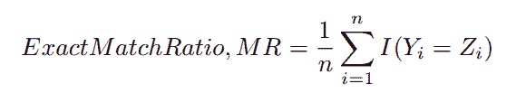

[来源](https://pdfs.semanticscholar.org/6b56/91db1e3a79af5e3c136d2dd322016a687a0b.pdf)

*   **0–1 损失:**该方法类似于精确匹配率，由下式给出

> 1-精确匹配比率

*   **精度:**通常精度由精度= TP / (TP+FP+FN+TN)给出。对于多标签，定义如下:

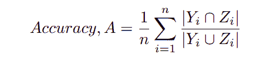

[来源](https://pdfs.semanticscholar.org/6b56/91db1e3a79af5e3c136d2dd322016a687a0b.pdf)

在等式中，Z 是样本 I 的预测标记向量，Y 是实际标记向量。现在，根据定义，如果预测标记和实际标记相同，则结果被称为真阳性。这里，我们取两个向量的交集，因此，得到的向量只有那些标签为 1，其中实际向量和预测向量都为真或 1。取向量的模值，我们就得到了数值。

比方说，(0，0，1，1，0)->Z 是样本的预测向量，而(0，1，1，1，0)->Y 是实际向量，所以 mod(Intersection(Y，Z))=2。

对于 union，mod(Union(Y，Z))=3。该特定样品的总体部分 accuracy=⅔ =0.67，因为它正确分类，3 个标签中的 2 个。如果它错误地预测了一个标签，则联合也会增加，即分母增加，从而降低了准确性。然后，我们找到每个样本的分数，并对集合中的所有样本进行平均。

```
def Accuracy(y_true, y_pred):temp = 0for i in range(y_true.shape[0]):temp += sum(np.logical_and(y_true[i], y_pred[i])) / sum(np.logical_or(y_true[i], y_pred[i]))return temp / y_true.shape[0]Accuracy(y_true, y_pred)
```

*   **精度:**根据定义，精度衡量预测为正类的样本中有多少实际上是正的。由 TP/(TP+FP)给出。假阳性是将样本错误地分类为真实的模型。分数修改为:

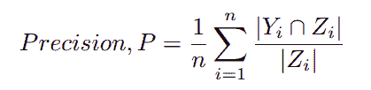

[来源](https://pdfs.semanticscholar.org/6b56/91db1e3a79af5e3c136d2dd322016a687a0b.pdf)

分子给出的标签为 1，预测值和实际值都为真。所以真正的好处是。分母给出所有标签为 1，其预测值为 1。所以，它同时包含了 TP 和 FP。因此，对于一个特定的样本，我们获得取值模数，并对所有样本取平均值。

(0，0，1，1，0)->Z 是样本的预测向量，而(0，1，1，1，0)->Y 是实际向量，因此 mod(Intersection(Y，Z))=2。

mod((Z))=2。

样本的精度=1，因为这里没有假阳性

```
def Precision(y_true, y_pred):temp = 0for i in range(y_true.shape[0]):if sum(y_true[i]) == 0:continuetemp+= sum(np.logical_and(y_true[i], y_pred[i]))/ sum(y_true[i])return temp/ y_true.shape[0]
```

*   **召回:**根据定义，召回由 TP/TP+FN 给出，即它决定了数据集中实际为真的样本中有多少被模型预测为真。修改为:

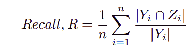

[来源](https://pdfs.semanticscholar.org/6b56/91db1e3a79af5e3c136d2dd322016a687a0b.pdf)

因此，正如我们所见，分子给出真阳性，分母给出所有标签为 1，对于给定的样本，这实际上是真的。

(0，0，1，1，0)->Z 是样本的预测向量，而(0，1，1，1，0)->Y 是实际向量，因此 mod(Intersection(Y，Z))=2。

mod((Y))=3。

召回=0.67 的样本，因为有 1 个假阴性。我们取所有样本的平均值。

```
def Recall(y_true, y_pred):temp = 0for i in range(y_true.shape[0]):if sum(y_pred[i]) == 0:continuetemp+= sum(np.logical_and(y_true[i], y_pred[i]))/ sum(y_pred[i])return temp/ y_true.shape[0]
```

*   **F1 得分:**它是精度和召回率的调和平均值。可以这样想，计算一个样本的 F1 分数，然后对所有样本进行平均。它由下式给出:

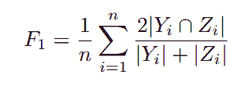

[来源](https://pdfs.semanticscholar.org/6b56/91db1e3a79af5e3c136d2dd322016a687a0b.pdf)

*   **汉明损失**:汉明损失试图说明模型对特定样本错误预测的任何标签，也就是说，它同时考虑假阳性和假阴性情况。它在此基础上计算每个样本的分数，然后最终求出所有样本的总和。它由下式给出:

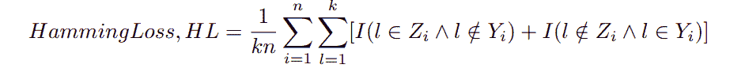

[来源](https://pdfs.semanticscholar.org/6b56/91db1e3a79af5e3c136d2dd322016a687a0b.pdf)

所以，这里 k 是样本 I 的类或标签的数量，I 是指示函数。首先，对于样本“I ”,该方程迭代 1 到 k 中 l 的所有标签“l”。然后，它试图找到预测值与实际值不匹配的标签“l”。它将所有误差相加，然后除以标签的数量。

(0，0，1，1，1)->Z 是样本的预测向量，而(0，1，1，1，0)->Y 是实际向量。

对于给定的样本，对于索引 0 处的标注分类，它们匹配，因此，误差=0，在第二个索引处发现不匹配，因为 l 表示 Y=1，l 表示 Z=0。因此，逻辑 and 为等式中的第二个条件给出 1。因此，总的来说，整个样本给出了⅖的汉明损失，因为在 5 个标签上有 2 个错配。该分数是所有给定样本的平均值。

汉明损失=0 表示没有错误。

```
def Hamming_Loss(y_true, y_pred):temp=0for i in range(y_true.shape[0]):temp += np.size(y_true[i] == y_pred[i]) — np.count_nonzero(y_true[i] == y_pred[i])return temp/(y_true.shape[0] * y_true.shape[1])Hamming_Loss(y_true, y_pred)
```

## 2.基于标签的指标

基于标签分别测量所有标签。如果有 k 个标签，它认为该评估是对 k 个不同的二元分类结果的评估。因此，任何测量准确度、精确度、召回率、F1 分数的单位或程序都可以用于每个标签，无需任何修改。然后我们取所有标签的平均值。主要有两种方法:

*   **宏观平均测度:**按照上述逻辑，即首先计算每个标签的测度。然后我们取所有标签的平均值。它由下式给出:

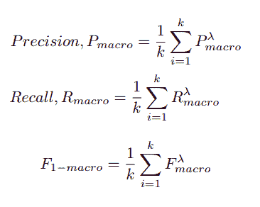

[来源](https://pdfs.semanticscholar.org/6b56/91db1e3a79af5e3c136d2dd322016a687a0b.pdf)

对于每个标签，计算精确度、召回率和 F1 分数，然后我们取所有类别或标签(k)的平均值。

*   **微平均测量**:分别取每个标签的真阳性、假阳性、真阴性和假阴性，然后计算精度、召回率和 F1 值。它由下式给出:

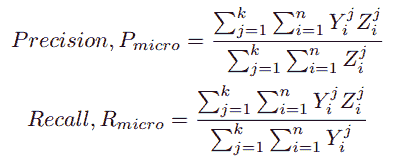

[来源](https://pdfs.semanticscholar.org/6b56/91db1e3a79af5e3c136d2dd322016a687a0b.pdf)

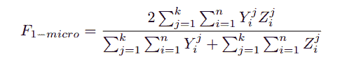

[来源](https://pdfs.semanticscholar.org/6b56/91db1e3a79af5e3c136d2dd322016a687a0b.pdf)

这里 n 是样本总数。存在 k 个类别标签。Y 表示实际的输出标签组，Z 表示预测的输出标签组。这里的区别是所有标签的总和是外部总和。内部求和对从 1 到 n 的所有样本求和。对于第 j 个标签，子怡是第 I 个样本的真阳性，依此类推。

> 对于 2 个标签，微精度由下式给出:(TP1+TP2) / ( TP1+TP2+FP1+FP2)
> 
> 对于 2 个标签，微召回率为:(TP1+TP2) / ( TP1+TP2+FN1+FN2)

## 数据集属性

在开始对数据集进行操作之前，我们需要分析数据及其分布。对于多标签，这是基于:

1.  **不同标签集(DL)** :由数据集中观察到的不同标签组合的总数给出。它解释了不同标签的分布。
2.  **标签基数(LCard):** 它由每个示例的平均标签数给出。它说明了样品和标签的分布。

## 多标签学习

有两种类型的算法来处理多标签分类:

1.  **简单的问题转化方法**
2.  **简单算法适配方法**

## 问题转化方法:

该方法将多标签问题转换为单标签问题，然后使用二元分类器和其他可用的方法进行分类。该类别中值得注意的方法有:

*   有一些简单的转换方法。我们来讨论其中的一些。

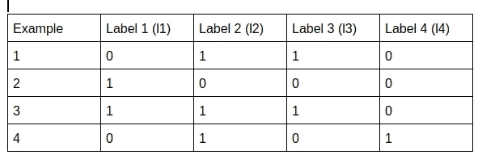

数据样本表

我们暂时忽略这些特性

*   **复制转换**:为每个有多个标签的样本创建新的样本。因此，它为每个样本复制特征，并考虑每个标签一次。上表修改为:

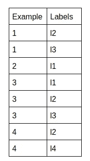

*   **称为复制转换:**它类似于复制转换，不同之处在于标签也分配了权重。

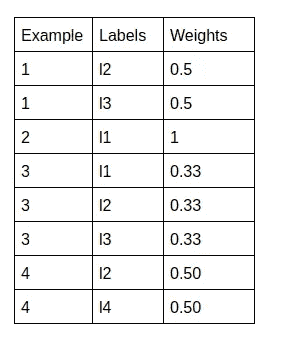

权重实际上是 1/(样本中值为 1 的标签数)。

*   下一种方法是从一组标签中选择一个标签，该标签对于特定的样本具有值 1。基于选择的过程，有 3 个选择

1.  选择最大
2.  选择最小值
3.  选择随机

*   **忽略**:忽略多标签数据。因此，这里的最终数据集将只有示例 2。
*   **Label Powerset(LP):** 它为不同的标签组合创建新标签。因此，它创建了一个多类分类。对于我们的数据集，它被修改为:

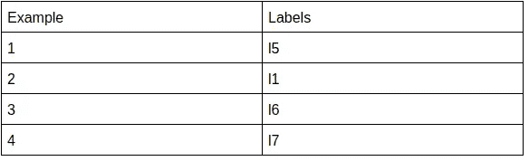

其中 l5 是 l2 和 l3 的组合，以此类推。可以创建的标签数量的上限由 min( n，2^k)给出，其中 n 是示例的数量，k 是标签的数量。2^k 考虑了使用给定的基本 k 标签可以形成的所有给定的组合。所以，这是最坏的情况，也就是例子的数量，因为如果你只有 10 个例子，你不可能有 2⁴= 16 种组合。

这种方法的问题是，它创建了高度不平衡的集合，因为一些组合可能出现的次数很少，甚至可能只有一次或两次，所以这些新的级别将被严重低估。

为了解决这个问题，使用了一个**修剪问题转换**，它接受一个用户阈值，比如一个标签在一个给定的例子集中必须出现至少 4 次。如果 4 次都没有找到标签，则忽略该标签。

*   **二元关联:**这种方法最常用。它为每个标签创建 k 个数据集。因此，它基本上将 k 类多标记分类转化为 k 个不相交的二元分类。我们的数据集被修改为:

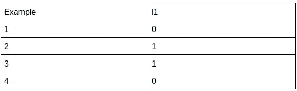

在获得每个二元分类的转换结果之后，我们对每个样本的结果进行联合，并获得我们的多类分类的结果。由于基于标签独立性的假设，这种方法受到了批评。它对每个类别使用 k 个不同的模型，因此每个预测都是相互独立的。

*   **通过成对比较排序:**它从 k 个给定标签中创建 kC2(组合)数据集。因此，它选择标签 Li 和标签 Lj，这样 i < j < k 将它们组合在一起形成一个新标签。如果示例至少属于集合中的任一个，但不属于两个集合，则每个数据集保留来自原始集合的示例。

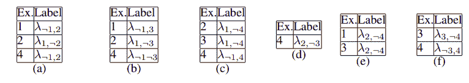

[来源](https://pdfs.semanticscholar.org/6b56/91db1e3a79af5e3c136d2dd322016a687a0b.pdf)

## 算法适应方法

这些方法试图修改用于单标签分类的常见算法(如支持向量机和决策树)的定义，使其适用于多标签分类。

损失函数 Log Loss 或二进制交叉熵是分类问题中最常用的损失函数，它被修改为:

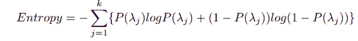

[来源](https://pdfs.semanticscholar.org/6b56/91db1e3a79af5e3c136d2dd322016a687a0b.pdf)

*其中，P(λj ) =类λj 的概率。*因此，它计算每个标签的损失，类似于它对正常的单标签二进制分类所做的，然后对所有标签的所有损失求和以给出最终损失。

主要有三种方式:

1.  **基于树的提升:**该算法集中于修改在树的梯度提升中使用的 AdaBoost 算法，以产生多个标签数据的结果。有两种类型的修改:AdaBoost。MH 试图通过最小化汉明损失和 AdaBoost 进行分类。

Adaboost 算法通常在三个要点上工作，这与随机森林算法不同:

*   Adaboost 算法适用于**样本**或弱决策树学习器。它们有一个根，也就是说，它们一次只能使用其中一个特征来预测标签。它们不是我们在随机森林算法中使用的成年树。
*   在 AdaBoost 中，森林中不同的树被赋予不同的权重，即所有的树对最终结果或预测没有相同的发言权或影响力，这与随机森林不同，在随机森林中，所有的树都有相同的权重来决定结果。
*   Adaboost 中的树从以前的错误中学习。所以，它们是相互依赖的，依赖于树木形成的顺序，不像随机森林，树木是相互独立的。

**2。懒惰学习:**懒惰学习基于 K 近邻方法。他们可以研究问题转换和算法适应方法。对于问题转化，最常用的懒惰学习方法是 BR-KNN。这是一个使用二进制相关性将多标签分类转换为单标签分类，然后应用 KNN 的过程。

**3。神经网络:**神经网络的反向传播算法已经被修改以适应多标签问题。损失函数实际上被修改以考虑跨多个标签的误差。这种方法被称为 *BP-MLL。*

**4。判别 SVM 方法:**普通的 SVM 方法在第一步中使用二进制相关方法来获得 k 个标签中的每一个标签的二进制分类的结果。然后，它通过 k 个附加特征扩展数据集，这些特征实际上是第一步中二元分类器的预测。在下一步中，“k”个新的二元分类器，每个 k 个标签一个。新的分类器在扩展的数据集上训练，以考虑标签的依赖性。还有其他类似 *BandSVM 的方法。*

## 其他可用的方法

1.  **One-Vs-Rest:** 这种方法非常类似于二元相关性方法。它将所有 k 个标签视为互斥的，并为 k 个标签中的每个标签训练具有相同超参数的不同模型。因此，模型是独立训练的，并且不考虑不同标签之间的相关性。它产生了独立的二进制分类问题。
2.  **分类器链:**它们考虑了 k 个标签之间的依赖性或相关性。它为 k 个标签创建 k 个二元分类器。第一个二元分类器接受数据集并预测第一个标签。假设预测是 C1。对于下一个分类标签，使用第二个二元分类器。对于第二个，我们传递特征集加上 C1，即第一个分类器输出的分类器输出。比如说，它给了 C2。对于第三个标签分类器，我们馈送，所有特征+C1+C2。因此，对于第 n 个标签的分类，我们通过实际上是前 n-1 个类别的预测标签的 n-1 个特征来扩展特征集。

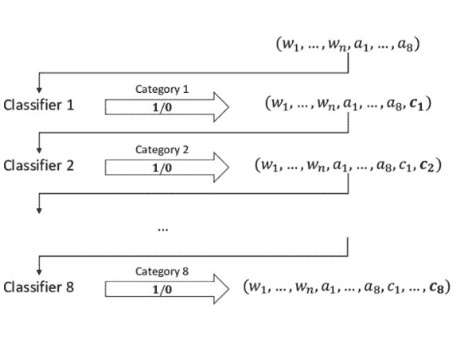

[来源](https://www.researchgate.net/publication/336148903_Multi-Label_Classification_of_Blurbs_with_SVM_Classifier_Chains/figures?lo=1)

## 应用

现在，我们来看看上述算法在 python 中的应用。

对于应用程序，我使用了 kaggle 的有毒评论分类数据集，此处[可用](https://www.kaggle.com/c/jigsaw-toxic-comment-classification-challenge)。这是最常用的数据集之一。我们继续。

## 数据可视化

在可视化中，数据如下所示:


它有 6 个类别，其中每个语句都必须进行分类。这些类别是:

```
Index(['comment_text', 'toxic', 'severe_toxic', 'obscene', 'threat', 'insult',
       'identity_hate'],
      dtype='object')
```

尽管如此，这些职业并没有很好的平衡。与其他类别相比,“有毒”类别的出现率非常高。

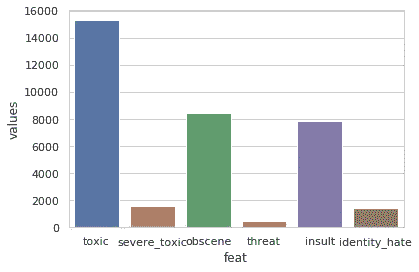

现在，这里需要注意的一点是 6 个标签之间的相关性。

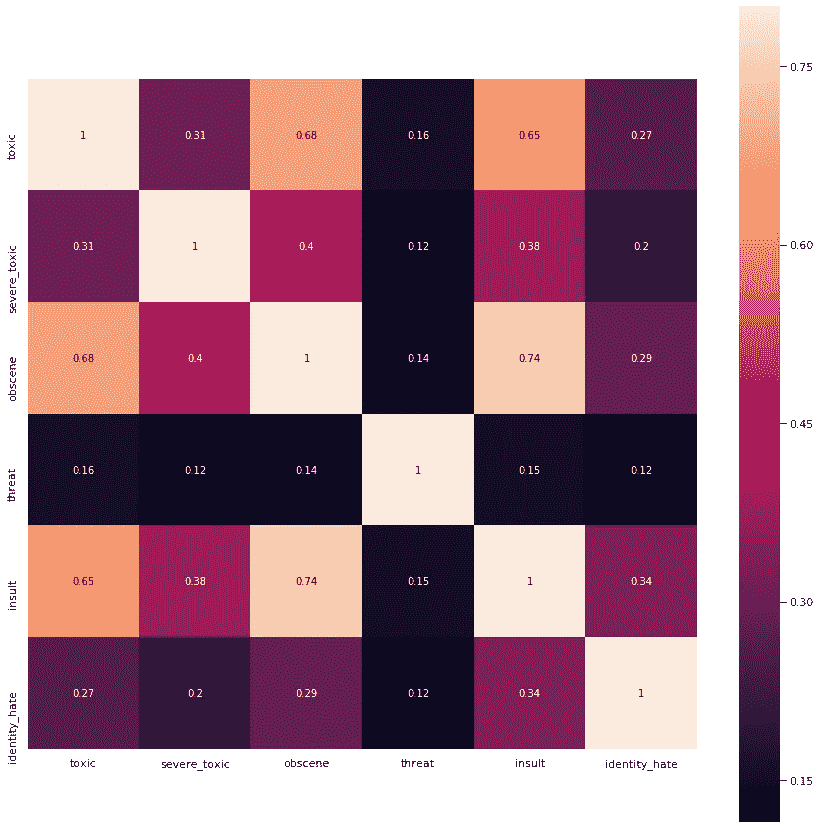

上图显示了标签之间的相互关系。我们可以观察到‘淫秽’类和‘有毒’类会有很高的相关性。

## 数据预处理

“comment_text”列将是我们的功能集。

```
0    Explanation\nWhy the edits made under my usern...
1    D'aww! He matches this background colour I'm s...
2    Hey man, I'm really not trying to edit war. It...
3    "\nMore\nI can't make any real suggestions on ...
4    You, sir, are my hero. Any chance you remember...
Name: comment_text, dtype: object
```

原始文本有几个特殊的字符和缩写，我们需要创建干净的文本来适应一个模型。

```
import re
def remove_special_characters(text):
    text=text.lower()
    pattern=r'[^a-zA-Z0-9 ]'
    text = re.sub(r"what's", "what is ", text)
    text = re.sub(r"\'s", " ", text)
    text = re.sub(r"\'ve", " have ", text)
    text = re.sub(r"can't", "cannot ", text)
    text = re.sub(r"n't", " not ", text)
    text = re.sub(r"i'm", "i am ", text)
    text = re.sub(r"\'re", " are ", text)
    text = re.sub(r"\'d", " would ", text)
    text = re.sub(r"\'ll", " will ", text)
    text = re.sub(r"\'scuse", " excuse ", text)
    text = re.sub('\W', ' ', text)
    text = re.sub('\s+', ' ', text)
    text=re.sub(pattern,'',text)

    return text
def new_line_r(text):
    pattern=r'\n'
    text=re.sub(pattern,'',text)
    return text
import nltk
from nltk.tokenize import sent_tokenize, word_tokenize 
from nltk.corpus import stopwords
def remove_stop(text):
    stop_words = stopwords.words('english')
    cleaned=''
    words=word_tokenize(text) 
    for word in words:
        if word not in stop_words:
            cleaned=cleaned+word+' '
    return cleaned
```

上面的代码片段可以用来清理我们的特性集。它从我们输入的句子中删除缩写、特殊字符和停用词。

```
0    explanation edits made username hardcore metal...
1    aww matches background colour seemingly stuck ...
2    hey man really trying edit war guy constantly ...
3    make real suggestions improvement wondered sec...
4                       sir hero chance remember page 
Name: cleaned_text, dtype: object
```

我们清理过的文本看起来不错。

接下来，我们对文本进行矢量化，并为模型创建训练集和测试集。

```
X=df_final['cleaned_text']
Y=df_final.drop(['cleaned_text'],axis=1)from sklearn.model_selection import train_test_split
X_train, X_test, Y_train, Y_test= train_test_split(X,Y, test_size=0.3)
from sklearn.feature_extraction.text import TfidfVectorizer
vectorizer=TfidfVectorizer(max_features=500,stop_words='english')
vectorizer.fit(X_train)
x_train=vectorizer.transform(X_train)
x_test=vectorizer.transform(X_test)
```

该代码片段创建了所需的集合。

## 模型

首先，让我们为每个标签单独训练一个模型，将每个标签视为一个二元分类，并专门检查准确性，以便获得每个标签性能的基线视图。

```
from sklearn.linear_model import LogisticRegression
from sklearn.metrics import accuracy_score
labels=Y_train.columns
log_reg=LogisticRegression()
for label in labels:
    y_train_f=Y_train[label]
    y_test_f=Y_test[label]
    log_reg.fit(x_train,y_train_f)
    y_pred=log_reg.predict(x_test)
    acc=accuracy_score(y_test_f,y_pred)
    print("For label {}: accuracy obtained: {}".format(label,acc))
```

上面的代码片段为我们提供了每个标签的精度。

```
For label toxic: accuracy obtained: 0.9416569184491979
For label severe_toxic: accuracy obtained: 0.9901403743315508
For label obscene: accuracy obtained: 0.9752882687165776
For label threat: accuracy obtained: 0.997033756684492
For label insult: accuracy obtained: 0.96563753342246
For label identity_hate: accuracy obtained: 0.991769719251337
```

现在，我们转向多标签分类。

## 问题转化

## 二元相关性

```
from skmultilearn.problem_transform import BinaryRelevance
classifier = BinaryRelevance(
    classifier = LogisticRegression(),
)
classifier.fit(x_train, Y_train)
y_pred=classifier.predict(x_test)
acc=accuracy_score(Y_test,y_pred)
```

该模型给出了 91.11%的准确度分数

## 分类器链

```
from skmultilearn.problem_transform import ClassifierChain
from sklearn.linear_model import LogisticRegression
chain_classifier = ClassifierChain(LogisticRegression())
chain_classifier.fit(x_train,Y_train)
y_pred = chain_classifier.predict(x_test)
acc=accuracy_score(Y_test, y_pred)
```

分类器链产生 91.26%的准确度

## 标签电源集

```
from skmultilearn.problem_transform import LabelPowerset
pw_set_class = LabelPowerset(LogisticRegression())
pw_set_class.fit(x_train,Y_train)
y_pred=pw_set_class.predict(x_test)
acc=accuracy_score(Y_test, y_pred)
```

准确率:91.28%

## 自适应算法

在这种情况下，我们将看到如何应用**懒惰学习**来处理应用二进制相关 KNN 分类器的多标签问题。

```
from skmultilearn.adapt import BRkNNaClassifier
lazy_classifier=BRkNNaClassifier()
x_train_a=x_train.toarray()
from scipy.sparse import csr_matrix
y_train_a=csr_matrix(Y_train).toarray()
lazy_classifier.fit(x_train_a, y_train_a)
x_test_a=x_test.toarray()
y_pred=lazy_classifier.predict(x_test_a)
```

## 结论

在本文中，我们看到了多标签分类的几种方法

这里是 Github [链接](https://github.com/abr-98/Multilabel_Classification_Toxic_Comments)。

希望这篇文章有所帮助。

## 参考

论文:[https://pdf . semantic scholar . org/b3c 9/88366 E6 f 80 D1 fecbe 7 f 4956 e 016 AC 2 e 498 e . pdf](https://pdfs.semanticscholar.org/b3c9/88366e6f80d1cfecbe7f4956e016ac2e498e.pdf)

论文:[https://pdfs . semantic scholar . org/6b 56/91 db 1 E3 a 79 af 5 E3 c 136 D2 DD 322016 a 687 A0 b . pdf](https://pdfs.semanticscholar.org/6b56/91db1e3a79af5e3c136d2dd322016a687a0b.pdf)

指标:[https://mmuratarat . github . io/2020-01-25/multi label _ classification _ metrics . MD](https://mmuratarat.github.io/2020-01-25/multilabel_classification_metrics.md)

[https://arxiv.org/pdf/1912.13405.pdf](https://arxiv.org/pdf/1912.13405.pdf)