# 计算机视觉任务和应用概述

> 原文：<https://pub.towardsai.net/overview-of-the-computer-vision-tasks-applications-647f63e66e9f?source=collection_archive---------0----------------------->

计算机视觉是计算机科学的一个子集，简单地说，它允许计算机看到、理解和分析视觉数据。借助计算机视觉，机器可以执行图像分类、面部识别、物体检测等任务，当然还有物体跟踪。在本文中，我们将探讨主要的计算机视觉任务以及每项任务最流行的应用。

计算机视觉/照片由 [Unsplash](https://unsplash.com?utm_source=medium&utm_medium=referral) 上的[离子场效应晶体管](https://unsplash.com/@ionfet?utm_source=medium&utm_medium=referral)拍摄

## 目录:

1.  **内容识别
    1.1。图像分类
    1.2。物体识别
    1.3。物体检测和定位
    1.4。对象和实例分割
    1.5。姿势估计**
2.  **视频分析
    2.1。物体跟踪
    2.2。动作识别
    2.3。运动估计**
3.  **内容感知图像编辑**
4.  **场景重建**
5.  **参考文献**

**如果你想免费学习数据科学和机器学习，可以看看这些资源:**

*   免费互动路线图，自学数据科学和机器学习。从这里开始:[https://aigents.co/learn/roadmaps/intro](https://aigents.co/learn/roadmaps/intro)
*   数据科学学习资源搜索引擎(免费)。将你最喜欢的资源加入书签，将文章标记为完整，并添加学习笔记。[https://aigents.co/learn](https://aigents.co/learn)
*   想要在导师和学习社区的支持下从头开始学习数据科学吗？免费加入这个学习圈:[https://community.aigents.co/spaces/9010170/](https://community.aigents.co/spaces/9010170/)

如果你想在数据科学& AI 领域开始职业生涯，但你不知道如何开始。我提供数据科学指导课程和长期职业指导:

*   长期指导:[https://lnkd.in/dtdUYBrM](https://lnkd.in/dtdUYBrM)
*   辅导课程:[https://lnkd.in/dXeg3KPW](https://lnkd.in/dXeg3KPW)

***加入*** [***中等会员***](https://youssefraafat57.medium.com/membership) ***计划，只需 5 美元，继续无限制学习。如果你使用下面的链接，我会收到一小部分会员费，不需要你额外付费。***

# 1.内容识别

## 1.1.图像分类

图像分类是计算机视觉领域的主要任务之一，被认为是 2012 年第一个取得巨大成功的任务。在此任务中，已训练的模型基于预定义的一组类别将某个类别分配给图像。下图是著名的 CIFAR-10 数据集[1]，由十类 8000 万张图像组成。在影像分类任务中，模型被训练为将输入影像分配到预定义的十个类别之一，如下图所示。

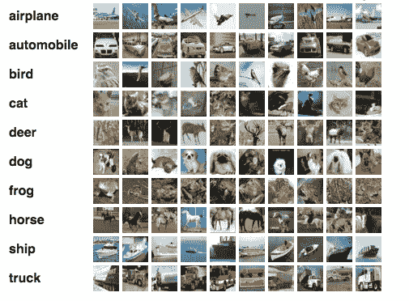

著名的 CIFAR-10 数据集的子集

计算机以像素的形式分析图像。它通过将图像视为矩阵的阵列来实现，矩阵的大小取决于图像分辨率。简单来说，图像分类，从计算机的角度来看，就是利用算法对这些统计数据进行分析。在数字图像处理中，图像分类是通过将像素自动分组到指定的类别中来完成的，所谓的**类**。这些算法将图像分成一系列最显著的特征，降低了最终分类器的工作量。这些特征给分类器一个图像代表什么和它可能被考虑到哪一类的概念。特征提取过程是图像分类中最重要的一步，因为其余的步骤都依赖于它。

## ***图像分类应用:***

图像分类是深度学习模型实现超人性能的早期任务之一。图像分类在现实世界中有很多应用。

*   **自动检测和质量控制:**图像分类可用于自动检测装配线上的产品，并识别不符合质量标准的产品。

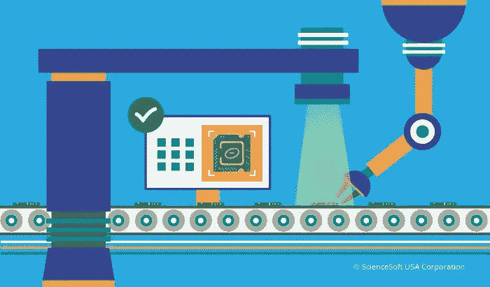

自动化检测和质量控制/ [科学软件](https://www.pinterest.com/pin/a-promising-future-of-automated-optical-inspection-in-pca-quality-control--613474780461289405/)

*   **皮肤癌的分类:**图像分类在健康护理领域的另一个应用是将皮肤图像自动分类为恶性和良性。

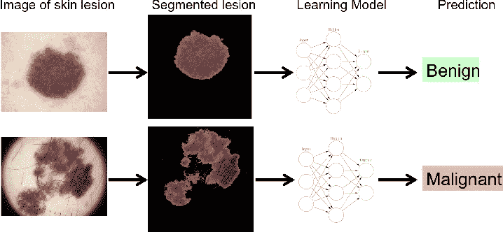

皮肤癌的分类

**土地利用制图:**影像分类可用于自动绘制土地利用图，识别不同的土地类型。

## 1.2.物体识别

如上所述，图像分类通过从预定义的标签集中为图片分配类别或标签来工作，对象识别识别类别的特定实例。例如图像分类任务，重点是对人脸的图片进行分类，在物体识别中，重点是对人进行识别和辨认。因此，对象检测可以被视为将相似实例彼此聚类的聚类算法。

## 1.3.目标检测和定位

内容识别的另一个重要任务是对象检测。对象检测是检测图像中某一类对象的实例的任务。对象检测通常是进一步计算之前的初步任务，例如在面部识别中，您必须首先检测面部，然后在识别之前进行裁剪。

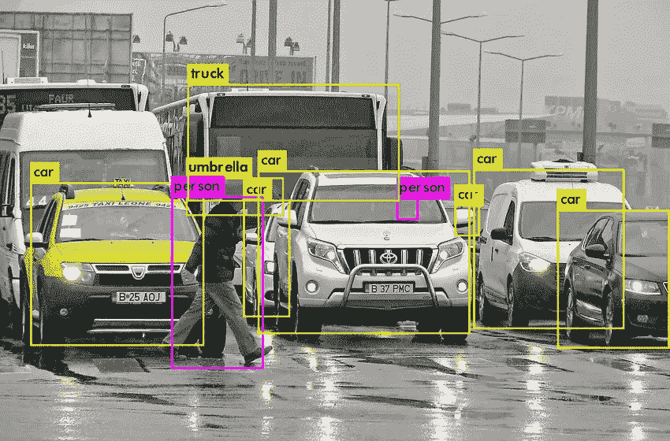

多目标检测

## 对象检测应用:

目标检测是现实生活中最常用的计算机视觉应用之一。它已经应用于大多数领域，例如:

*   **安全和监控中的危险检测:**视频监控中的各种安全应用都基于对象检测，例如，检测受限或危险区域中的人员、预防自杀或使用计算机视觉在远程位置自动执行检查任务。
*   **交通和物流领域的人工智能车辆检测:**目标检测用于检测和计数车辆以进行交通分析，或检测停在危险区域的车辆，例如，在十字路口或高速公路上。

车辆检测和计数。

*   **医疗保健领域的医疗特征检测:**目标检测帮助医疗保健领域取得了许多突破。因为医学诊断非常依赖于对图像、扫描和照片的研究，所以涉及 ct 和 MRI 扫描的对象检测对于诊断疾病已经变得非常有用，例如，利用 ML 算法进行肿瘤检测。

## 1.4.对象和实例分割

图像分割是一种将数字图像划分为称为图像片段的子组的方法，它降低了图像的复杂性，并能够对每个图像片段进行进一步的处理或分析。从技术上讲，分割是将标签分配给像素，以识别图像中的对象、人或其他重要元素。在下图中，图像被分割，每个实例被赋予特定的颜色，如下所示:

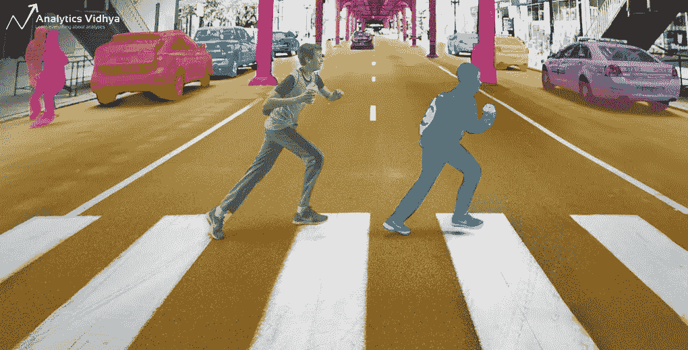

图像分割/ [**分析 Vidhya**](https://www.analyticsvidhya.com/blog/2019/04/introduction-image-segmentation-techniques-python/)

## 对象和实例分割应用程序

图像分割是计算机视觉技术和算法的关键组成部分。它用于许多实际应用，包括医学图像分析、自动车辆的计算机视觉、人脸识别和检测、视频监控和卫星图像分析。

## 1.5.姿态估计

取决于目标任务，姿态估计可以具有不同的含义。对于**刚性物体，**通常是指物体在三维空间中相对于摄像机的位置和方向的估计。这对机器人特别有用，这样它们就可以与环境互动(拾取物体、避免碰撞等等)。它还经常用于增强现实中，在对象上叠加 3D 信息。

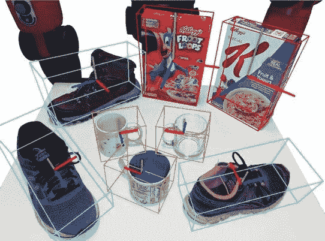

刚性物体的姿态估计

对于非刚性元素，姿态估计也意味着估计它们的子部分相对于彼此的位置。更具体地说，当把人看作非刚性目标时，典型的应用是识别人的姿势(站、坐、跑等等)或理解手语。

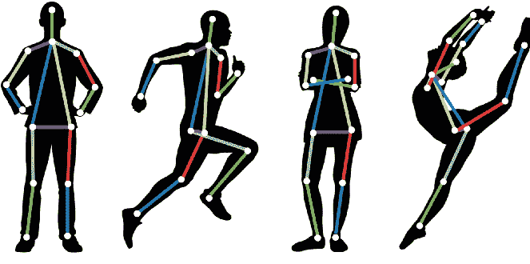

非刚性物体的姿态估计/ [分析 Vidhya](https://www.analyticsvidhya.com/blog/2021/10/human-pose-estimation-using-machine-learning-in-python/)

# 2.视频分析

计算机视觉算法不仅适用于单个图像，也适用于视频。一些任务需要将视频的图像序列作为一个整体来考虑，以便考虑时间和空间的一致性。我们将探索计算机视觉在视频中最著名的任务和应用。

## 2.1.目标跟踪

对象跟踪是一个过程，通过这个过程，计算机能够检测、理解并关注图像或视频流中的对象。这是人工智能(AI)和机器学习(ML)最广泛的应用之一，使您的视觉数据处理需要自动化和简化到最高水平。底层的深度学习算法从我们的生物神经系统中获得灵感，形成一个分层但复杂的数据传输和学习能力网络。

对象跟踪解决方案使我们能够对通过不同类型的摄像机获得的视觉数据执行有意义的操作。使用合适的对象检测算法和跟踪模型，您可以训练机器不仅识别特定图像中的一个或多个独特的对象或人，还可以在后续帧中识别它们，并在视频流中跟踪它们的轨迹。

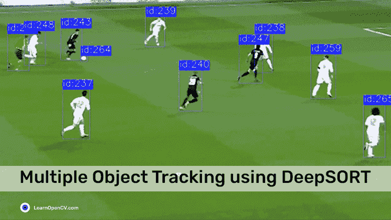

使用 deep sort/[learnopecv](https://learnopencv.com/understanding-multiple-object-tracking-using-deepsort/)进行多目标跟踪

## 目标跟踪的应用

*   **监控用例:**借助能够实时跟踪视频中对象的复杂算法，企业可以显著增强其安全部门。
*   **零售市场:**在[亚马逊 Go 商店](https://www.amazon.com/b?ie=UTF8&node=16008589011)中可以看到零售业中一个极具创新性的对象跟踪实际应用。亚马逊创造了各种计算机视觉和人工智能过程的融合，为他们的超市引入了无收银员结账系统:
*   自动驾驶:自动驾驶汽车可能是人工智能驱动的物体检测和跟踪最知名的应用。因为你必须跟踪道路和你周围的物体，所以物体检测对于这个行业的发展非常重要。

## 2.2.动作识别

动作识别是识别图像或视频中的人何时正在执行给定动作的任务。它属于只能在图像序列上执行的任务列表。这非常类似于我们不能仅仅从一个单词中理解一个句子，也不能从一幅图像中识别一个动作。可以训练计算机视觉算法来识别各种动作，从跑步和睡觉到喝水、摔倒或骑自行车。

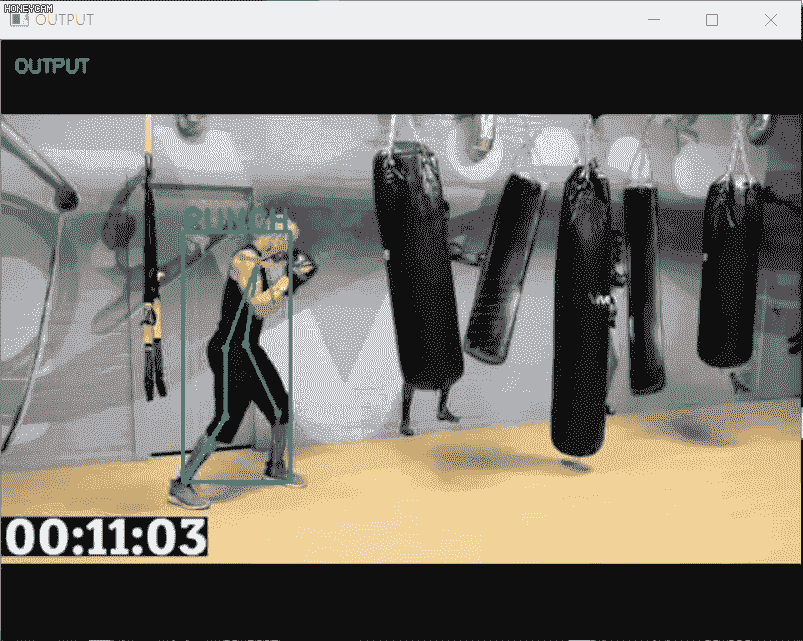

动作识别/ [由 imsoo 进行的战斗检测](https://github.com/imsoo/fight_detection)

***动作识别的应用:***

*   **监视**:动作识别的应用领域之一是监视行业，例如检测可疑或异常行为
*   **人机交互:**动作识别的另一个应用领域是人机交互，比如手势控制的设备。

## 2.3.运动估计

运动估计检查图像序列中对象的运动，以试图获得表示估计运动的矢量。这对于侧重于估计视频中捕获的实际速度或轨迹的应用程序非常重要。

使用光流/ [纳米网](https://nanonets.com/blog/optical-flow/)的运动估计

运动估计在不同的行业中非常有用，例如在交通管理中用于估计汽车的速度，在娱乐行业中用于捕捉运动以对其应用视觉效果或者在电视流或广播中叠加 3D 信息。

# 3.内容感知图像编辑

如前所述，计算机视觉算法不仅用于分析图像的内容，还用于提高图像的质量和内容。如今，基本的图像处理和增强工具，如使用更智能方法的滤波，使用图像内容的先验知识来提高图像的视觉质量。例如，如果一个模型被训练成知道一只鸟通常看起来是什么样子，那么它可以应用这一知识，以便用鸟图片中的相干像素来替换有噪声的像素。这个概念可以应用于图像恢复或分辨率增强。下图显示了使用 Nividia 内容感知填充工具恢复的像素。

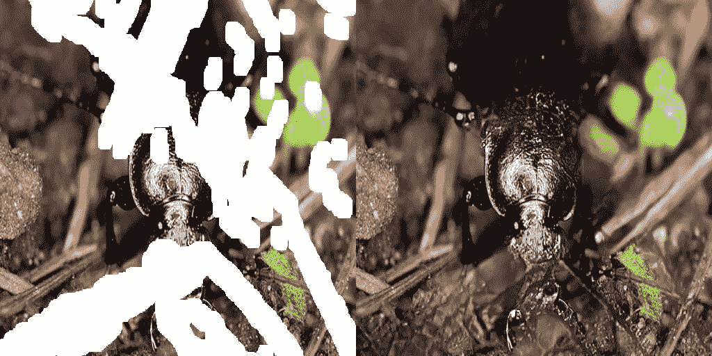

内容感知图像编辑/ [PetaPixel](https://petapixel.com/2018/04/23/nvidias-ai-powered-content-aware-fill-is-mind-blowing/)

# 4.场景重建

场景重建是从物体的图片或扫描重建真实世界物体的 3D 数字版本的过程。这是一个非常复杂的问题，有很多研究历史、未解决的问题和可能的解决方案。在这个过程中，来自不同视点的场景的两个图像之间的对应关系导出每个可视化元素的距离。更先进的方法是拍摄几幅图像，并将它们的内容匹配在一起，以获得目标场景的 3D 模型。

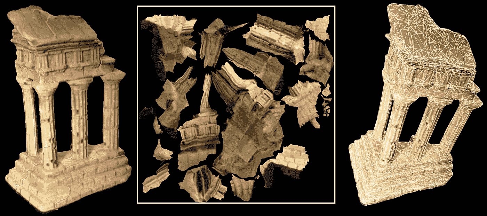

场景重建/ [马特的网角](https://graphics.stanford.edu/~mdfisher/SceneReconstruction.html)

# 5.参考

[1].【https://www.cs.toronto.edu/~kriz/cifar.html 

[2].[2022 年图像分类完整指南](https://viso.ai/computer-vision/image-classification/)

[3].[2022 年的物体探测:权威指南](https://viso.ai/deep-learning/object-detection/)

[4].[计算机视觉目标跟踪—类型和商业用例](https://mindtitan.com/resources/blog/object-tracking-with-computer-vision/)

[5].[英伟达人工智能驱动的“内容感知填充”令人兴奋](https://petapixel.com/2018/04/23/nvidias-ai-powered-content-aware-fill-is-mind-blowing/)

[6].[马特网角场景重建](https://graphics.stanford.edu/~mdfisher/SceneReconstruction.html)

[7].使用 Tensorflow 2 实践计算机视觉

*感谢阅读！如果你喜欢这篇文章，一定要鼓掌(高达 50！)并在* [*LinkedIn*](https://www.linkedin.com/in/youssef-hosni-b2960b135/) *上与我联系，并在*[*Medium*](https://youssefraafat57.medium.com/)*上关注我的新文章。*