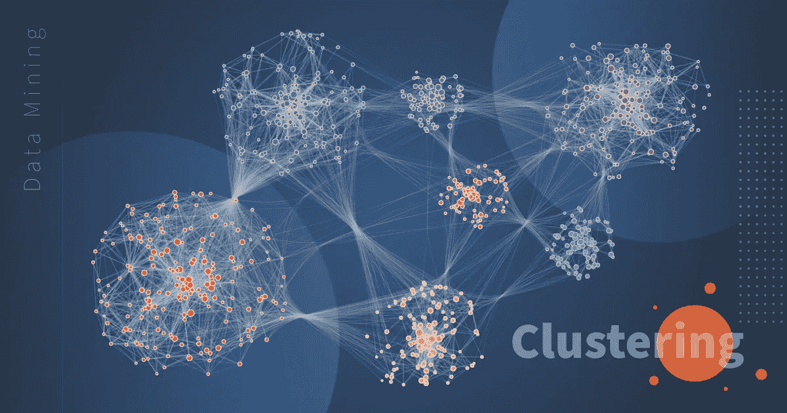

# 无监督机器学习任务和应用概述

> 原文：<https://pub.towardsai.net/overview-of-unsupervised-machine-learning-tasks-applications-139db2239e2c?source=collection_archive---------1----------------------->

虽然我们世界上大多数机器学习的应用都是基于受监督的机器学习算法，这也是大多数投资进入这个方向的原因。然而，大多数可用数据实际上是未标记的:我们有输入特征 X，但我们没有标记 y。无监督学习的重要性由此而来。扬·勒村有句名言:

> **如果智能是一块蛋糕，无监督学习将是蛋糕，监督学习将是蛋糕上的糖衣，强化学习将是蛋糕上的樱桃**

由 [Billy Huynh](https://unsplash.com/@billy_huy?utm_source=medium&utm_medium=referral) 在 [Unsplash](https://unsplash.com?utm_source=medium&utm_medium=referral) 上聚类/拍照

无监督学习有很多应用，例如，如果你想创建一个系统，为生产生产线上的每个产品拍几张照片，并检测哪些产品有缺陷。你可以很容易地创建一个自动拍照的系统，这可能会每天给你数千张照片。然后，您可以在短短几周内构建一个相当大的数据集。但是当你开始做这个项目时，你将面临一个问题，那就是没有标签！假设您想要训练一个常规的二进制分类器来预测一个项目是否有缺陷。在这种情况下，你需要把每一张图片都标上“有缺陷”或“正常”的标签。

这通常需要人类专家坐下来手动浏览所有图片。这是一项漫长、昂贵且乏味的任务，因此通常只在可用图片的一小部分上进行。因此，标记的数据集将非常小，分类器的性能将令人失望。此外，每次公司对其产品进行任何更改，整个过程都需要从头开始。如果算法可以只利用未标记的数据，而不需要人类标记每张图片，那岂不是很棒？进入无监督学习。

在这篇博客中，我们将看看主要的无监督学习任务和算法:

*   **集群化:**目标是将相似的实例分组到集群中。对于数据分析、客户细分、推荐系统、搜索引擎、图像分割、半监督学习、降维等等，这是一个非常好的工具。
*   **异常检测:**目标是了解“正常”数据是什么样的，并使用它来检测异常情况，如生产线上的缺陷项目或时间序列中的新趋势。
*   **密度估计:**这是估计生成数据集的随机过程的概率密度函数(PDF)的任务。这通常用于异常检测:位于非常低密度区域的实例很可能是异常。也有助于数据分析和可视化。

## 目录:

1.  **集群**
2.  **异常检测**
3.  **密度估计**

**如果你想免费学习数据科学和机器学习，看看这些资源:**

*   免费互动路线图，自学数据科学和机器学习。从这里开始:[https://aigents.co/learn/roadmaps/intro](https://aigents.co/learn/roadmaps/intro)
*   数据科学学习资源搜索引擎(免费)。将你最喜欢的资源加入书签，将文章标记为完整，并添加学习笔记。[https://aigents.co/learn](https://aigents.co/learn)
*   想要在导师和学习社区的支持下从头开始学习数据科学吗？免费加入这个学习圈:[https://community.aigents.co/spaces/9010170/](https://community.aigents.co/spaces/9010170/)

如果你想在数据科学&人工智能领域开始职业生涯，但你不知道如何开始。我提供数据科学指导课程和长期职业指导:

*   长期指导:[https://lnkd.in/dtdUYBrM](https://lnkd.in/dtdUYBrM)
*   辅导会议:[https://lnkd.in/dXeg3KPW](https://lnkd.in/dXeg3KPW)

***加入*** [***中等会员***](https://youssefraafat57.medium.com/membership) ***计划，只需 5 美元，继续无限制学习。如果你使用下面的链接，我会收到一小部分会员费，不需要你额外付费。***

# 1.使聚集

想象一下，你正在山里享受远足，偶然发现了一种你从未见过的植物。你环顾四周，注意到还有一些。它们并不完全相同，但是它们足够相似，你可以知道它们很可能属于同一个物种(或者至少是同一个属)。你可能需要一个植物学家来告诉你那是什么物种，但你肯定不需要一个专家来识别一群看起来相似的物体。这被称为**聚类:**它的任务是识别相似的实例并将它们分配到集群，即相似实例的组。

什么是聚类没有统一的定义:它实际上取决于上下文，并且不同的算法将捕获不同种类的聚类。例如，一些算法寻找以称为质心的特定点为中心的实例。其他人寻找密集聚集的连续区域:这些集群可以呈现任何形状。有些算法是分层次的，寻找簇的簇。

最著名的聚类算法是 K-Means 和 DBSCAN。

聚类/ [Loginom](https://loginom.com/blog/data-mining-clustering)

聚类用于各种各样的应用中，包括:

*   **客户细分**:你可以根据客户的购买行为、他们在你网站上的活跃程度等等来对他们进行分类。这有助于了解你的客户是谁，他们需要什么，这样你就可以针对每个细分市场调整你的产品和营销活动。例如，在推荐系统中，这对于推荐相同集群中的其他用户喜欢的内容是有用的。
*   **数据分析:**当分析一个新的数据集时，首先发现相似实例的聚类通常是有用的，因为单独分析聚类通常更容易。
*   **降维:**一旦数据集被聚类，通常就可以测量每个实例与每个聚类的相似性(相似性是一个实例与一个聚类匹配程度的任何度量)。然后，每个实例的特征向量 x 可以替换为其聚类相似性的向量。如果有 k 个簇，那么这个向量是 k 维的。这通常比原始特征向量的维数低得多，但是它可以为进一步处理保留足够的信息。
*   **半监督学习:**如果你只有几个标签，你可以执行聚类并将标签传播到同一个聚类中的所有实例。这可以大大增加后续监督学习算法可用的标签数量，从而提高其性能。
*   **搜索引擎:**例如，一些搜索引擎让你搜索与参考图像相似的图像。要构建这样一个系统，首先要对数据库中的所有图像应用聚类算法:相似的图像将出现在同一个聚类中。然后，当用户提供参考图像时，您需要做的就是使用训练好的聚类模型找到该图像的聚类，然后您可以简单地返回该聚类中的所有图像。
*   **图像分割:**通过根据颜色对像素进行聚类，然后用其聚类的平均颜色替换每个像素的颜色，可以大大减少图像中不同颜色的数量。这种技术被用在许多物体检测和跟踪系统中，因为它使得检测每个物体的轮廓变得更容易。

# 2.异常检测

异常检测(也称为离群点检测)是检测严重偏离规范的实例的任务。当然，这些实例被称为异常或异常值，而正常的实例被称为内部值。异常检测在各种各样的应用中非常有用，例如，在欺诈检测、检测制造中的缺陷产品、或者在训练另一个模型之前从数据集中移除异常值中，这可以显著地提高所得模型的性能。

照片由[威尔·迈尔斯](https://unsplash.com/@will_myers?utm_source=medium&utm_medium=referral)在 [Unsplash](https://unsplash.com?utm_source=medium&utm_medium=referral) 上拍摄

在异常检测中，目标是发现与多个对象不同的对象。通常，异常对象被称为异常值，因为在数据的散点图中，它们远离多个数据点。异常检测也称为偏差检测，因为异常对象具有本质上偏离预期或一般属性值的属性值，或者称为异常挖掘，因为异常在几种意义上是异常的。

异常检测有多种应用:

*   **欺诈检测**:盗取信用卡的人的购买行为与最初的主人不同。信用卡公司试图通过观察描述盗窃特征的购买设计或通过感知一般行为的变化来识别盗窃。不同类型的欺诈使用相同的方法。

*   **入侵检测:**不幸的是，对计算机系统和计算机网络的攻击屡见不鲜。虽然一些攻击(包括那些旨在使计算机和网络瘫痪或瘫痪的攻击)是显而易见的，但其他攻击(包括那些旨在秘密收集数据的攻击)却很难识别。其中一些入侵可以通过观察系统和网络的异常行为来识别。
*   **公共卫生:**在一些国家，医院和医疗诊所会向国家机构报告多项统计数据，以便进行更多分析。例如，如果一个城市的一些儿童接种了特定疾病的疫苗，如麻疹，那么分散在一个城市的几家医院的一些病例的出现是异常事件，可以表明该城市的疫苗接种计划存在问题。

以下是一些最著名的异常检测算法:

*   **隔离森林:**它是一种无监督的异常检测算法，使用随机森林算法来检测数据集中的异常值。该算法试图划分数据点，使每个观察值与其他观察值隔离开来。
*   **局部异常因子:**该算法考虑数据点密度来判断一个点是否异常。局部异常值因子计算一个称为异常值的异常值，用于测量该点相对于周围邻域的孤立程度。
*   **稳健协方差:**对于高斯无关特征，可以采用简单的统计技术来检测数据集中的异常。对于高斯/正态分布，远离第三偏差的数据点可被视为异常。

# 3.密度估计

密度估计是根据从密度场提取的离散采样点集合来估计连续密度场的行为。**密度估计**的目标是精确描述密度未知的可观测数据集的潜在概率密度分布。

照片由 [Joseph Chan](https://unsplash.com/@yulokchan?utm_source=medium&utm_medium=referral) 在 [Unsplash](https://unsplash.com?utm_source=medium&utm_medium=referral) 上拍摄

当给定数据集下的分布具有概率密度时，良好的密度估计通常会揭示分布的重要特征。这可以用于异常和异常值检测，也可以用于数据分析和可视化。

# 参考资料:

*   [使用 Scikit Learning、Keras 和 TensorFlow 进行机器实践学习](https://www.oreilly.com/library/view/hands-on-machine-learning/9781492032632/)
*   [异常检测的应用是什么？](https://www.tutorialspoint.com/what-are-the-application-of-anomaly-detection)
*   [每个数据科学家都应该知道的 5 种异常检测算法](https://towardsdatascience.com/5-anomaly-detection-algorithms-every-data-scientist-should-know-b36c3605ea16)

*喜欢这篇文章吗？成为* [***中等会员***](https://youssefraafat57.medium.com/membership) *继续无限制学习。如果你使用下面的链接，我会收到一小部分会员费，不需要你额外付费。*

 [## 加入我的介绍链接媒体-优素福胡斯尼

### 阅读 Youssef Hosni(以及媒体上成千上万的其他作家)的每一个故事。您的会员费直接支持…

youssefraafat57.medium.com](https://youssefraafat57.medium.com/membership) 

*感谢阅读！如果你喜欢这篇文章，一定要鼓掌(高达 50！)并在* [*LinkedIn*](https://www.linkedin.com/in/youssef-hosni-b2960b135/) *上与我联系，并在*[*Medium*](https://youssefraafat57.medium.com/)*上关注我的新文章。*