# 视觉变形金刚概述是你所需要的

> 原文：<https://pub.towardsai.net/overview-of-vision-transformers-is-all-you-need-88727438ff8d?source=collection_archive---------0----------------------->

## 变形金刚如何成为计算机视觉的下一个突破？

约书亚·厄尔在 [Unsplash](https://unsplash.com/s/photos/overview?utm_source=unsplash&utm_medium=referral&utm_content=creditCopyText) 上的照片

深度学习的**变形金刚**历史上，一切都始于 2017 年的那篇著名论文[**‘注意力是你所需要的全部**](https://arxiv.org/abs/1706.03762)**’**。谷歌大脑团队发表了他们的研究，通过使用**转换器**改变了**自然语言处理**的命运。

*在图像上使用相同技术的想法可能开启了视觉技术的新时代……*

> 一、**简介**

*   在这篇文章中，我根据我的研究准备了一份视觉变形金刚的概述。在我的学习过程中，我总结了一些笔记来回答这些问题来理解变形金刚。

**— — *什么是 Transformer，为什么要用在深度学习中？***

**— — *为什么以及如何将 Transformer 应用于视觉？***

**— — *视觉变形金刚和 CNN 有什么区别？***

**——*Transformer 如何用于物体检测？***

视觉变形金刚准备好生产了吗？

*   这些笔记会很有用，特别是对于那些经常听变形金刚但还不能开始的人。让我们开始…

> ***什么是 Transformer，为什么要用在深度学习中？***

*   **Transformer** ，一种基于**注意力**机制的新模型架构，于 2017 年由一些研究人员和谷歌大脑团队在论文**‘注意力是你所需要的全部’**中首次提出。
*   在那之前，**递归神经网络(RNN)** 、**长短期记忆(LSTM)** 和**门控递归网络**大多被用作**自然语言处理**应用中的最新网络，因为它们能够找到序列数据的信息。然而，这些网络在 NLP 任务中有一些主要的缺点。

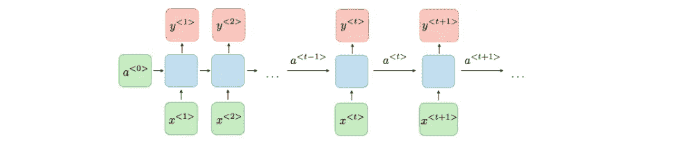

RNN 建筑公司。来源:[https://Stanford . edu/~ shervine/teaching/cs-230/cheat sheet-recurrent-neural-networks](https://stanford.edu/~shervine/teaching/cs-230/cheatsheet-recurrent-neural-networks)

*   它们不足以从文本数据中理解全局意义，因为它是顺序处理的。正如您在上面的传统 **RNN 架构**的图片中所看到的，每个时间戳的输出都必须作为输入提供给下一个时间戳。这导致了**短时记忆**，也阻止了**平行训练**。即使 **LSTM** 可以增加内存容量，但这还不够，而且计算量仍然很大。
*   另一方面， **Transformer** 尤其是它的**注意力机制**在 **NLP** 任务上创造了突破。OpenAI 的 **GPT-3** 模型和谷歌的**伯特**模型是这一突破的最大例子。

谷歌的 BERT 例子。来源:[https://blog . Google/products/search/search-language-understanding-Bert/](https://blog.google/products/search/search-language-understanding-bert/)

*   **变压器** **架构**的主要部分由**编码器**和**解码器**组成。**变形金刚**一次性将所有输入，如一个句子，作为嵌入，而 **RNN** 和 **LSTM** 模型逐字输入。并且这些嵌入在**关注块**中被处理。
*   **关注块**的目的是提取输入句子的单词之间的关系/依存关系。因此，这些特征有助于获得对上下文的**全局理解**。除了**注意机制**和**嵌入**、**层模型**、**前馈网络**和 **softmax 函数**也在该网络中使用。

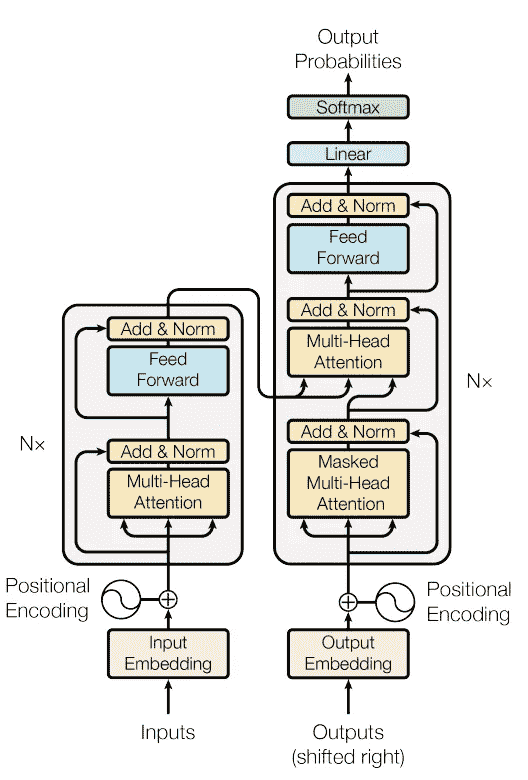

变压器模型架构。来源:[https://arxiv.org/pdf/1706.03762.pdf](https://arxiv.org/pdf/1706.03762.pdf)

*   我不打算解释关于模型架构的所有细节，但我应该提到的是**注意力区块**是**变形金刚**最关键的部分。我们将在下一部分更详细地看到相同的架构。上面可以看到**变压器**的模型架构。关于该模型的进一步解释可以在该研究的官方论文中找到。

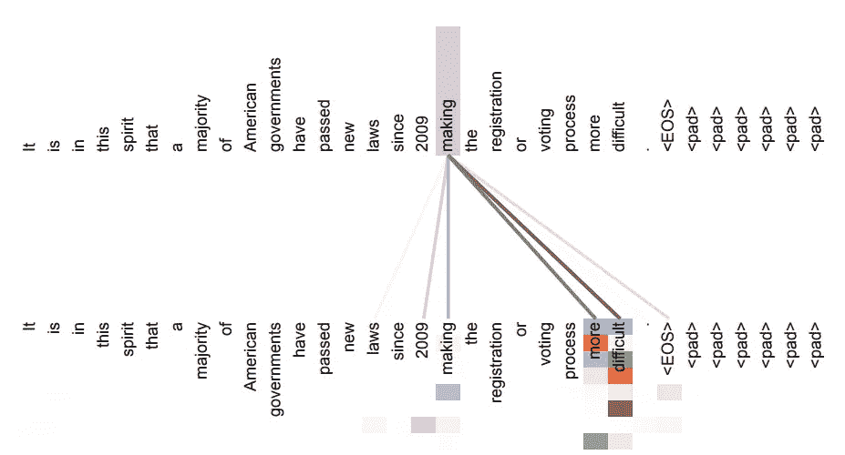

注意力可视化。来源:[https://arxiv.org/pdf/1706.03762.pdf](https://arxiv.org/pdf/1706.03762.pdf)

*   在上面的**注意机制**的例子中，你可以看到**长距离依赖**在网络的**编码器**部分。您在此看到的所有**注意事项**仅为工作**【制作】**显示。每种不同的颜色也代表不同的**注意力头**。令人印象深刻的是，许多注意力集中在**、**、**、【更多】、**、【困难】、**之间。**

> ***为什么以及如何将 Transformer 应用于视觉？***

*   正如我提到的，**注意机构**是**变形金刚**的心脏。这使得**变形金刚**成为 NLP 任务事实上的标准。从**局部**到**全局理解**…像人类一样。
*   2020 年，谷歌研究和大脑团队在图像上使用了几乎相同的技术，他们表明，对**CNN**的依赖是不必要的，直接应用于图像补丁序列的纯**转换器**可以在**图像分类**任务上表现得非常好。他们在名为[**‘一张图像抵得上 16×16 个字’**](https://arxiv.org/pdf/2010.11929.pdf)的论文中发表了他们的研究。

**视觉变压器**型号可在下面查看。让我解释一下这个模型是如何工作的。

模型概述。来源:[https://arxiv.org/pdf/2010.11929.pdf](https://arxiv.org/pdf/2010.11929.pdf)

*   整个过程的第一步是**将**图像**拆分**成**固定大小的面片**、**展平**它们，然后线性**嵌入**它们每一个。你可以在 **NLP** 中把这些小块想象成单词，把整个图像想象成一个句子。

*你可能会问为什么我们不把所有的像素都当成面片。这个问题的第一个答案与* ***计算复杂度*** *有关。如果我们把每一个像素看作一个面片，那么* ***注意机制*** *的复杂度会非常高。此外，图像不同角落或侧面的像素彼此之间没有有意义的关系。因此，网络没有必要额外关注。*

*   下一步是将位置嵌入添加到面片嵌入中。然后，**变压器**编码器由嵌入的结果序列馈送。

*在说变压器编码器之前，我想提一点。如果你意识到我们把* ***面片*** *和它们的* ***位置*** *组合起来。但是，没有关于* ***像素*** *位置的信息。*

*有研究试图通过将补丁分成更小的补丁来解决这个问题。此外，本研究的作者在 ImageNet 上实现了 81%的 top-1 准确率***。这比具有类似计算成本的最先进的视觉变压器高大约 1.7%。他们称自己的框架为* [***【变压器中的变压器(TNT)***](https://arxiv.org/abs/2103.00112) *。你可以在下面看到他们的模型，并查看他们的论文了解详情。**

*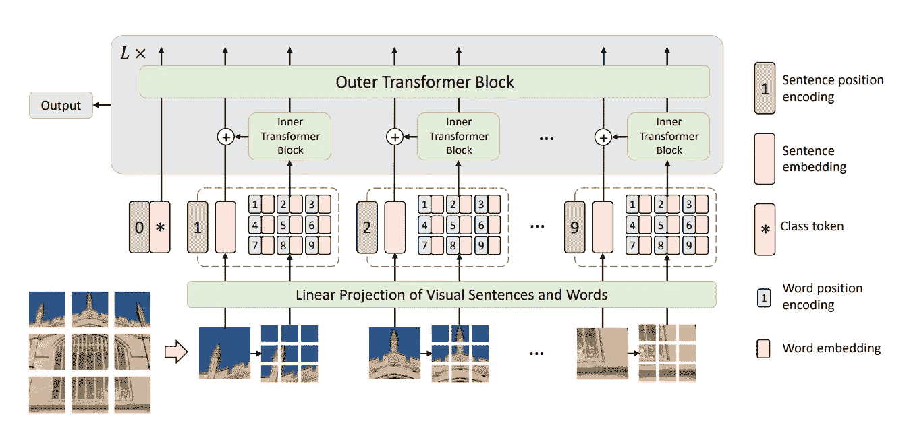*

*TNT 框架。来源:[https://arxiv.org/pdf/2103.00112.pdf](https://arxiv.org/pdf/2103.00112.pdf)*

*让我们继续从**视觉** **变压器编码器……***

*   ***变压器编码器**包括**多头自关注(MSA)、MLP 块**和**层形态(LN)** 。*
*   ***MSA** 的目的是像在 **NLP** 中一样在**补丁**之间抽取**注意力**。在图像的每个补丁之后，**自我关注度**将评估该补丁与图像的其他补丁之间的**关注度**。别忘了，我们把这种**注意机制** **叫做多头自我注意**，每个头都有一个**注意模式**。*
*   ***Layernorm(LN)** 在每个块之前使用，**剩余连接**在每个块之后应用。*
*   ***MLP** 用于实现架构的**分类头**。MLP 由预训练时的一个**隐层**和微调时的一个**单线层**组成。*

*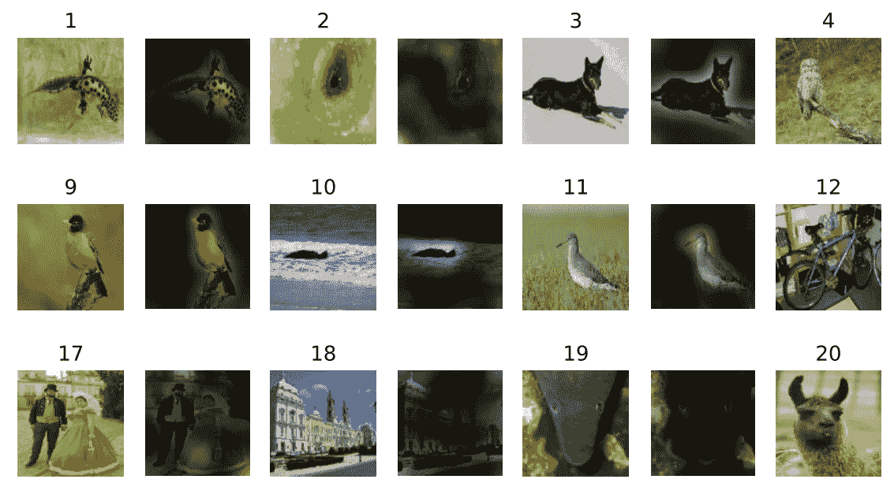*

*注意地图示例。来源:[https://arxiv.org/pdf/2010.11929.pdf](https://arxiv.org/pdf/2010.11929.pdf)*

*   *你可以在上面的**图片**中看到**注意机制**是如何工作的。你还记得显示**注意力头**如何在 **NLP** 中工作的例子吗？就像在那里，你看到我们在所有的**注意力**头被组合起来之后得到了什么。*

*你可以在他们的 [GitHub 库](https://github.com/google-research/vision_transformer)上找到谷歌大脑团队的最新发展和模型。关于**视觉转换器**的详细实现和解释可以在那里找到。*

> ****CNN 和视觉变形金刚的主要区别是什么？****

*   ***视觉变压器**在图像上的**感应偏差**比 **CNNs** 小。2007 年， **Geoffrey Hinton** 说 CNN 的一个主要问题来自于网络中的**池层**。这些层导致部分图像和整个图像的重要信息的损失。这也导致图像不同部分之间失去联系，并使**局部理解**图像。然而，T **转换器**的**自我关注层**是**全局的，**它带给它们**全局的理解**。*
*   *根据**视觉变形金刚的官方论文，**在**CNN**和**视觉变形金刚**之间可以观察到不同的对比。*
*   ***CNN** 与**变形金刚**相比，使用**更少的数据量**效果更好，如下图所示。主要原因来自于有这个**感应偏置**。然而，如果**变形金刚**可以被**大** **数据量**馈入，那么它们会用**全局方法带来更好的结果，**相反 **Cnn 的**受限能力因为**局部敏感性**。*

*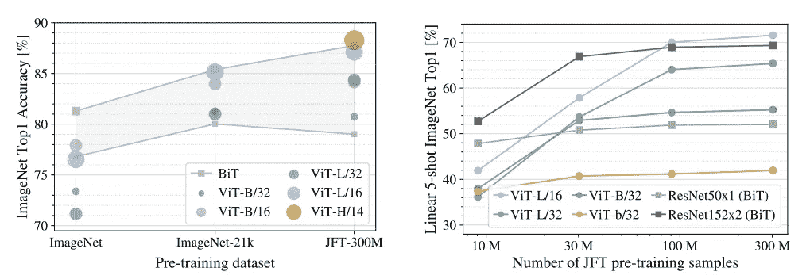*

*性能比较。[https://arxiv.org/pdf/2010.11929.pdf](https://arxiv.org/pdf/2010.11929.pdf)*

*   *另外，当比较**内存效率**时，特别是**大视野变压器**型号比 **ResNet** 型号内存效率更高。*

*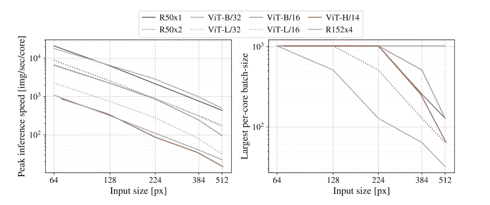*

*性能比较。[https://arxiv.org/pdf/2010.11929.pdf](https://arxiv.org/pdf/2010.11929.pdf)*

*   *当针对不同架构比较预训练**计算性能**时，**视觉变形器**通常在相同的**计算预算**下**超过**结果。然而，**混合**模型为较小的模型尺寸带来了更好的结果。*

*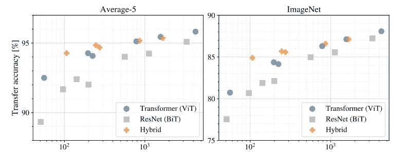*

*总预训练计算[exaFLOPS]。来源:[https://arxiv.org/pdf/2010.11929.pdf](https://arxiv.org/pdf/2010.11929.pdf)*

****混动车型*** *不在本帖解释。我在下一部分只讲了* ***DETR 框架*** *。从名字就可以理解，混动车型是* ***变形金刚*** *和****CNN****的组合。这个话题将是下一篇文章的主题。**

*   *这两种方法的另一个区别是**视觉变形金刚**能够学习**有意义的信息**，即使在**最底层**。**CNN**能够在最后一层提取**高层**信息。通过比较来自**变形金刚**的可视化**注意力图**和来自**CNN**的**权重**可以观察到这些差异*

> ****变形金刚中的物体检测****

***物体检测**是计算机视觉的主要**任务之一，我认为是工程师和我使用最多的任务之一。这就是为什么我插入了两个著名的**物体检测**方法，它们在管道中使用了**变压器**。***

****【检测变压器(DETR)】****

*   *2020 年，**脸书**出版 **DETR** 。他们已经发布了第一个**物体检测**框架，使用**转换器**作为检测流水线中的核心构件。**CNN**也被用在了这条管道上。此外，这项研究的作者已经取得了比**更快的 R-CNN** 更有竞争力的结果。*

*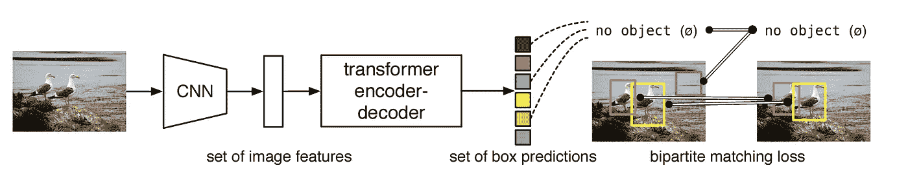*

*DETR 管道公司。来源:[https://arxiv.org/abs/2005.12872](https://arxiv.org/abs/2005.12872)*

*   ***脸书的 DETR** 就是**混动**车型的一个很好的例子。它由 **CNN** 、**变压器编解码**和**前馈网络**组成。*
*   ***CNN 主干**用于提取图像的**特征**，而不是将输入图像分割成小块。这些**特征**是**变平**和**组合**与**位置编码**。*
*   ***变压器编码器**将这组图像**特征**作为一个序列。正如我们之前看到的，**变压器**编码器包括一个**多头自关注**模块、**规格化器、**和**前馈网络**。在这个网络中，**位置编码**也是固定的。*

*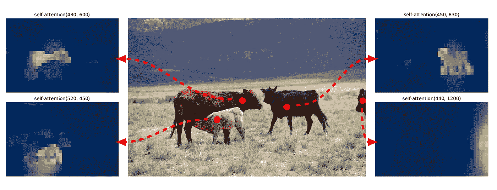*

*编码器自我关注。来源:https://arxiv.org/abs/2005.12872*

*   *正如你在上面看到的，多亏了**注意机制，变形金刚编码器**甚至能够在模型的最后一个**编码器层**分离物体。*
*   *在**解码器**部分，机制与**原变压器**几乎相同。唯一的区别是，该模型在每个**解码器层**并行解码**‘N’个嵌入**。这些嵌入来自**编码器**部分，也被称为“**对象查询**”。这“N”个对象被转换成嵌入并被发送到**前馈网络**。*
*   ***前馈网络**用于**预测**问题。来自**变压器解码器**的嵌入输出被发送到这些网络。然后，他们预测一个**检测**(类和边界框)或者一个**‘无对象’**类。你可以把这个类想象成标准物体检测模型中的**‘背景’类**。*

***代码**和**预训练模型**可以在本作官方 [GitHub 库](https://github.com/facebookresearch/detr)中找到。*

***你只看一个序列(YOLOS)***

*   ***YOLOS** 是**视觉转换器**的优化版本，用于**物体检测**任务。因为这种方法没有被设计成高性能的对象检测器。它的性能对未来的发展是有希望的。*

***YOLOS** 架构与最初的**视觉转换器**方案非常相似，如下图所示。你注意到有**【Pat-Tok】****【PE】****【Det-Tok】**。*

*   ***‘Pat-Tok’**定义一个展平的**图像补片**的嵌入。**‘PE’**表示**位置嵌入，**和**‘Det-Tok’**定义了对象绑定的可学习嵌入。*
*   *在架构上，**视觉转换器**和 **YOLOS** 的第一个区别是有 100 个随机初始化的可学习**检测令牌(' Det-Tok')** ，而不是使用一个可学习的**类令牌**，后者用于**分类**。*
*   *架构的主体部分与**视觉转换器** **编码器**相同。每个变压器编码器层包括一个**多头自关注块**、**层名**和 **MLP** 块，如我们在前面部分中所述。*
*   ***MLP** 头像用于**实现**分类**和**包围盒回归。*

*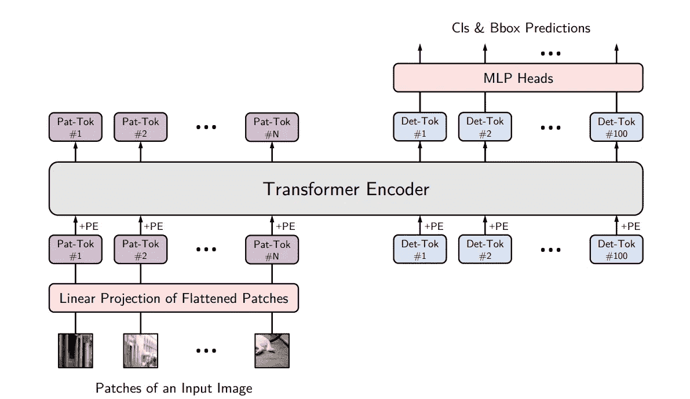*

*YOLOS 架构概述。来源:[https://arxiv.org/pdf/2106.00666.pdf](https://arxiv.org/pdf/2106.00666.pdf)*

*   *这两种方法的第二个区别是**损失函数**。**视觉转换器**使用**图像分类损失**，而 **YOLOS** 使用**二分匹配损失**。*
*   *你可以在两个不同的 **YOLOS-S** 模型的最后一层的头上检查**自我关注**地图可视化检测令牌和相应的预测。*

*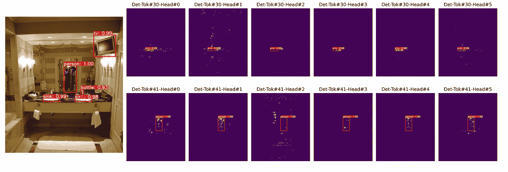*

*自我注意地图可视化。来源:[https://arxiv.org/pdf/2106.00666.pdf](https://arxiv.org/pdf/2106.00666.pdf)*

*   *你可以在这个 [GitHub 库](https://github.com/hustvl/YOLOS)找到**代码**和**预训练**模型。*

*所以，在所有这些信息之后，我想分享一下我对这个问题的想法…*

> ****视觉变形金刚准备好量产了吗？****

*当然，这个问题没有具体的答案。任何任务的解决技术都可以根据项目需求而变化。*

*然而，在大多数项目的**生产**过程之前，有一些基本点需要关注，如**推断时间**、**精度**、**模型训练要求、**和**部署**过程。*

*那么关于**变形金刚**和**CNN**的区别，应该选择哪一个来制作呢？*

*   *由于**变压器**需要大量数据用于**高精度**，**数据收集**过程会延长项目时间。在数据**较少的情况下，CNN**通常比**变压器**表现更好。*
*   ***变压器**的训练时间**看起来比 **CNNs** 要少。根据对**计算效率**和**精度**的比较，在**模型训练**时间有限的情况下，可以选择**变压器**。***
*   ***自我关注机制**可以给开发的模型带来更多**意识**。既然**CNN**开发的模型的**弱点**如此难以理解，那么**注意力地图**就可以可视化，它们可以帮助开发者指导如何改进模型。这个过程对于基于 CNN 的模型来说更加困难。*
*   *最后但同样重要的是，所选方法的**部署**应该简单而快速，以便准备好进行部署(如果没有时间限制，没问题)。即使有一些**框架**用于**变形金刚**，基于 CNN 的方法部署起来仍然不那么复杂。*

*正如我在开始时说的，我们不能说这个问题的具体答案。**混合动力车型**也在开发中，表现良好。应该始终如一地关注这些方法的现状。在做出决策之前，应该考虑不同方法的项目需求和能力。*

*由于我们生活在一个每天都有越来越多数据的世界，而且开发从未停止，**变形金刚**将更适合部署在实际应用中…*

> ***结论***

*   *从**图像分类**到**图像分割，**变形金刚**成为**计算机视觉**应用的一部分。我们可以在变形金刚的列表中添加**动作识别**、**图像增强**、**超分辨率**，或者 **3D 重建**任务。***
*   *毫无疑问，随着更多数据的到来，我们将在未来的**视觉技术**中看到表现良好的、基于**变压器的**方法。*
*   *我想以提到这种方法对我最重要的影响来结束我的文章。CNN 一直是我思考计算机视觉的**未来的中心。作为一名学生，可能当时我的眼界还不够。然而，**变形金刚**让我明白/记住新的方法总会到来。***

*这种进化是如此令人兴奋，我很高兴成为人工智能革命的一部分！*

> *关于我*

*   *我是**新技术**的机器学习工程师实习生**。我正在帕维亚大学攻读**数据科学**的**硕士学位。*****
*   *****Neosperience** 通过利用 **AI** 的软件解决方案释放同理心的力量，使品牌能够了解、参与和扩大其客户群。在[www.neosperience.com](http://www.neosperience.com/)伸手。***