# EHR-谷歌安全:高保真和隐私保护的合成数据框架:逐页研究综述

> 原文：<https://pub.towardsai.net/page-by-page-research-review-ehr-safe-a-high-fidelity-and-privacy-preserving-synthetic-ehr-data-3a34a591c192?source=collection_archive---------1----------------------->

## EHR 安全:生成高保真和隐私保护的合成电子健康记录

## 摘要

[https://doi.org/10.21203/rs.3.rs-2347130/v1](https://doi.org/10.21203/rs.3.rs-2347130/v1)

> **隐私问题经常成为消费者和数据持有者之间共享数据的主要瓶颈**，尤其是电子健康记录等敏感数据(EHR)。这阻碍了具有巨大潜力的数据分析和基于 ML 的创新的应用。避免这种隐私问题的一个有希望的方法是使用合成数据。我们提出了一个**新颖的生成建模框架，EHR 安全的，用于生成高度逼真和隐私保护的合成 EHR 数据**。EHR 安全基于一个**两阶段模型，该模型由顺序编码-解码网络和生成对抗网络**组成。我们的创新集中在真实世界 EHR 数据的关键挑战方面:数据是异构的，由具有不同特征的数字和分类特征组成；它们包含序列长度高度变化的时变特征；并且特征通常是高度稀疏的。**经过多次评估，我们证明 EHR 安全的保真度非常高**，即它具有与真实数据几乎相同的属性，同时在实际隐私指标方面产生近乎理想的性能。

## 第 1 页:

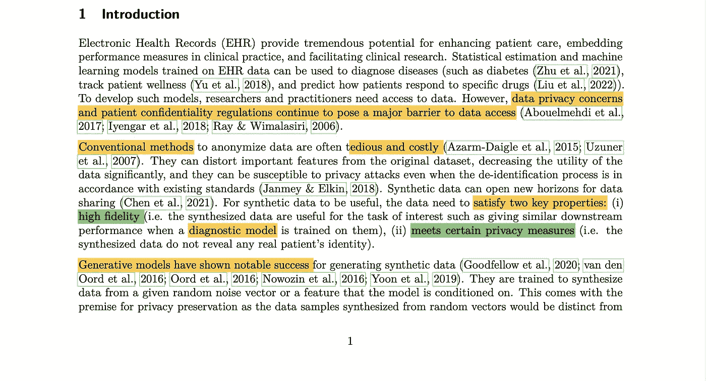

来源:[研究论文](https://www.researchsquare.com/article/rs-2347130/v1)

数据隐私和保密法规是研究访问的障碍。传统方法既昂贵又繁琐。合成数据质量需要满足两个因素。

1.  监管机构对患者隐私的担忧
2.  研究的下游用例的高保真度。

我必须指出，本文主要讨论“诊断”模型。然而，数据的其他用例，即预测性、预测性和规范性用例，可能没有被涵盖。

GAN(生成对抗网络)能够产生高维合成数据。

## 第 2 页:

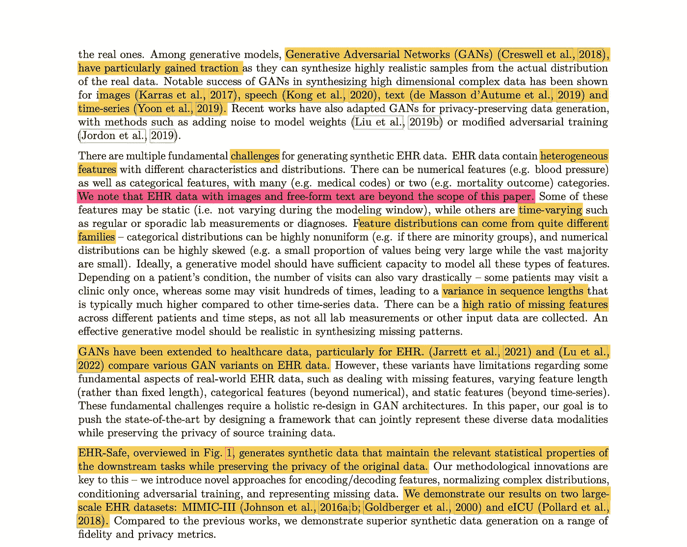

来源:[研究论文](https://www.researchsquare.com/article/rs-2347130/v1)

该论文指出，这些模型是针对图像(Karras 等人，2017 年)、语音(Kong 等人，2020 年)、文本(de Masson 等人，2019 年)和时间序列(Yoon 等人，2019 年)中的用例开发的。

需要记住的一个重要注意事项是，本文不包括超出范围的图像和自由格式的文本数据。尽管人们可以理解“好”数据将是标准格式的，而不是自由文本格式的，但 EHR 的现状是，大部分信息仍然停留在自由文本格式中。如果不将这种信息转换成数据的结构化形式，就不能相信在生成 GAN 模型时输入到训练数据中的分布假设。

本文列举了 EHR 生成的数据固有的主要障碍，例如缺失的特征、变化的停留时间、分类特征及其非标准分布、时变特征、静态特征等。

本文通过将合成数据的预测值与真实数据进行比较，展示了公开可用的 [MIMIC-III](https://registry.opendata.aws/mimiciii/) ( [主链接](https://physionet.org/content/mimiciii/1.4/))和 [eICU](https://eicu-crd.mit.edu/) 数据集的结果。

从原始数据生成合成数据的流程图

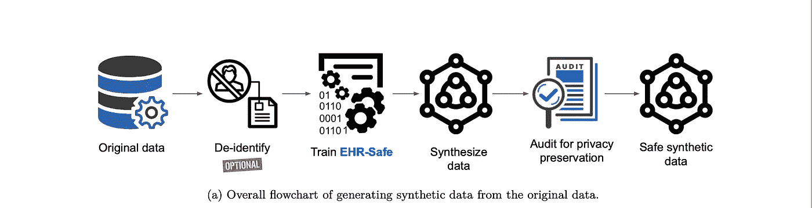

来源:[研究论文](https://www.researchsquare.com/article/rs-2347130/v1)

## 第 3 页

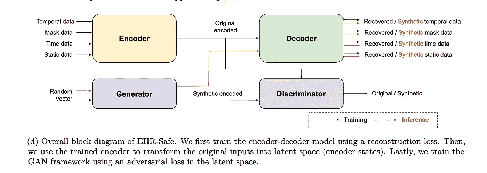

来源:[研究论文](https://www.researchsquare.com/article/rs-2347130/v1)

本文提出了编码器-解码器架构，以避免必须了解 EHR 数据的观察和潜在特征的每个深奥的分布。如上所述，工作流的一般思想是将包括时间、屏蔽、基于时间和静态特征的高维真实数据转换成较低维的表示。这被输入到 GAN 训练中。

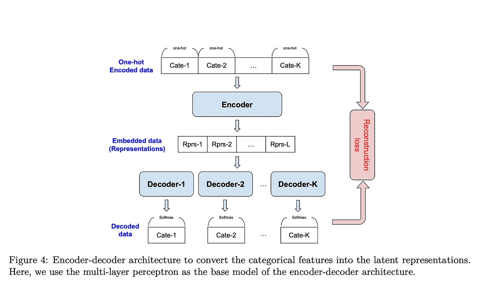

来源:[研究论文](https://www.researchsquare.com/article/rs-2347130/v1)

然后使用 GAN 模型来恢复特征(或重建高维特征)。这是该过程的技术核心。其余的审计和隐私是满足监管监督所必需的。

## 第 4 页

该方法包括 80-20 的培训和测试。关于 MIMIC-III 的更多细节可以在下面找到。

**MIMIC-III:** 患者总数为 19946 人。在 3，000 多个特征中，我们选择了 90 个与死亡率结果高度相关的异质性特征(详情见附录 D)。90 个特征包括(i) 3 个静态数字特征(例如年龄)，(ii) 3 个静态分类特征(例如婚姻状况)，(iii) 75 个时间数字特征(例如呼吸率)，(iv) 8 个时间分类特征(例如心率)，以及(v) 1 个测量时间。序列长度在 1 到 30 之间变化。

**eICU:** 患者总数为 198707 人。有(i) 3 个静态数字特征(年龄、性别、死亡率)，(ii) 1 个静态分类特征(条件码)，(iii) 162 个时间数字特征，和(iv) 1 个测量时间。在 162 个时间数字特征中，我们仅选择 50 个特征，其平均观察次数高于每个患者 1 次。我们将序列的最大长度设置为 50。对于更长的序列，我们只使用最后 50 个时间步长。

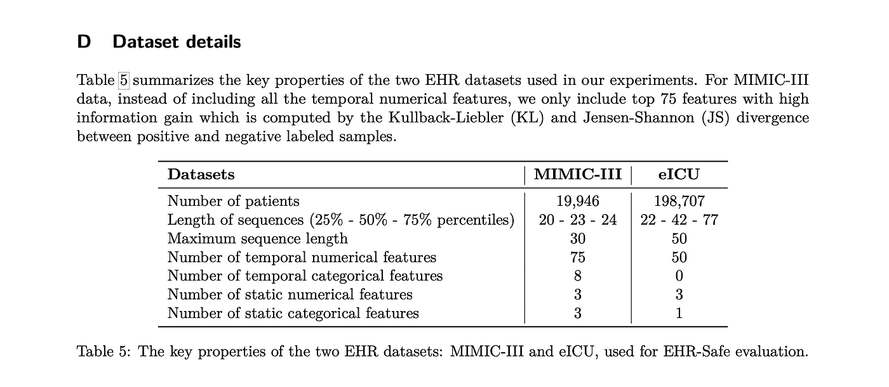

来源:[研究论文](https://www.researchsquare.com/article/rs-2347130/v1)

## 警告

值得注意的是，特征选择是基于与道德的高度相关性。我对这种基于二元结果相关性的特征选择有所保留。此外，当涉及连续空间时，Kullback-Liebler 相对熵的选择可能会给模型带来一些额外的问题(参考:[连续空间上离散时间非线性系统的 Kullback-Leibler 控制](https://arxiv.org/abs/2203.12864))。我必须坦率地说，我的数学理解可能是关闭的，所以请在评论中纠正我，如果你喜欢它。

需要注意的另一点是，序列的最大长度被截断为 50 个时间戳。假设这些特征包括非常频繁的特征(见下图),如心率、SpO2、体温等。我不确定截断是否是最好的方法。从临床角度讲，这些特征在观察期的大部分时间里一般都是正常的，直到“真的出问题”为止。真正错误的部分，是与提议的兴趣特征，道德相关的部分。

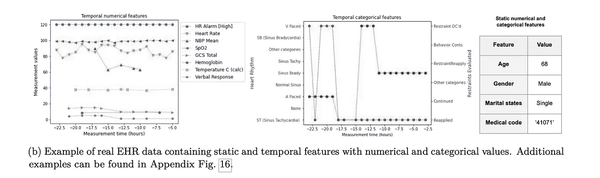

来源:[研究论文](https://www.researchsquare.com/article/rs-2347130/v1)

## 第 4–5 页

关于评估指标的讨论

**数据的保真度**

保真度度量通过测量合成数据与真实数据相比的真实性来评估合成生成数据的质量。B1 部分讨论了保真度下的不同指标。

**使用 KS 检验/统计测量的分布距离。**

正如在 Kolmogorov-Smirnov 检验中一样，KS 的假设数量非常有限；然而，在医疗保健的背景下，让我担心的一点是，衡量的尺度至少需要是“有序的”。同样，对于检验的双尾版本，检验统计量(d)是两个观察到的累积阶跃函数之间的最大绝对偏差，不考虑差异的方向( [ref](https://influentialpoints.com/Training/kolmogorov-smirnov_test-principles-properties-assumptions.htm) )。通常假设 KS 统计量对分布的尾部不太敏感。在医疗保健行业，大多数关键且可操作的数据通常位于分布的尾部。此外，对于不允许将普通性假设扩展到离散特征的低类别离散，KS 测试不是最佳选择([参考](https://www.itl.nist.gov/div898/handbook/eda/section3/eda35g.htm))。鉴于在 EHR 数据中选择的分类特征，我不确定这个测试是否合适。

## **统计相似度**

比较这两种分布并至少从视觉上欣赏其相似性的一个更简单的方法是绘制一个相关性热图。好吧，用皮尔逊相关法看起来很相似。然而，当非常低的心率和非常高的心率都可以影响死亡率时，我不确定至少依赖于某种有序行为的相关性统计的选择和效用。

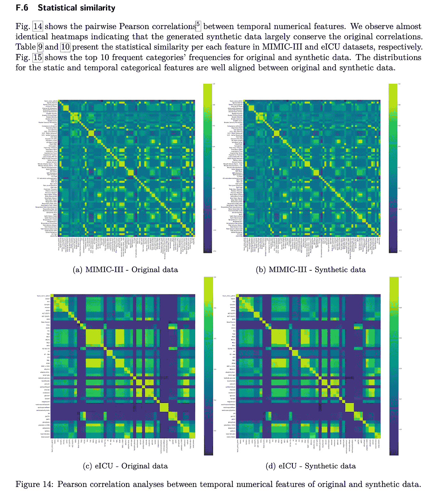

来源:[研究论文](https://www.researchsquare.com/article/rs-2347130/v1)

另一个比较是针对 MIMIC-III 数据集的，其中对大部分要素的缺失率和标准差进行了比较。不幸的是，丢失的%只是硬币的一面。思念的实际分布是另一回事。该表给出了原始数据和合成数据的 CDF 比较的 KS 统计量，理论上应反映分布情况。但是，这种比较严格地说是在数据集级别，而不是在子集级别。如果能看到一个类似的统计数据对影响结果和不影响结果的特征子集也成立，那就太好了。此外，一般来说，在医疗保健研究中，90%缺失数据的效用是不被认可的。

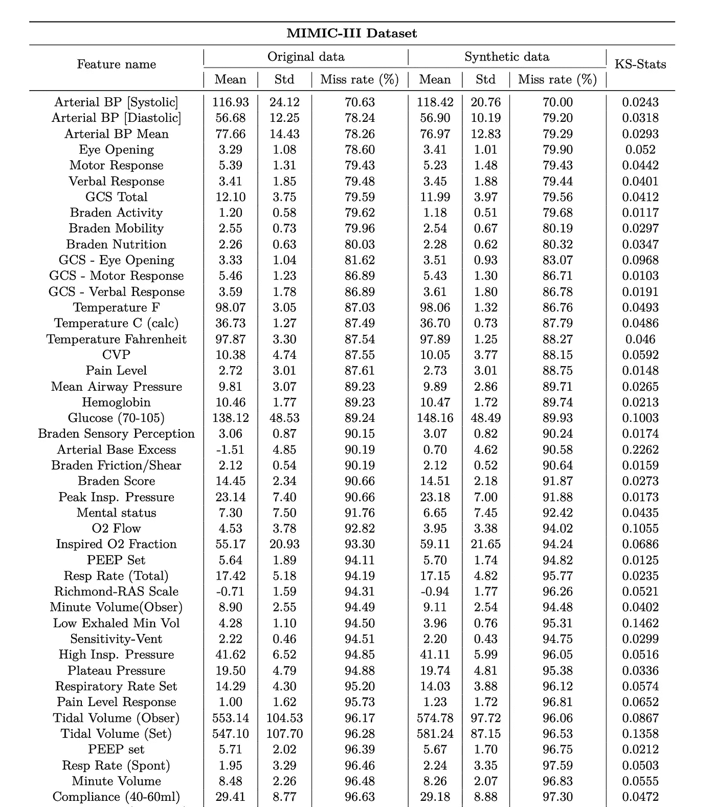

来源:[研究论文](https://www.researchsquare.com/article/rs-2347130/v1)

**关注合成数据“有用性”的效用度量**

它有两种亚型，单靶标和多靶标效用。单目标效用度量集中于给定任务的合成数据的有用性。合成数据的一个常见用例是在无法访问真实数据的情况下开发预测模型。

多目标效用度量关注数据的非主要目标特征。这是一个比主要用例更通用的综合数据对所有其他用例的效用的度量。

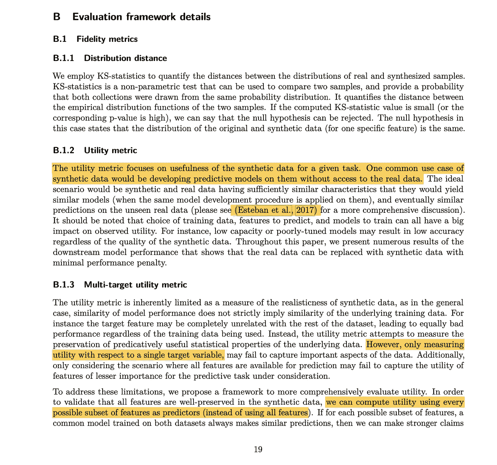

来源:[研究论文](https://www.researchsquare.com/article/rs-2347130/v1)

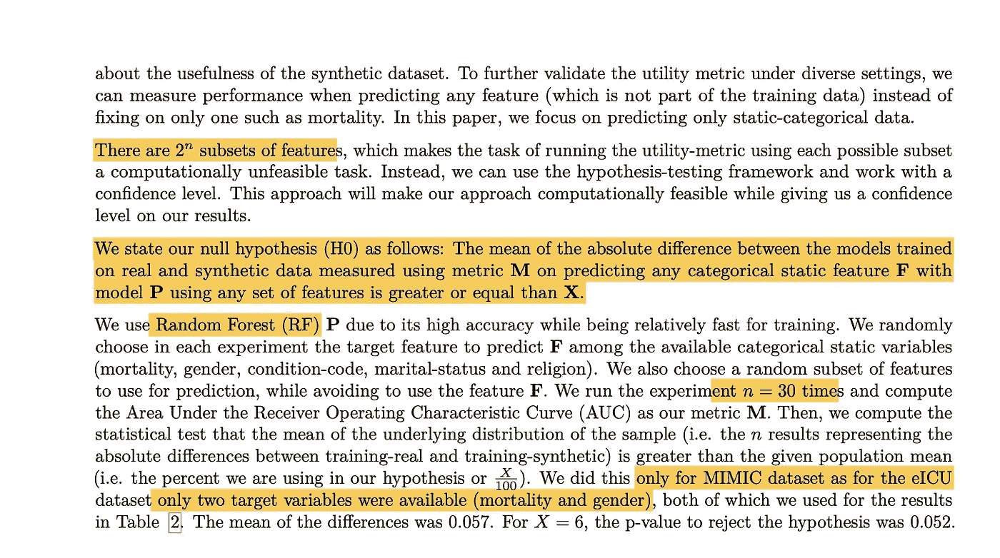

来源:[研究论文](https://www.researchsquare.com/article/rs-2347130/v1)

本文提出了一个综合评价效用的框架。这个框架包括计算每个可能的特征子集的效用。该论文指出，假设存在数据的 2^n 子集，使得计算不可行，那么选择的方法是假设驱动的方法。

零假设(H0)如下:在使用任何一组特征预测任何分类静态特征 **F** 和模型 **P** 时，在使用度量 **M** 测量的真实和合成数据上训练的模型之间的绝对差的平均值大于或等于 **X** 。他们选择死亡率、性别、条件代码、婚姻状况和宗教作为目标特征来实现随机森林模型。测试将是在运行模型 30 次后计算指标 M 的 AUC，以生成允许在合成数据和真实数据之间进行比较的分布。然而，该论文仅在 MIMIC-III 中进行了这项研究，而没有在 eICU 中进行，因为除了死亡率和性别之外的特征不可用。

**基于合成数据和真实数据的 ML 模型开发**

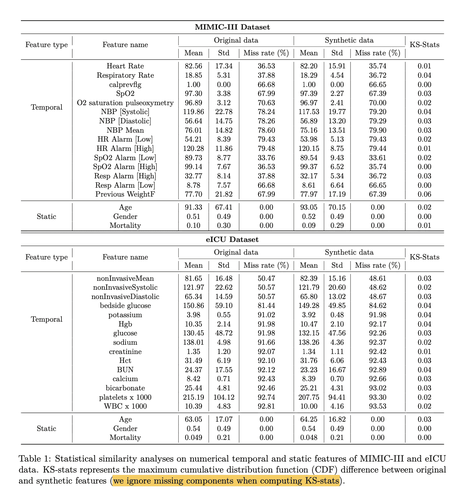

我对这种比较只有两个担心，第一个是这种统计是在比较真实的 KS-stats 与预期死亡率结果的合成数据时构建的。这些特征被选择成与道德相关联。我目前仍在努力思考它会如何影响模型。第二个问题是在计算 KS-stats 时忽略了缺失的组件。在医疗保健领域，缺失的数据与当前的数据一样重要。从健康公平和平等的角度来看，忽略缺失成分的偏见如何影响合成数据的实际效用仍然是一个未决问题。

## **多目标特征对比**

根据分布统计，以下标准用于比较分布。论文拒绝了 AUC 差异大于 0.04 且 p 值小于 0.001 的假设(平均 AUC 差异为 0.009)。对于 eICU 性别预测，我们实现了 0.019 的平均 AUC 差异，p 值小于 0.001。

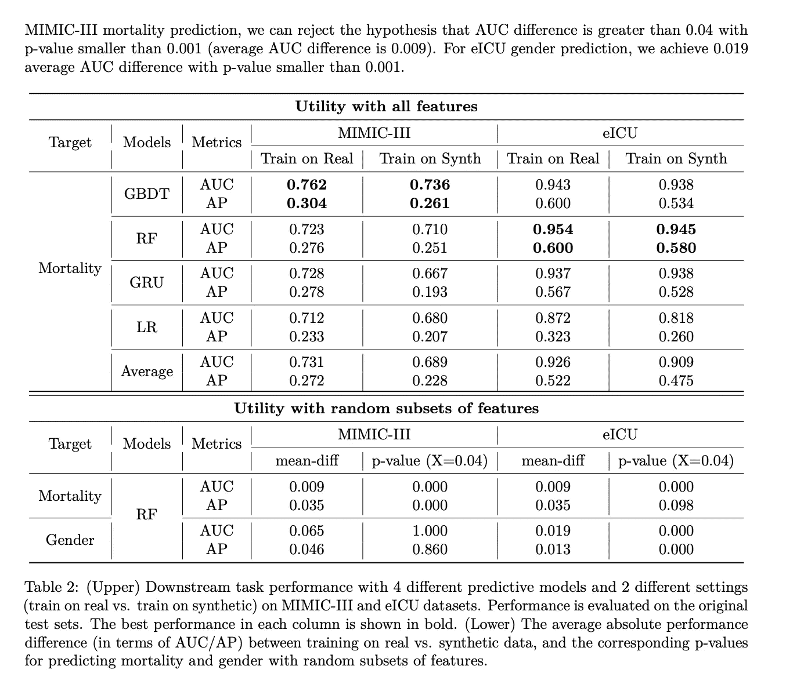

来源:[研究论文](https://www.researchsquare.com/article/rs-2347130/v1)

尽管该论文陈述了他们对 MIMIC 的 5 个分类静态特征(死亡率、性别、条件代码、婚姻状况和宗教)和 eICU 的仅 2 个特征(死亡率、性别)进行了上述分析；只提供了各种模型的死亡率和性别的结果。对于真实数据与合成数据的预测能力差异的给定假设，RF 似乎表现最好，而 LR 表现最差。

## 第 6 页

隐私指标——房间里的大象

这篇论文考虑了三种不同类型的隐私攻击。

1.  成员推断攻击:对手探索数据成为用于训练合成数据生成模型的训练数据的成员的概率(刘等，2019a)。
2.  重识别攻击:对手利用合成数据探索某些特征被重识别的概率，并将其与训练数据进行匹配(Su et al .，2020)。
3.  属性推断攻击:对手使用合成数据预测敏感特征的值(Mehnaz 等人，2022)。

测试攻击媒介的模型如下所示

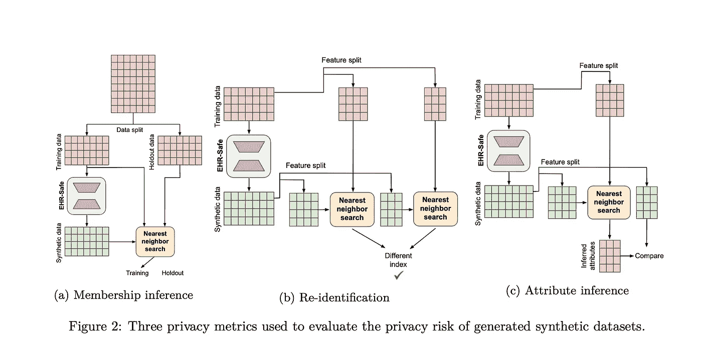

来源:[研究论文](https://www.researchsquare.com/article/rs-2347130/v1)

根据该论文，攻击的所有 3 个向量的隐私度量都是理想的(类似于合成数据中的真实数据)。另一种解释是，重新识别病人的风险几乎是随机的。然而，隐私远不止是数据中的信息。当涉及生成的合成数据时，使用 EHR 内部和外部数据的专家确定的重新识别风险仍然很重要。当我们用合成数据代替 EHR 数据时，我不认为专家确定再鉴定风险的责任有任何减少。在我看来，这实际上可能使专家难以判断当与外部可用数据结合时可能允许重新识别的数据元素。

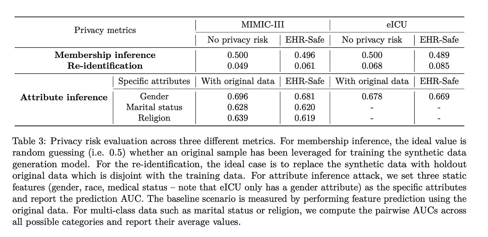

来源:[研究论文](https://www.researchsquare.com/article/rs-2347130/v1)

附录 F5 进一步描述了隐私结果。该论文指出，医疗保健数据是时间序列的形式，因此，他们计算的距离度量也包括时间作为特征维度之一。他们比较了 tslearn 包中 kNN 模型的时间序列指标。

*   动态时间缠绕(DTW):用于测量可能具有不同速度的两个时间序列之间的距离。
*   soft DTW:DTW 的更高级版本，可以在每一点计算差异。与 DTW 相比，这一指标的实施也要快得多。
*   规范时间扭曲(CTW):DTW 的改进版本，可以在数据随时间旋转和转换的更复杂的情况下计算差异。

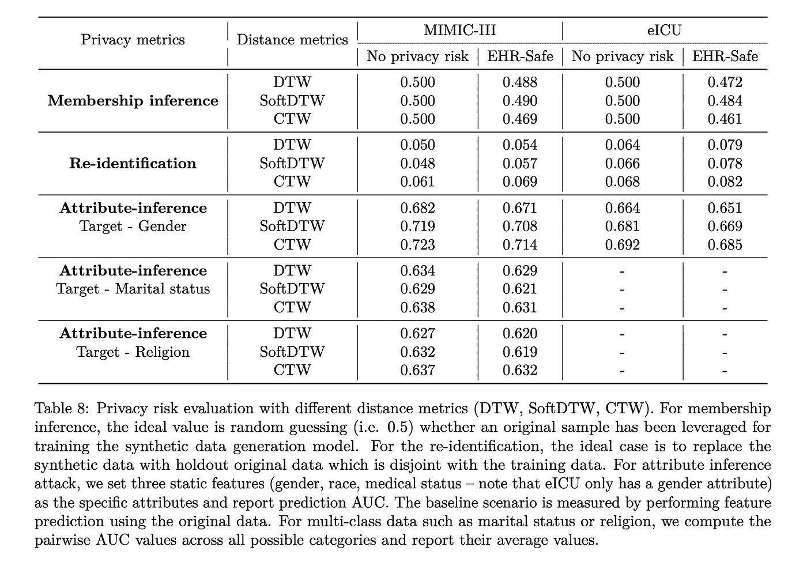

来源:[研究论文](https://www.researchsquare.com/article/rs-2347130/v1)

EHR 安全算法似乎具有与无隐私风险(空)相似的安全特征。然而，前面提到的截断的 50 个时间事件的限制可能会影响该度量。如果有人对此有更好的直觉，请在评论中分享。我很乐意进一步讨论这个问题。PS:如果你最终阅读了这篇论文，一定要看看附录。很多细节就在附录里。[链接](https://www.researchsquare.com/article/rs-2347130/v1)

## 结论

这篇论文是谷歌研究人员完成的一项令人印象深刻的工作。[尹金松](https://www.linkedin.com/in/jinsung-yoon-bb7751b8/)、[塞尔詹·奥·阿里克](https://www.linkedin.com/in/sercanarik/)和研究科学家团队、谷歌研究院和云人工智能团队值得一点掌声。然而，我认为这项研究和证据是朝着我们可以使用完全合成数据的未来迈出的一步。

来支持我🔔 ***拍手*** | ***跟随|*** [***订阅***](https://ithinkbot.com/subscribe) **🔔**

使用我的链接成为会员:[https://ithinkbot.com/membership](https://ithinkbot.com/membership)

检查我的其他作品—

 [## 医疗保健隐私的生成人工智能

### Syntegra 使用基因人工智能创建准确、隐私保护的合成数据

pub.towardsai.net](/generative-ai-for-healthcare-privacy-22994a4ec8c4)  [## 数据注册在循证医疗中的作用

### 证据始于高质量的数据

ithinkbot.com](https://ithinkbot.com/role-of-data-registries-in-evidence-based-healthcare-f52d2babbf4c)  [## 2022:chat GPT 年，未来如何？

### 看着水晶球

pub.towardsai.net](/2022-year-of-chatgpt-what-is-the-future-979b034efdf9)  [## 数据注册在循证医疗中的作用

### 证据始于高质量的数据

ithinkbot.com](https://ithinkbot.com/role-of-data-registries-in-evidence-based-healthcare-f52d2babbf4c)