# 熊猫 2022 年完成数据科学教程

> 原文：<https://pub.towardsai.net/pandas-complete-tutorial-for-data-science-in-2022-685a4c6df347?source=collection_archive---------1----------------------->

## [编程](https://towardsai.net/p/category/programming)

## 熊猫初级到高级指南


照片由[拉格斯技术人员](https://unsplash.com/@heylagostechie?utm_source=medium&utm_medium=referral)在 [Unsplash](https://unsplash.com?utm_source=medium&utm_medium=referral) 上拍摄

Pandas 是数据科学家、数据分析和机器学习工程师中最受欢迎的 python 框架之一。这个框架是数据加载、预处理和分析的基本工具。

> 在学习熊猫之前，你必须了解什么是数据帧？数据框是一种二维数据结构，类似于 2d 数组，或者类似于具有行和列的表。

对于本文，我使用我的虚拟在线商店数据集，它位于我的 [Kaggle](https://www.kaggle.com/mountboy/online-store-customer-data) 帐户和 [GitHub](https://github.com/norochalise/pandas-tutorial-article-2022/blob/main/dataset/online_store_customer_data.csv) 中。你可以从这两个网站下载。还有，我会在我的 GitHub 账号上给你提供所有这些练习笔记本，你可以随意使用。

在开始这篇文章之前，这里是我们涉及的主题。

## 目录

1.  设置
2.  加载不同的数据格式
3.  数据预处理
4.  内存管理
5.  数据分析
6.  数据可视化
7.  最终想法
8.  参考

*随时查看本教程的*[*GitHub*](https://github.com/norochalise/pandas-tutorial-article-2022)*repo。*

## 1.设置

## 导入

在继续学习熊猫之前，我们首先需要安装并导入它们。如果你在你的本地机器上安装了 [Anaconda 发行版](https://www.anaconda.com/)或者使用 [Google Colab](https://research.google.com/colaboratory) 那么熊猫就已经可以在那里使用了，否则，你可以从[熊猫官方网站](https://pandas.pydata.org/docs/getting_started/install.html)按照这个安装过程。

```
# Importing libraries
import numpy as np
import pandas as pd
```

## 设置显示选项

熊猫显示选项的默认设置有列和行显示的限制。当我们需要显示更多的行或列时，我们可以使用`set_option()`函数来显示大量的行或列。对于这个函数，我们可以设置任意数量的行和列值。

```
# we can set numbers for how many rows and columns will be displayed
pd.set_option('display.min_rows', 10) #default will be 10 
pd.set_option('display.max_columns', 20)
```

## 2.将不同的数据格式加载到熊猫数据框中

熊猫是一个简单的工具，用于读写不同类型的文件格式。使用这些工具，我们可以轻松加载 CSV、Excel、Pdf、JSON、HTML、HDF5、SQL、Google BigQuery 等文件。

这里有一些方法，我会告诉你我们如何使用文件格式最频繁地读写。

## 正在读取 CSV 文件

CSV(逗号分隔文件)是最流行的文件格式。读取这个文件时，我们使用了简单的`read.csv()`函数。

```
# read csv file

df = pd.read_csv('dataset/online_store_customer_data.csv')
df.head(3)
```

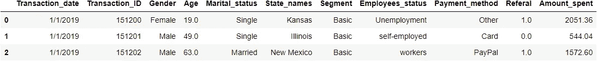

我们可以添加一些公共参数来调整这个函数。如果我们需要跳过数据框中的一些第一行，那么我们可以使用关键字参数`skiprows`。例如，如果我们想跳过第一行，那么我们使用`skiprows=2`。类似地，如果我们不想持续 2 行，那么我们可以简单地使用`skipfooter=2`。如果我们不想加载列标题，那么我们可以使用`header=None`。

```
# Loading csv file with skip first 2 rows without header
df_csv = pd.read_csv('dataset/online_store_customer_data.csv', skiprows=2, header=None)
df_csv.head(3)
```

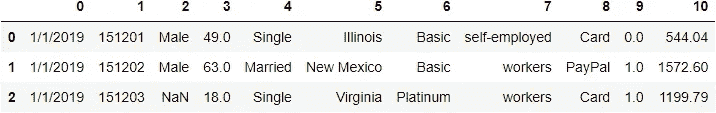

## 从 URL 读取 CSV 文件

对于读取 CSV 文件形式的 URL，可以直接传递链接。

```
# Read csv file from url
url="[https://raw.githubusercontent.com/norochalise/pandas-tutorial-article-2022/main/dataset/online_store_customer_data.csv](https://raw.githubusercontent.com/norochalise/pandas-tutorial-article-2022/main/dataset/online_store_customer_data.csv)"
df_url = pd.read_csv(url)
df_url.head(3) 
```


## 写入 CSV 文件

当您想要将数据帧保存在 CSV 文件中时，您可以简单地使用`to.csv()`功能。您还需要传递文件名，它将保存该文件。

```
# saving df_url dataframe to csv file
df_url.to_csv('dataset/csv_from_url.csv')
df_url.to_csv('dataset/demo_text.txt')
```

## 读取文本文件

读取一个纯文本文件，我们可以使用`read_csv()`这个函数。在这个函数中，你需要传递 `*.txt*`文件名。

```
# read plain text file
df_txt = pd.read_csv("dataset/demo_text.txt")
```

## 读取 Excel 文件

要读取一个 Excel 文件，我们应该使用`read_excel()`pandas 包的功能。如果我们有多个工作表名称，那么我们可以用这个函数传递工作表名称参数。

```
# read excel file
df_excel = pd.read_excel('dataset/excel_file.xlsx', sheet_name='Sheet1')
df_excel
```

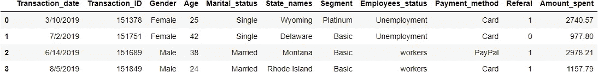

## 编写 Excel 文件

我们可以将数据框保存为与 CSV 文件相同的 excel 文件。可以使用带有文件名和位置的`to_excel()`功能。

```
# save dataframe to the excel file
df_url.to_csv('demo.xlsx')
```

## 3.数据预处理

数据预处理是将原始数据加工成干净数据的过程。这是数据科学最关键的部分。在这一节中，我们将首先浏览数据，然后删除不需要的列，删除重复项，处理丢失的数据等。在这一步之后，我们从原始数据中获得干净的数据。

## 3.1 数据探索

## 从数据框中检索行。

加载数据后，我们做的第一件事是查看我们的数据。为此，我们使用`head()`和`tail()`功能。head 函数将显示第一行，tail 函数将显示最后一行。默认情况下，它显示 5 行。假设我们想显示前 3 行和后 6 行。我们可以这样做。

```
# display first 3 rows
df.head(3)
```


```
# display last 6 rows
df.tail(6)
```

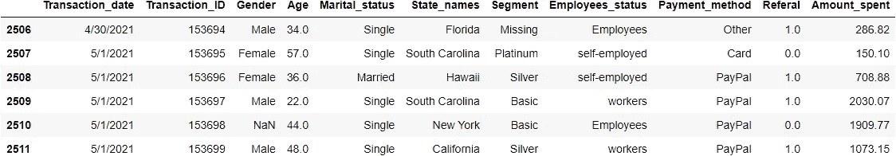

## 从数据框中检索样本行。

如果我们想要显示样本数据，那么我们可以使用`sample()`一个具有期望行数的函数。它将显示所需的随机行数。如果我们想要取 7 个样本，我们需要在`sample(7)`函数中传递 7 个。

```
# Display random 7 sample rows
df.sample(7)
```

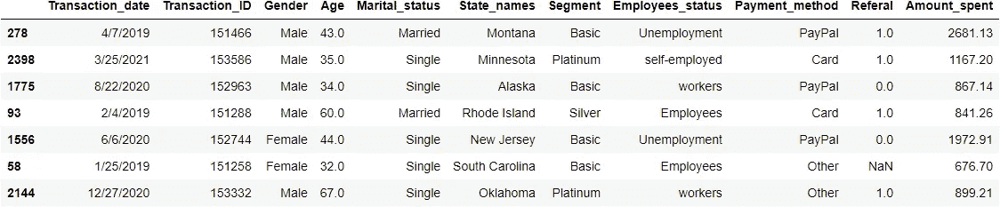

## 检索关于数据框的信息

要显示数据帧信息我们可以使用`info()`的方法。它将显示列数据类型，计算每列的非空值总数及其内存空间。

```
df.info()<class 'pandas.core.frame.DataFrame'>
RangeIndex: 2512 entries, 0 to 2511
Data columns (total 11 columns):
 #   Column            Non-Null Count  Dtype  
---  ------            --------------  -----  
 0   Transaction_date  2512 non-null   object 
 1   Transaction_ID    2512 non-null   int64  
 2   Gender            2484 non-null   object 
 3   Age               2470 non-null   float64
 4   Marital_status    2512 non-null   object 
 5   State_names       2512 non-null   object 
 6   Segment           2512 non-null   object 
 7   Employees_status  2486 non-null   object 
 8   Payment_method    2512 non-null   object 
 9   Referal           2357 non-null   float64
 10  Amount_spent      2270 non-null   float64
dtypes: float64(3), int64(1), object(7)
memory usage: 216.0+ KB
```

显示每一列的数据类型我们可以使用`dtypes`属性。我们可以在 dtypes 中添加`value_counts()`方法来显示所有数据类型的值计数。

```
# display datatypes
df.dtypesTransaction_date     object
Transaction_ID        int64
Gender               object
Age                 float64
Marital_status       object
State_names          object
Segment              object
Employees_status     object
Payment_method       object
Referal             float64
Amount_spent        float64
dtype: objectdf.dtypes.value_counts()object     7
float64    3
int64      1
dtype: int64
```

## 显示行数和列数。

为了显示行数和列数，我们使用了`shape`属性。第一个数字和最后一个数字分别显示行数和列数。

```
df.shape(2512, 11)
```

## 显示列名和数据

为了显示数据框的列名，我们使用了`columns`属性。

```
df.columnsIndex(['Transaction_date', 'Transaction_ID', 'Gender', 'Age', 'Marital_status',
       'State_names', 'Segment', 'Employees_status', 'Payment_method',
       'Referal', 'Amount_spent'],
      dtype='object')
```

如果我们想显示单个或多个列的数据，只需用数据框传递列名。为了显示多列数据信息，我们需要传递列名列表。

```
# display Age columns first 3 rows data
df['Age'].head(3)0    19.0
1    49.0
2    63.0
Name: Age, dtype: float64# display first 4 rows of Age, Transaction_date and Gender columns
df[['Age', 'Transaction_date', 'Gender']].head(4)
```


## 检索一系列行

如果我们想显示特定范围的行，我们可以使用切片。例如，如果我们想得到第 2 到第 6 行，我们可以简单地使用`df[2:7]`。

```
# for display 2nd to 6th rows
df[2:7]

# for display starting to 10th
df[:11]

# for display last two rows
df[-2:]
```

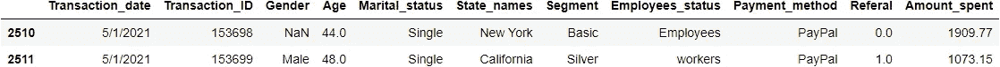

## 3.2 数据清理

探索后，我们的数据集可能需要清理它们，以便更好地分析。数据来自多个来源，因此某些值可能有错误。这就是数据清理变得极其重要的地方。在本节中，我们将删除不需要的列、重命名列、更正适当的数据类型等。

## 删除列名

我们可以使用 drop 函数从数据框中删除不需要的列。别忘了加上`inplace = True`和`axis=1`。它将更改数据框中的值。

```
# Drop unwanted columns
df.drop(['Transaction_ID'], axis=1, inplace=True)
```

## 更改列名

要更改列名，我们可以使用`rename()`函数传递列字典。在字典中，我们将像旧的列名那样传递键，并将值作为新的所需列名。比如现在我们要把`Transaction_date`和`Gender`改成`Date`和`Sex`。

```
# create new df_col dataframe from df.copy() method. 
df_col = df.copy()

# rename columns name
df_col.rename(columns={"Transaction_date": "Date", "Gender": "Sex"}, inplace=True)
df_col.head(3)
```

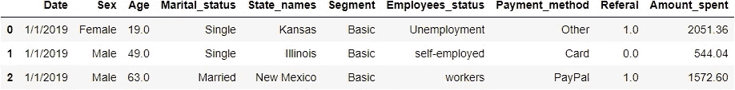

## 向数据框添加新列

您可以向现有的 pandas 数据框中添加一个新列，只需为新列名赋值即可。例如，以下代码在`df_col`数据帧中创建了名为`new_col`的第三列:

```
# Add a new_col column which value will be amount_spent * 100
df_col['new_col'] = df_col['Amount_spent'] * 100df_col.head(3)
```

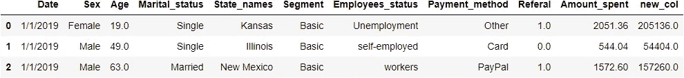

## 字符串值更改或替换

我们可以用旧值替换新值，用`.loc()`这个方法借助条件。比如现在我们在性别一栏里把女的改成女的，男的改成男的。

```
df_col.head(3)
```


```
# changing Female to Woman and Male to Man in Sex column.
#first argument in loc function is condition and second one is columns name. 
df_col.loc[df_col.Sex == "Female", 'Sex'] = 'Woman' 
df_col.loc[df_col.Sex == "Male", 'Sex'] = 'Man'df_col.head(3)
```

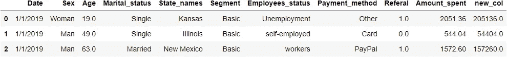

现在性别栏的值由女性改为女性，由男性改为男性。

## 数据类型更改

当我们处理不同类型的数据类型时，有时这是一项乏味的任务。如果我们想处理一个日期，我们必须用确切的日期格式来改变它。否则，我们就有问题了。这项任务对熊猫来说很容易。我们可以使用`astype()`函数将一种数据类型转换成另一种。

```
df_col.info()<class 'pandas.core.frame.DataFrame'>
RangeIndex: 2512 entries, 0 to 2511
Data columns (total 11 columns):
 #   Column            Non-Null Count  Dtype  
---  ------            --------------  -----  
 0   Date              2512 non-null   object 
 1   Sex               2484 non-null   object 
 2   Age               2470 non-null   float64
 3   Marital_status    2512 non-null   object 
 4   State_names       2512 non-null   object 
 5   Segment           2512 non-null   object 
 6   Employees_status  2486 non-null   object 
 7   Payment_method    2512 non-null   object 
 8   Referal           2357 non-null   float64
 9   Amount_spent      2270 non-null   float64
 10  new_col           2270 non-null   float64
dtypes: float64(4), object(7)
memory usage: 216.0+ KB
```

在我们的`Date`列中，它是对象类型，所以现在我们将把它转换成日期类型，我们也将把`Referal`列 float64 转换成 float32。

```
# change object type to datefime64 format
df_col['Date'] = df_col['Date'].astype('datetime64[ns]')

# change float64 to float32 of Referal columns
df_col['Referal'] = df_col['Referal'].astype('float32')df_col.info()<class 'pandas.core.frame.DataFrame'>
RangeIndex: 2512 entries, 0 to 2511
Data columns (total 11 columns):
 #   Column            Non-Null Count  Dtype         
---  ------            --------------  -----         
 0   Date              2512 non-null   datetime64[ns]
 1   Sex               2484 non-null   object        
 2   Age               2470 non-null   float64       
 3   Marital_status    2512 non-null   object        
 4   State_names       2512 non-null   object        
 5   Segment           2512 non-null   object        
 6   Employees_status  2486 non-null   object        
 7   Payment_method    2512 non-null   object        
 8   Referal           2357 non-null   float32       
 9   Amount_spent      2270 non-null   float64       
 10  new_col           2270 non-null   float64       
dtypes: datetime64[ns](1), float32(1), float64(3), object(6)
memory usage: 206.2+ KB
```

## 3.3 删除重复

在数据预处理部分，我们需要删除重复的条目。由于各种原因，有时我们的数据帧有多个重复条目。在熊猫功能的帮助下，可以很容易地删除重复条目。首先，我们使用`duplicated()`函数来识别重复条目，然后使用`drop_duplicates()`来删除它们。

```
# Display duplicated entries 
df.duplicated().sum()12# duplicate rows dispaly, keep arguments will--- 'first', 'last' and False
duplicate_value = df.duplicated(keep='first')

df.loc[duplicate_value, :]
```

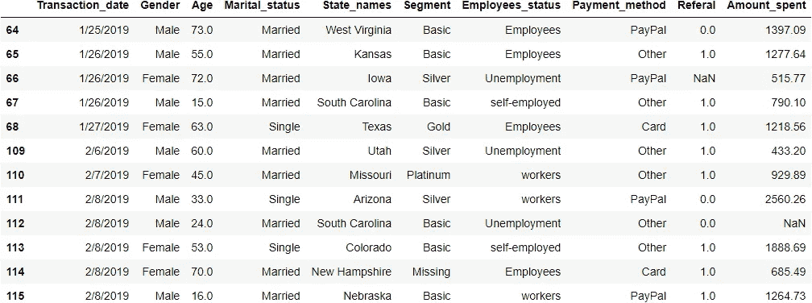

```
# dropping ALL duplicate values
df.drop_duplicates(keep = 'first', inplace = True)
```

## 3.4 处理缺失值

在数据预处理部分处理常见任务中的缺失值。出于多种原因，大多数时候我们会遇到缺失值。不解决这个问题，我们就无法进行正确的模型构建。对于这一部分，我们将首先找出丢失的值，然后决定如何处理它们。我们可以通过删除受影响的列或行或者替换那里的适当值来处理这个问题。

## 显示缺失值信息

为了显示缺失值，我们可以使用`isna()`功能。我们使用`.sum()`和`sort_values(ascending=False)`函数按升序计算每一列中缺失值的总数。

```
df.isna().sum().sort_values(ascending=False)Amount_spent        241
Referal             154
Age                  42
Gender               28
Employees_status     26
Transaction_date      0
Marital_status        0
State_names           0
Segment               0
Payment_method        0
dtype: int64
```

## 删除 Nan 行

如果我们有更小的 Nan 值，那么我们可以通过`dropna()`函数删除整行。对于这个函数，我们将在子集参数中添加列名。

```
# df copy to df_copy
df_new = df.copy()#Delete Nan rows of Job Columns
df_new.dropna(subset = ["Employees_status"], inplace=True)
```

## 删除整列

如果我们在特定的列中有大量的 Nan 值，那么删除这些列可能是一个好的决定，而不是进行估算。

```
df_new.drop(columns=['Amount_spent'], inplace=True)df_new.isna().sum().sort_values(ascending=False)Referal             153
Age                  42
Gender               27
Transaction_date      0
Marital_status        0
State_names           0
Segment               0
Employees_status      0
Payment_method        0
dtype: int64
```

## 估算缺失值

有时，如果我们删除整列，那将不是适当的方法。删除列会影响我们的模型构建，因为我们会失去我们的主要特征。对于估算，我们有许多方法，所以这里有一些最流行的技术。

**方法 1** —输入固定值，如 0、‘未知’或‘缺失’等。我们在性别栏中填入未知

```
df['Gender'].fillna('Unknown', inplace=True)
```

**方法 2** —估算平均值、中值和众数

```
# Impute Mean in Amount_spent columns
mean_amount_spent = df['Amount_spent'].mean()
df['Amount_spent'].fillna(mean_amount_spent, inplace=True)

#Impute Median in Age column
median_age = df['Age'].median()
df['Age'].fillna(median_age, inplace=True)

# Impute Mode in Employees_status column
mode_emp = df['Employees_status'].mode().iloc[0]
df['Employees_status'].fillna(mode_emp, inplace=True)
```

**方法三**——通过`ffill`和`bfill`输入正向填充或回填。在`ffill`中，缺失值从上一行的值估算，对于`bfill`则从下一行的值获取。

```
df['Referal'].fillna(method='ffill', inplace=True)df.isna().sum().sum()0
```

现在我们用不同的方法处理所有的缺失值。所以现在我们没有任何空值。

## 4.内存管理

当我们处理大型数据集时，我们会遇到一个大问题，那就是内存问题。我们需要太多的资源来处理这件事。但是熊猫有一些方法来处理这个问题。这里有一些方法或策略来帮助熊猫解决这个问题。

## 更改数据类型

从改变一种数据类型到另一种数据类型，我们可以节省大量的内存。一个流行的技巧是改变对象的类别，这将大大减少我们的数据帧内存。

首先，我们将把之前的`df` 数据帧复制到`df_memory` ，并使用`memory_usage(deep=True)`方法计算该数据帧的总内存使用量。

```
df_memory = df.copy()memory_usage = df_memory.memory_usage(deep=True)
memory_usage_in_mbs = round(np.sum(memory_usage / 1024 ** 2), 3)
print(f" Total memory taking df_memory dataframe is : {memory_usage_in_mbs:.2f} MB ")Total memory taking df_memory dataframe is : 1.15 MB
```

## 将对象更改为类别数据类型

我们的数据框很小。也就是 1.15 MB。现在我们将把我们的对象数据类型转换成类别。

```
# Object datatype to category convert
df_memory[df_memory.select_dtypes(['object']).columns] = df_memory.select_dtypes(['object']).apply(lambda x: x.astype('category'))# convert object to category
df_memory.info(memory_usage="deep")<class 'pandas.core.frame.DataFrame'>
Int64Index: 2500 entries, 0 to 2511
Data columns (total 10 columns):
 #   Column            Non-Null Count  Dtype   
---  ------            --------------  -----   
 0   Transaction_date  2500 non-null   category
 1   Gender            2500 non-null   category
 2   Age               2500 non-null   float64 
 3   Marital_status    2500 non-null   category
 4   State_names       2500 non-null   category
 5   Segment           2500 non-null   category
 6   Employees_status  2500 non-null   category
 7   Payment_method    2500 non-null   category
 8   Referal           2500 non-null   float64 
 9   Amount_spent      2500 non-null   float64 
dtypes: category(7), float64(3)
memory usage: 189.1 KB
```

现在它减少了 1.15 兆字节到 216.6 KB。差不多减少了 5.5 倍。

## 将 int64 或 float64 更改为 int 32、16 或 8

默认情况下，pandas 将数值存储到 int64 或 float64。这需要更多的内存。如果我们必须存储小数字，那么我们可以将 64 改为 32、16 等等。例如，我们的`Referral` 列只有 0 和 1 值，因此我们不需要存储在 float64。所以现在我们把它改成 float16。

```
# Change Referal column datatypes
df_memory['Referal'] = df_memory['Referal'].astype('float32')# convert object to category
df_memory.info(memory_usage="deep")<class 'pandas.core.frame.DataFrame'>
Int64Index: 2500 entries, 0 to 2511
Data columns (total 10 columns):
 #   Column            Non-Null Count  Dtype   
---  ------            --------------  -----   
 0   Transaction_date  2500 non-null   category
 1   Gender            2500 non-null   category
 2   Age               2500 non-null   float64 
 3   Marital_status    2500 non-null   category
 4   State_names       2500 non-null   category
 5   Segment           2500 non-null   category
 6   Employees_status  2500 non-null   category
 7   Payment_method    2500 non-null   category
 8   Referal           2500 non-null   float32 
 9   Amount_spent      2500 non-null   float64 
dtypes: category(7), float32(1), float64(2)
memory usage: 179.3 KB
```

仅更改一列的数据类型后，我们将 216 KB 减少到 179 KB。

> **注意:在改变数据类型之前，请确定它的后果。**

## 5.数据分析

## 5.1.计算基本统计测量

在数据分析部分，我们需要计算一些统计测量值。为了计算这个，熊猫有多种有用的功能。第一个有用的功能是`describe()`，它将显示大多数基本的统计测量值。对于此功能，您可以添加`.T`来转换显示。当有多个列时，这将使查看变得容易。

```
df.describe().T
```

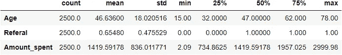

上述函数只显示数字列信息。`count`显示有多少个值。`mean`显示每列的平均值。`std`显示列的标准偏差，它测量一组值的变化量或离差。`min`是各列的最小值。`25%`、`50%`和`75%`示出了分组中总值，最后`max`示出了各列的最大值。

我们已经知道上面的代码将只显示数字列的基本统计信息。对于对象或类别列，我们可以使用`describe(include=object)`。

```
df.describe(include=object).T
```

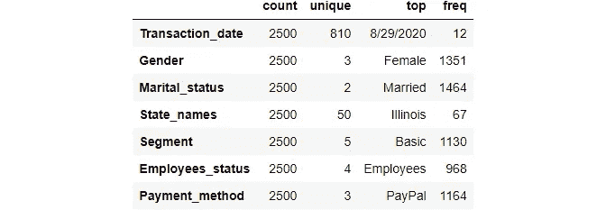

以上信息，`count`显示有多少个值。`unique`表示该列中有多少个值是唯一的。`top`是该类别中最大数量的值。`freq`显示有多少值经常位于顶部值上。

我们可以计算各个列的平均值、中值、众数、最大值、最小值，我们只需使用这些函数。

```
# Calculate Mean
mean = df['Age'].mean()

# Calculate Median
median = df['Age'].median()

#Calculate Mode
mode = df['Age'].mode().iloc[0]

# Calculate standard deviation
std = df['Age'].std()

# Calculate Minimum values
minimum = df['Age'].min()

# Calculate Maximum values
maximum = df.Age.max()

print(f" Mean of Age : {mean}")
print(f" Median of Age : {median}")
print(f" Mode of Age : {mode}")
print(f" Standard deviation of Age : {std:.2f}")
print(f" Maximum of Age : {maximum}")
print(f" Menimum of Age : {minimum}")Mean of Age : 46.636
 Median of Age : 47.0
 Mode of Age : 47.0
 Standard deviation of Age : 18.02
 Maximum of Age : 78.0
 Menimum of Age : 15.0
```

在 pandas 中，我们可以显示不同数字列的相关性。为此，我们可以使用`.corr()`功能。

```
# calculate correlation
df.corr()
```


## 5.2 用于数据分析的基本内置函数

在熊猫，有这么多有用的基本功能可用于数据分析。在本节中，我们将探索一些最常用的函数。

## 类别列中唯一值的数量

为了显示所有唯一值的总和，我们使用`nunique()`所需列名的函数。例如，在 State_names 列中显示总的唯一值，我们使用此函数:

```
# for display how many unique values are there in State_names column
df['State_names'].nunique()50
```

## 显示所有唯一值

为了显示所有唯一值，我们使用带有所需列名的`unique()`函数。

```
# for display uniqe values of State_names column
df['State_names'].unique()array(['Kansas', 'Illinois', 'New Mexico', 'Virginia', 'Connecticut',
       'Hawaii', 'Florida', 'Vermont', 'California', 'Colorado', 'Iowa',
       'South Carolina', 'New York', 'Maine', 'Maryland', 'Missouri',
       'North Dakota', 'Ohio', 'Nebraska', 'Montana', 'Indiana',
       'Wisconsin', 'Alabama', 'Arkansas', 'Pennsylvania',
       'New Hampshire', 'Washington', 'Texas', 'Kentucky',
       'Massachusetts', 'Wyoming', 'Louisiana', 'North Carolina',
       'Rhode Island', 'West Virginia', 'Tennessee', 'Oregon', 'Alaska',
       'Oklahoma', 'Nevada', 'New Jersey', 'Michigan', 'Utah', 'Arizona',
       'South Dakota', 'Georgia', 'Idaho', 'Mississippi', 'Minnesota',
       'Delaware'], dtype=object)
```

## 唯一值的计数

为了显示唯一值计数，我们使用`value_counts()`方法。此函数将显示唯一的值，每个值出现一个数字。例如，如果我们想知道`Gender` 列中有多少个值频率为的唯一值，那么我们使用下面的方法。

```
df['Gender'].value_counts()Female     1351
Male       1121
Unknown      28
Name: Gender, dtype: int64
```

如果我们想用出现的百分比而不是数字来显示，我们可以在`value_counts()`函数中使用`normalize=True`参数

```
# Calculate percentage of each category
df['Gender'].value_counts(normalize=True)Female     0.5404
Male       0.4484
Unknown    0.0112
Name: Gender, dtype: float64df['State_names'].value_counts().sort_values(ascending = False).head(20)Illinois         67
Georgia          64
Massachusetts    63
Maine            62
Kentucky         59
Minnesota        59
Delaware         56
Missouri         56
New York         55
New Mexico       55
Arkansas         55
California       55
Arizona          55
Nevada           55
Vermont          54
New Jersey       53
Oregon           53
Florida          53
West Virginia    53
Washington       52
Name: State_names, dtype: int64
```

## 排序值

如果我们想按特定的列对数据帧进行排序，我们需要使用`sort_values()`方法。我们可以使用升序或降序排序。默认情况下，它按升序排列。如果我们想使用降序，那么我们只需要在函数的`sort_values()`中传递`ascending=False`参数。

```
# Sort Values by State_names
df.sort_values(by=['State_names']).head(3)
```


按照`Amount_spent` 升序排列我们的数据帧:

```
# Sort Values Amount_spent with ascending order
df.sort_values(by=['Amount_spent']).head(3)
```

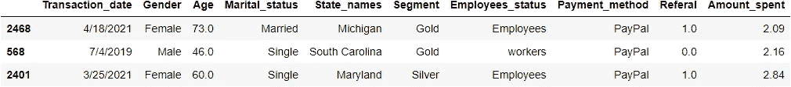

按照`Amount_spent` 降序排列我们的数据帧:

```
# Sort Values Amount_spent with descending order
df.sort_values(by=['Amount_spent'], ascending=False).head(3)
```

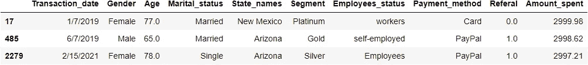

或者，我们可以使用`nlargest()`和`nsmallest()`功能显示所需数字的最大值和最小值。例如，如果我们想要显示 4 个最大的`Amount_spent` 行，那么我们使用这个:

```
# nlargest
df.nlargest(4, 'Amount_spent').head(10) # first argument is how many rows you want to disply and second one is columns name
```

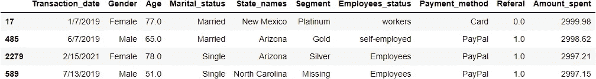

对于 3 个最小的`Amount_spent` 行

```
# nsmallest
df.nsmallest(3, 'Age').head(10)
```

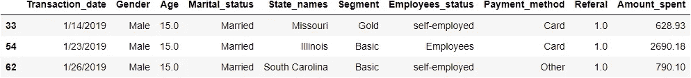

## 对数据的条件查询

如果我们想要应用单个条件，那么首先我们将给出一个条件，然后我们传递数据帧。例如，如果我们想要显示所有行，其中`Payment_method` 是 PayPal，那么我们使用这个:

```
# filtering - Only show Paypal users
condition = df['Payment_method'] == 'PayPal'
df[condition].head(4)
```

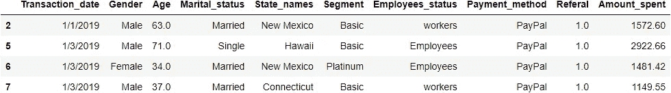

我们可以像以前一样应用多个条件查询。例如，如果我们想显示所有居住在纽约的已婚女性，那么我们使用以下代码:

```
# first create 3 condition
female_person = df['Gender'] == 'Female'
married_person = df['Marital_status'] == 'Married'
loc_newyork = df['State_names'] == 'New York'

# we passing condition on our dataframe
df[female_person & married_person & loc_newyork].head(4)
```

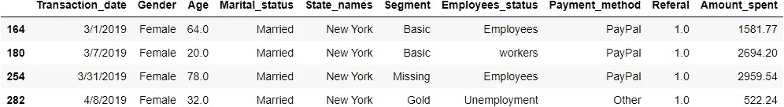

## 5.3 汇总或分组数据

## 分组依据

在 Pandas 中，按功能分组在数据分析部分更受欢迎。它允许分割和分组数据，应用一个函数，并结合结果。我们可以通过下面的例子来理解这个功能和用法:

**按一列分组:**例如，如果我们想通过`Gender`找到`Age`和`Amount_spent`的`maximum`值，那么我们可以使用这个:

```
df[['Age', 'Amount_spent']].groupby(df['Gender']).max()
```


通过`Gender`找到`Age`和`Amount_spent`的`mean`、`count`和`max`值，然后我们可以使用`agg()`函数和`groupby()`。

```
# Group by one columns
state_gender_res = df[['Age','Gender','Amount_spent']].groupby(['Gender']).agg(['count', 'mean', 'max'])
state_gender_res
```

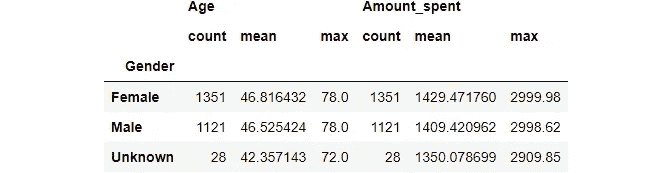

**多列分组:**通过`State_names`、`Gender`、`Payment_method` 找到`Amount_spent`的总计数、最大值和最小值，然后我们可以在`groupby()`函数下传递这些列名，并添加带有`count`、`mean`、`max`参数的`.agg()`。

```
#Group By multiple columns
state_gender_res = df[['State_names','Gender','Payment_method','Amount_spent']].groupby([ 'State_names','Gender', 'Payment_method']).agg(['count', 'min', 'max'])
state_gender_res.head(12)
```

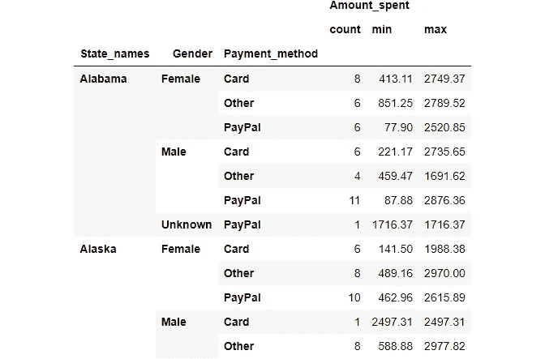

## 交叉制表(交叉标签)

交叉制表(也称为 cross tab)是一种定量分析多个变量之间关系的方法。也称为列联表。这将有助于理解不同变量之间的相关性。为了创建这个表，pandas 有一个内置函数`crosstab()`。

为了在`Maritatal_status`和`Payment_method`列之间创建一个简单的交叉标签，我们只需使用带有两个列名的`crosstab()`。

```
pd.crosstab(df.Marital_status, df.Payment_method)
```


我们可以通过`margins`参数包括小计:

```
pd.crosstab(df.Marital_status, df.Payment_method, margins=True, margins_name="Total")
```


如果我们想要一个显示百分比的比`normalize=True`参数帮助

```
pd.crosstab(df.Marital_status, df.Payment_method, normalize=True, margins=True, margins_name="Total")
```


在这些跨选项卡特性中，我们可以传递多个列名来分组和分析数据。例如，如果我们想知道`Marital_status`如何分配`Payment_method`和`Employees_status`，那么我们将在`crosstab()`函数中传递这些列的名称，如下所示。

```
pd.crosstab(df.Marital_status, [df.Payment_method, df.Employees_status])
```

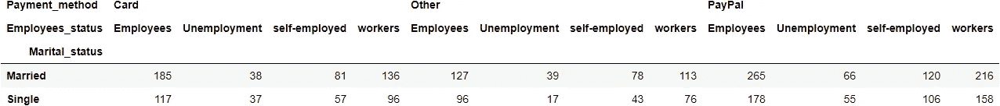

## 6.数据可视化

可视化是数据分析的关键。最流行的可视化 python 包是 matplotlib 和 seaborn，但有时熊猫对你来说会很方便。熊猫也很容易提供一些可视化的情节。对于基础分析部分，会比较好用。在这一节中，我们将探索一些不同类型的使用熊猫的情节。以下是情节。

## 6.1 线形图

线形图是所有图形图中最简单的。线形图用于跟踪连续时间内的变化，并将信息显示为一系列。折线图是比较多个变量和可视化单个和多个变量趋势的理想工具。

为了在 pandas 中创建一个线图，我们使用`.plot()`两列的名称作为参数。例如，我们从一个虚拟数据集创建一个线图。

```
dict_line = {
    'year': [2016, 2017, 2018, 2019, 2020, 2021],
    'price': [200, 250, 260, 220, 280, 300]
}
df_line = pd.DataFrame(dict_line)# use plot() method on the dataframe
df_line.plot('year', 'price');
```

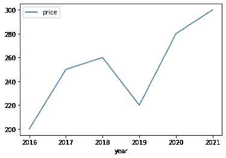

上面的折线图显示了不同时间的价格。它显示了价格趋势。

## 6.2 条形图

条形图也称为条形图，显示不同类别项目的定量或定性值。在条形图中，图数据以条形图的形式表示。条形的长度或高度用于表示每个项目的定量值。条形图可以水平或垂直绘制。为了创造这些情节，请看下面。

**对于单杠:**

```
df['Employees_status'].value_counts().plot(kind='bar');
```

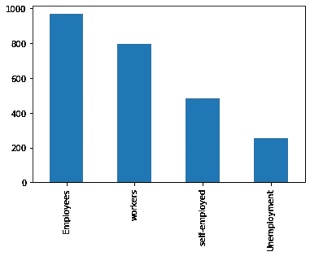

**对于竖条:**

```
df['Employees_status'].value_counts().plot(kind='barh');
```

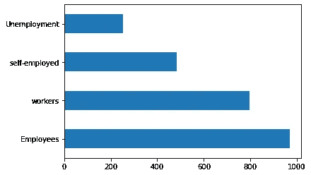

## 6.3 饼图

饼图也称为饼图。饼图是一个圆形图形，表示总值及其组成部分。圆的面积代表总值，圆的不同部分代表不同的部分。在该图中，数据以百分比表示。每个组成部分都表示为总值的百分比。

以熊猫为创作派的情节。我们在数据框列或系列中使用`plot()`函数中的`kind=pie`。

```
df['Segment'].value_counts().plot(
    kind='pie');
```

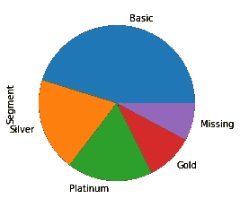

## 6.4 箱线图

箱形图也称为箱须图。此图用于显示变量基于其四分位数的分布。箱形图显示一组数据的五个数字的汇总。五位数汇总是最小值、第一个四分位数、中值、第三个四分位数和最大值。识别异常值也将很受欢迎。

我们可以用一列或多列来绘制。对于多列，我们需要在`y`变量中传递列名作为列表。

```
df.plot(y=['Amount_spent'], kind='box');
```

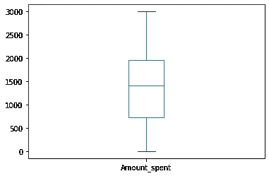

在箱线图中，我们可以绘制出分类变量相对于数值变量的分布，并对它们进行比较。让我们用`Employees_status` 和`Amount_spent`列画熊猫`boxplot()`的方法:

```
import matplotlib.pyplot as plt

np.warnings.filterwarnings('ignore', category=np.VisibleDeprecationWarning) 
fig, ax = plt.subplots(figsize=(6,6)) 

df.boxplot(by ='Employees_status', column =['Amount_spent'],ax=ax, grid = False);
```

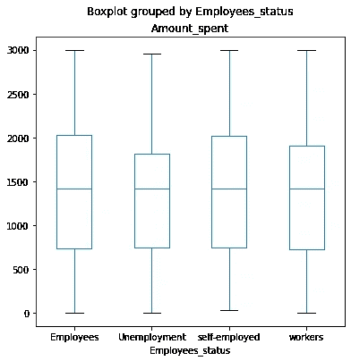

## 6.5 直方图

直方图显示了数据项分组值之间定量测量的频率和分布。它通常用于统计，以显示在特定范围或时段内某一类型的变量出现的数量。下面我们将绘制一个直方图来观察年龄分布。

```
df.plot(
    y='Age',
    kind='hist',
    bins=10
);
```

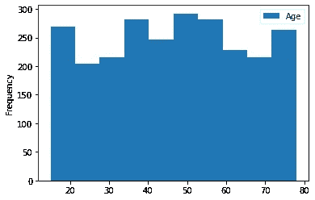

## 6.6 KDE 情节

核密度估计(KDE)图是一种可视化数据集中观察值分布的方法，类似于直方图。KDE 使用一维或多维的连续概率密度曲线来表示数据。

```
df.plot(
    y='Age',
    xlim=(0, 100),
    kind='kde'
);
```

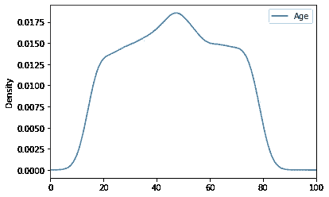

## 6.7 散点图

散点图用于观察和显示不同类别项目的两个定量变量之间的关系。数据集的每个成员都被绘制成一个点，其 x-y 坐标与其两个变量的值相关。下面我们将绘制一个散点图来显示`Age`和`Amount_spent`列之间的关系。

```
df.plot(
    x='Age',
    y='Amount_spent',
    kind='scatter'
);
```

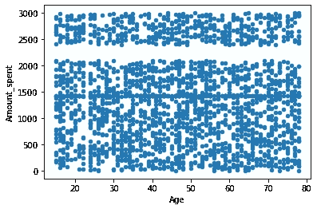

## 7.最后的想法

在本文中，我们知道如何使用 pandas 来读取、预处理、分析和可视化数据。它还可以用于内存管理，以更少的资源实现快速计算。这篇文章的主要动机是帮助那些好奇的人们了解熊猫以进行数据分析。

如果您对本文有任何疑问或帮助，请随时通过 LinkedIn 联系我。如果你觉得这篇文章有帮助，那么请跟我来进一步学习。欢迎您的建议和反馈。感谢您阅读我的文章。有精彩的学习。

*随时查看本教程的* [*GitHub*](https://github.com/norochalise/pandas-tutorial-article-2022) *回购。*

## 8.参考

1.  [熊猫用户指南](https://pandas.pydata.org/docs/user_guide/index.html)
2.  [熊猫 1.x 食谱](https://www.packtpub.com/product/pandas-1-x-cookbook-second-edition/9781839213106)
3.  [数据争论研讨会](https://www.packtpub.com/product/the-data-wrangling-workshop-second-edition/9781839215001)
4.  [用于数据分析的 Python](https://www.oreilly.com/library/view/python-for-data/9781449323592/)
5.  [用 Python 进行数据分析:从零到熊猫——Jovian YouTube 频道](https://www.youtube.com/watch?v=BaV4PRXYNIY&list=PLyMom0n-MBrpzC91Uo560S4VbsiLYtCwo)
6.  [熊猫最佳实践——数据学校 YouTube 频道](https://www.youtube.com/watch?v=hl-TGI4550M&list=PL5-da3qGB5IBITZj_dYSFqnd_15JgqwA6)
7.  [熊猫教程——科里·斯查费 YouTube 频道](https://www.youtube.com/watch?v=ZyhVh-qRZPA&list=PL-osiE80TeTsWmV9i9c58mdDCSskIFdDS)
8.  [熊猫交叉表讲解](https://pbpython.com/pandas-crosstab.html)

***跟我上*** [***中***](https://norochalise.medium.com/)*[***推特***](https://twitter.com/norochalise)***&***[***领英***](https://www.linkedin.com/in/norochalise/)*