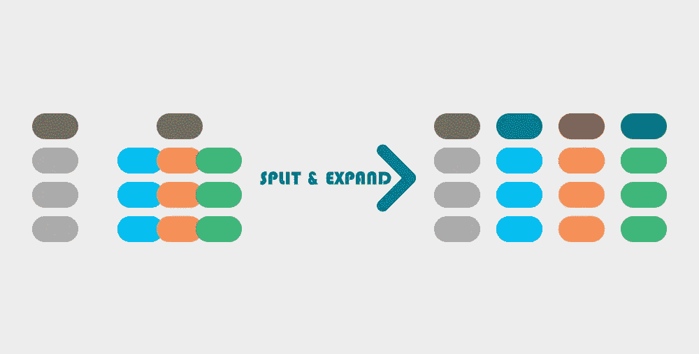

# 熊猫数据框架基础

> 原文：<https://pub.towardsai.net/pandas-dataframes-basics-c7d5a41fa018?source=collection_archive---------2----------------------->

## [数据科学](https://towardsai.net/p/category/data-science)

## 重塑数据


在这一系列的文章中，我们将向你展示 Pandas Dataframes 的基础知识，它是有史以来最有用的数据科学 python 库之一。本系列的第一篇文章是关于重塑数据的。

# pd.pivot:将列分散成行


## 示例:

```
df = pd.DataFrame(
{"A" : ['a' ,'a', 'a', 'b', 'b' ,'b'],
"B" : ['A' ,'B', 'C', 'A', 'B' ,'C'],
"C" : [4, 5, 6 , 7 ,8 ,9]})

df A  B  C
0  a  A  4
1  a  B  5
2  a  C  6
3  b  A  7
4  b  B  8
5  b  C  9
```

`df.pivot(columns='B',values='C',index='A')`

```
B  A  B  C
A         
a  4  5  6
b  7  8  9
```

# pd.melt:将列聚集成行


## 示例:

```
df=pd.DataFrame({'A': [4, 7], 'B': [5, 8], 'C': [6, 9]})df A  B  C
0  4  5  6
1  7  8  9df.melt() variable  value
0        A      4
1        A      7
2        B      5
3        B      8
4        C      6
5        C      9
```

# 合并数据帧


## 示例:

```
df1 **=** pd.DataFrame({"A" : [1 ,2, 3],"B" : [4, 5, 6],"C" : [7, 8, 9]})df2 **=** pd.DataFrame({"A" : [10 ,11],"B" : [12, 13],"C" : [14, 15]})print(df1print(df2) A  B  C
0  1  4  7
1  2  5  8
2  3  6  9 A   B   C
0  10  12  14
1  11  13  15
```

`pd.concat([df1,df2])`

```
 A   B   C
0   1   4   7
1   2   5   8
2   3   6   9
0  10  12  14
1  11  13  15
```

# pd.explode:将类似列表的每个元素转换为一行


## 示例:

```
df**=**pd.DataFrame({'A':[[1,2,3],[4,5,6]]}) A
0  [1, 2, 3]
1  [4, 5, 6]df.explode('A') A
0  1
0  2
0  3
1  4
1  5
1  6
```

# 堆叠:堆叠要索引的列


## 示例:

```
df **=** pd.DataFrame([[0, 1], [2, 3]],index**=**['A', 'B'],columns**=**['COL1', 'COL2'])df COL1  COL2
A     0     1
B     2     3df.stack()A  COL1    0
   COL2    1
B  COL1    2
   COL2    3
```

# 拆分:从索引中拆分列


## 示例:

```
index **=** pd.MultiIndex.from_tuples([('A', 'col1'), ('A', 'col2'),('B', 'col1'), ('B', 'col2')])df **=** pd.Series(np.arange(1.0, 5.0), index**=**index)dfA  col1    1.0
   col2    2.0
B  col1    3.0
   col2    4.0df.unstack() col1  col2
A   1.0   2.0
B   3.0   4.0
```

# pd.split(expand=True):将拆分的字符串展开到单独的列中



## 示例:

```
df **=** pd.DataFrame({"A" : ['A B C' ,'D E F', 'G H I']}) A
0  A B C
1  D E F
2  G H Iprint(df['A'].str.split(' ',expand**=**True)) 0  1  2
0  A  B  C
1  D  E  F
2  G  H  I
```

*最初发表于*[*https://predictivehacks.com。*](https://predictivehacks.com/pandas-dataframes-basics-reshaping-data/)