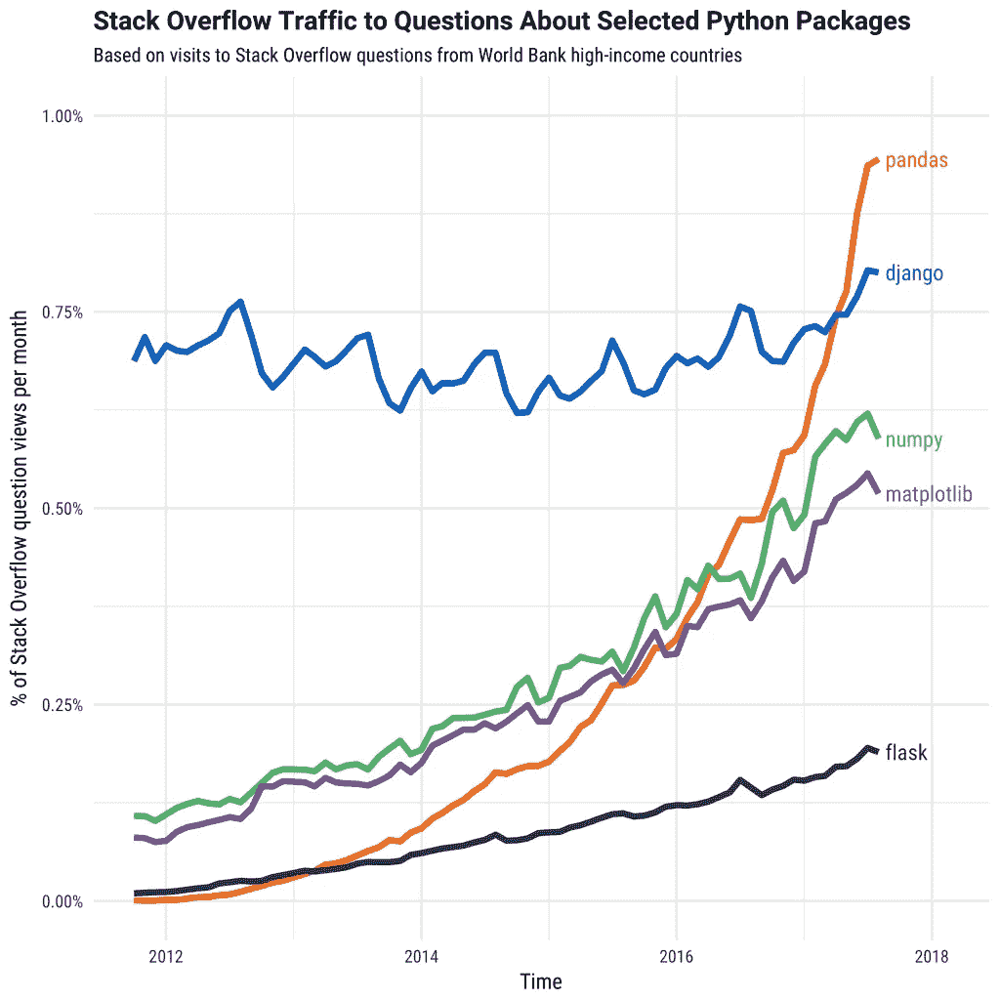
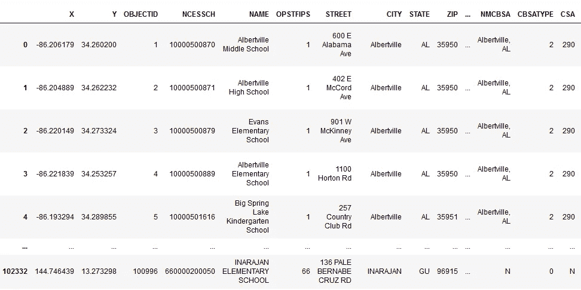
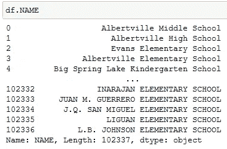
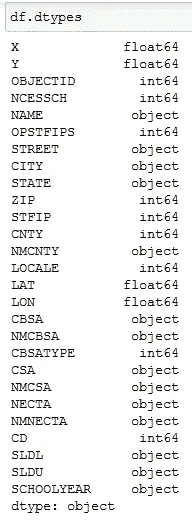
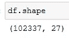
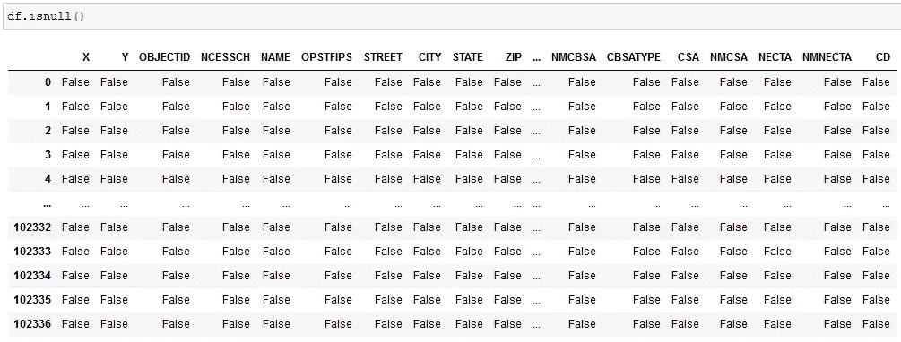
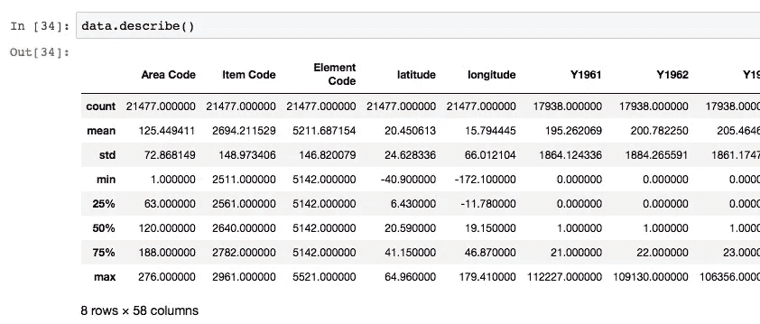
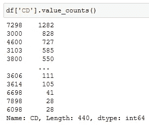
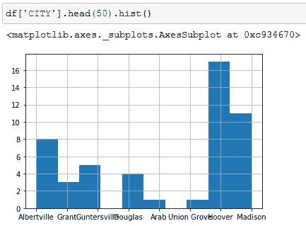

# 数据科学和人工智能的熊猫

> 原文：<https://pub.towardsai.net/pandas-for-data-science-and-ai-4e9038ae6ebc?source=collection_archive---------2----------------------->

卢卡斯·布拉塞克在 [Unsplash](https://unsplash.com?utm_source=medium&utm_medium=referral) 上的照片

## 迈向数据科学和人工智能的一步

本文基于 Python Pandas，为我的数据科学和 AI 爱好者同胞做数据准备。

数据准备是你获得任何类型的数据集后的第一步。这是将原始数据预处理成可以快速准确分析的形式的步骤。准确的数据准备带来高效的分析。它可以消除错误，处理数据收集过程中可能出现的缺失数据，并提高数据质量。因此，数据科学家的大量时间花费在数据准备和特征工程上。

来到熊猫，

# 为什么是熊猫？

熊猫的能力如此之强，以至于列出它不能做的事情而不是它能做的事情可能是有意义的。它建立在 Python 的 Numpy 库之上。

通过 pandas，人们可以非常容易地清理、转换和分析数据。

我将通过 Pandas 中的一些基本函数、方法和术语来处理数据。

让我们举个例子来了解熊猫的力量。

您的计算机上存储了 CSV(逗号分隔值)格式的数据集。Pandas 会将 CSV 文件中的数据提取到 DataFrame(表结构)中。它可以从文件中提取。xlsx 和。html 扩展也是。

下面提到的是你可以用熊猫做的一些事情:

*   做统计，求平均值、中值、最大值、最小值等。每列的。
*   查找列之间的相互关系
*   分布在列中的数据看起来如何？
*   通过删除或替换丢失的值以及根据某些条件和标准过滤行或列来清理数据。
*   此外，使用 python 中的许多库(如 Seaborn、MatplotLib 等)将这些清理后的数据可视化。数据被输入到机器学习模型中。
*   最后，我们可以将数据转换回 CSV 或其他文件格式或数据库。

# 熊猫的特征

1.  **探索性数据分析:** Pandas 提供了大量不同的函数和方法来对数据集进行各种操作。
2.  **处理缺失数据:**收集的数据可能不完整，可能包含缺失的数据值。熊猫处理得很有效率。
3.  **文件格式支持:**熊猫支持多种格式的文件，如 CSV、Excel、HTML，用于输入和输出。
4.  **数据清洗:**数据可以包含不必要的、模糊的值。熊猫可以帮助清理这些乱七八糟的东西，并为分析准备好数据。
5.  **数据可视化:**您的数据分析结果可以使用 Pandas 可视化。
6.  **其他支持:**熊猫可以和 NumPy、SciPy、Seaborn、MatPlotLib 等 Python 库携手工作。

让我们逐一探索每个特性。

*   **注:“df”代表数据帧对象，“srs”代表系列对象***

# 了解熊猫的基本知识

与熊猫一起工作围绕着数据框架和系列发展。

## 数据帧

数据框是包含索引、列和值的二维结构。它被形象化为一个表格。下图是一个数据框。索引是最左边的一列。列是第一行，值是每列的数据。

## 系列

Series 是一维结构，包含列的索引和值。它没有数据框漂亮，但在分析过程中被广泛使用。左列是索引，右列包含列“NAME”的值。请注意，底部给出了一些关于该列的信息。

# 导入和导出数据集

## pandas.read_csv("文件位置")

该方法用于从 CSV 文件中读取数据。

还有许多其他的功能可以接收各种文件格式的输入，你可以从熊猫官方文档网站上获得。

您可以使用方法 **df.to_csv("文件位置")导出数据框。**

# 一些基本方法

## 测向头(n)

获取数据帧的前 n 行。默认情况下，n=5。

## df.tail

以获取数据帧的最后 n 行。默认情况下，n=5。

## df.dtypes

获取列的数据类型

## df.shape

获取数据框的尺寸。

## 还有更多…

可以查看熊猫官方页面了解更多。

# 数据清理和处理缺失值

## df.isnull()

返回一个带有布尔值的数据框，如果相应的值为空，则返回真，否则返回假

## df.fillna(值)

用作为参数传入的“value”来填充缺少的值。

## df.dropna()

删除所有丢失的值。

# 探索性数据分析

谈到熊猫的数据争论，首先想到的方法是 Describe 方法。

## df.describe()

**描述**()方法用于获取一些基本的统计细节，如均值、标准差、计数、最小值、最大值等。数据帧/数值序列。

## srs.value_counts()

**value_counts** ()是另一个非常有用的方法，用于获得包含所有列的唯一值的计数的序列。结果系列将按降序排序。当它与其他方法链接时，它变得非常有用。

# 形象化

## srs.hist()

绘制系列的直方图。

您可以绘制任何类型的图形，如条形图、折线图、散点图、箱线图等。用熊猫。

这就是熊猫的一些基本功能。

我们可以看到该库对于数据分析是多么强大和通用。

你可以在这里获得熊猫功能的详细列表:[https://pandas.pydata.org/pandas-docs/stable/](https://pandas.pydata.org/pandas-docs/stable/)

从这篇文章中，我对熊猫的力量做了一个展望，并对熊猫的一些基本方法做了一个简短的描述。如果你想让我详细解释一些关于熊猫的话题，请在评论区告诉我。我也会就特定的话题发表更多的文章！

[1]stack overflow 上的熊猫流量图片:[https://149351115 . v2 . pressable cdn . com/WP-content/uploads/2017/09/related _ tags _ over _ time-1-1024 x 1024 . png](https://149351115.v2.pressablecdn.com/wp-content/uploads/2017/09/related_tags_over_time-1-1024x1024.png)