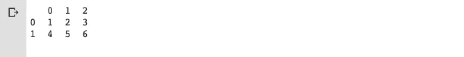
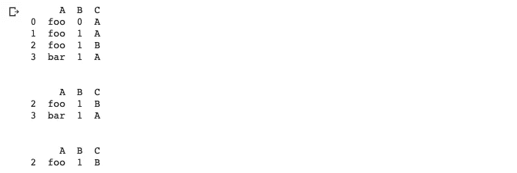
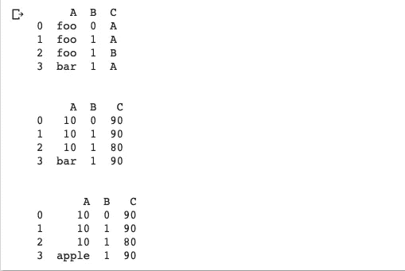
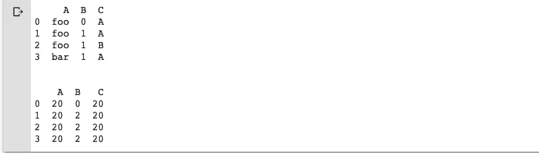
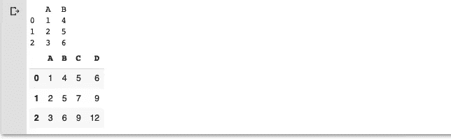
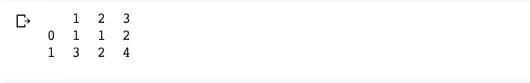
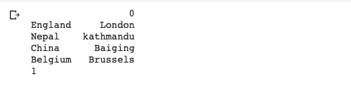

# 数据科学项目中十大最常用的熊猫功能

> 原文：<https://pub.towardsai.net/pandas-for-data-scientist-a2d8a8e81d04?source=collection_archive---------1----------------------->

## [数据科学](https://towardsai.net/p/category/data-science)，[编程](https://towardsai.net/p/category/programming)


图片来源:Octávio Deluchi

网上和书上有很多关于熊猫的教程。熊猫图书馆是数据科学家和数据工程师使用最多的图书馆之一。在本教程中，我将列出我最常用的熊猫功能。

虽然有许多功能可供选择，但这里是我最常用的十个功能。请在评论区让我知道你的。我很乐意将它们加入我的收藏。我将把重点放在熊猫数据框架而不是系列。

让我们从进口熊猫开始。

```
import pandas as pd
```

## 1.文件操作

擅长

```
import pandas as pd
 data = pd.read_excel(‘path_to_your_excel file’, sep=‘ ’, index_col=‘name’, dtype=dtypes, sheet_name=’’)
```

战斗支援车

```
import pandas as pd
 data = pd.read_excel(‘path_to_your_excel file’, sep=‘ ’ , index_col=‘name’, dtype=dtypes)
```

阅读 HTML

```
import pandas as pd
data = pd.read_html(‘data.html’, index_col=0)
```

注意:您可以在导入文件时添加数据类型。也就是说，如果你想忽略标题，设置 header=False。

```
dtypes = {‘colname’: ’datatype’, ‘Weight’: ‘float32’}
```

熊猫认为这些是缺失的价值观

> (' ')，' nan '，'-nan '，' NA '，' N/A '，' nan '，' null '

当读写文件时，你可以像这样替换它们

```
df.to_csv('new-data.csv', na_rep='(missing)')
```

## 2.熊猫数据框中的统计数据

总和

```
df['colName'].sum()
```

**的意思是**

```
df['colName'].mean()
```

累积和

```
df['colName'].cumsum()
```

汇总统计数据

```
df['colName'].describe()
```

数数

```
df['colName'].count()
```

最小/最大

```
df['colName'].min()
df['colName'].max()
```

中位数

```
df['colName'].median()
```

采样离散

```
df['colName'].var()
```

标准偏差

```
df['colName'].std()
```

**偏斜度**

```
df['colName'].skew()
```

**峰度**

```
df['colName'].kurt()
```

**值的相关矩阵**

```
df.corr()
```

## 3.加入操作

Pandas 在大型数据集中提供类似 SQL 的功能

简单连接

```
pd.concat([df_a, df_b], axis=**1**)
```

用 condition_column 值合并两个数据框

```
pd.merge(df_new, df_n, on=‘join_condition_column_name’)
```

与外部联接合并

```
pd.merge(df_a, df_b, on=‘condition_column', how='outer’)
```

用内部联接合并

```
pd.merge(df_a, df_b, on=‘condition_column', how='inner’)
```

用右连接合并

```
pd.merge(df_a, df_b, on=’common_column_id’, how=’right’)
```

用左连接合并

```
pd.merge(df_a, df_b, on=‘common_column_id ‘, how=’left’)
```

向重复的列名添加后缀时进行合并

```
pd.merge(df_a, df_b, on=’ common_column_id ‘, how=’left’, suffixes=(‘_left’, ‘_right’))
```

基于索引合并

```
pd.merge(df_a, df_b, right_index=True, left_index=True)
```

## 4.熊猫数据分析

查看前 10 个条目

```
dataFrame.head(10)
```

查看最后 10 个条目

```
dataFrame.tail(10)
```

数据集中的记录总数

```
dataFrame.shape[0]
```

数据集中的列数

```
dataframes.columns
```

数据集索引详细信息

```
data.index
```

汇总数据帧

```
data.describe()
```

汇总所有列

```
data.describe(include = “all”)
```

列的平均值

```
round(data.columnname.mean())
```

列中出现次数最少的值

```
data.columnnsme.value_counts().tail()
```

## 5.切片和切块

熊猫中的 loc:来自[https://www . analyticsvidhya . com/blog/2020/02/loc-iloc-Pandas/](https://www.analyticsvidhya.com/blog/2020/02/loc-iloc-pandas/)

> ***loc*** *是基于标签的，这意味着我们必须指定需要过滤掉的行和列的名称。*

熊猫中的 iloc:来自[https://www . analyticsvidhya . com/blog/2020/02/loc-iloc-Pandas/](https://www.analyticsvidhya.com/blog/2020/02/loc-iloc-pandas/)

> 另一方面，iloc 是基于整数索引的。所以在这里，我们必须通过它们的整数索引来指定行和列。

例子

```
import numpy as np # imported numpy to make arrays.
df = pd.DataFrame(np.array([[1, 2, 3], [4, 5, 6]]))
print(df)
```

输出:



```
# Using `iloc[]`
print(df.iloc[0][0])
```

输出:1

```
# Using `loc[]`
print(df.loc[0][2])
```

输出:3

```
# Using `at[]`
print(df.at[1,2])
```

产出:6

```
# Using `iat[]`
print(df.iat[0,2])
```

输出:3

## 6.将列追加到现有数据帧

例子

```
df = pd.DataFrame(data=np.array([[1, 2, 3], [4, 5, 6], [7, 8, 9]]), columns=['A', 'B', 'C'])
print(df)# Append a column to `df`
df.loc[:, 'D'] = pd.Series(['5', '6' ,'7'], index=df.index)
print(df)
```

输出:


## 7.从数据帧中删除重复值

例子

```
df = pd.DataFrame({"A":["foo", "foo", "foo", "bar"], "B":[0,1,1,1], "C":["A","A","B","A"]})
print(df)# droping duplicate value from A and C
df = df.drop_duplicates(subset=['A', 'C'], keep=False) 
print(df)# froping the whole column in index 1, which remove the whole row
df = df.drop(df.index[[1]]) 
print(df)
```

输出:



## 8.更新值

例子

```
df = pd.DataFrame({"A":["foo", "foo", "foo", "bar"], "B":[0,1,1,1], "C":["A","A","B","A"]})
print(df)# Replace strings by number (0-4)
df = df.replace(['foo', 'A','B' ], [10,90 , 80]) 
print(df)# Replace using `regex`
df = df.replace({r'[^0-9]+': 'apple'}, regex=True) 
print(df)
```

输出:



## 9.应用功能

我们可以创建一个自定义函数或使用 lambda 函数一次性动态地更改数据框中的记录。

例子

```
df = pd.DataFrame({"A":["foo", "foo", "foo", "bar"], "B":[0,1,1,1], "C":["A","A","B","A"]})
print(df)
print('\n')
doubler = lambda x: x*2
df = df.replace({r'[^0-9]+': 10}, regex=True)
df = df.apply(doubler)
print(df)
```

输出:



从现有列创建新列

```
dfa = pd.DataFrame({"A": [1, 2, 3], "B": [4, 5, 6]})
print(dfa)
dfa = dfa.assign(C=lambda x: x['A'] + x['B'],D=lambda x: x['A'] + x['C'])
dfa
```

输出:



## 10.将字典、序列作为数据框中的输入。

把字典作为你的数据框架的输入

```
my_dict = {1: [‘1’, ‘3’], 2: [‘1’, ‘2’], 3: [‘2’, ‘4’]}
print(pd.DataFrame(my_dict))
```

输出:



序列作为数据框的输入

```
my_series = pd.Series({“England”:”London”, “Nepal”:”kathmandu”, “China”:”Baiging”, “Belgium”:”Brussels”})
print(pd.DataFrame(my_series))
print(len(my_series.shape))
```

输出:



在这个列表中，我还没有添加很多功能。但是这些是我用得最多的。Panda 是一个丰富的库，它有来自官方网站的非常好的文档。你可以通过这个链接阅读。[https://pandas.pydata.org](https://pandas.pydata.org/)