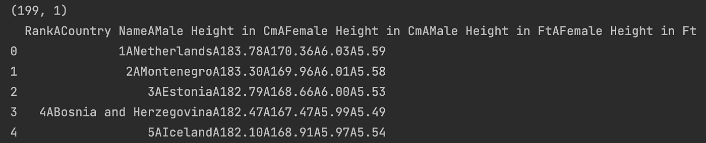
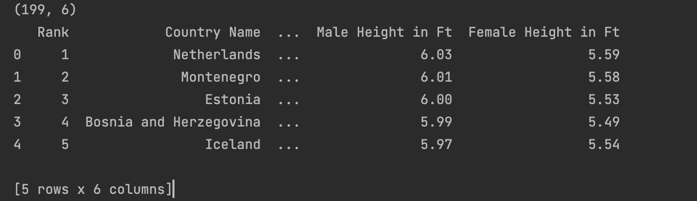
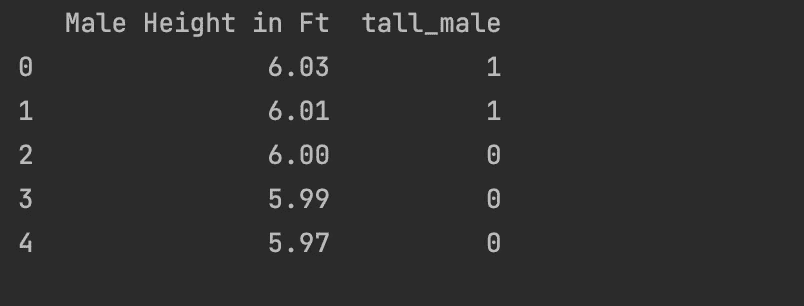
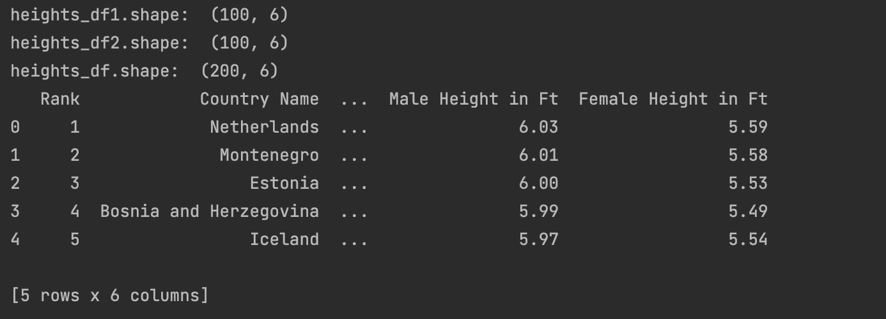
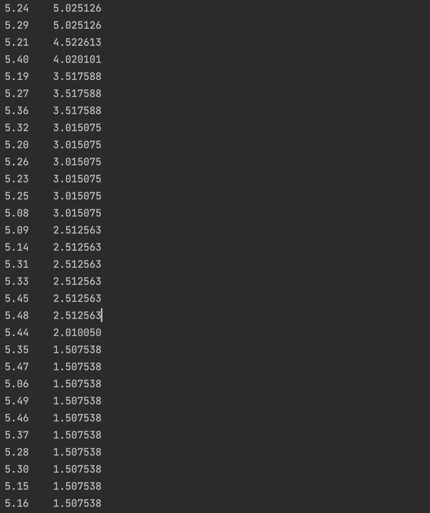

# 数据科学家的熊猫黑客:第一部分

> 原文：<https://pub.towardsai.net/pandas-hacks-for-a-data-scientist-part-i-e8625646a2b6?source=collection_archive---------1----------------------->

作为一个每天都要写代码作为工作一部分的数据科学家，我几乎可以保证你想尽可能了解熊猫库。我已经使用熊猫很长时间了，但是，我每天都在了解这个神奇的图书馆。Pandas 无疑是为数据科学家创建的最重要的 Python 库。

如果你想成为一名优秀的数据科学家，我强烈建议你继续学习更多关于熊猫的知识。正如我在之前的[帖子](https://medium.com/me/stats/post/d5adc289e974)中所写的，熊猫就是力量。此外，看看我的其他博客帖子，我在那里讨论了[基于熊猫的阴谋](https://medium.com/mlearning-ai/p-for-pandas-p-for-power-and-p-for-pyplot-f06b0048e39f)。

今天，我想介绍一些简单又好用的熊猫小窍门。那么，我们开始吧。

## 将非 csv 文件作为数据帧读取

当您在 pandas 中以数据帧的形式读取文件时，pandas 假定分隔符是 CSV。但是很多时候，您可能会遇到分隔符不是'，'的文件。对于来自包含自由文本列的数据源的大量数据来说，情况确实如此。逗号可能出现在用户/系统可以输入包括逗号在内的自由文本的列中。可以想象，这可能会导致 dataframe 列计数和值失控。例如，如果我们有一个由“control+A”字符分隔的数据集，并且我们通过默认分隔符读取它，如下所示:

```
import pandas as pd

heights_df = pd.read_csv('heights_by_country_2022.csv')
print(heights_df.shape)
```

输出将如下所示，其中数据中的所有 6 列都被读取为 1:



但是当我们通过指定分隔符来正确读取它时:

```
heights_df = pd.read_csv('heights_by_country_2022.csv',**sep='\001'**)
print(heights_df.shape)
print(heights_df.head(5))
```

数据帧中的数据读取正确，如下所示:



## 如何根据另一列的值快速添加一列？

很多时候，我们希望根据数据帧中现有列的值的条件，向 pandas 数据帧中添加一个新列。例如，在上面的数据框架中，我们想添加一列“tall_male ”,作为身高超过 6.0 英尺的男性。当我们想要为我们的机器学习模型创建一个标签作为派生标签时，这非常有帮助。我们可以通过下面的一行代码实现这一点:

```
import numpy as np
heights_df['tall_male'] = **np.where**(
                              heights_df['Male Height in Ft'] > 6.0,
                              1,
                              0)
```

np.where()是 NumPy 中的一个函数，您可以在其中指定 dataframe 中现有列上的条件，然后在条件分别评估为 true(在我们的示例中为 1)和 false(在我们的示例中为 0)时指定新列的值。NumPy 是一个高度优化的库，可以很好地处理高维数据，你会惊讶于这个命令有多快！

上述命令的结果如下所示:



正如你所看到的，男性身高超过 6.0 被指定为 1。

## 如何根据多列的值快速添加一列？

现在假设我们想在数据框架中添加一个从多个列派生的列。例如，我们希望在数据框架中添加一个平均身高列，它是每个国家男性和女性身高的平均值。同样，我们可以用另一个一行程序来实现:

```
heights_df['average_height'] = heights_df[['Female Height in Ft','Male Height in Ft']].mean(axis=1)
```

输出如下所示:


就这样，我们有了一个新的列，这是多个其他列的平均值。

## 如何横向合并两个数据框？

有时，我们有两个列数完全相同的数据帧，我们希望将它们水平连接，或者说，我们希望将数据帧 2 附加到数据帧 1 的末尾，以创建一个数据帧，该数据帧是这些数据帧的水平堆叠。以下是实现这一目标的步骤:

```
heights_df1 = pd.read_csv('heights_by_country_2022_split1.csv',sep='\001')
print("heights_df1.shape: ", heights_df1.shape)

heights_df2 = pd.read_csv('heights_by_country_2022_split2.csv',sep='\001')
print("heights_df2.shape: ", heights_df2.shape)

heights_df = pd.concat([heights_df1,heights_df2],axis=0)
print("heights_df.shape: ", heights_df.shape)
print(heights_df.head(5))
```

这里我们有两个数据帧，它们具有完全相同的列数，但数据不同，即行数不同。我们可以使用 pd.concat()将第二个数据帧追加到第一个数据帧的末尾。该函数的第一个参数是要连接的数据帧列表，第二个参数是我们要连接的轴。在我们的例子中，由于我们想按行连接，axis=0。

结果如下所示:



## 以百分比形式查找列值分布

有时我们想知道特定列中值的百分比是多少，以了解该列的频率分布。例如，在我们的数据框架中，我们想知道每个女性身高在数据集中所占的百分比，我们可以通过 pandas value_counts()来实现:

```
print(heights_df['Female Height in Ft'].value_counts(normalize=True) * 100)
```

value_counts()是一个非常有用的 pandas 函数，它告诉我们一个列或数据帧在数据中出现的次数。但是给它参数 normalize=True，我们告诉它将计数转换为 0 到 1 之间的归一化值。再乘以 100，就得到列中每个值的百分比分布。上述列的输出如下所示:



上面是我们看到的输出，身高 5.24 是全世界女性身高中最常见的，在我们的数据框架中占 5.02%。

这就把我们带到了这个关于熊猫黑客的简短系列的结尾。我会添加更多关于这个主题的博客，因为我觉得这些是一些最有用的技巧，使数据分析或建模过程中的数据工作变得非常容易。欢迎随时评论分享。

如果你想知道更多关于其他基于数据科学的图书馆的这类技巧，请在评论中添加它们，我会尽力在我未来的博客中加入它们。

更多这样的故事，请加入 medium.com

[](https://medium.com/mlearning-ai/mlearning-ai-submission-suggestions-b51e2b130bfb) [## Mlearning.ai 提交建议

### 如何成为 Mlearning.ai 上的作家

medium.com](https://medium.com/mlearning-ai/mlearning-ai-submission-suggestions-b51e2b130bfb) 

🔵 [**成为作家**](https://medium.com/mlearning-ai/mlearning-ai-submission-suggestions-b51e2b130bfb)