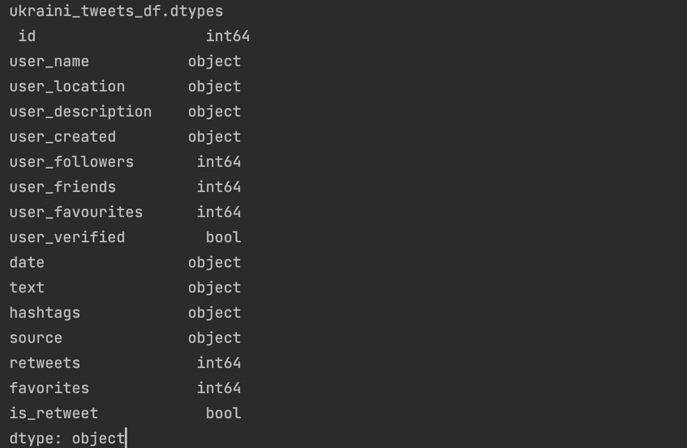
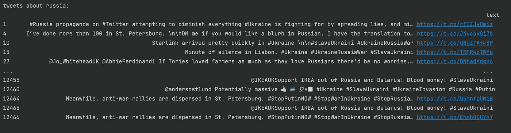
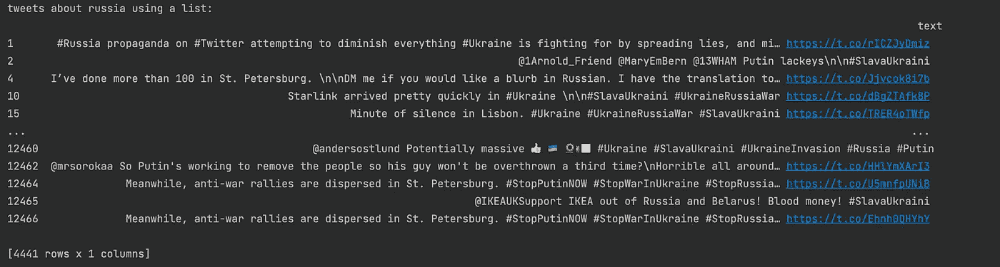
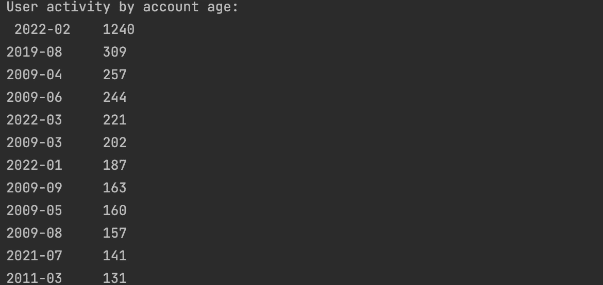
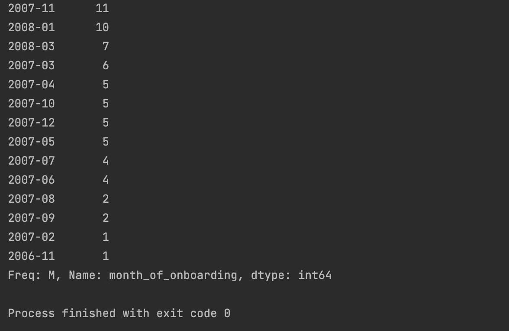
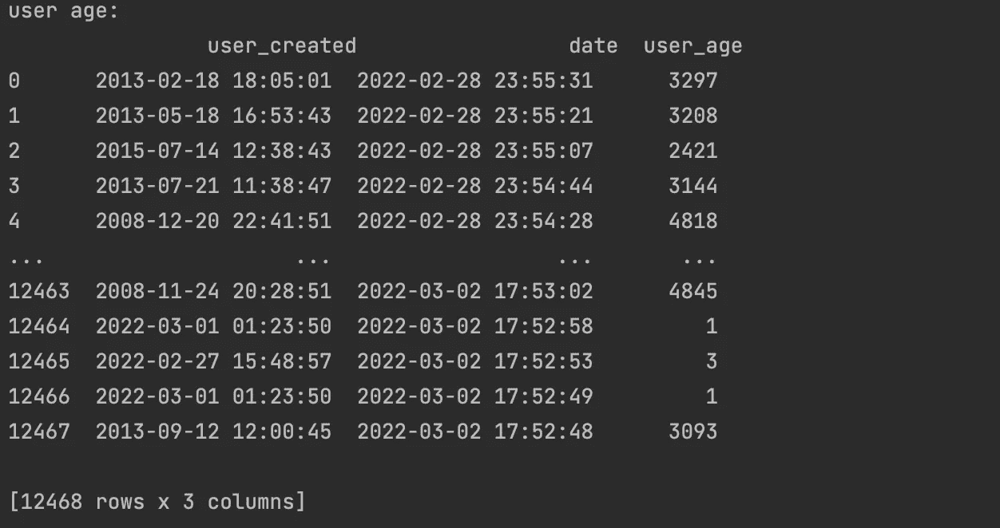

# 数据科学家的熊猫黑客:第二部分

> 原文：<https://pub.towardsai.net/pandas-hacks-for-a-data-scientist-part-ii-60cb64b800fb?source=collection_archive---------0----------------------->

这篇博文是我第一篇关于[熊猫黑客:第一部分](https://medium.com/@tangri.anurag/pandas-hacks-for-a-data-scientist-part-i-e8625646a2b6)的博文的延续

正如我前面提到的，学习熊猫是你在数据科学职业生涯中可以做的最好的投资之一。我要重复一遍，Pandas 无疑是为数据科学家创建的最重要的 Python 库。

如果你想成为一名优秀的数据科学家，我强烈建议你继续学习更多关于熊猫的知识。正如我在之前的[帖子](https://medium.com/me/stats/post/d5adc289e974)中所写的，熊猫就是力量。此外，看看我的其他博客帖子，我在那里讨论了[基于熊猫的阴谋](https://medium.com/mlearning-ai/p-for-pandas-p-for-power-and-p-for-pyplot-f06b0048e39f)。

今天，我想涵盖一些额外的熊猫黑客非常方便。那么，我们开始吧。

我们将使用来自 Kaggle 的新的乌克兰推文数据集，其中包含关于乌克兰战争的推文数据。数据集中的列如下所示:

```
ukraini_tweets_df = pd.read_csv('slava_ukraini.csv')
print("ukraini_tweets_df.dtypes", ukraini_tweets_df.dtypes)
```

输出是:



# 筛选与字符串匹配的 dataframe 列中的行

假设我们现在想搜索 tweet“text”列，只选择包含单词“Russia”的 tweet。这可以通过下面的 oneliner 轻松完成:

```
tweets_abt_russia_df = ukraini_tweets_df[ukraini_tweets_df['text'].str.contains('Russia')][['text']]
```

在上面的代码中，我们使用“text”列，这是实际的 tweet，并使用 pandas 中的 str()访问器将其转换为字符串序列，然后应用字符串函数 contains()检查“text”列是否包含单词“Russia”。输出如下所示:



如你所见，只有文本包含单词“俄罗斯”的推文被选中。当您执行探索性数据分析并希望将重点放在表现出特定行为的数据集的特定部分时，这非常有用。你可以点击查看熊猫系列[支持的字符串函数的完整列表。](https://pandas.pydata.org/docs/reference/series.html#string-handling')

# 筛选列表中 dataframe 列中的行

现在假设我们有一个列表，其中包含我们想要搜索 dataframe 列的单词。这也可以通过字符串访问器和字符串函数轻松完成，如下所示:

```
tweets_filter_on_russia_list=['Russia', 'war', 'attack', 'Zelenskyy',' Putin']
tweets_abt_russia_list_df = ukraini_tweets_df[ukraini_tweets_df['text'].str.contains("|".join(tweets_filter_on_russia_list))][['text']]
```

让我们打破这些陈述来更好地理解它:

*   这里，我们首先在我们的列表中定义一组单词。在这种情况下，我们选择一些与当前俄乌冲突相关的常用词。
*   此外，我们再次使用“文本”列并转换为字符串。
*   现在我们准备在列表中搜索单词。我们获取列表中的单词，并使用分隔符“|”和 join()将它们连接在一起，以创建一个正则表达式。最终模式评估为‘俄罗斯|战争|进攻|泽伦斯基|普京’。
*   熊猫现在将只选择在 contains()调用中出现这 5 个单词的推文。

输出如下所示:



很好地解释了为什么只有包含我们列表中单词的推文被熊猫选中了。这在我们想要创建停用词黑名单或白名单以仅过滤/选择匹配列表的行的情况下特别有用。

# 使用日期操作创建派生列

现在假设我们有一个需求，要找出我们的平台上有多少活跃用户。我们可以通过找到一个用户上 Twitter 的月份，以及有多少用户正在积极地评论俄罗斯的战争形势来找到这个统计数据。这可以通过下面的语句轻松实现:

```
ukraini_tweets_df['month_of_onboarding'] = pd.to_datetime(ukraini_tweets_df['user_created']).dt.to_period('M')
print(ukraini_tweets_df['month_of_onboarding'].value_counts())
```

让我们再来分解一下:

*   首先，我们获取用户创建日期，并将其转换为 datetime 对象。
*   接下来，我们使用 dt 访问器和 to_period('M ')函数从这个日期中提取月份和年份(YYYY-MM)。
*   然后，我们在这个新创建的列上使用 value_counts()找到每个 YYYY-MM 的频率计数。

让我们看看输出是什么样子的:



上面的代码输出片段显示了 2022–02 年加入的一些用户在该数据集中是如何最活跃的。我们看到 2009 年的一些用户也非常积极地在推特上谈论俄罗斯危机。在底部，我们看到 2006 年和 2007 年的老账户仍然活跃在平台上，但他们的活跃度很低。这个统计数据对于系统了解他们的活跃用户和参与度非常有价值。

# 使用日期算法创建复杂的派生列

在这个数据集中，我们有两个日期列:

*   user_created:用户创建其帐户的日期
*   日期:实际发布推文的地点。

假设我们想知道用户发微博当天的年龄。我们可以通过以下陈述实现这一目标:

```
ukraini_tweets_df['user_age'] = pd.to_numeric((pd.to_datetime(ukraini_tweets_df['date']) - pd.to_datetime(ukraini_tweets_df['user_created'])).dt.days)
```

让我们试着把这种说法分解一下:

*   首先，我们使用 pd.to_datetime()将“date”列转换为 datetime 对象
*   接下来，我们使用 pd.to_datetime()将“user_created”转换为日期时间对象
*   然后我们找出它们的差异，得到一个 timedelta 对象，该对象表示两个日期之间的天数和小时数的差异。区别如下:4524 天 23:16:43
*   此外，我们使用 pandas dt 访问器，并将差异的天数部分选择为:4524
*   最后，我们使用 pd.to_numeric()将它转换成数字:4524，这样我们就可以根据用户首次加入 twitter 以来的天数得出他的年龄。

输出如下所示:



我们可以很容易地从上面的输出中验证 user_age 是用户帐户创建日期和 tweet 的日期时间之差。这显示了 pandas 在如何使用日期算法和 dt accesor 函数创建用户年龄方面的强大功能。该年龄可以直接用作机器学习模型中的输入特征，以代理账户的真实年龄，并对用户行为进行预测。

这就把我们带到了熊猫黑客系列的第二部分的结尾。请继续关注，了解更多此类有用的技巧，它们使得在数据分析或建模过程中处理数据变得非常容易。欢迎随时评论分享。

如果你想知道其他基于数据科学的库的更多这样的技巧，请在评论中添加，我会在我未来的博客中添加。

更多这样的故事，请加入 medium.com