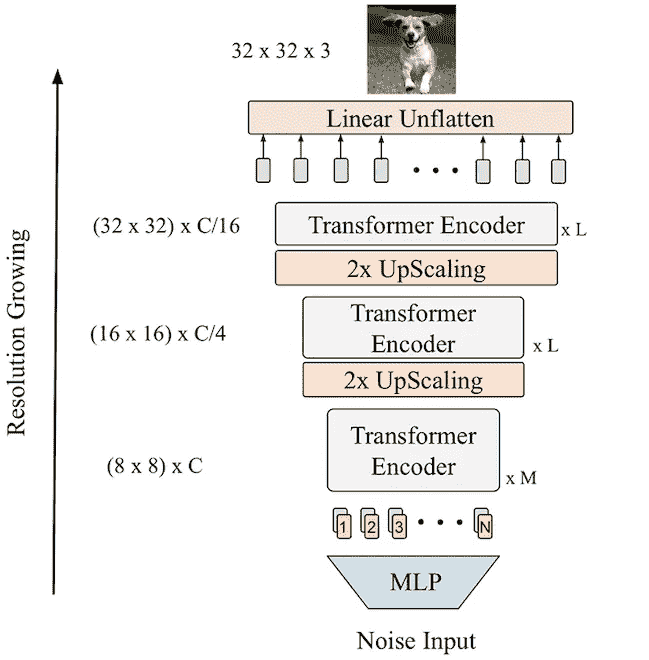
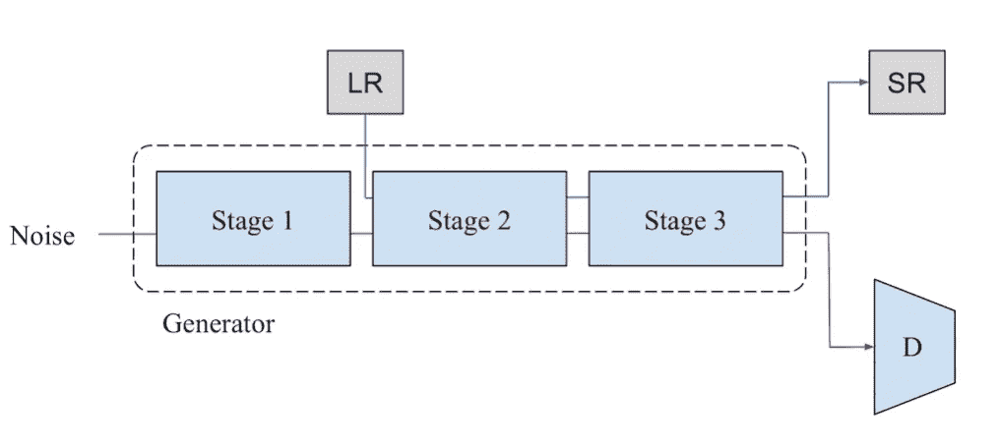
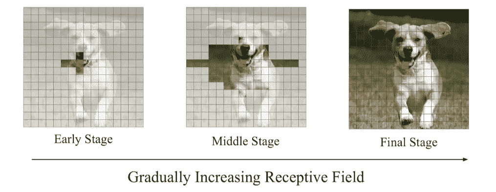
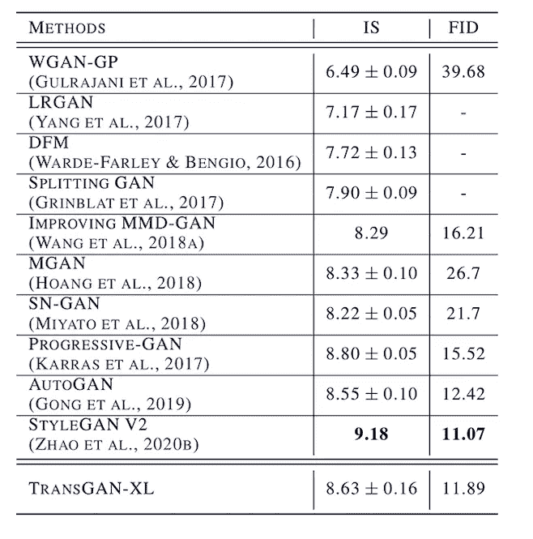
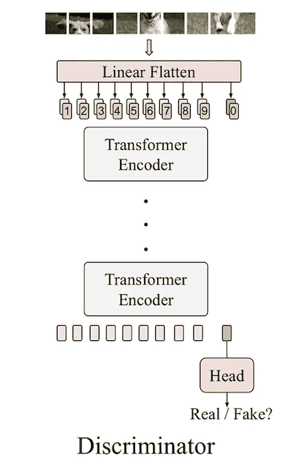
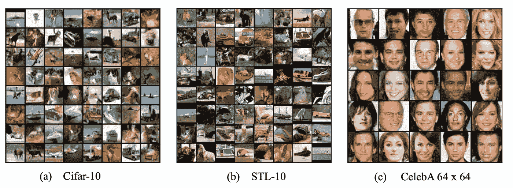

# 论文解释:trans GAN——两个变压器可以组成一个强大的 GAN

> 原文：<https://pub.towardsai.net/paper-explained-transgan-two-transformers-can-make-one-strong-gan-515d24350fdb?source=collection_archive---------1----------------------->

## [计算机视觉](https://towardsai.net/p/category/computer-vision)，[深度学习](https://towardsai.net/p/category/machine-learning/deep-learning)

## 一个无 CNN 的 GAN 网络

照片由[丹尼尔·麦卡洛](https://unsplash.com/@d_mccullough?utm_source=unsplash&utm_medium=referral&utm_content=creditCopyText)在 [Unsplash](https://unsplash.com/s/photos/collage-frames?utm_source=unsplash&utm_medium=referral&utm_content=creditCopyText) 上拍摄

目前，大多数 NLP 任务都是使用变压器网络或变压器网络的变体来解决的。在过去的几年中，变压器由于其可重复使用性，已经成为 NLP 生态系统的一个组成部分。一些多模态任务在某处使用变压器网络；尽管如此，这些都不是 CNN 免费的。任何与变形金刚结合的计算机视觉任务；还采用 CNN 作为特征提取的主干。但是使用 [TransGAN](https://arxiv.org/pdf/2102.07074.pdf) ，开发了基于纯变压器网络的架构来训练 GAN 进行图像合成。研究人员的一个强烈动机是简化和统一各种任务管道，因此一个通用的模型套件可以被许多应用程序广泛重用，从而避免重新发明轮子的需要。

GAN 通常用于图像合成，众所周知，训练 GAN 进行高质量的图像合成非常困难，从数据、模型、训练方法和超参数调整开始的每个方面都需要非常积极地考虑，以构建高效的 GAN。我们都同意这样一个事实，即图像中的对象用它的周围环境来表示它自己，并且基本上用卷积来表示，感受野是局部的，因此除非经过足够多的层，否则不能处理长程相关性。随着图层的增加，可能会损失要素分辨率，并且可能会丢失精细细节。

每个 GAN 网络分为两部分，

1.  发电机
2.  鉴别器

如前所述，gan 主要用于图像合成；在训练之后，只有生成器部分被保持来基于一些输入生成图像。在本文中，大部分重点放在发电机部分。开发能够匹配 GAN 网络的当前 SOTA 基准的良好发电机网络的努力分为四个部分。

# 发电机

## 1.记忆友好生成器

在训练变形金刚时，它们是巨大的内存饥渴野兽，在 NLP 中，每个单词都被当作输入，但相同的方法不能用于通过堆叠编码器块来逐像素地生成图像，因为对于小的***(32×32)***图像，序列长度将变成 ***1024*** ，导致更昂贵的自关注计算。为了避免这种情况，TransGAN 逐渐增加输入序列，减少嵌入。

图片来源— [论文](https://arxiv.org/pdf/2102.07074.pdf)

如图所示，TransGAN 中的发电机网络有三级变压器组。每一级堆叠几个变压器编码器*(默认为 5，2，2)*。特征图分辨率分三个阶段增加，直到与最终分辨率 *(HxW)* 匹配。生成器将随机噪声作为输入，并通过多层感知器(MLP)将其传递给长度为 *H x W x C* 的向量。然后向量被整形成一个 *H x W* 分辨率的特征图，每个点一个 *C 维*嵌入。接下来，该特征图被视为与可学习的位置编码相结合的 *C 维*记号的*长度 64* 序列。

变换器编码器将嵌入标记作为输入，并递归地计算每个标记之间的对应关系。在每一级之后，插入一个*整形*和 *pixelshuffle* 模块，以将输出放大到更高的分辨率。该模块首先将 *1-D 序列*嵌入到 *2-D 特征图*中，然后使用 *pixelshuffle* 模块对分辨率进行升级并对嵌入维度进行下采样，从而得到大小为***2H****x****2W****x****C/4*为了移动到下一阶段，*二维特征图*再次被整形为*一维序列*，序列长度为***4****xHW** *并且嵌入维度为***C****/****4***。因此，在每一级，分辨率变得 2 倍大，而嵌入维数减少到输入的四分之一。一旦达到期望的分辨率；嵌入标记被投影到嵌入维度 3，并且获得 RGB 图像。尽管如此，这还不足以达到目前美国有线电视新闻网的甘的 SOTA 基准分数，因此第二阶段，第三阶段和第四阶段。**

## 2.增加数据以提高效率

为任何 NLP 任务预先训练基于转换器的模型需要大量数据。总的来说，变形金刚非常需要数据。类似地，即使是基于 CNN 的 GANs，也使用数据扩充来达到良好的基准分数。当使用增强数据训练时，TransGAN 实现了惊人的大幅度改进。

## 3.自我监督辅助任务的联合训练

NLP doming 中的变压器网络从多个预训练任务中受益匪浅。已经发现，向 GAN 添加自我监督的共同训练任务已经稳定了 GAN 训练。合练任务可以是轮换预测什么的。类似地，在跨 g an 训练中，超分辨率的辅助协同训练任务与 GAN 损失相关联。发电机损耗增加了一个辅助项***λ∫L(超分辨率)*** ，其中 *L(超分辨率)*为最后阶段得到的超分辨率图像和中间任意阶段的低分辨率图像的均方误差 *λ* 经验设定为 *50* 。这种联合培训方法对 TransGAN 基准测试有些许帮助。

图片来源— [纸张](https://arxiv.org/pdf/2102.07074.pdf)

## 4.自我关注的位置感知定位

如上所述，卷积算子是局部可接受的，并且在生成的图像中有自然的平滑度。这是变压器所缺少的，为了实现这一点，自我关注可以被适当地热启动，而根本不改变纯变压器。

图片来源— [纸张](https://arxiv.org/pdf/2102.07074.pdf)

如图所示，引入了一个掩码，通过该掩码，查询只允许与其未被掩码的邻居进行交互。在训练 TransGAN 模型期间，掩蔽区域逐渐减小，并且在最后阶段，没有掩蔽，并且自我关注是完全全局的。这一策略源于一个观察，即局部的自我关注在早期训练阶段最有帮助，但会伤害后期训练阶段和最终可达到的表现。这将通过首先优先考虑本地邻域，然后更广泛地利用非本地交互，来加强 TransGAN 模型以学习图像生成。由此，在每个块中具有三个阶段和 5、4 和 2 个变换器编码器的 TransGAN 模型分别获得 8.63 的初始分数和 11.89 的 FID 分数。

图片来源— [纸张](https://arxiv.org/pdf/2102.07074.pdf)

# 鉴别器

图片来源— [纸张](https://arxiv.org/pdf/2102.07074.pdf)

鉴别器基于[视觉转换器](https://arxiv.org/pdf/2010.11929.pdf)，其中图像的 8×8 块被认为是一个单词，然后被转换为一维序列，并通过具有位置编码的转换器编码器，最后，分类头采用`[cls]`令牌来输出真/假预测。

来自 TransGAN Generator 的一些合成图像。

图片来源— [论文](https://arxiv.org/pdf/2102.07074.pdf)

总的来说，我们看到了如何使用不含 CNN 的纯变压器方法进行图像合成，对于基于变压器的计算机视觉模型来说，还有很长的路要走，还有很大的改进空间。