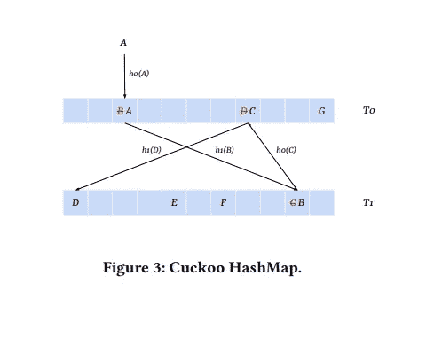
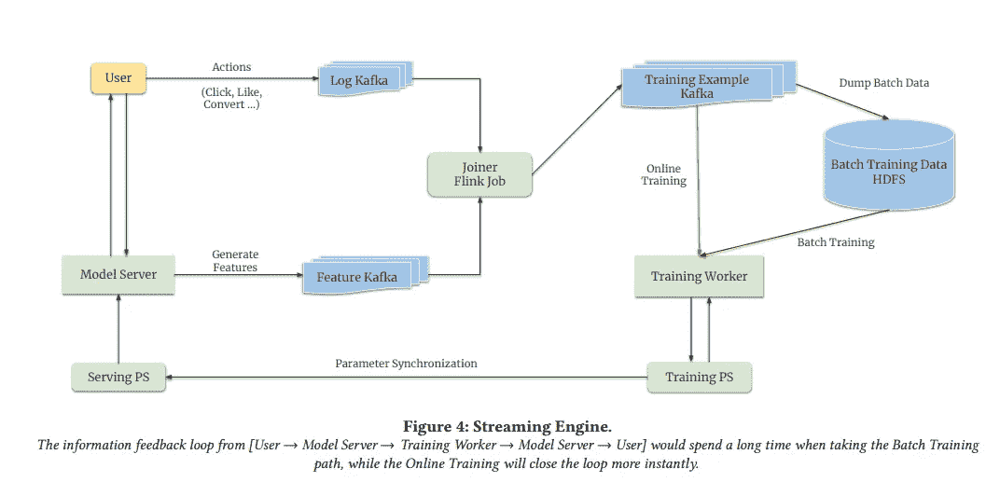

# 论文综述:迈向更好的推荐系统

> 原文：<https://pub.towardsai.net/paper-review-monolith-towards-better-recommendation-systems-b58702be416a?source=collection_archive---------3----------------------->

## 无冲突嵌入表、在线训练和容错

丹尼尔·科尔派在 [Unsplash](https://unsplash.com?utm_source=medium&utm_medium=referral) 上拍摄的照片

推荐系统是机器学习最普遍的应用。我们在每一个社交媒体平台、流媒体网站、在线市场以及几乎所有有广告展示的网站上都看到了他们的身影。

尽管它们很流行，但推荐系统的设计还有很大的改进空间。在今天的文章中，我们将回顾抖音的母公司**字节跳动的一个团队最近发表的一篇论文[。**具有无冲突嵌入表的实时推荐系统**](https://arxiv.org/pdf/2209.07663.pdf)**

作者强调了他们工作的三个主要贡献:

*   **无冲突和过期嵌入表**处理分类数据。
*   **在线培训平台**确保模型随着用户偏好的变化而更新。
*   **周期性快照**(副本)使系统容错。

# 问题 1:爆炸的特征空间

在它的核心，一个推荐引擎被训练来预测显示给你的东西是否会被点击。推荐引擎尝试使用两种类型的数据进行预测:

*   **关于用户的数据**可以是诸如年龄、登录次数、先前购买/点击/查看等特征。
*   **关于正在显示的项目的数据**。例如，如果你在一个食品配送应用程序上，正在使用的功能可能是菜肴的类型、配料、餐馆评级等。

照片由 [Saundarya Srinivasan](https://unsplash.com/@saundiii?utm_source=medium&utm_medium=referral) 在 [Unsplash](https://unsplash.com?utm_source=medium&utm_medium=referral) 上拍摄

在许多情况下，用于训练模型的特征可以是分类变量，即可以分类的非数值，例如融合、汉堡、比萨饼等。在烹饪种类的情况下。还应该注意，用户/项目本身是分类变量，因为它们通常以唯一标识符(ID)的形式表示。

在深度学习中，处理分类变量的一种常见方法是使用嵌入。其中每个类别被映射到一个 n 维向量。嵌入层通常只是一个查找表，其中唯一的 ID 被映射到其对应的向量表示。

分类变量带来了一个问题，因为随时都可能会出现新的类别。可能会有新的食物在任何一天突然出现，或者一个应用程序可能会有新用户注册。理论上，对于任何给定的特性，可以拥有的类别数量是没有限制的。

然而，我们不能有一个无限记忆的嵌入层。这意味着**可以将多个 id 映射到同一个 n 维向量**。假设我们的任务是把 11 个球装进 10 个盒子里，不管我们做什么，至少有一个盒子里会有不止一个球。**这种情况就是我们所说的碰撞。**碰撞可能会阻碍机器学习模型区分不同类别的能力。

## 解决办法

作者通过使用以下方法解决了这个问题:

*   布谷鸟散列法
*   过滤和驱逐类别

[**哈希**](https://en.wikipedia.org/wiki/Hash_function) **的概念是取任意大小的输入，将其映射到固定大小的输出**。理想的哈希函数可以确保没有冲突，即没有两个输入可以映射到同一个输出。字典和哈希映射等数据结构利用了哈希函数。

作者指出，许多推荐系统试图通过选择确保低冲突的散列函数来减少嵌入表中的冲突。他们认为，这对机器学习模型仍然是有害的。

理想情况下，如果我们使用嵌入表，我们希望使用哈希函数来确保没有两个输入被映射到嵌入表中的相同位置。作者为此使用了 Cuckoo 散列表。

## **布谷鸟散列表**

图自论文:[https://arxiv.org/pdf/2209.07663.pdf](https://arxiv.org/pdf/2209.07663.pdf)

如图所示，Cuckoo 散列表有两个散列表 **T0 和 T1** 。每个哈希表都有其**唯一的哈希函数，T0 使用 h0，T1 使用 h1** 。散列函数决定给定输入在嵌入表中的存储位置。

上图展示了 Cuckoo 散列表的工作方式以及它如何处理冲突。

*   当项目 A 进来时，它被 h0 散列(写成 h0(A))到 T0 中的一个位置，但是那个位置已经有项目 B 在其中(这是一个冲突)。在这个场景中发生的是 A 被移动到这个位置，而 B 被驱逐。
*   在被驱逐时，B 通过计算 h1(B)移动到 T1。然而，还有另一个冲突。
*   现在 C 被驱逐，h0(C)被计算，与 d 冲突。
*   计算 h1(D)。最后，h1(D)对应于 T1 中为空的位置。

**观察算法如何通过重新定位与传入项目**有冲突的所有项目来确保没有两个项目占据哈希表中的相同位置。

## **过滤和驱逐类别**

为了限制嵌入层/表的大小，作者认识到某些类别/id 很少出现。为这样的项目拥有一个独特的嵌入并不是很有用，因为模型会因为在训练中很少被观察到而对该类别不适合。

作者指出的另一个敏锐的观察是，某些 id/类别可能在一段时间后变得不活跃，为它们设置参数不再有任何意义。这可能是用户一年没有登录，亚马逊上的产品在过去 3 个月没有被购买，等等。

**基于这些观察，作者根据类别/id 出现的频率以及它们是否在一定时间内处于非活动状态来过滤它们。**这确保了只有最相关的类别/id 出现在嵌入表中。

# **问题二:概念漂移**

机器学习模型根据从过去收集的数据进行训练。但是，不能保证过去能准确代表未来。我们都见证了潮流随着时间的推移而变得突出和消失。我们的偏好也会随着时间而改变。

在数据科学领域，这种现象被称为**概念漂移。模型了解的数据分布不再准确，并且特征之间的交互也不相同**。概念漂移是机器学习模型需要定期重新训练的主要原因，以确保它们的性能不会急剧下降，并确保它们了解新兴的概念。

## 解决办法

在线训练是一旦新的数据点出现就训练模型的过程。例如，如果你决定开始观看网飞的一个新节目，当你点击播放按钮时，一个新的带有肯定标签的训练点(从你点击开始)就已经创建了。该模型现在可以运行向前传递来计算损失，并相应地更新其权重。

图自论文:[https://arxiv.org/pdf/2209.07663.pdf](https://arxiv.org/pdf/2209.07663.pdf)

在这篇论文中，作者创建了一个框架，可以运行批处理(离线训练)与在线训练串联。**然而，这里所关心的是被训练的模型**(训练工人和训练参数服务器(PS)如图所示)**和被主动使用的模型**(服务参数服务器(PS)) **提供建议是不同的，并且可以在不同的集群中运行。**

这是因为在训练模式下运行模型比在推理模式**下运行要慢，因为后者不需要计算梯度。**这就引出了训练和服务 PS 的权重如何同步(使之相同)的问题。

根据我们的理解，作者提供了以下关键见解，为该问题提供了解决方案:

*   推荐模型的大部分参数很大程度上是[稀疏](https://ai.googleblog.com/2016/06/wide-deep-learning-better-together-with.html)特征，即类别特征及其对应的嵌入。
*   只有少数稀疏特征倾向于在给定的时间窗口内得到更新。想象一下像 Tiktok 这样的社交媒体平台，在任何给定的小时间窗口，尽管日活跃用户总数为几百万，但只有一小部分用户可能会登录该应用程序。
*   使用基于动量的优化器来更新权重的模型往往需要很长时间才能使权重发生显著变化。属于除嵌入之外的深度神经网络的权重被称为**密集参数**。

基于前两个观察，作者开发了一种方法来跟踪**在训练**(在线和离线)期间更新了哪些稀疏特征。**只有在训练期间已经被更新的 IDs/features 的参数被发送到服务 PS 以更新其参数。**这通过图像中从训练 PS 到服务 PS 的箭头来指示。

作者每分钟更新一次稀疏参数。这是可行的，因为只有一小部分 id 在在线培训期间更新。另一方面，密集参数以低得多的频率更新。尽管服务 PS 中的嵌入和密集参数版本不同，但作者强调性能没有任何显著下降。

在线和批量训练与更新模型权重的巧妙计划相结合，使得推荐引擎能够了解用户不断变化的偏好。

# 问题 3:容错

对于具有容错能力的系统来说，即使在出现故障的情况下，它也需要能够按预期运行。请注意，流行的软件应用程序完全停止工作是多么罕见，这是因为工程师们重视尽可能增加对失败的抵抗力。

实现容错的一种常见方法是创建服务器、数据库等的副本。请记住，归根结底，服务器只是一台计算机。就像你自己的设备一样，它在任何时候都可能被损坏、被破坏和发生故障。让多台机器运行并存储同一组信息和数据确保了**一旦一台机器出现故障，副本就可以接管并服务于指向它的任何请求。**

作者遵循相同的方法，使他们的推荐引擎对失败具有鲁棒性。它们创建模型权重的副本(称为快照)。然而，有几个错综复杂的问题需要强调。

*   模型可能会非常大，创建太多的模型副本会非常昂贵，因为您需要为消耗的所有内存付费。
*   需要在创建副本和拥有最新权重之间找到适当的平衡。如果副本是旧的，这意味着它不知道自副本创建以来用户偏好的所有变化。

在他们的实验中，作者发现，尽管存储模型的服务器或数据中心出现了任何故障，但制作他们的模型的**每日副本工作正常，模型性能没有任何明显下降。**

# 结论

Monolith 告诉我们如何实现无冲突嵌入，以及清除未使用的特性/id 的优势。它向我们展示了模型如何通过利用在线训练和巧妙的参数同步技术来更好地处理概念漂移。它还向我们展示了在创建模型参数副本以确保容错时找到正确平衡的重要性。

感谢阅读这篇文章，我们希望你已经学到了一些新的东西！如果你有任何问题或想法，请在下面的评论区分享。

## 参考

*   【https://arxiv.org/pdf/2209.07663.pdf 