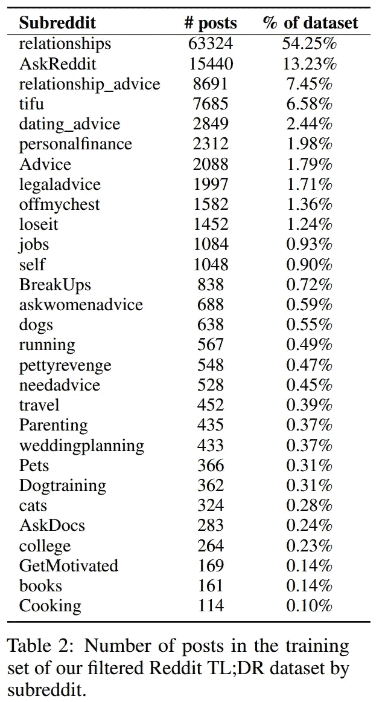
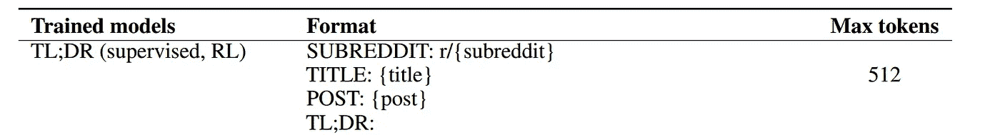
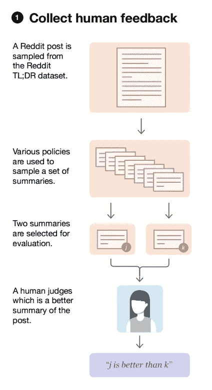
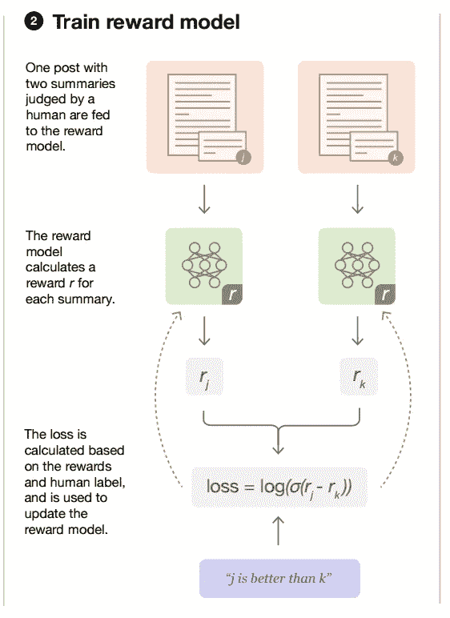
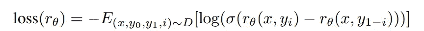
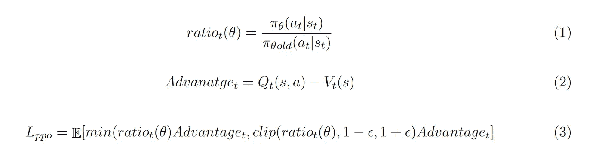
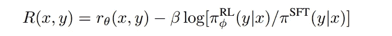
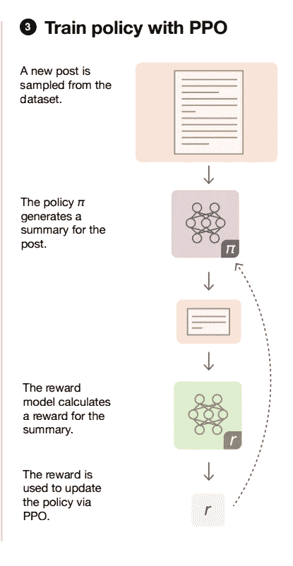

# 论文综述:利用人类反馈的强化学习进行摘要

> 原文：<https://pub.towardsai.net/paper-review-summarization-using-reinforcement-learning-from-human-feedback-e000a66404ff?source=collection_archive---------1----------------------->

## 人工智能校准、从人类反馈中强化学习、近似策略优化(PPO)

# 介绍

OpenAI 的 ChatGPT 是镇上新的酷人工智能，并席卷了世界。我们都见过无数的 Twitter 帖子，媒体文章等等。，强调了 ChatGPT 的不同用法。一些开发者已经开始构建[应用](https://twitter.com/jordnb/status/1599880721077633024)、插件、服务等。，利用 ChatGPT。

虽然 ChatGPT 的确切工作方式尚不清楚，因为 OpenAI 尚未发布论文或开源他们的代码。我们确实知道他们利用了来自人类反馈的**强化学习(RLHF)** 的想法

> 我们使用来自人类反馈的强化学习(RLHF)来训练这个模型，使用与 InstructGPT 相同的方法，但在数据收集设置上略有不同。

在今天的文章中，我们将深入到 OpenAI 之前的[工作](https://arxiv.org/pdf/2009.01325.pdf)中，他们使用 RLHF 来学习总结文档。本文将由以下几个部分组成。

*   **数据集创建**
*   **监督微调**
*   **培训奖励模型**
*   **强化学习**
*   **局部策略优化**

# 什么是数据集？

OpenAI 通过从 Reddit [TL 采样来创建数据集；DR](https://webis.de/data/webis-tldr-17.html) 数据集。此数据集由后接 TL 的帖子组成；帖子的创建者写的博士。TL；DR 被当作原帖的总结。

原 TL；灾难恢复数据集包含 300 万篇帖子。然而，OpenAI 运行了一些质量过滤器，还过滤了长度在 24 到 48 个令牌之间的摘要。长度过滤器的原因是限制摘要的长度对确定其质量的影响。帖子过滤，他们的数据集包含 123，169 个帖子，其中 5%用作验证集。

表格来自论文:[https://arxiv.org/pdf/2009.01325.pdf](https://arxiv.org/pdf/2009.01325.pdf)

在上图中，你可以看到文章的分布和它们所属的子编辑。OpenAI 还在这里公开了数据集[。](https://openaipublic.blob.core.windows.net/summarize-from-feedback/website/index.html#/tldr)

# 方法学

概括地说，该方法包括以下三个主要步骤:

1.  **监督微调(SFT)**
2.  **创建奖励模型**
3.  **训练一个利用奖励模型的强化学习模型。**

## **监督微调(SFT)**

这个步骤类似于任何预先训练的 transformer 模型的微调步骤，以便它可以进行特定于任务的预测。**在这种特殊情况下，作者训练模型来预测/生成给定帖子的摘要。**

他们没有使用现成的预训练变压器模型，**而是复制标准变压器架构，并对其进行预训练，以预测下一个令牌**。他们使用以下语料库进行预培训:

*   普通爬行
*   网络文本
*   书
*   维基百科(一个基于 wiki 技术的多语言的百科全书协作计划ˌ也是一部用不同语言写成的网络百科全书ˌ 其目标及宗旨是为全人类提供自由的百科全书)ˌ开放性的百科全书

发送到变压器模型用于预测汇总的输入遵循如下所示的模板:

表格来自论文:[https://arxiv.org/pdf/2009.01325.pdf](https://arxiv.org/pdf/2009.01325.pdf)

# 创建奖励模型

## **强化学习的基础**

强化学习(RL)背后的思想是，一个主体从它与它所活动的环境/世界的交互中学习。代理从 RL 学习的一个例子是像吃豆人这样的游戏。代理可以选择在特定的方向上移动它所采取的每一个动作。当代理做出某些动作时，它可以从环境接收一些反馈。反馈可以是点数增加、被杀死等。

收到的反馈被称为**奖励**，代理可以感知和利用来决定下一步采取什么行动的所有信息被称为**观察状态**。在 RL 中，代理人**的目标是最大化其可以收到的**的报酬。代理采取的单个动作被称为**步骤、**，导致游戏结束的一系列步骤被称为**情节**。

在摘要的上下文中，观察到的状态是帖子的文本内容，代理可以采取的操作是逐个(按步骤)输出一个令牌，并为每集生成一个摘要。然而，我们需要找到一种在一集结束时奖励代理人的方法。奖励必须是一个标量值。在 RLHF 中，我们训练一个奖励模型，它判断我们代理的输出，并提供一个分数作为奖励。

## 为奖励模型收集数据

图片来自论文:[https://arxiv.org/pdf/2009.01325.pdf](https://arxiv.org/pdf/2009.01325.pdf)

为了训练一个奖励模型，作者从他们的数据集中抽取一个帖子，然后获得一串摘要。他们获取给定帖子摘要的一些方法有:

*   SFT 模型的样本
*   通过传递一些上下文中的摘要示例，从没有 SFT 的预训练模型中抽取样本。
*   使用帖子创建者写的地面真相总结。

一个新的任务是这样创建的:为一个给定的帖子取成对的摘要，并要求签约的贴标签者在这两个摘要中选择他们更喜欢的一个。

## **培训奖励模型**

图片来自论文:【https://arxiv.org/pdf/2009.01325.pdf 

为了获得奖励模型，**从 SFT 得到的模型被用作起点**，并且用于预测代币的层**被替换为新的头部**(线性层)以获得发送到奖励模型的 post +摘要文档的标量分数。与上面创建的数据集保持一致，给定帖子的两个**候选摘要都被单独传递给奖励模型，以获得每个摘要的分数。**

该模型被训练成最大化优选概要和其他候选概要之间的分数差**，或者换句话说，最小化分数的负差。这可以在下面所示的损失函数中观察到，其中 ***y_i*** 对应于**优选人类**摘要，***y _(1-I)****对应于其他候选摘要， ***x*** 对应于帖子， ***r*** 对应于我们的奖励模型***

**

*图片来自论文:[https://arxiv.org/pdf/2009.01325.pdf](https://arxiv.org/pdf/2009.01325.pdf)*

*很好，现在我们有了一个奖励模型，好的总结应该得到高分，坏的总结应该得到低分**！下一步是在 RL 环境中利用奖励模型。***

# ***使用近似策略优化的强化学习***

## ***最近策略优化的基础***

***R1 中的一个**策略**决定了给定一个状态 **( *s* )** ，代理应该采取什么动作 **( *a* )** 。一个策略通常用符号 ***π*** *来表示。*在本文的上下文中，我们的**初始策略是生成摘要的转换器模型**。***

***在 RL，我们试图学习最好的政策，以便我们的代理人可以获得最高的回报。我们通过在每集结束时更新我们的总结模型的权重来更新我们的策略。本文上下文中的一个事件是我们的策略为其生成摘要的一批帖子。 **PPO 是一种专注于如何更新与我们的策略相对应的参数的算法。**策略模型的损失可由以下三个等式表示:***

******

***本文作者图片***

***基于等式 1，我们想要找到基于我们当前策略对给定状态 *s* 采取**某个动作 *a* 的概率与根据**我们先前/旧策略**对同一状态 *s*** 采取相同动作 *a* 的概率之间的比率。***

***最近策略优化(PPO) **背后的想法是，我们希望避免在一个步骤中彻底改变策略**。过于彻底地改变策略的危险在于，代理可能会忘记它到目前为止所学习的内容，并最终进入一个性能非常低的空间，并且重新学习它所忘记的内容可能会花费很多时间。从等式 1 计算出的比率让我们了解了政策变化的幅度。***

***等式 2 中描绘的优势函数是在状态*下采取行动*比在该状态下预期的平均回报好或差多少的度量。本质上，这是一种判断我们是否在采取好的行动的方式。如果你对 Q 值和价值函数不熟悉，我建议你深入学习由 Huggingface 创建的 RL 课程，链接在参考资料部分。*****

*****在等式 3 中，clip 函数绑定范围 1-*ε*和 1+*ε*，*ε*之间的比值，通常是范围[0.1–0.2]内的常数值。损失函数 *L_ppo* 确保梯度为 0，当:*****

1.  ****比率< 1-*ε*和*优势*0****
2.  ****比值> 1+*ε*和*优势*0****

****总结这两种情况，如果我们已经意识到我们正在采取的行动相当好或相当坏，并且在所有其他情况下更新它，我们不想再更新我们的政策。如果你不清楚为什么上述两种情况下梯度为零，请参考[这篇](https://huggingface.co/blog/deep-rl-ppo)文章。****

## ****更新的奖励方程式****

****该论文的作者还增加了一个 KL 散度惩罚，以确保更新后的政策不会偏离原始的 SFT 模型太远。这是为了确保模型不会通过欺骗和产生不连贯的总结来找到最大化奖励函数的方法。它还确保了新策略生成的输出摘要不会与奖励模型所依据的太不相似。****

****奖励的最终等式是****

********

****图片来自论文:【https://arxiv.org/pdf/2009.01325.pdf ****

********

****图片来自论文:【https://arxiv.org/pdf/2009.01325.pdf ****

****PPO-Clip 算法可以遵循基于[演员-评论家](https://huggingface.co/blog/deep-rl-a2c)的训练范例。评论家负责给我们 Q 值( *Q(s，a)* )，也称为价值函数。价值函数由另一个用与回报模型相同的权重初始化的变换器模型来表示。****

****由于作者没有提到关于价值函数的任何其他信息，我们假设他们通过最小化价值函数的预测回报和回报函数提供的实际回报之间的差异来优化它。****

****总而言之，我们有三种不同的模型:****

1.  ****策略模型****
2.  ****奖励模型****
3.  ****价值函数模型****

****这三种模型都基于 transformer 架构。****

# ******结论******

****论文作者根据实验得出以下结论:****

1.  *****“使用人类反馈的训练明显优于非常强的英语摘要基线。”*:这是基于贴标机运行的评估。****
2.  *****“人类反馈模型比监督模型更好地推广到新领域”*:这是基于在 TL 上训练的模型的性能；DR 数据集对照 [CNN/DailyMail](https://huggingface.co/datasets/cnn_dailymail) 数据集。****

****在今天的文章中，我们讨论了如何在 NLP 环境中使用来自人类反馈的强化学习来总结文档。如果您对本文有任何疑问或想法，请留言。****

## ****参考****

*   ****Huggingface [DeepRL 类](https://github.com/huggingface/deep-rl-class)****
*   ****最近的政策优化 [(PPO)](https://huggingface.co/blog/deep-rl-ppo)****
*   ****[https://towards data science . com/proximity-policy-optimization-tutorial-part-1-actor-critic-method-d 53 f 9 affffb f 6](https://towardsdatascience.com/proximal-policy-optimization-tutorial-part-1-actor-critic-method-d53f9afffbf6)****
*   ****[https://github.com/openai/summarize-from-feedback](https://github.com/openai/summarize-from-feedback)****
*   ****[https://open ai . com/blog/learning-to-summary-with-human-feedback/](https://openai.com/blog/learning-to-summarize-with-human-feedback/)****
*   ****[https://keras.io/examples/rl/ppo_cartpole/](https://keras.io/examples/rl/ppo_cartpole/)****
*   ****[https://spinningup.openai.com/en/latest/algorithms/ppo.html](https://spinningup.openai.com/en/latest/algorithms/ppo.html)****