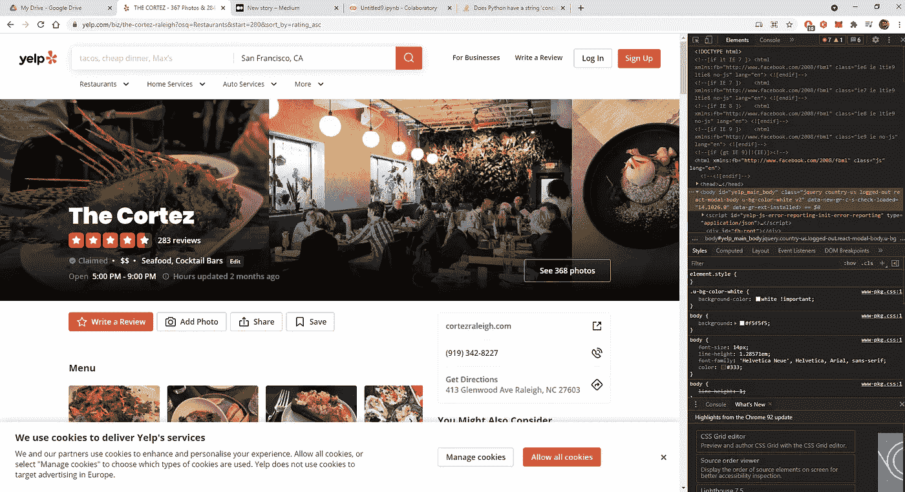
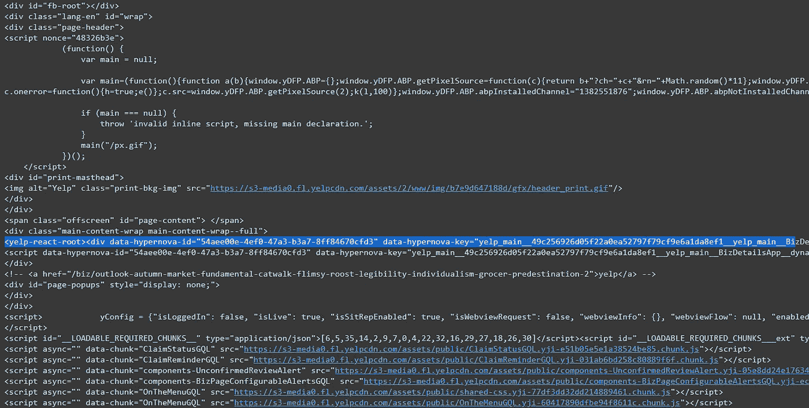
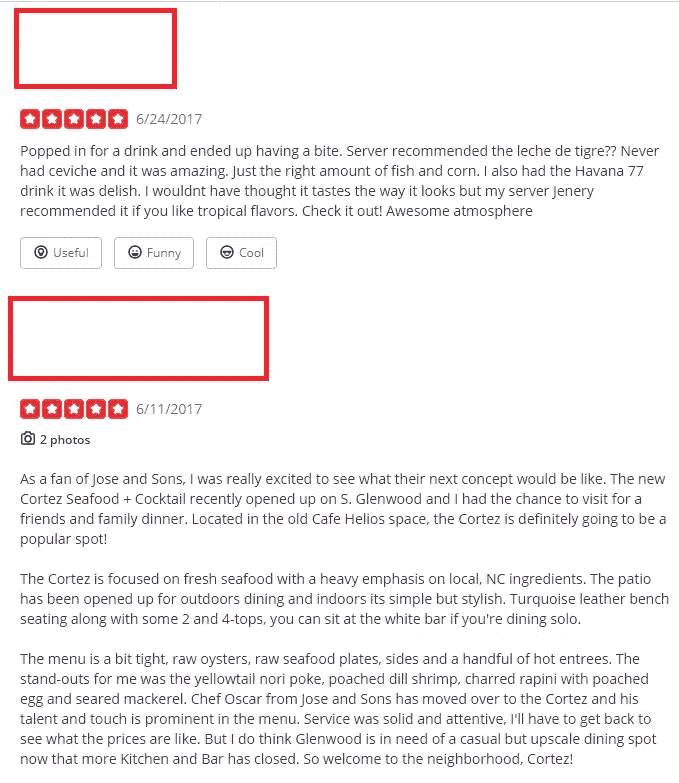
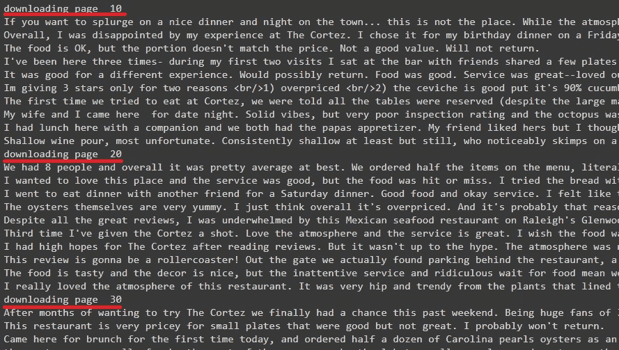
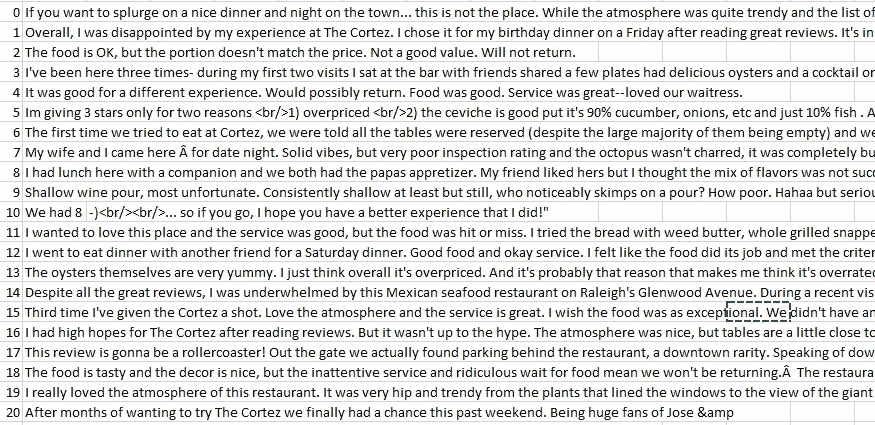

# 网页抓取 Yelp，第 1 部分:用 Pyhton 使用 Beautifulsoup 挖掘评论

> 原文：<https://pub.towardsai.net/part-1-scraping-yelp-reviews-with-pyhton-using-beautifulsoup-a014867a1d2c?source=collection_archive---------0----------------------->

## [网页抓取](https://towardsai.net/p/category/web-scraping)

## 执行餐馆评论的网络搜集。完整的代码[可在我的回购](https://github.com/arditoibryan/Projects/tree/master/20210813_yelp_webscraping)。

使用 python 时，Web 抓取是我最喜欢面对的挑战之一。网络抓取是一种允许程序员使用代码连接到网站，然后提取网站上托管的 HTML 和 javascript 的技术。然后使用一些库对代码进行分析，这些库可以帮助提取我们想要的信息。


照片由[雅各布·久巴克](https://unsplash.com/@jckbck?utm_source=medium&utm_medium=referral)在 [Unsplash](https://unsplash.com?utm_source=medium&utm_medium=referral) 拍摄

通过 python 这样的编程语言使用 web scraping 的好处是，我们不局限于从单个页面中提取信息，但是如果网站的逻辑足够一致，我们可以迭代网站的所有页面，以挖掘尽可能多的数据。

## 网页抓取的局限性

然而，网络搜集并不是一个可靠的方法。像所有其他工具一样，它要么存在局限性，要么存在无法正常工作的情况。如果我们足够幸运，我们在采矿时可能不需要面对这些问题。每个网站都有自己独特的结构和自己的保护方法，因此这是一个全新的挑战。

*   Beautifulsoup 无法下载所有代码

可能发生的情况是，网站启用了阻止 beautifulsoup 获得连接的保护。事实上，如果一些网站了解到您试图在不使用浏览器界面的情况下发送 GET 请求，它们可能会阻止您。不幸的是，当这个问题出现时，没有机会找到解决方法，至少不能使用代码。令人怀疑的是，任何其他图书馆将在同样的情况下工作。

*   无法解析代码

其他时候，软件仍然可以访问 HTML，由于某种原因，代码不能被解析和转换成结构化的 beautifulsoup 对象。如果我们不能解析它，我们就不能使用 beautifulsoup 库提供的任何方法来提取信息，这使得自动化过程变得不可能。

*   网站结构没有逻辑

有时您可能会发现，即使代码已经被正确地访问、下载和解析，网站的设计也可能很糟糕，以至于无法在相似的页面中找到共同的结构。当然，这种情况很少发生，但是我不得不处理这个问题几次，结果导致几条信息丢失，因为检索过程不能正确地自动化。

*   这太难了

我希望你永远不会遇到这个问题，然而，一些网站只是能够用如此大量的代码淹没你，这是不可能正确破译。有时，信息被嵌套在 javascript 和哈希隐藏的结构中，即使您需要的所有信息都隐藏在代码中，您也无法找到简单提取它们的方法。

## 刮 Yelp

在这篇文章中，我将重点刮这个确切的餐馆的评论[。](https://www.yelp.com/biz/the-cortez-raleigh?osq=Restaurants&start=280&sort_by=rating_asc)



Yelp 页面我会用 python 刮

为了执行正确的网页抓取，我通常遵循以下步骤:

1.  检查我是否能下载一页的 HTML
2.  检查网站中是否有允许迭代的逻辑
3.  刮掉第一页
4.  找到我们想要提取的信息
5.  提取信息并把它们放在一个列表上
6.  为将同一算法应用于若干页的循环创建
7.  导出结果

这个过程非常直观，可以这样总结:在我们检查我们是否可以实际执行 web 抓取之前，如果可以，我们在单个页面上执行，然后我们将代码扩展到几个页面(如果需要，甚至几百个)。

## 检查 HTML 是否可以下载



用 python 下载的乱码

一开始，我以为没有希望了。我花了一段时间才明白，所有的评论都包含在我必须分析的那一行 HTML 代码中。

## 检查网站是否有任何逻辑

下一个挑战是看看是否有任何逻辑证据允许我遍历关于同一家餐馆的不同页面。

```
[https://www.yelp.com/biz/the-cortez-raleigh?osq=Restaurants&start=280&sort_by=rating_asc](https://www.yelp.com/biz/the-cortez-raleigh?osq=Restaurants&start=280&sort_by=rating_asc)
```

幸运的是，逻辑很简单。一旦确定了我想搜索的餐馆，我可以改变链接中除以 10 的唯一数字，作为包含评论的页面的指示。遍历不同的页面是小菜一碟。



我将要下载的评论截图

# 编码

python 中的代码如下:

## 导入库

```
import requests
from bs4 import BeautifulSoup
import time
```

## 遍历整个网站

```
comment_list = list()
for pag in range(1, 29):
  time.sleep(5)URL = "[https://www.yelp.com/biz/the-cortez-raleigh?osq=Restaurants&start=](https://www.yelp.com/biz/the-cortez-raleigh?osq=Restaurants&start=)"+str(pag*10)+"&sort_by=rating_asc"
  print('downloading page ', pag*10)
  page = requests.get(URL)#next step: parsing
  soup = BeautifulSoup(page.content, 'lxml')
  soup
```

## 提取评论并把它们放在一个列表中

```
for comm in soup.find("yelp-react-root").find_all("p", {"class" : "comment__373c0__Nsutg css-n6i4z7"}):
    comment_list.append(comm.find("span").decode_contents())
    print(comm.find("span").decode_contents())
```

下载数据时，代码会向我们显示进度和目前下载的数据。



输出的屏幕截图

## 导出结果

从列表中导出结果非常简单。我们可以通过文本文件来实现，但我更喜欢使用 CSV 来方便信息通过其他软件的移动。

```
import pandas as pdpd.DataFrame([comment_list]).T.to_csv(‘yelp.csv’)
```

从截图中我们可以看到，我们已经成功地将所有评论导出到一个 CSV 文件中。



CSV 的截图

## 现在怎么办？

我们可以做很多很酷的事情来充分利用我们刚刚下载的数据。我们可以清理数据，然后对数据进行情感分析。然后，我们可以从多个餐馆下载数据，并可视化该地区最好的地方，这完全取决于我们的想象力。