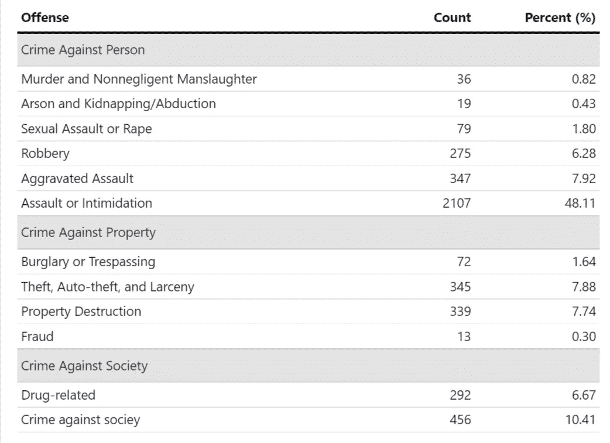
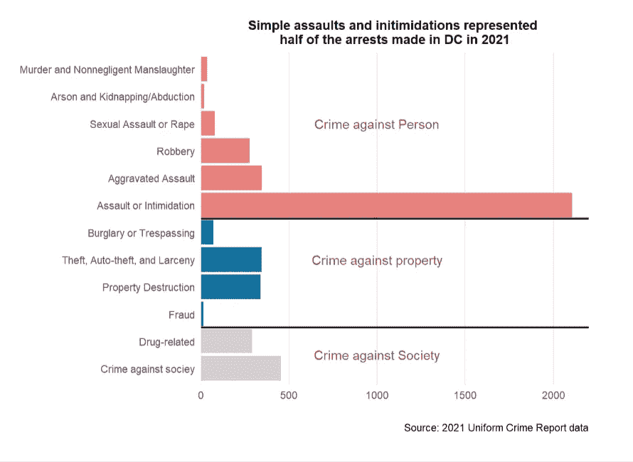
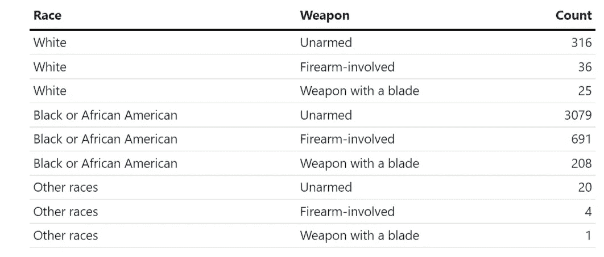
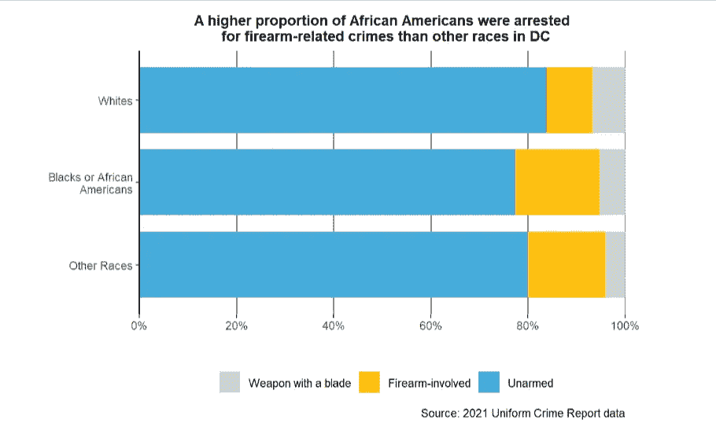
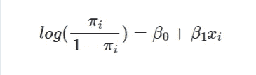
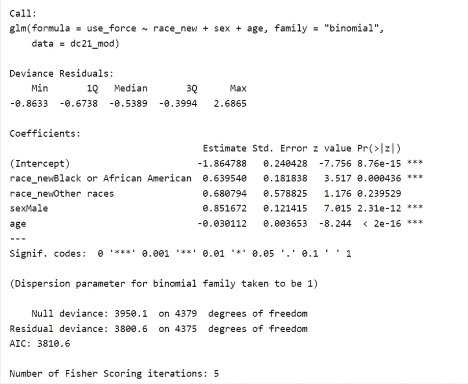
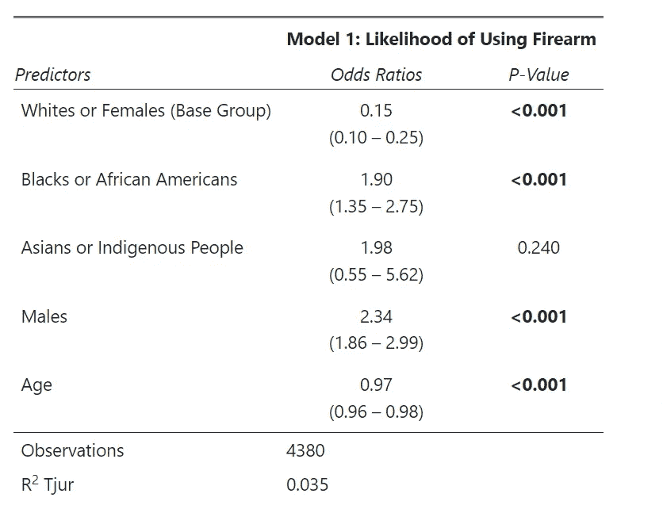
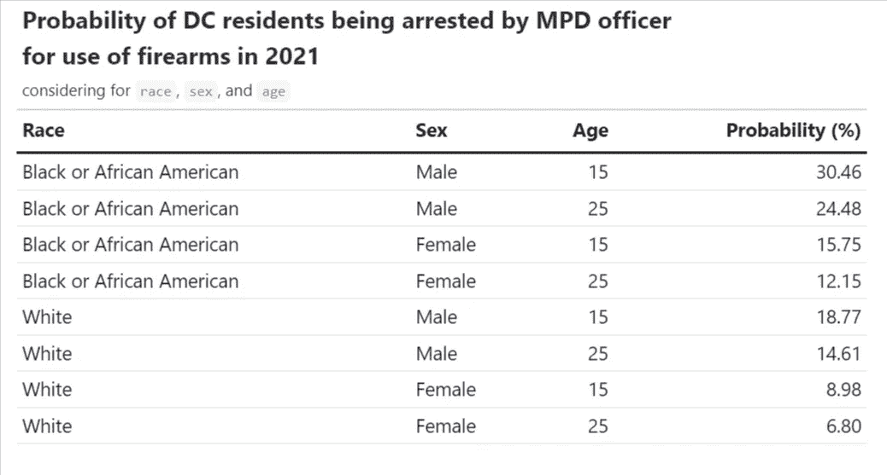

# (最后一部分)用数据科学促进刑事司法

> 原文：<https://pub.towardsai.net/part-final-fostering-social-impacts-with-data-science-c853e50d0379?source=collection_archive---------2----------------------->

## 关于他们是谁和我们是谁的最后一个故事


来源:【NIBRS 官方网站

***注*** *:* *这是由《走向 AI》出版的系列文章的最后一部分，专注于使用 R tidyverse 工具来说明 2021 年发生在 DC 的抓捕故事。后两部分可在*阅读:

*   **第一部分**(介绍、数据清理和扯皮):[https://pub . toward sai . net/fooding-criminal-justice-with-Data-science-Part-I-be 4c abde B0 a 1](/fostering-criminal-justice-with-data-science-part-i-be4cabdeb0a1)
*   **第二部分**(数据讲故事第一部分):[https://pub . toward sai . net/footing-social-impacts-with-Data-science-Part-II-a 73 F5 b 90 ebf 5](/fostering-social-impacts-with-data-science-part-ii-a73f5b90ebf5)

# 我们图片的最后一部分:总结

在本系列的最后两篇文章中，我们介绍了清理公共数据集、理解数据的本质以及讲述去年谁在 DC 被捕的故事的过程。在今天的最后一部分，我们将通过谈论导致他们被捕的人的所作所为来结束我们的故事:他们犯了什么罪？他们使用武器了吗？这些问题是各种政策和法律讨论的核心，这使得更深入地理解它们变得非常重要。作为这个三部曲的结尾，我将通过对我们的数据进行建模来得出一些推论，并分享如何以一种无害的方式进行数据科学，从而谱写这个管弦乐队的结尾音符:数据科学应该是道德的，并被用来促进社会和刑事司法和公平，但它很容易出错。

尽管如此，我们还是首先加载我们的数据和库。

```
library(tidyverse) # use the tidyverse universe
library(ggtext) # format texts/annotations in ggplots
library(GGally) # for more visualization options
library(ggpubr) # dot chart and plot arrangement
library(gt) # for good looking tablelibrary(sjPlot) # for beautiful looking regresison table
library(sjmisc)
library(sjlabelled)load("data/final_data.rda")
```

# 他们是罪犯吗？:如何操作部分

## 通过进攻

犯罪的分类方法不止一种。我们经常熟悉指数犯罪、暴力犯罪和毒品犯罪等词汇，但很少有人知道它们代表不同执法机构使用的不同分类系统。例如，暴力犯罪往往与武力有关，意味着造成严重的身体伤害。另一方面，财产犯罪通常意味着财产的损失或损坏。然而，财产犯罪不一定是非暴力的，反之亦然。与暴力与非暴力对话不同，索引犯罪是联邦调查局使用的术语，代表几个最重要的类别，其中一些是最令人发指和可怕的性质(如谋杀)，而一些是真正的未成年人(如盗窃)，但所有这些都危及我们的自由。联邦调查局的编码系统并没有被全国所有的执法机构使用。例如，芝加哥警察局在其 CLEAR(公民执法分析和报告)系统中对 50 多种犯罪类型进行了编码(他们奇怪地将严重袭击和简单袭击合并为一类——袭击)。

在这里，与我在本系列第 1 部分中讨论数据的方式一致，我应用法律框架将这 12 种犯罪类型分为三组:针对人身的犯罪、针对财产的犯罪和针对社会的犯罪。这种也被广泛采用的结构，强调的是谁来承担犯罪的负担——一个人，财产，还是整个社会。类似于这种分类方法，我们也有轻罪与重罪的划分，这是基于服刑时间。

从下表中我们可以看出，2021 年，简单的攻击或恐吓占 DC 所有导致逮捕的犯罪的近一半，在数量上几乎是第二高类别“危害社会罪”的五倍，从字面上看，它代表卖淫等犯罪！如果我们排除这一类别(与加重袭击不同，简单袭击通常水平较低，没有枪支/武器，没有重大身体伤害)，暴力犯罪导致的逮捕数量与其他两个类别的规模大致相等，这是很奇怪的，因为暴力犯罪通常是所有犯罪中最罕见的。袭警和暴力犯罪数量的疯狂有原因吗？我们无法用我们的数据来回答这个问题，但这是一个很好的研究想法。

```
dc21 %>%
  group_by(offense) %>%
  summarise(count = n()) %>%
  mutate(`Percent (%)` = round(count/sum(count)*100,2)) %>%
  gt() %>%
  cols_align(
    align = "left",
    columns = offense
  ) %>%
   cols_label(
    offense = "Offense",
    count = "Count"
  ) %>%
  tab_row_group(
    label = "Other Crimes",
    rows = 11:12
  )  %>%
  tab_row_group(
    label = "Peoperty Crime/ Crime Against Property",
    rows = 7:10
  )  %>%
   tab_row_group(
    label = "Violent Crime/ Crime Against Person",
    rows = 1:6
  ) %>%
    tab_options(
      column_labels.border.top.width = px(3),
      column_labels.border.top.color = "transparent",
      table.border.top.color = "transparent",
      table.border.bottom.color = "transparent",
      data_row.padding = px(3),
      source_notes.font.size = 12,
      heading.align = "left",
      #Adjust grouped rows to make them stand out
      row_group.background.color = "#e3e3e3") %>%
  tab_style(
     locations = cells_column_labels(columns = everything()),
     style  = list(
       cell_borders(sides = "bottom", weight = px(3)),
       cell_text(weight = "bold")
     )
   )
```



下面的图表以更具视觉吸引力的方式讲述了同样的故事。我根据他们所属的犯罪集团给这些条着色，并去掉了多余的网格线。

```
dc21 %>%
  group_by(offense) %>%
  summarise(count = n()) %>%
  ggplot(aes(x = offense, y = count)) +
  geom_col(fill = "#12719e") +
  coord_flip() +
  scale_x_discrete(limits=rev) +
  theme_classic() +
  scale_y_continuous(expand = c(0, 0),
                     limits = c(0, 2200), 
                     breaks = c(0,100,
                                seq(250, 2000, 250), 4500)) +
  theme(
 #   text = element_text(family = "sans"), #other default fonts aren't good for web
    title =element_text(size=11, face='bold'),
    panel.grid.major.y = element_blank(),
    panel.grid.minor.y = element_blank(),
    panel.grid.major.x = element_line(),
    axis.line.y = element_line(),
    axis.line.x = element_blank()
  ) + 
  labs(x = "", y = "",
       caption = "Source: 2021 Uniform Crime Report data") +
  geom_vline(xintercept = 2.5,
             colour = "red", size = 1.5) +
  annotate("text", y = 1000, x = 1.5, 
           label = "Other Crimes", color = "#af1f6b") +
  geom_vline(xintercept = 6.6, 
             colour = "red", size = 1.5) +
  annotate("text", y = 1000, x = 10, 
           label = "Violent Crimes", color = "#af1f6b") +
  annotate("text", y = 1000, x = 5, 
           label = "(Violent) Property Crimes",
           color = "#af1f6b") +
  ggtitle("Arrests in DC Area by Offense Type in 2021")
```



## 用武器

枪支问题是这个国家面临的一个突出问题，但并不是所有的犯罪都与枪支有关。作为一名犯罪政策的学生和研究者，我经常看到这个问题被政客们扭曲和操纵，以服务于他们的议程和传播他们的想法。事实是，大多数犯罪都与枪支或武器无关。尽管根据皮尤研究中心最近的一项民意调查，枪支引发的杀人事件近年来一直在上升，但涉枪犯罪仍然只占所有犯罪的一小部分，并且这些与枪支相关的伤亡中有一半以上是自杀。除此之外，[很少有研究表明持枪和犯罪之间存在因果关系。](https://www.science.org/content/article/gun-violence-studies-show-few-causal-relationships?cookieSet=1)

然而，重要的是，我们要知道有多少案件与武器有关，谁使用了武器，罪犯使用了什么武器，以满足我们的好奇心，制定更有针对性和有效的预防犯罪政策，避免更多无辜生命和宝贵的社区成员的逝去。这也是研究的目的:建立一个更美好的未来，人们的生活得到重视。

从我们的数据中，我们看到绝大多数逮捕(80%左右)不是由罪犯使用武器造成的。对于所有种族、性别和年龄的罪犯来说都是如此。

```
dc21 %>%
  count(race_new, weapon) %>%
  gt() %>%
  cols_align(
    align = "left",
    columns = race_new
  ) %>%
  cols_align(
    align = "left",
    columns = weapon
  ) %>%
   cols_label(
    n = "Count",
    weapon = "Weapon",
    race_new = "Race"
  )
```



根据水平堆积条形图，在涉及枪支(如枪支或步枪)的情况下，白人的被捕比例最低(8%左右)。另一方面，黑人因武器引发的逮捕比例最高(15%左右)。这可能与该市臭名昭著的东南部地区存在黑色帮派有关，在那里[帮派争斗和枪击已经成为惯例](https://wtop.com/local/2017/06/ms-13-how-a-gang-was-revitalized-in-the-dc-area/)，有害的帮派监管和某些街道警力不足的问题普遍存在。

尽管如此，不考虑种族群体，逮捕主要与未被强迫失踪的人有关(这并不等于说同样数量的案件是非暴力的)。

```
dc21 %>%
  mutate(weapon = fct_rev(weapon)) %>%
  group_by(race_new, weapon) %>%
  summarise(count = n()) %>%
  ggplot(aes(x = race_new, y = count, fill = weapon)) +
  geom_col(position = "fill", width = .8) +
  coord_flip() +
  labs(title = "A higher proportion of African Americans were arrested\n  for firearm-related crimes than other races in DC",
       caption = "Source: 2021 Uniform Crime Report data",
      y = "",
       x = "") +
  theme_classic() +
  theme(
    title =element_text(size=10, face='bold'),
    axis.line.x = element_blank(),
    panel.grid.major.x = element_line(color = "gray60", 
                                            size = 0.6,
                                            linetype = "solid")) +
  scale_x_discrete(limits = rev, 
                   labels = c("Other Races", 
                              "Blacks or African\nAmericans", 
                              "Whites")) +
  scale_y_continuous(expand = c(0,0),
                     breaks = seq(0,1,.2),
                     labels = scales::percent)  +
  guides(fill = guide_legend(title = NULL)) +
  scale_fill_manual(values=c("#e46aa7", "#46abdb", "#d2d2d2"))
```



# 从 EDA 到统计建模

在许多项目中，分析停止于探索性的数据分析，就像我们在上一节中所做的那样。在许多其他情况下，我们需要做更多的建模来推断。我们是否进行数据建模的问题取决于我们研究的目标。如果我们有兴趣超越了解“什么”和理解“如何”——数据的内部机制，那么在数据上运行一些模型是必须的。图形和表格可以告诉你数字，但不能告诉你“如何”:不做一些统计检验，我们不能说两件事是相关的或有因果关系的。如果想说 A 增加/减少 B XXX(A 数/级)之类的话，就需要做建模了。

有大量的统计模型适合不同类型的数据，从回归和多级建模到随机控制试验、差异中的差异(用于因果推断)、机器学习和深度学习。使用哪个是数据看起来像什么以及团队希望回答什么问题的问题。大多数情况下，进行回归可以解决问题，但有时事情会变得更加棘手。这尤其是因为大多数模型假定持有某些假设，任何违反将导致我们的结果不可靠。因此，一种常见的做法是在编写模型后检查假设。

因为我们的数据只包括被捕的人，所以做一个回归并不容易。相反，一个很好的问题是什么与犯罪中使用枪支有关。DC 的某些社会经济群体更有可能使用枪支吗？我们用一个广义线性模型(GLM)来回答这个问题。

## 广义线性回归

一般线性模型用于模拟任何不遵循正态分布的数据，因此不支持 OLS 假设。在最经典的情况下，这些模型有一个分类变量作为因变量(y)，并遵循二项式分布(值为 0/1 或两组)。然而，这条规则有许多例外，但这些不在讨论范围之内。数据遵循的分布通常被称为“链接函数”。具有二项式链接函数的广义线性模型遵循以下等式



具有二项式链接的 logit 模型

，其中 *pi* 为链接函数， *x* 为独立变量。GLM 不做很多假设，所以我们通常可以跳过这一步，只要我们能确保数据中的观察是独立的，这是研究设计(数据收集)的问题。

我的研究问题 2 问的是，使用武力是否会增加被捕的可能性。这个问题在最后一节讨论。在这里，我想就这个问题展开，问一句:某些群体是否更有可能使用武力？为了回答这个问题，我创建了一个虚拟变量(虚拟变量是一个 0 或 1/真或假的变量)，它可以描述被捕者是否使用了任何武力。武力，我指的是涉及枪支或其他火器如步枪。在 x 轴这边，我放了三个变量*种族*、*性别*和*年龄*。

在 GLM 模型中，估计值指的是系数的对数概率，因此我们不能用解释线性回归模型中这些统计数据的方式来解释它们。一种常见的方法是对系数进行指数运算，从而得到比值比，并按照“A 组的比值比 B 组的比值”的惯例来解释它们。

p 值是我们关注的另一个统计数据。小于. 001/.05 的 p 值表示稳健的统计相关性，而小于. 01 的 p 值表示某些相关性。大于 0.01 的 p 值表明没有统计关系(通常，大于 0.05 的 p 值足以让我们这么说)。

像线性回归一样，我们可以用基数 r 中的 *summary* 函数得到所有的统计数据。我们还可以进行 ANOVA 测试来查看方差。

```
dc21_mod <-dc21 %>%
  mutate(use_force = if_else(weapon == "Firearm-involved", 1, 0))mod <- glm(use_force ~ race_new + sex + age, 
           family = "binomial",
           data = dc21_mod)summary(mod)
```



glm 模型的汇总输出。这太乱了

我爱*总结*功能，但它的输出不够漂亮，无法放到纸上。幸运的是， *sjPlot* 包提供了一些实用函数，这些函数构成了发布质量的广义回归表。该函数自动为我们将对数优势转换为优势比，因此我们不需要手动进行这种转换。

从表中，我们可以看出一些事情。首先，黑人使用枪支与不使用枪支的几率比白人高 1.90 倍。从性别来看，如果一个人是男性，使用枪支的几率会增加 2.34 倍。最后，年龄在某种程度上与使用枪支呈负相关，但这种影响很小。随着年龄增加一个单位，我们看到奇数减少 0.03。作为亚洲人或太平洋岛民使用武器的可能性并不比白人高(p 无关紧要)。

性别比种族有更强的影响，这让你吃惊吗？了解性别的强烈影响是由男性荷尔蒙还是其他一些社会因素引起的(例如，帮派卷入、住房隔离水平、辍学率)将会很有趣。

```
sjPlot::tab_model(mod, collapse.ci = TRUE, 
          pred.labels = c("Whites or Females (Base Group)", 
                          "Blacks or African Americans", 
                          "Asians or Indigenous People", 
                          "Males", 
                          "Age"),
          dv.labels = "Model 1: Likelihood of Using Firearm",
          string.p = "P-Value")
```



更好看的汇总表

有了这个模型，我们能够计算出已知种族、年龄和性别的人因枪支相关原因被捕的概率。我很想知道黑人男性/女性、白人男性/女性以及 15 岁和 25 岁这两个年龄段的人的概率。

根据下表，2021 年 15 岁左右的黑人男性被捕者因使用枪支被捕的概率为 30.4%。如果年轻的黑人是女性，这种可能性就会减少一半。对于白人来说，概率在 6.8%到 18.8%之间。总之使用枪械被抓的概率低(< 15ish%) for females regardless of their race and age.

```
sample_pop <- data.frame(
  race_new = c(rep("Black or African American", 4), 
                 rep("White", 4)),
  sex = c(rep(c("Male","Male", "Female", "Female"), 2)),
  age = rep(c(15, 25), 4))sample_pop$prob = round(predict(mod,
                                newdata = sample_pop, 
                                type = "response"), 
                        4) 
sample_pop <-
  sample_pop %>%
  mutate(prob = prob *100) %>%
  rename(race = race_new ,
         `probability (%)` = prob) %>%
     rename_with(str_to_title) # convert all to title casesample_pop %>%
  gt() %>%
    tab_options(
      column_labels.border.top.width = px(3),
      column_labels.border.top.color = "transparent",
      table.border.top.color = "transparent",
      table.border.bottom.color = "transparent",
      data_row.padding = px(3),
      source_notes.font.size = 12,
      heading.align = "left",
      #Adjust grouped rows to make them stand out
      row_group.background.color = "#e3e3e3") %>%
  tab_style(
     locations = cells_column_labels(columns = everything()),
     style  = list(
       cell_borders(sides = "bottom", weight = px(3)),
       cell_text(weight = "bold")
     )
   ) %>%
  tab_header(
    title = md("**Probability of DC residents being arrested by MPD officer <br>for use of firearms in 2021**"),
    subtitle = md("considering for `race`, `sex`, and `age`")
  )
```



*注:为了更全面的了解二项 logistic 回归或者 R 中的 GLM，我一直觉得 UCLA 制定的* [*这个指南*](https://stats.oarc.ucla.edu/r/dae/logit-regression/) *很有帮助。*

# 最后

数据并不意味着客观。政客们经常滥用统计数据来支持他们的宣传。例如，人们可能会合理解释这样一个事实，即在 DC，警察因暴力犯罪而逮捕的黑人比任何其他种族都多，因为黑人在本质上更暴力。然而，这样说的人没有抓住这些数字背后的更广泛的图景:与白人和亚洲人相比，黑人更有可能生活在隔离和低收入地区，每天都在经历暴力，从政府获得的支持更少，去资源不足的学校，并受到系统性种族主义的伤害。犯罪是复杂的。很多因素都会导致犯罪率的上升和下降。那些犯罪统计数字的背后是故事，是人的故事，很多都是悲剧。数据科学并不总能解决问题。有可能，但前提是我们用客观的眼光看待数据，并以最大限度的谨慎来解释我们的结果。下结论很容易，但言语可能是有害的。数据科学的真正目的是帮助我们认识到“是什么”，这是任何政策变化的基础。