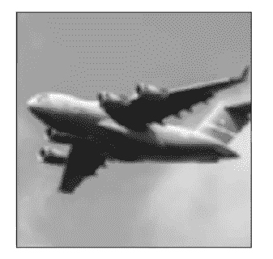
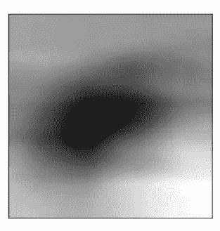
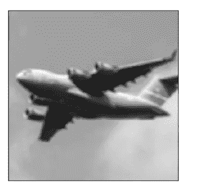
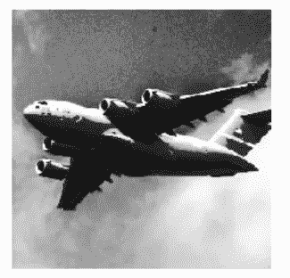
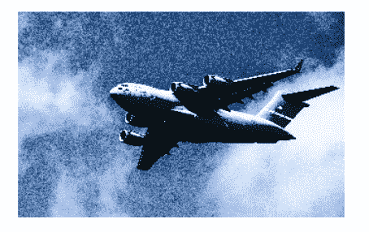
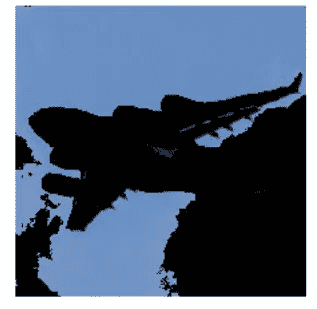
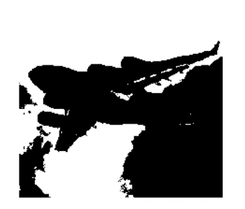
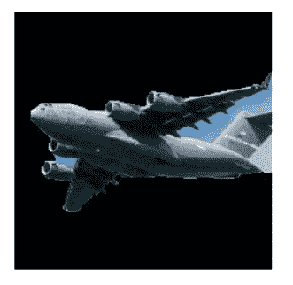

# 第二部分 Python 图像处理中的预处理技术

> 原文：<https://pub.towardsai.net/part-ii-pre-processing-techniques-in-image-processing-with-python-17fb628453ff?source=collection_archive---------0----------------------->

## [计算机视觉](https://towardsai.net/p/category/computer-vision)

## OpenCV 下的图像处理技术


由 [Patrick](https://unsplash.com/@patuphotos?utm_source=medium&utm_medium=referral) 在 [Unsplash](https://unsplash.com?utm_source=medium&utm_medium=referral) 上拍摄

在本文中，我们将使用 OpenCV 工具进行图像处理。

## 涵盖的主题:

*   **模糊图像**
*   **增强对比度**
*   **隔离颜色**
*   **移除背景**

[](/pre-processing-techniques-in-image-processing-with-python-81e5c8babf09) [## Python 图像处理中的预处理技术

### OpenCV 下的图像处理技术

pub.towardsai.net](/pre-processing-techniques-in-image-processing-with-python-81e5c8babf09) 

## 模糊图像

当我们试图模糊图像时，每个像素将被转换为其相邻像素的平均值。将对可以表示为内核的相邻像素执行数学运算。该内核的大小有助于确定模糊量，较大的内核产生更平滑的图像。

例如，我们希望通过平均每个像素周围的 5*5 内核的值来模糊图像。

```
# Load libraries
import cv2
import numpy as np
from matplotlib import pyplot as plt# Load image as grayscale
image = cv2.imread(“images/plane_256x256.jpg”, cv2.IMREAD_GRAYSCALE)# Blur image
image_blurry = cv2.blur(image, (5,5))# Show image
plt.imshow(image_blurry, cmap=”gray”), plt.axis(“off”)
plt.show()
```



作者的照片

现在，我们可以将内核大小增加到 100*100 来看看模糊的效果

```
# Blur image
image_very_blurry = cv2.blur(image, (100,100))# Show image
plt.imshow(image_very_blurry, cmap=”gray”), plt.xticks([]), plt.yticks([])
plt.show()
```



作者的照片

内核广泛用于图像处理步骤，如锐化、边缘检测等。

对于模糊图像，内核看起来像

```
# Create kernel
kernel = np.ones((5,5)) / 25.0# Show kernel
kernel#output: 
array([[ 0.04, 0.04, 0.04, 0.04, 0.04],
 [ 0.04, 0.04, 0.04, 0.04, 0.04],
 [ 0.04, 0.04, 0.04, 0.04, 0.04],
 [ 0.04, 0.04, 0.04, 0.04, 0.04],
 [ 0.04, 0.04, 0.04, 0.04, 0.04]])
```

出现在内核中的中心元素是被检查的像素，而其余的元素将是邻居。正如我们所看到的，所有元素都有相同的值，这意味着它们被归一化为相加为 1，其中感兴趣的像素的结果值。

我们可以手动这样做，并使用“filter2D”将它应用到图像的内核，以产生类似的模糊效果。

```
# Apply kernel
image_kernel = cv2.filter2D(image, -1, kernel)# Show imageplt.imshow(image_kernel, cmap=”gray”), plt.xticks([]), plt.yticks([])
plt.show()
```



作者的照片

[](/z-statistics-t-statistics-p-statistics-are-still-confusing-you-87557047e20a) [## Z-统计量，T-统计量，P-统计量还在迷惑你？

### 机器学习统计学中的定义和概念

pub.towardsai.net](/z-statistics-t-statistics-p-statistics-are-still-confusing-you-87557047e20a) 

## 增强对比度

当我们想要增强给定图像的像素之间的对比度时，图像处理将提供直方图均衡化工具，使图像中的对象和形状突出。

OpenCV 库为灰度图像提供了“均衡”方法。

```
# Load libraries
import cv2
import numpy as np
from matplotlib import pyplot as plt# Load image
image = cv2.imread(“images/plane_256x256.jpg”, cv2.IMREAD_GRAYSCALE)# Enhance image
image_enhanced = cv2.equalizeHist(image)# Show image
plt.imshow(image_enhanced, cmap=”gray”), plt.axis(“off”)
plt.show()
```



作者的照片

当我们有彩色图像时，首先将图像转换成 YUV 颜色格式。YUV 的独立色彩空间是亮度或亮度，即 Y 和颜色，即 U 和 v。转换完成后，直接对图像应用***【equalize hist】***方法，然后将其转换回 BGR 或 RGB 格式

```
# Load image
image_bgr = cv2.imread(“images/plane.jpg”)# Convert to YUV
image_yuv = cv2.cvtColor(image_bgr, cv2.COLOR_BGR2YUV)# Apply histogram equalization
image_yuv[:, :, 0] = cv2.equalizeHist(image_yuv[:, :, 0])# Convert to RGB
image_rgb = cv2.cvtColor(image_yuv, cv2.COLOR_YUV2RGB)# Show image
plt.imshow(image_rgb), plt.axis(“off”)
plt.show()
```



作者的照片

长话短说，这将图像转换为更宽范围的像素强度，得到的图像通常看起来不像真实的图像，而只是底层数据的视觉表示。

如果直方图均衡化方法可以区分图像中感兴趣的对象，那么它就增加了图像处理流水线的价值。

[](/word-cloud-with-python-82e833d8c636) [## 使用 Python 的词云

### 文本注释转换为词云可视化

pub.towardsai.net](/word-cloud-with-python-82e833d8c636) 

## 隔离颜色

借助 OpenCV 库分离图像中的颜色非常简单。要隔离图像中的颜色，请定义一个颜色范围，然后对图像应用蒙版。在步骤中，首先将图像转换为 HSV(色调、饱和度、值)格式。第二，定义一个范围的值，用于从图像中分离这些值，但这是一个困难且非常耗时的部分。最后，我们可以“使用 bitwise_and”为图像创建一个遮罩(保留白色区域)，并将其转换为所需的输出格式。

```
# Load libraries
import cv2
import numpy as np
from matplotlib import pyplot as plt# Load image
image_bgr = cv2.imread(‘images/plane_256x256.jpg’)# Convert BGR to HSV
image_hsv = cv2.cvtColor(image_bgr, cv2.COLOR_BGR2HSV)# Defining the range of HSV color space for blue color
lower_blue = np.array([50,100,50])
upper_blue = np.array([130,255,255])# Create mask
mask = cv2.inRange(image_hsv, lower_blue, upper_blue)# Mask image
image_bgr_masked = cv2.bitwise_and(image_bgr, image_bgr, mask=mask)# Convert BGR to RGB
image_rgb = cv2.cvtColor(image_bgr_masked, cv2.COLOR_BGR2RGB)# Show image
plt.imshow(image_rgb), plt.axis(“off”)
plt.show()
```



作者的照片

```
# Show image
plt.imshow(mask, cmap=’gray’), plt.axis(“off”)
plt.show()
```



作者的照片

## 移除背景

如果我们想要隔离图像的前景或移除图像中的背景，则在感兴趣的对象周围标记一个矩形，并运行“GrabCut”算法。

在代码结果中，我们可以发现“GrabCut”算法做得很好，但仍然有一些区域在图像中留下了轻微的背景。

为了避免这种情况，我们可以手动标记它们并删除不需要的区域，但在现实世界的应用程序中，我们会获得成千上万的图像，手动修复它们将会非常繁忙。

```
# Load library
import cv2
import numpy as np
from matplotlib import pyplot as plt# Load image and convert to RGB
image_bgr = cv2.imread(‘images/plane_256x256.jpg’)
image_rgb = cv2.cvtColor(image_bgr, cv2.COLOR_BGR2RGB)# Parameter of rectangle: (x, y, width, height)
rectangle = (0, 56, 256, 150)# Create initial mask
mask = np.zeros(image_rgb.shape[:2], np.uint8)# Create temporary arrays used by grabCut
bgdModel = np.zeros((1, 65), np.float64)
fgdModel = np.zeros((1, 65), np.float64)# Run grabCut
cv2.grabCut(image_rgb,           # Our image
 mask,                           # The Mask
 rectangle,                      # Our rectangle
 bgdModel,                       # Temporary array for background
 fgdModel,                       # Temporary array for background
 5,                              # Number of iterations
 cv2.GC_INIT_WITH_RECT)          # Initiative using our rectangle#Create mask where sure and likely backgrounds set to 0, otherwise 1
mask_2 = np.where((mask==2) | (mask==0), 0, 1).astype(‘uint8’)# To subtract background convolve original image and mask image
image_rgb_nobg = image_rgb * mask_2[:, :, np.newaxis]# Show image
plt.imshow(image_rgb_nobg), plt.axis(“off”)
plt.show()
```



作者的照片

在这里，我们在感兴趣的区域周围标记出矩形，“GrabCut”算法假设标记的矩形外部的每个元素都是背景，它使用此信息来计算标记的矩形内部的背景。然后我们创建一个遮罩来表示图像中不同的背景区域。

```
# Show mask
plt.imshow(mask, cmap=’gray’), plt.axis(“off”)
plt.show()
```


作者的照片

在上图中，黑色区域是标记矩形之外的区域，算法假定它是背景。灰色区域是由“GrabCut”算法学习的区域，作为图像中标记矩形内的背景。图像中的白色区域表示感兴趣的区域。

创建的蒙版非常有助于创建第二个蒙版，合并上面蒙版图像中的黑色和灰色区域，结果只保留了前景。

```
# Show mask
plt.imshow(mask_2, cmap=’gray’), plt.axis(“off”)
plt.show()
```


作者的照片

我希望你喜欢这篇文章。通过我的 [LinkedIn](https://www.linkedin.com/in/data-scientist-95040a1ab/) 和 [twitter](https://twitter.com/amitprius) 联系我。

# 推荐文章

[1。NLP —零到英雄与 Python](https://medium.com/towards-artificial-intelligence/nlp-zero-to-hero-with-python-2df6fcebff6e?sk=2231d868766e96b13d1e9d7db6064df1)
2。 [Python 数据结构数据类型和对象](https://medium.com/towards-artificial-intelligence/python-data-structures-data-types-and-objects-244d0a86c3cf?sk=42f4b462499f3fc3a160b21e2c94dba6)3 .[数据预处理概念同 Python](/data-preprocessing-concepts-with-python-b93c63f14bb6?source=friends_link&sk=5cc4ac66c6c02a6f02077fd43df9681a)
4。[用 Python 进行主成分分析降维](/principal-component-analysis-in-dimensionality-reduction-with-python-1a613006d531?source=friends_link&sk=3ed0671fdc04ba395dd36478bcea8a55)
5。[用 Python 全面讲解 K-means 聚类](https://medium.com/towards-artificial-intelligence/fully-explained-k-means-clustering-with-python-e7caa573176a?source=friends_link&sk=9c5c613ceb10f2d203712634f3b6fb28)
6。[用 Python](https://medium.com/towards-artificial-intelligence/fully-explained-linear-regression-with-python-fe2b313f32f3?source=friends_link&sk=53c91a2a51347ec2d93f8222c0e06402)
7 全面讲解了线性回归。[用 Python](https://medium.com/towards-artificial-intelligence/fully-explained-logistic-regression-with-python-f4a16413ddcd?source=friends_link&sk=528181f15a44e48ea38fdd9579241a78)
充分解释了 Logistic 回归 8。[用 Python 实现时间序列的基础知识](https://medium.com/towards-artificial-intelligence/basic-of-time-series-with-python-a2f7cb451a76?source=friends_link&sk=09d77be2d6b8779973e41ab54ebcf6c5)
9。[与 Python 的数据角力—第一部分](/data-wrangling-with-python-part-1-969e3cc81d69?source=friends_link&sk=9c3649cf20f31a5c9ead51c50c89ba0b)
10。[机器学习中的混淆矩阵](https://medium.com/analytics-vidhya/confusion-matrix-in-machine-learning-91b6e2b3f9af?source=friends_link&sk=11c6531da0bab7b504d518d02746d4cc)