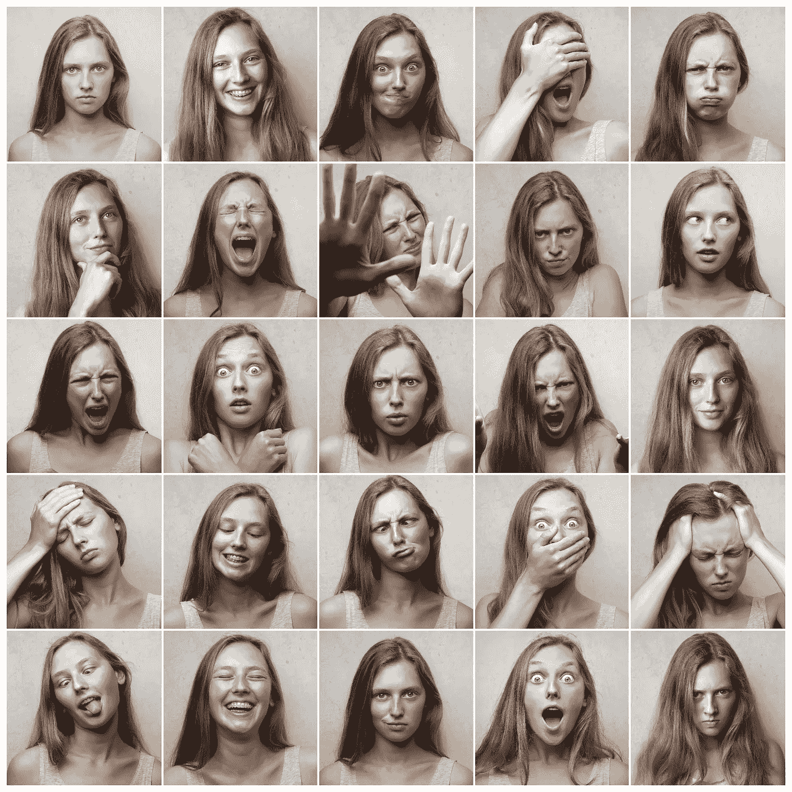
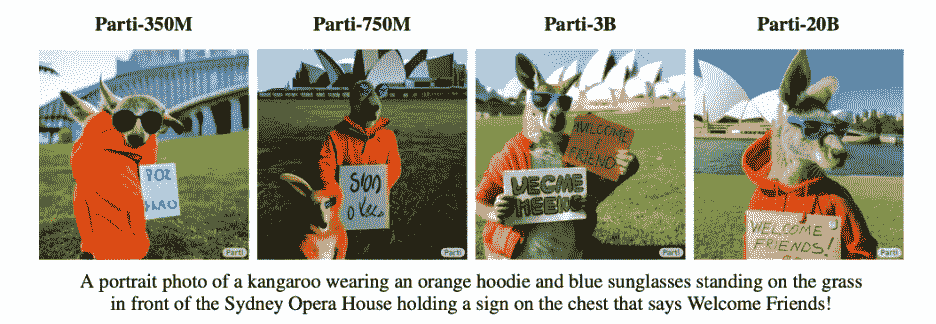
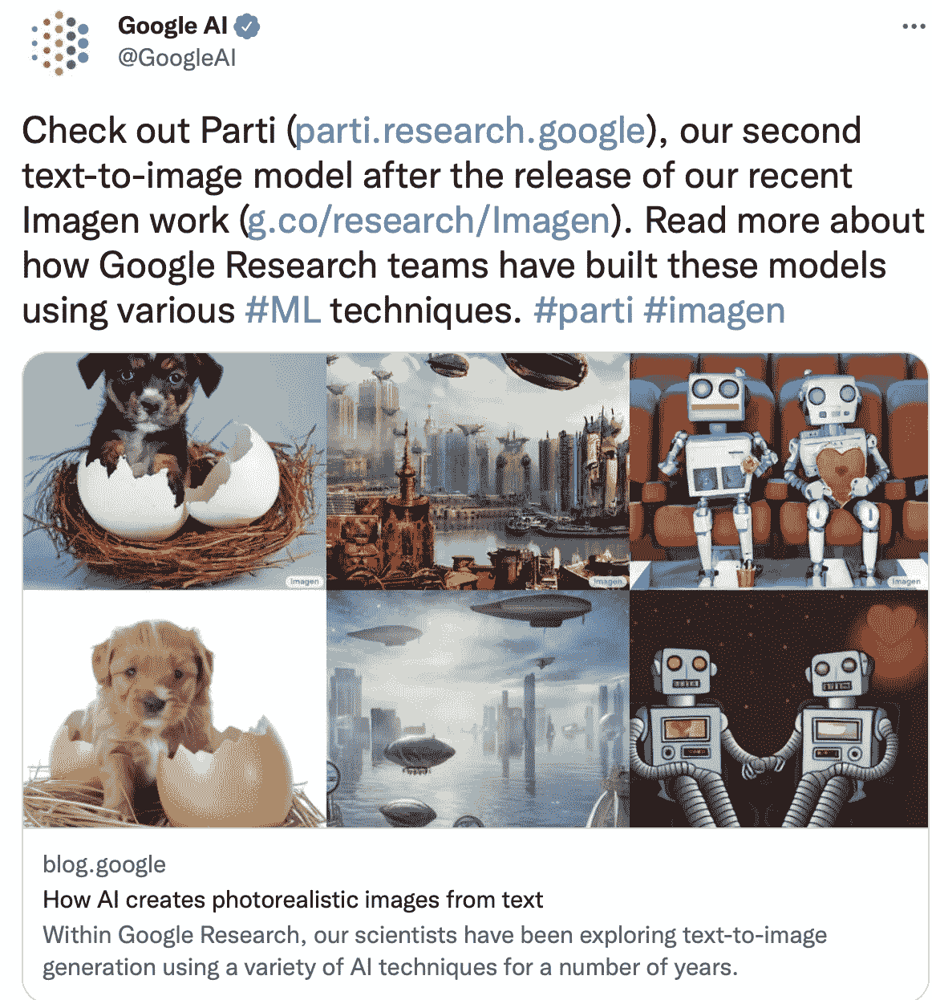
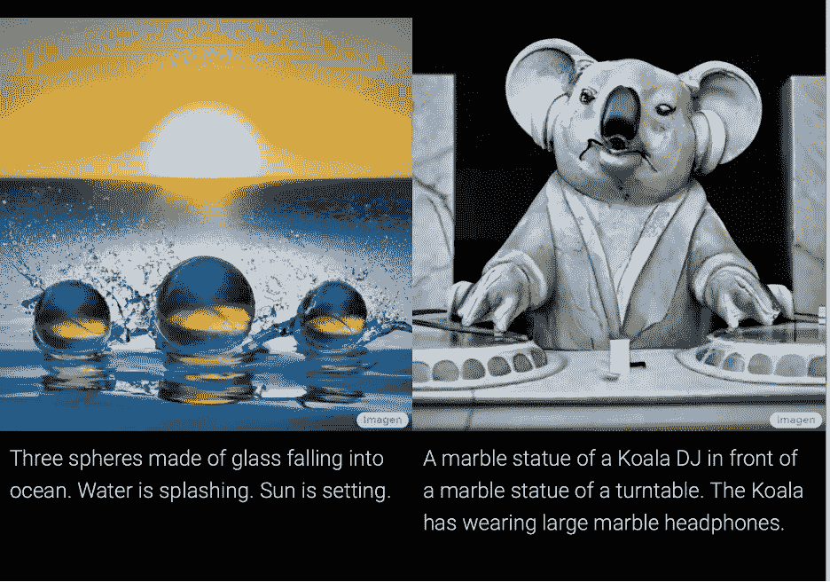
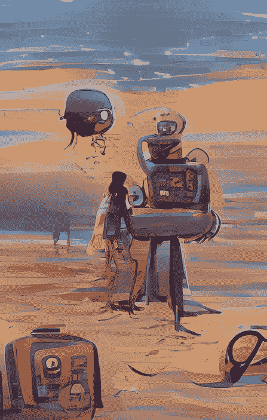

# Parti、Imagen 和 Wombo:它们的差异和 2022 年更新

> 原文：<https://pub.towardsai.net/parti-imagen-and-wombo-their-differences-and-2022-updates-6f61a5ea8e90?source=collection_archive---------4----------------------->

比较图像生成功能及其更新。

来自 Pexels 的 Andrea Piacquadio

# Parti 是什么:

1.pathways auto regressive Text-to-Image(Parti)是一种文本到图像模型，可以从文本描述中生成“高保真的照片级真实感”[3]图像。

2.Parti 基于神经网络，使用序列到序列(Seq2Seq)架构(“类似于机器翻译，以图像标记序列作为目标输出，而不是另一种语言的文本标记”)[1]。

3.Parti 可以从文本描述中生成物体、场景和人物的图像。

4.Parti 可以在不同的数据集上进行训练，并可用于各种应用程序，它可以为不属于训练数据的新图像生成文本到图像的映射。

谷歌人工智能关于 Parti 的推文[6]

5.Parti 正在去往 Github 的路上，可以在这里找到(关于目前正在发布的内容的更多细节):【https://github.com/google-research/parti 

6.它在大型文本-图像对语料库上进行训练，以学习文本和图像之间的映射。

7.该建模方法高效且可扩展，可应用于各种任务，如图像字幕和视觉问答。

8.当谈到视觉读写技能的发展时，Patri 可以用来增强解决问题和批判性思维的技能。

9.Parti 的编码器-解码器已经调整到 20B 参数[3]，新的“MS-COCO 上最先进的零炮 FID 分数为 7.23，微调的 FID 分数为 3.22”[1]。

10.Parti 在 Lingvo 中实现，并在 TPU v4 硬件上使用 GSPMD 进行缩放，以进行训练和推理，从而获得 20B 参数模型[2]。

来自[4]

# 1.Imagen 是什么？

Imagen 是谷歌开发的文本到图像扩散模型。它允许用户使用文本查询来搜索图像。

## 2.Imagen 是如何工作的？

Imagen 的工作原理是将文本查询与用相似关键字标记的图像进行匹配。然后，它使用各种算法来确定用户的最佳结果。

## 3.使用 Imagen 有什么好处？

使用 Imagen 的好处包括使用自然语言搜索图像的能力、查找相似图像的能力和发现新图像的能力。

## 4.使用 Imagen 有什么弊端？

使用 Imagen 的缺点包括它不能精确地回答您的特定查询。

## 5.我如何改进我的 Imagen 结果？

你可以做一些事情来改善你的图片效果。首先，确保你使用了正确的关键词。第二，当你搜索的时候，尽量具体。

归本帖作者所有:冬天的卡普里。

# Imagen 进行输出的高级程序是什么？

1.Imagen 的文本到图像扩散模型从文本输入开始，然后由文本到图像引擎处理。

2.然后，该引擎从库存图像数据库中提取相关图像，并从头开始生成新图像。

3.对图像进行一系列变换，例如缩放、旋转和平移，以创建一组扩散变换图像。

4.然后，转换后的图像通过一个选择函数，该函数选择最佳图像来表示文本输入。

5.然后，所选择的图像再次被扩散变换，并通过第二选择函数。

6.然后输出最终图像。

由这篇文章的作者拥有:一个机器人在沙滩上与人类交谈。

# 与此同时，你可以开始创造视觉效果:

使用 Wombo，你只需输入一个提示，然后选择你希望它从中获得灵感的艺术风格(你不必选择一种风格，但可以选择)，然后使用他们的网站或移动应用程序“开始创作”[5]。

如果您想要根据您的图像“训练”模型的输出，您可以上传一个。因此，您可以根据您希望照片对模型施加的影响量来预期输出。

# 文本到图像的功能将如何改变行业？

1.允许企业根据其输入标准轻松创建带有图像的营销和广告材料；这种方法将使企业更容易创建包含文本和图像的有凝聚力的活动，从而定制营销内容以瞄准其受众。

2.使企业能够创建更具吸引力和视觉吸引力的内容；像这样的方法可以帮助企业更好地从竞争对手中脱颖而出，并抓住目标受众的注意力。

3.帮助企业更好地与受众建立联系，创造更加个性化的联系。

4.允许企业创建更吸引人和视觉上更吸引人的内容来吸引和留住客户，例如更好地传达他们的信息和更好地传达他们的品牌身份。

就这样了，伙计们。我们调查了 Parti，Imagen 和 Wombo。如果这里有任何事情或各种话题需要我解答，请给我发消息。

参考:

[1]研究:[https://arxiv.org/abs/2206.10789](https://arxiv.org/abs/2206.10789)

[2] Parti 网址:[https://Parti . research . Google](https://parti.research.google/)

[3]Parti Github:【https://github.com/google-research/parti 

[4] Imagen 网址:[https://Imagen . research . Google](https://imagen.research.google/)

[5] Wombo 网址: [https://www.wombo.art](https://www.wombo.art/)

[6]谷歌人工智能关于 Parti 的推文:[https://bit.ly/3nDemaH](https://bit.ly/3nDemaH)