# 将分类算法应用于过去的贷款数据

> 原文：<https://pub.towardsai.net/past-loan-data-75710e4552ed?source=collection_archive---------0----------------------->

## KNN，决策树，支持向量机，逻辑回归

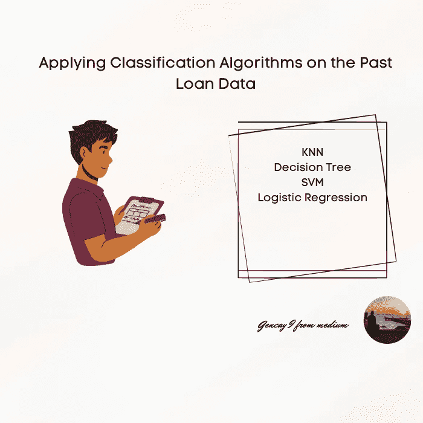

作者图片

在这个数据集中，我将对过去的贷款数据进行分类机器学习分析，这些数据是；

*   k 最近邻(KNN)
*   决策图表
*   支持向量机
*   逻辑回归

```
Content Table· [Data Visualization](#7f67)
· [One hot encoding](#5891)
· [Feature Selection](#d45a)
· [Normalize Data](#c4ed)
· [Classification](#71cd)
 ∘ [K Nearest Neighbor](#b540)
 ∘ [Evaluation Metrics of KNN](#8b51)
 ∘ [Decision Tree](#8300)
 ∘ [Evaluation Metrics of Decision Tree](#5730)
 ∘ [Support Vector Machine](#83d7)
 ∘ [Evaluation Metrics of SVM](#5cc6)
 ∘ [Logistic Regression](#bf84)
 ∘ [Evaluation Metrics of Logistic Regression](#5f5d)
 ∘ [Model Evaluation using a Test set](#1eb5)
 ∘ [Jaccard Scores](#edfa)
 ∘ [F1 Scores](#8648)
 ∘ [Final Evaluation](#dd7e)
```

让我们加载必要的库；

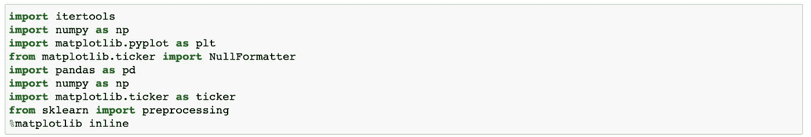

作者图片

**Loan_train.csv** 数据集包括 346 名贷款已经还清或违约的客户的详细信息。

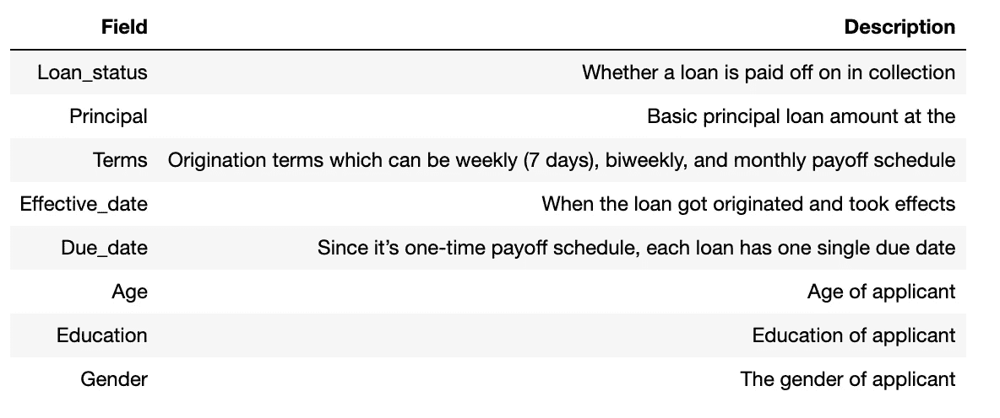

作者图片

让我们加载数据；

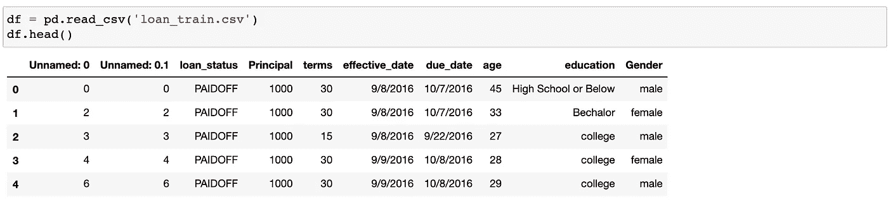

作者图片

看数据的形状，看全局总是有效的。

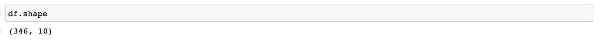

作者图片

现在，让我们修复数据框列类型。

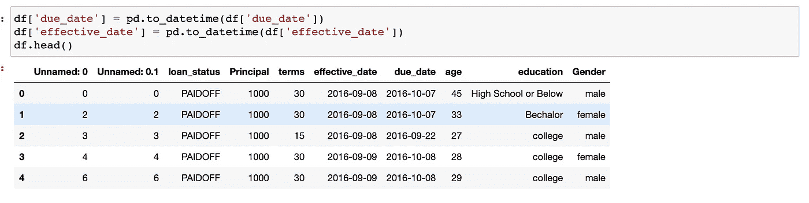

作者图片

# 数据可视化

让我们看看每个类在我们的数据集中有多少

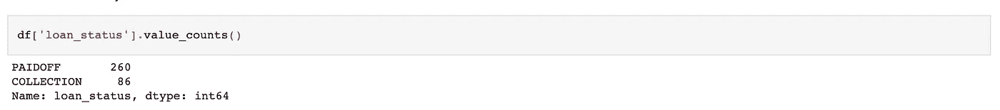

作者图片

让我们绘制一些列来更好地理解

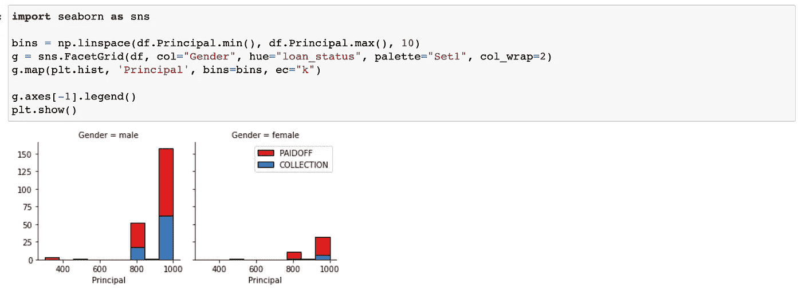

作者图片

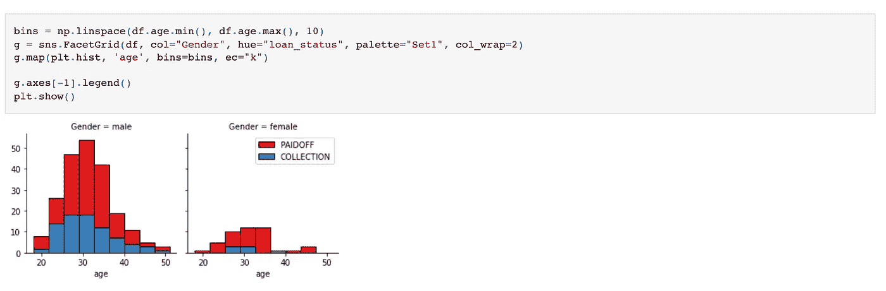

作者图片

让我们看看人们在一周的哪一天得到贷款

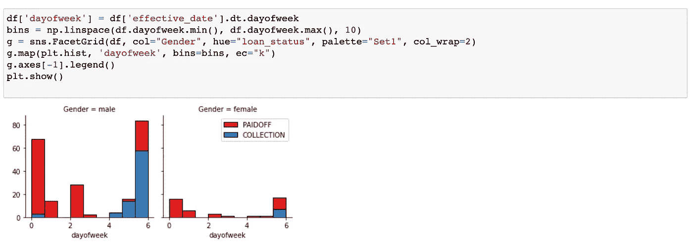

作者图片

我们看到在周末获得贷款的人没有还清贷款，所以让我们使用特征二值化来设置小于第 4 天的阈值

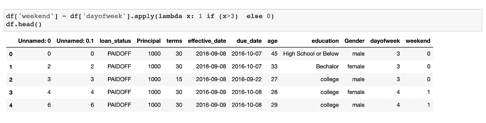

作者图片

现在是时候将分类特征改为数字特征了，因为我们将使用机器学习算法。

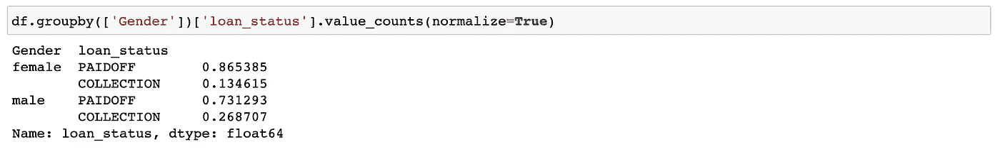

作者图片

86 %的女性偿还贷款，而只有 73 %的男性偿还贷款

让我们将男性转换为 0，女性转换为 1:

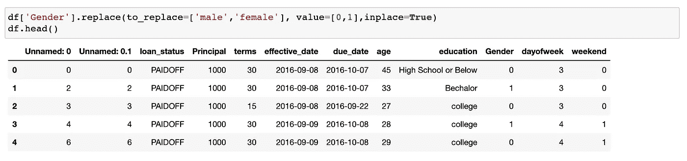

作者图片

# 一个热编码

现在让我们看看教育专栏。

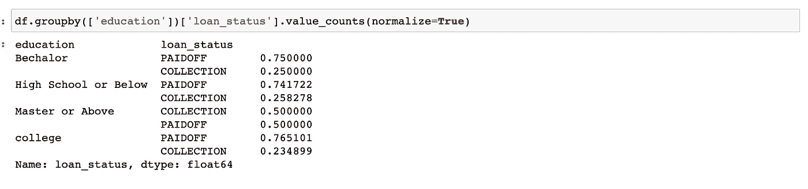

作者图片

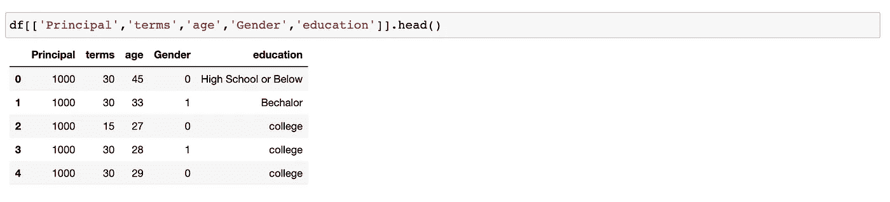

作者图片——这些是我们在预测中要用到的特征。

我们用假人将教育从分类转变为数字。

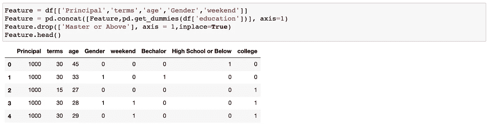

作者图片

# **功能选择**

让我们定义特征；

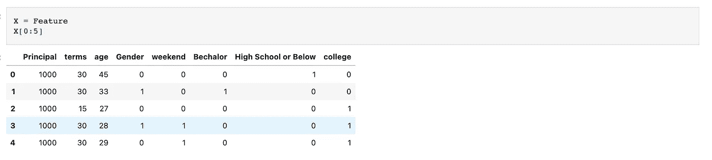

作者图片

现在是时候定义我们的标签了；

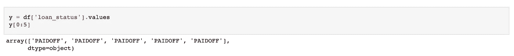

作者图片

# 标准化数据

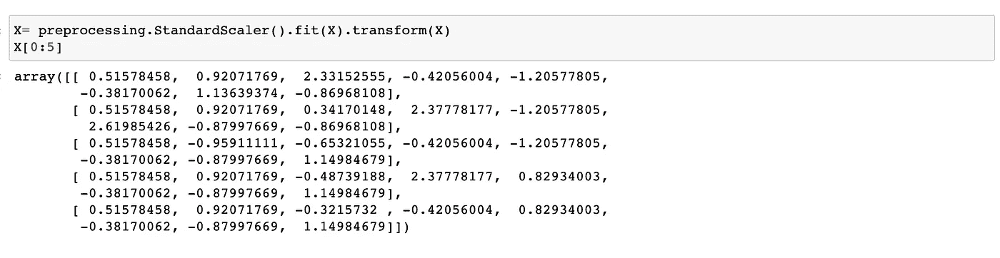

作者图片

# 分类

这些是我将在这个数据集中使用的分类技术。

*   k 最近邻(KNN)
*   决策图表
*   支持向量机
*   逻辑回归

## k 最近邻

现在是时候分割训练和测试数据了，通常是 0.2-0.8 份。

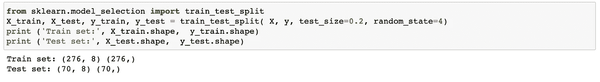

作者图片

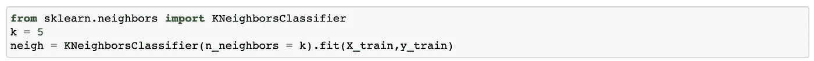

作者图片

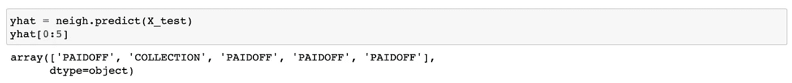

作者图片

现在是时候调查测试和训练数据的准确性了。

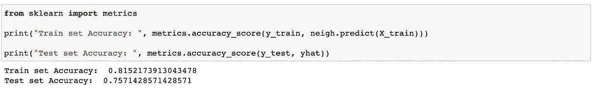

作者图片

定义最佳 K；

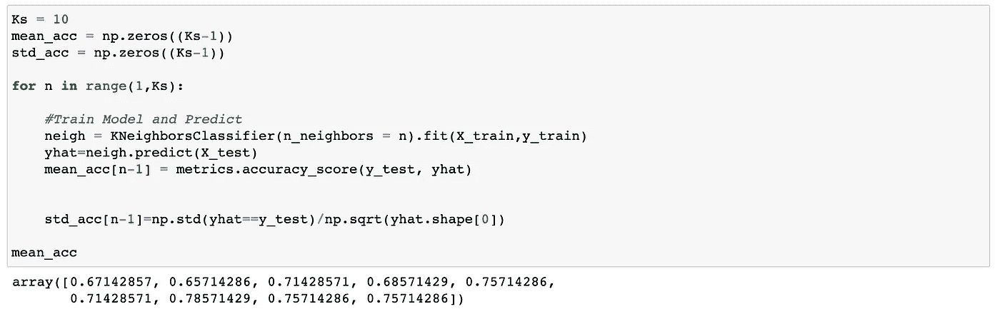

作者图片

如我们所见，结果 7 是我们数据的最佳 K。

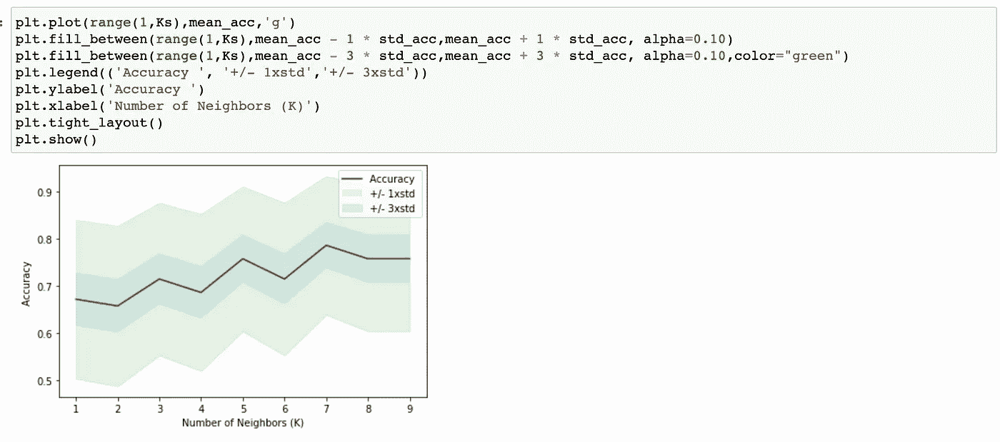

作者图片

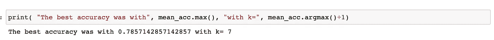

作者图片

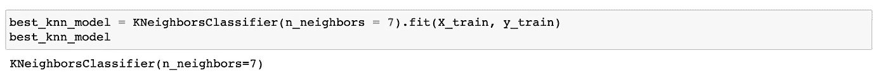

作者图片-适合模型

## KNN 的评价指标

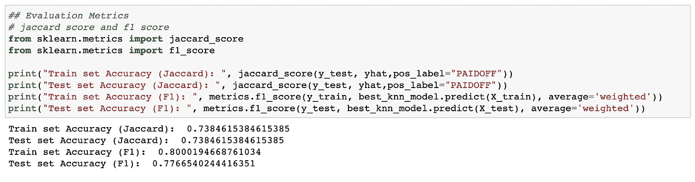

作者图片

## 决策图表

现在让我们尝试使用决策树算法。


作者图片

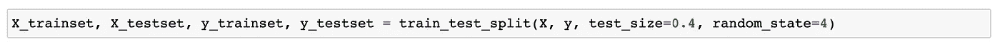

作者图片

确定最佳深度；

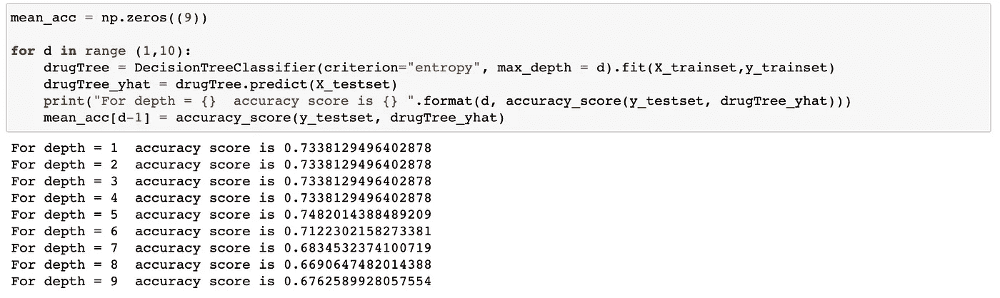

作者图片

根据准确度分数，5 是最佳深度分数。

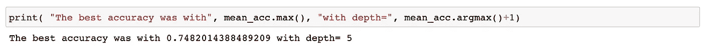

作者图片

让我们进行我们的算法，然后评估；

## 决策树的评价指标

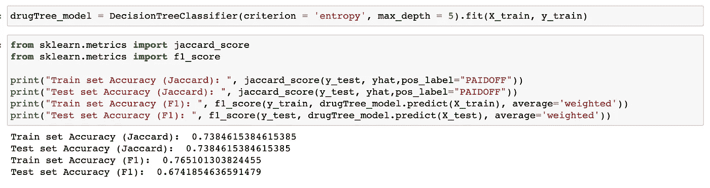

作者图片

## 支持向量机

现在让我们用 SVM。

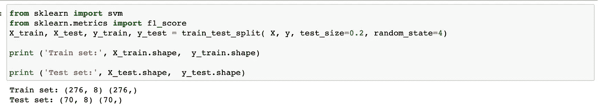

作者图片

找出 SVM 最好的模特；

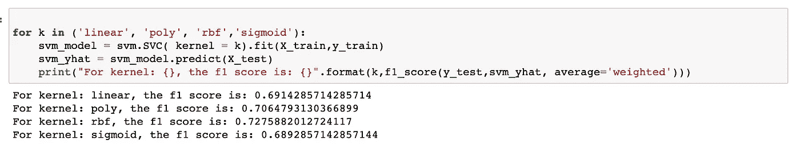

作者图片

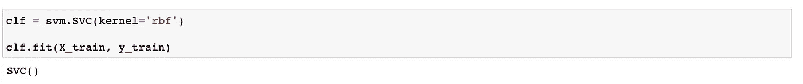

作者图片

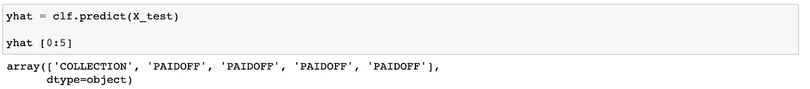

作者图片

## SVM 的评价指标

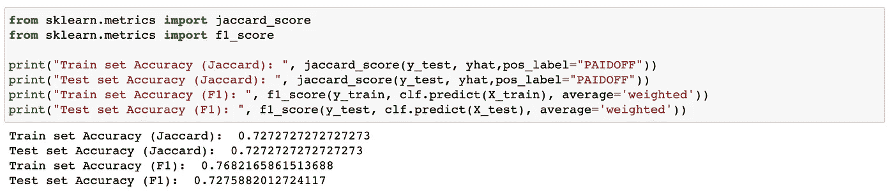

作者图片

## 逻辑回归

现在是使用逻辑回归的时候了。

让我们锁定和加载；

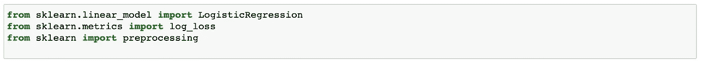

作者图片

列车-测试分离；

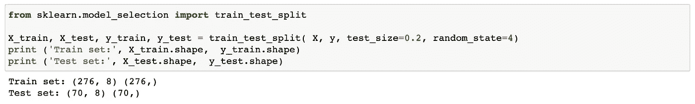

作者图片

找到最佳解算器；

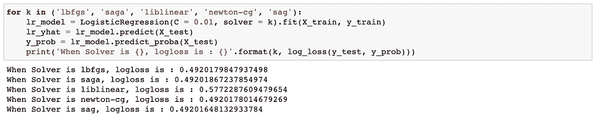

作者图片

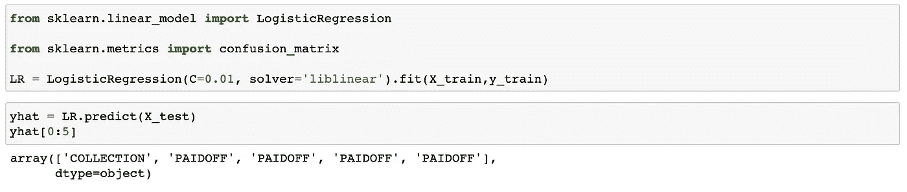

作者图片

## 逻辑回归的评价指标

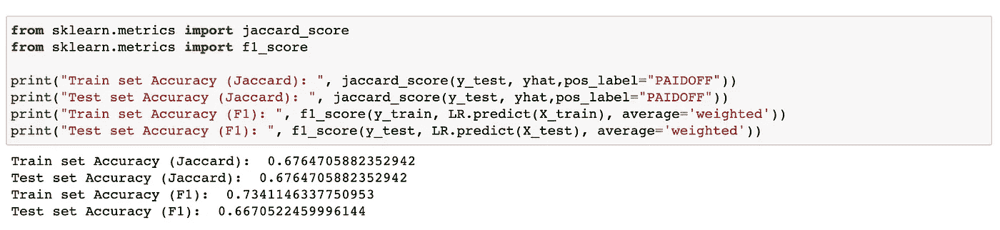

作者图片

## 使用测试集的模型评估

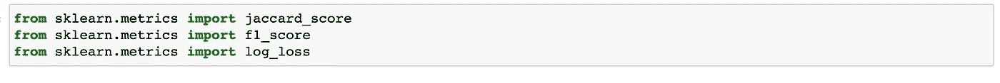

作者图片

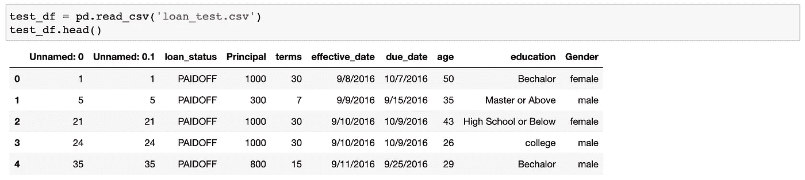

作者图片

数据处理；

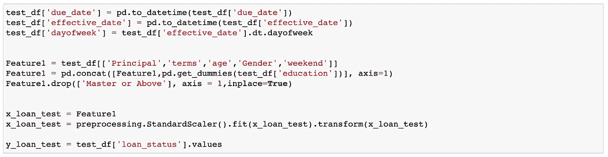

作者图片

## Jaccard 分数

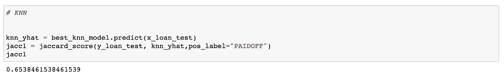

作者图片

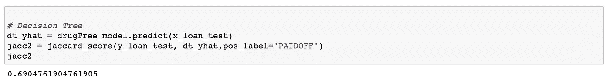

作者图片

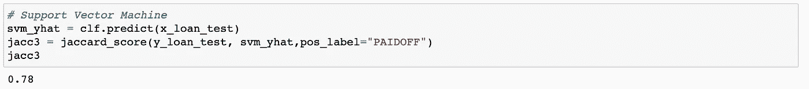

作者图片


作者图片

## F1 分数

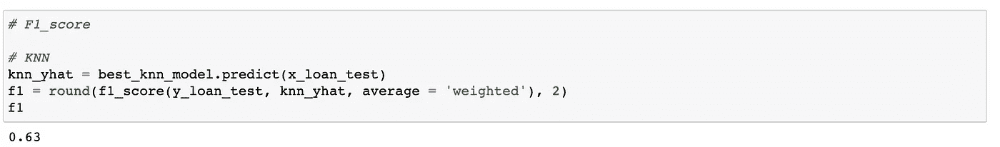

作者图片

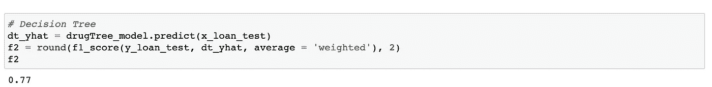

作者图片


作者图片


作者图片

## 最终评估


作者图片

感谢 IBM 的机器学习教程，它让我到达了那里。