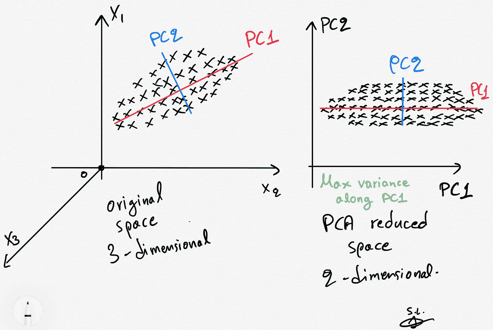
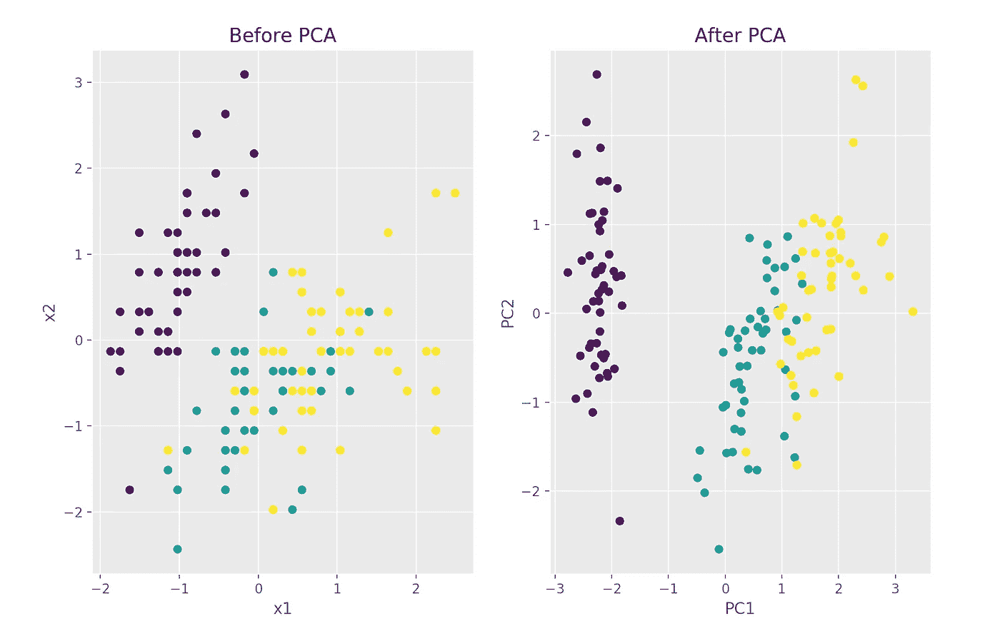
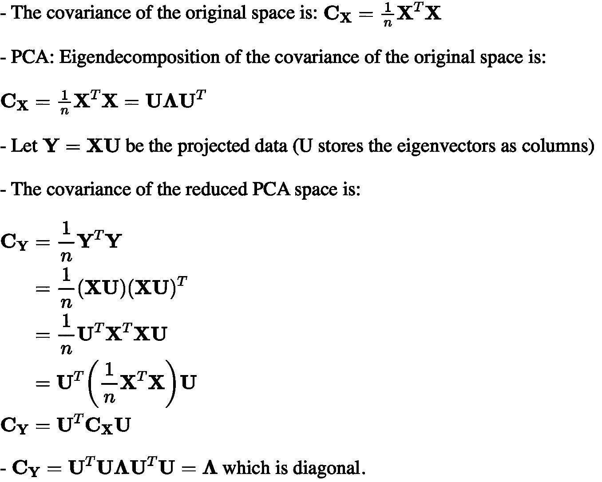
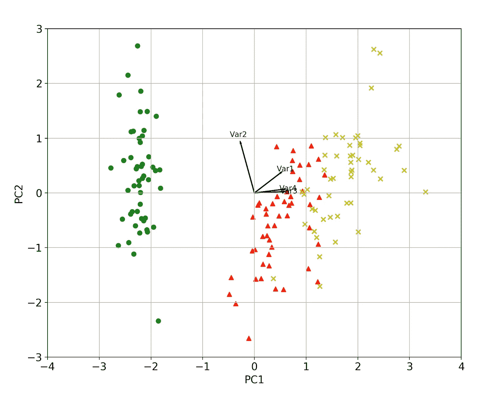

# PCA 清楚地解释了——何时、为什么、如何使用它以及特性的重要性:Python 指南

> 原文：<https://pub.towardsai.net/pca-clearly-explained-when-why-how-to-use-it-and-feature-importance-a-guide-in-python-56b3da72d9d1?source=collection_archive---------0----------------------->

## [数据科学](https://towardsai.net/p/category/data-science)，[机器学习](https://towardsai.net/p/category/machine-learning)

## 在这篇文章中，我解释了什么是 PCA，何时以及为什么使用它，以及如何使用 scikit-learn 在 Python 中实现它。此外，我解释了如何在 PCA 分析后得到特征的重要性。



**手工制作**草图**作者制作。**

# 1.简介和背景

**主成分分析** (PCA)是一种众所周知的**无监督******降维**技术，通过原始变量(特征)的线性(线性 PCA)或非线性(核 PCA) **组合**来构造**相关**特征/变量。在本帖中，我们将只关注著名且广泛使用的**线性 PCA** 方法。**

**相关特征的构建是通过将相关变量线性转换成较少数量的**不相关变量**来实现的。这是通过**使用协方差/相关矩阵的特征向量(也称为主分量(PCs ))将**(点积)原始数据投影到**缩减的 PCA 空间**中来完成的。**

****结果** **预计** **数据**实质上是**原始**数据**捕捉** **数据** ( [Jolliffe 2002](https://www.springer.com/gp/book/9780387954424) )中方差最大的 **。****

**总之， **PCA** 是数据到一系列**不相关**数据的**正交** **变换，这些数据存在于缩减的 PCA 空间中，使得第一个分量解释数据中的最大差异，而每个后续分量解释的较少。****

**如果你想在交互式路线图和活跃的学习社区的支持下自学数据科学，看看这个资源:[https://aigents.co/learn](https://aigents.co/learn)**

# **2.何时/为何使用 PCA**

*   **PCA 技术在处理**多** - **共线性**存在于**特征** / **变量**之间的数据时特别有用。**
*   **当**输入特征的尺寸较大**(如大量变量)时，可使用 PCA。**
*   **PCA 还可以用于**去噪**和**数据**压缩。**

# **3.主成分分析方法的核心**

**设`**X**`是包含形状为`[n_samples, n_features]`的原始数据的矩阵。**

**简而言之， **PCA** 分析由以下**步骤**组成:**

*   **首先，`**X**`中存储的原始输入变量是 **z 得分**，这样每个原始变量(`**X**`列)的平均值和单位标准差为零。**
*   **下一步涉及**协方差**矩阵`**Cx= (1/n)X'X**`的构造和 [**特征分解**](https://en.wikipedia.org/wiki/Eigendecomposition_of_a_matrix) (在 z 得分数据的情况下，协方差等于相关矩阵，因为所有特征的标准偏差为 1)。**
*   ****特征值**然后按照**递减**的顺序**排序**，表示数据中的递减方差(特征值等于方差——我将在下面第 6 段使用 Python 来证明这一点)。**
*   **最后，**原始** **归一化** **数据**到**约简 PCA 空间**的**投影**(变换)通过**乘以**(点积)**原始归一化数据**与协方差矩阵即 PCs 的**前导** **特征向量**得到。**
*   **新的**减少的** PCA 空间**最大化**原**数据的**方差**。为了**可视化**投影数据以及原始变量的贡献，在联合绘图中，我们可以使用**双绘图**。****

# **4.有意义组件的最大数量**

****有意义的** **成分**有一个**上** **界**，可以用 **PCA** 提取。这与**协方差/相关性**矩阵(`**Cx**`)的 [**秩**](https://stattrek.com/matrix-algebra/matrix-rank.aspx) 有关。具有形状为`[n_samples, n_features/n_variables]`的数据矩阵`**X**`，则**协方差** / **相关性**矩阵将为`[n_features, n_features]`，其中**最大秩**等于`min(n_samples, n_features)`。**

**因此，我们可以在**处拥有最** `min(n_samples, n_features)` **有意义的** PC **组件/维度**归因于协方差/相关矩阵的**最大值** [**秩**](https://stattrek.com/matrix-algebra/matrix-rank.aspx) 。**

# **5.使用 scikit-learn 和 Iris 数据集的 Python 示例**

```
import numpy as np
import matplotlib.pyplot as plt
from sklearn import datasets
from sklearn.decomposition import PCA
import pandas as pd
from sklearn.preprocessing import StandardScaler
plt.style.use('ggplot')# Load the data
iris = datasets.load_iris()
X = iris.data
y = iris.target# Z-score the features
scaler = StandardScaler()
scaler.fit(X)
X = scaler.transform(X)# The PCA model
pca = PCA(n_components=2) # estimate only 2 PCs
X_new = pca.fit_transform(X) # project the original data into the PCA space
```

**让我们在 PCA 变换之前和**变换之后绘制数据，并使用花** `(y)`的相应**类对每个点(样本)进行**颜色**编码。****

```
fig, axes = plt.subplots(1,2)axes[0].scatter(X[:,0], X[:,1], c=y)
axes[0].set_xlabel('x1')
axes[0].set_ylabel('x2')
axes[0].set_title('Before PCA')axes[1].scatter(X_new[:,0], X_new[:,1], c=y)
axes[1].set_xlabel('PC1')
axes[1].set_ylabel('PC2')
axes[1].set_title('After PCA')plt.show()
```

****

**上面的 PCA 输出代码。**

**我们可以看到在 PCA 空间中，**方差**是沿着**PC1** **PC2** **最大化**(解释了 73%的方差)和**PC2**(解释了 22%的方差)。两者加起来解释了 95%。**

```
print(pca.explained_variance_ratio_)
# array([0.72962445, 0.22850762])
```

# **6.原协方差矩阵特征值等于约简空间方差的证明**

## **数学公式和证明**

**假设存储在`**X**`中的原始输入变量是 **z 得分的**，这样每个原始变量(`**X**`列)具有零均值和单位标准偏差，我们有:**

****

**作者写的 Latex 代码。**

**上面的`**Λ**`矩阵存储了原始**空间/数据集的**协方差**矩阵的**特征值**。****

## **使用 Python 验证**

****最大方差证明**也可以通过估计**约简** **空间**的**协方差**矩阵来看:**

```
np.cov(X_new.T)array([[**2.93808505e+00**, 4.83198016e-16],
       [4.83198016e-16, **9.20164904e-01**]])
```

**我们观察到这些值(对角线上有方差)等于存储在`pca.explained_variance_`中的协方差的**实际** **特征值**:**

```
pca.explained_variance_
array([2.93808505, 0.9201649 ])
```

# **7.特征重要性**

**每个**特征**的**重要性**由特征向量中**对应值的**量级**来反映(量级越高，重要性越高)。****

**让我们找到**最重要的特征:****

```
print(abs( pca.components_ ))[[0.52106591 0.26934744 0.5804131 0.56485654]
 [0.37741762 0.92329566 0.02449161 0.06694199]]
```

**这里，`pca.components_`具有形状`[n_components, n_features]`因此，通过查看 **PC1** (第一主成分)即**第一**行**行****

```
[[0.52106591 0.26934744 0.5804131 0.56485654]
```

**我们可以得出结论，对于 **PC1 来说，**特性 1、3 和 4** 是**最重要的**。**同样，我们可以说**特征 2** 和那么 **1** 就是****对于 **PC2 来说最重要的**。******

***综上所述，我们看特征向量的分量的绝对值对应于* ***k*** *最大特征值。在 sklearn 中，组件按解释的方差排序。* ***这些绝对值越大，特定特征对该主成分的贡献越大。*****

# **8.双地块**

****双标图**是在 **PCA** 分析后可视化**一体化**的最佳方式。**

**在 [**R**](https://www.rdocumentation.org/packages/stats/versions/3.6.2/topics/biplot) 中有一个实现，但是在 **python** 中没有标准实现，所以我决定为此编写自己的**函数**:**

```
def biplot(score, coeff , y):
    '''
    Author: Serafeim Loukas, serafeim.loukas@epfl.ch
    Inputs:
       score: the projected data
       coeff: the eigenvectors (PCs)
       y: the class labels
   '''xs = score[:,0] # projection on PC1
    ys = score[:,1] # projection on PC2
    n = coeff.shape[0] # number of variables
    plt.figure(figsize=(10,8), dpi=100)
    classes = np.unique(y)
    colors = ['g','r','y']
    markers=['o','^','x']
    for s,l in enumerate(classes):
        plt.scatter(xs[y==l],ys[y==l], c = colors[s], marker=markers[s]) # color based on group
    for i in range(n):
        #plot as arrows the variable scores (each variable has a score for PC1 and one for PC2)
        plt.arrow(0, 0, coeff[i,0], coeff[i,1], color = 'k', alpha = 0.9,linestyle = '-',linewidth = 1.5, overhang=0.2)
        plt.text(coeff[i,0]* 1.15, coeff[i,1] * 1.15, "Var"+str(i+1), color = 'k', ha = 'center', va = 'center',fontsize=10)

    plt.xlabel("PC{}".format(1), size=14)
    plt.ylabel("PC{}".format(2), size=14)
    limx= int(xs.max()) + 1
    limy= int(ys.max()) + 1
    plt.xlim([-limx,limx])
    plt.ylim([-limy,limy])
    plt.grid()
    plt.tick_params(axis='both', which='both', labelsize=14)
```

**调用函数(确保首先运行加载虹膜数据和执行 PCA 分析的初始代码块):**

```
import matplotlib as mpl
mpl.rcParams.update(mpl.rcParamsDefault) # reset ggplot style# Call the biplot function for only the first 2 PCs
biplot(X_new[:,0:2], np.transpose(pca.components_[0:2, :]), y)
plt.show()
```

****

**使用我的自定义函数的 PCA 双图。**

**我们可以再次从视觉上验证****a)**方差最大化 **b)** 特征 1、3 和 4 是 **PC1 最重要的**。**同样，**功能 2** 和**功能 1**和**功能 1** 都是**功能**功能**对于 **PC2 最重要的**。********

此外，指向**相同** **方向**的**箭头**(变量/特征)表示它们所代表的变量之间的**相关性**，而指向与 **方向**相反**的箭头表示它们所代表的变量之间的**对比**。**

**使用**代码**验证**上述内容:

```
# **Var 3 and Var 4** are extremely **positively** correlated
np.corrcoef(X[:,2], X[:,3])[1,0]
0.9628654314027957# **Var 2and Var 3** are **negatively** correlated
np.corrcoef(X[:,1], X[:,2])[1,0]
-0.42844010433054014
```

那都是乡亲们！希望你喜欢这篇文章！

# 最新帖子

[](https://towardsdatascience.com/time-series-forecasting-predicting-stock-prices-using-facebooks-prophet-model-9ee1657132b5) [## 时间序列预测:用脸书的先知模型预测股票价格

### 使用可从《先知脸书》公开获得的预测模型预测股票价格

towardsdatascience.com](https://towardsdatascience.com/time-series-forecasting-predicting-stock-prices-using-facebooks-prophet-model-9ee1657132b5) [](https://towardsdatascience.com/roc-curve-explained-using-a-covid-19-hypothetical-example-binary-multi-class-classification-bab188ea869c) [## 用新冠肺炎假设的例子解释 ROC 曲线:二分类和多分类…

### 在这篇文章中，我清楚地解释了什么是 ROC 曲线以及如何阅读它。我用一个新冠肺炎的例子来说明我的观点，我…

towardsdatascience.com](https://towardsdatascience.com/roc-curve-explained-using-a-covid-19-hypothetical-example-binary-multi-class-classification-bab188ea869c) [](https://towardsdatascience.com/support-vector-machines-svm-clearly-explained-a-python-tutorial-for-classification-problems-29c539f3ad8) [## 支持向量机(SVM)解释清楚:分类问题的 python 教程…

### 在这篇文章中，我解释了支持向量机的核心，为什么以及如何使用它们。此外，我还展示了如何绘制支持…

towardsdatascience.com](https://towardsdatascience.com/support-vector-machines-svm-clearly-explained-a-python-tutorial-for-classification-problems-29c539f3ad8) [](https://towardsdatascience.com/everything-you-need-to-know-about-min-max-normalization-in-python-b79592732b79) [## 关于 Python 中的最小-最大规范化，您需要知道的一切

### 在这篇文章中，我将解释什么是最小-最大缩放，什么时候使用它，以及如何使用 scikit 在 Python 中实现它

towardsdatascience.com](https://towardsdatascience.com/everything-you-need-to-know-about-min-max-normalization-in-python-b79592732b79) [](https://towardsdatascience.com/how-and-why-to-standardize-your-data-996926c2c832) [## Scikit-Learn 的标准定标器如何工作

### 在这篇文章中，我将解释为什么以及如何使用 scikit-learn 应用标准化

towardsdatascience.com](https://towardsdatascience.com/how-and-why-to-standardize-your-data-996926c2c832) 

# 敬请关注并支持这一努力

如果你喜欢并发现这篇文章有用，**关注我吧！**

有问题吗？把它们作为评论贴出来，我会尽快回复。

# 参考

[1] Jolliffe，I. T. *主成分分析。纽约州纽约市:斯普林格出版社，2002 年。*

[https://en.wikipedia.org/wiki/Principal_component_analysis](https://en.wikipedia.org/wiki/Principal_component_analysis)

[https://stattrek.com/matrix-algebra/matrix-rank.aspx](https://stattrek.com/matrix-algebra/matrix-rank.aspx)

# 和我联系

*   **LinkedIn**:【https://www.linkedin.com/in/serafeim-loukas/ 
*   https://www.researchgate.net/profile/Serafeim_Loukas**研究之门**:[](https://www.researchgate.net/profile/Serafeim_Loukas)