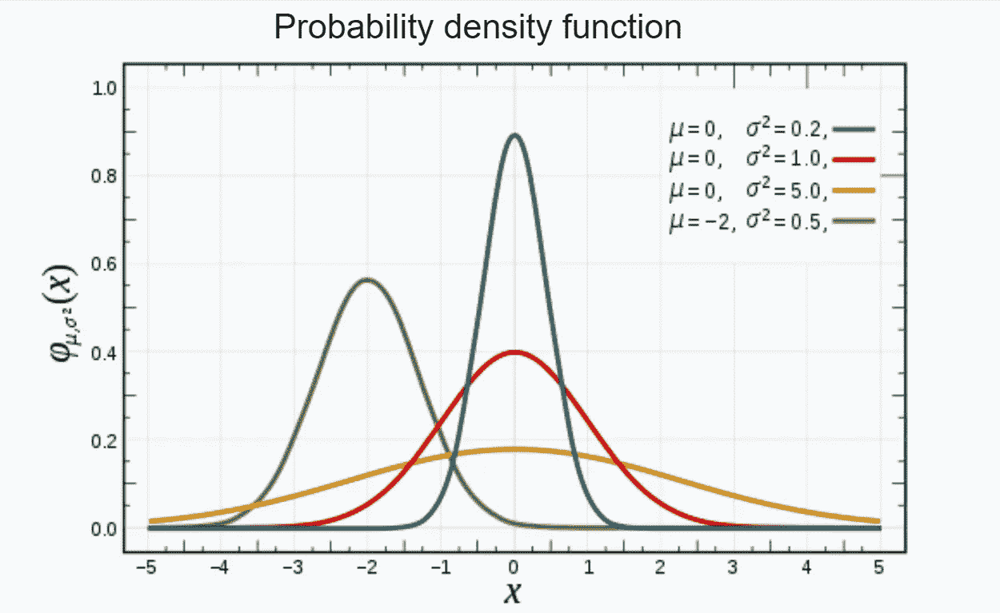
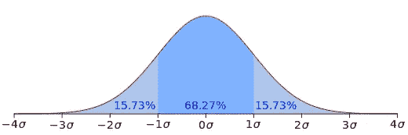
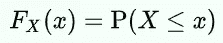
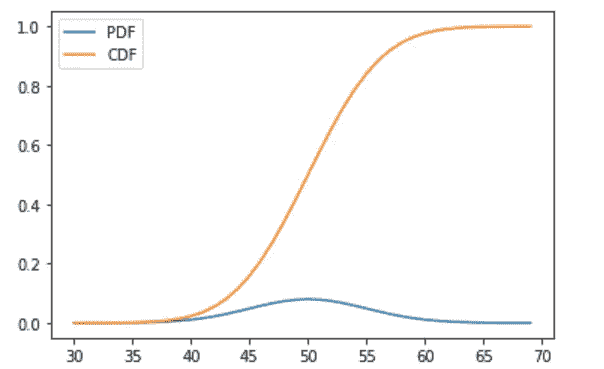

# 机器学习中的 PDF，CDF

> 原文：<https://pub.towardsai.net/pdf-cdf-in-machine-learning-5a10f7abeef6?source=collection_archive---------0----------------------->


PDF 和 CDF 对于数据分析非常有用(图片来自 [Pixabay](https://pixabay.com/photos/graph-chart-investment-growth-hand-4737109/)

## [机器学习](https://towardsai.net/p/category/machine-learning)

## 简而言之，两个最重要的统计功能

*PDF 和 CDF* 统计函数是*探索性数据分析中广泛使用的技术*到寻找变量之间的概率关系。在讨论这些函数之前，让我们先了解几个术语。

## 随机变量:

> **随机变量**是一个**变量**，其值是未知的，或者是一个为每个实验结果赋值的函数。

它仅仅意味着一个*随机变量*是一个实验的可能结果的集合*。*

随机变量用于量化随机事件的结果，因此可以取很多值。随机变量根据其取值类型分为两类。

*   如果随机变量属于这组值，则称为一个 ***离散随机变量*** 。例如，一个扔硬币的随机实验要么是正面要么是反面。
*   如果随机变量是取值范围，则称为 ***连续随机变量*** 。例如，寻找特定区域中人的平均身高的随机实验。

**在本文中，我们将用一个简单的代码来讨论 PDF 和 CDF 绘图。**

文章的流程如下:

*   概率密度函数
*   累积密度函数
*   为什么用这些？
*   绘制 PDF、CDF

## 概率密度函数

随机变量的 PDF 是随机变量和该随机变量的频率之间的图。它给出了随机变量的概率分布。

对于一个随机变量，给定分布类型，均值和方差，我们可以画出 PDF。在这里，我们能够构建一个 PDF，而不需要实际数据点的帮助。

让我们了解一下 PDF 是如何随均值和方差变化的。



具有不同均值和方差的正态分布的 PDF

均值表示分布的中心权重。方差表示分布的范围。随着方差的增加，分布的展宽增加，这意味着分布的高度降低，而分布的宽度增加。

## 68–95–97 规则:



正态分布的 PDF

PDF 的另一个重要观点是关于数据的百分比分布。如果数据是正态分布的，大约 68%的实际数据位于(-1 *标准差，+1 *标准差)的范围内。大约 95%的数据位于(-2 *标准差，+2 *标准差)的范围内。大约 97%的数据位于(-3 *标准差，+3 *标准差)的范围内

## 累积密度函数

CDF 是随机变量 X 取值小于或等于 X 的概率。CDF 总是介于 0 和 1 之间。



X 的 CDF

与 PDF 类似，CDF 可以在给定均值和方差的情况下绘制。

## 为什么要用 PDF，CDF？

pdf、CDF 广泛应用于数据分析。一旦知道了数据的分布、均值和方差，就很容易画出 PDF 和 CDF。这些图可以帮助找到数据分析中许多问题的解决方案。

考虑一个为组织订购衬衫的例子。让衬衫的尺码分为小号、中号和大号。一个很常见的问题是每种尺寸要订购多少。使用 PDF 和 CDF 可以轻松回答这些问题。

CDF 将给出大于某一值或小于某一值的人口百分比。从这种解释中，我们可以很容易地找到每一类人口的百分比。

## 绘制 PDF、CDF

下面是创建正态分布和绘制 PDF，CDF 的简单代码。

```
from scipy.stats import norm 
from matplotlib import pyplot
```

*norm* 用于创建正态分布数据。
*pyplot* 用于绘制 PDF、CDF。

```
# define distribution parameters
mean = 50
variance = 5
# create distribution
dist = norm(mean, variance)
```

这里，我们正在创建定义的平均值*(= 50)和方差*(= 5)的正态分布**

```
*# plot pdf
values = [value for value in range(30, 70)]
probabilities = [dist.pdf(value) for value in values]
pyplot.plot(values, probabilities,label = "PDF")*
```

*使用 pyplot，生成上述正态分布的 PDF。*

```
*# plot cdf
cprobs = [dist.cdf(value) for value in values]
pyplot.plot(values, cprobs,label = "CDF")
pyplot.legend()
pyplot.show()*
```

*使用 pyplot，生成上述正态分布的 CDF。*

***输出:***

**

*正态分布的概率密度函数*

***观察:***

*   *从 PDF 来看，当 X=50 时有一个凸起，分布的平均值是 50*
*   *从 CDF 来看，45 处的 CDF 为 0.2，55 处的 CDF 为 0.8。这意味着 60%的数据位于(45，55)中。任何范围内的数据百分比都可以用类似的方式从 CDF 中很容易地观察到。*

*谢谢你的阅读。我也将在未来写更多初学者友好的帖子。请在[媒体](https://medium.com/@ramyavidiyala)上关注我，以便了解他们。我欢迎反馈，可以通过 Twitter [ramya_vidiyala](https://twitter.com/ramya_vidiyala) 和 LinkedIn [RamyaVidiyala](https://www.linkedin.com/in/ramya-vidiyala-308ba6139/) 联系我。快乐学习！*