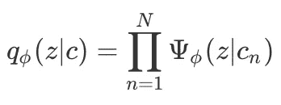
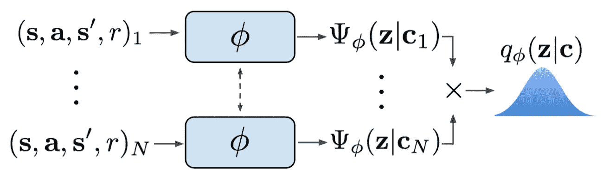
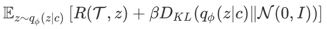
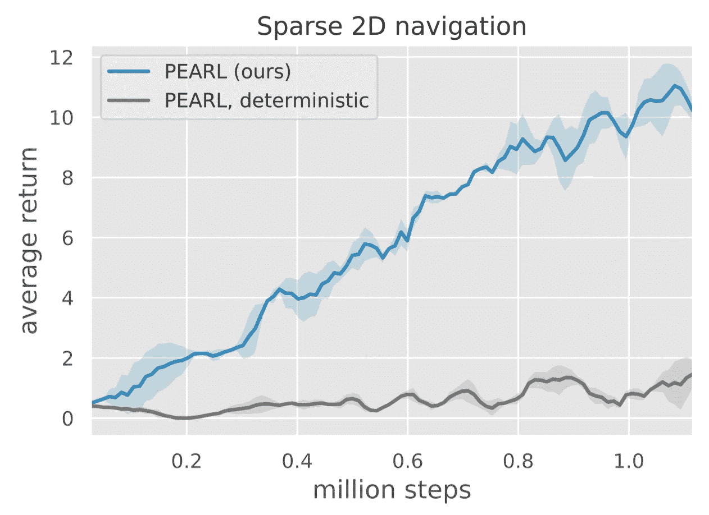
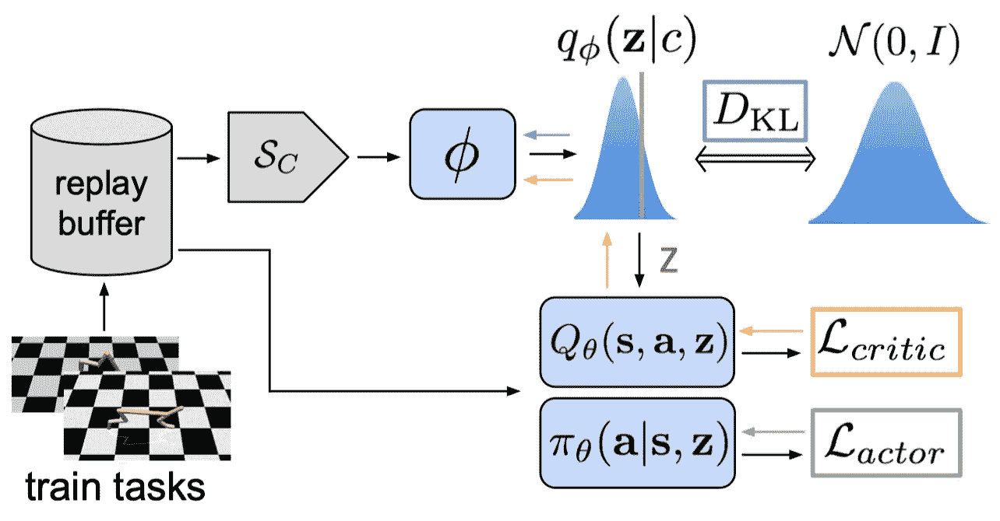
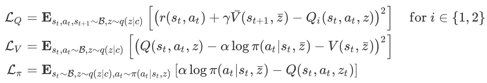
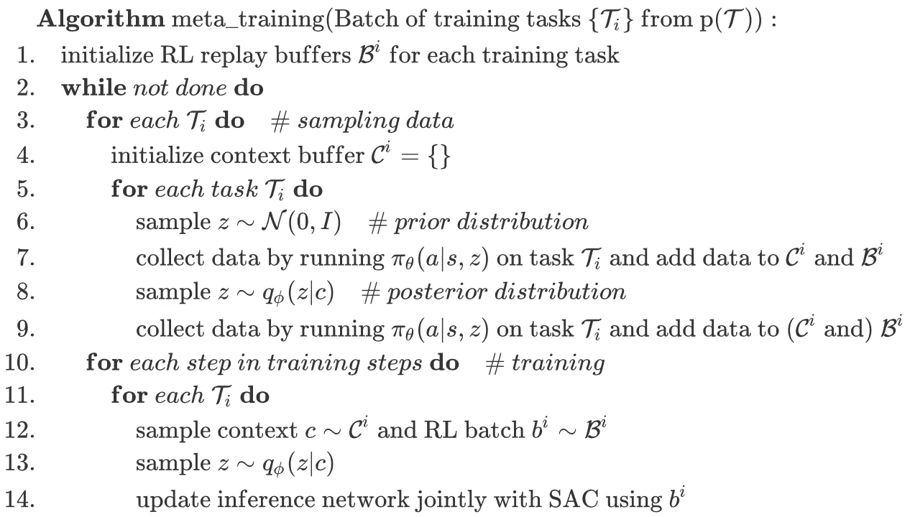
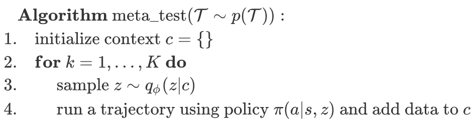

# 珀尔:演员评论家 RL 的概率嵌入

> 原文：<https://pub.towardsai.net/pearl-probabilistic-embeddings-for-actor-critic-rl-42a5cbe05bfb?source=collection_archive---------0----------------------->

## 潜入珍珠| [走向艾](https://towardsai.net)

## 一种样本有效的元强化学习方法

资料来源:联合国人类住区规划署

# 介绍

元强化学习尤其具有挑战性，因为智能体不仅要适应新的输入数据，还要找到探索新环境的有效方法。当前的 meta-RL 算法严重依赖于基于策略的经验，这限制了它们的采样效率。更糟糕的是，他们中的大多数人在适应新任务时缺乏推理任务不确定性的机制，这限制了他们在稀疏回报问题上的有效性。

我们讨论了试图解决这些挑战的 meta-RL 算法。简而言之，该算法，即 Rakelly & Zhou 等人在 2019 年提出的演员-评论家 RL(PEARL)的概率嵌入，由两部分组成:它学习充分描述任务的概率潜在上下文；以该潜在上下文为条件，非策略 RL 算法学习采取行动。在这个框架中，概率潜在上下文充当当前任务的信念状态。通过在潜在上下文上调节 RL 算法，我们期望 RL 算法学会区分不同的任务。此外，这将任务推理从行动决策中分离出来，正如我们将在后面看到的，这使得一个非策略算法适用于元学习。

文章的其余部分分为三个部分。首先，我们介绍推理架构，PEARL 的基石。在此基础上，我们论证了 PEARL 中非策略学习的有效性，并简要讨论了 Rakelly & Zhou 等人所采用的非策略学习方法。最后，我们将这两个部分结合起来，形成了 PEARL 算法。

# 推理架构

推理网络获取关于当前任务应该如何在潜在概率上下文变量 *Z* 中执行的知识，在此基础上，我们将策略限定为 *𝜋(a|s，z)* ，以便使其行为适应任务。在本节中，我们将重点关注推理网络如何利用来自各种训练任务的数据来学习从新任务的最近经历中推断出 *Z* 的值。

对于特定的任务，我们对一批最近收集的转换进行采样，并通过网络𝜙对每个转换 *cₙ* 进行编码，以提取概率潜在上下文𝛹 *_𝜙(z|cₙ】，*通常是高斯后验概率。然后，我们计算所有这些高斯因子的乘积，以形成潜在上下文变量的后验概率:

下图演示了这一过程

推理架构。来源:通过概率上下文变量的有效非策略元强化学习

请注意，这里使用的转换是从一组最近收集的转换中随机采样的，这不同于我们稍后用来训练非策略算法的转换。作者还试验了其他架构和采样策略，如顺序转换的 RNN，但没有一个表现出优越的性能。

## 最佳化

我们通过变分下界来优化推理网络 *q_𝜙(z|c)* :

其中 *R* 是某个下游任务的目标， *𝒩(0，I)* 是单位高斯先验。如果我们取 *R* 作为重建损失，则可以很容易地根据𝛽-variational 自动编码器的推导得出这个目标。Rakelly & Zhou 等人根据经验发现，训练编码器恢复状态-动作值函数(使用*Q*-函数)优于优化它以最大化行动者回报(使用政策)，或重建状态和奖励(使用 VAE 结构)。

## 为什么不使用确定性上下文呢？

概率上下文的优势在于它可以对任务的信念状态进行建模，这对于下游的偏离策略算法实现深度探索是至关重要的。深度探索在稀疏奖励设置中尤其重要，在稀疏奖励设置中，一致的探索策略比随机探索更有效。我们建议感兴趣的读者参考 Osband 等人 2016 年的[第 5 节，以获取说明性示例。下图在一个带有稀疏回报的 2D 导航问题上比较了这两种情况。](https://arxiv.org/abs/1602.04621)

确定性上下文和概率性上下文的比较。来源:通过概率上下文变量的有效非策略元强化学习

# 将非策略学习与元学习相结合

来源:通过概率上下文变量的有效非策略元强化学习

现代元学习算法主要依赖于这样的假设，即用于适应的数据分布将在元训练和元测试中匹配。在 RL 中，这意味着在元训练期间应该使用策略上的数据，因为在元测试时，策略上的数据将用于适应。PEARL 通过将任务推理的负担从 RL 方法卸载到推理网络上来释放这种约束。这样，PEARL 不再需要在元测试时微调 RL 方法，并且可以在元训练时应用非策略方法。事实上，这里对非策略 RL 方法的唯一修改是使每个网络以 *z* 为条件，并保持其他网络不变。

PEARL 的官方实现采用软行动者-批评家( [SAC](https://arxiv.org/abs/1801.01290) )，因为 SAC 表现出良好的采样效率和稳定性，并且进一步具有与概率潜在上下文很好地结合的概率解释。长话短说，SAC 由五个网络组成:两个状态值函数 *V* 和 *\bar V* ( *\bar V* 是 *V* 的目标网络)、两个动作值函数 *Q₁* 和 *Q₂* ，以及一个策略函数𝜋；它通过以下损失函数优化这些函数

SAC 中的损失函数

其中 *Q=min(Q₁，Q₂)* 和 *\bar z* 表示没有通过它计算梯度。我们让感兴趣的读者去我的个人博客了解更多关于 SAC 的细节。

# 算法

既然我们已经介绍了所有必要的组件，现在是时候将它们放在一起并呈现整个算法了。

## 元训练

元训练时的 PEARL 伪代码

有几件事值得注意:

1.  上下文 *c* 是一个元组 *(s，a，r)*；它还可以包括用于任务分布的*s’*，其中动态在任务之间变化。
2.  有一个隐含的 for 循环回绕线 6 和 7，使得 *z* 在每个轨迹后被重新采样。第 8 & 9 行也是如此。另外，请注意，在许多任务中，我们不会将第 9 行收集的数据添加到上下文缓冲区中(在大多数[配置](https://github.com/katerakelly/oyster/tree/master/configs)中`num_steps_posterior`为零)；这表明第 12 行中的上下文 *c* 是由来自先前分布的以 *z* 为条件的策略收集的。Rakelly &周等人发现，这种设置在这些有形的奖励环境中效果更好，在这些环境中，探索似乎对识别和解决任务并不至关重要。[5]
3.  推理网络 *q_𝜙(z|c)* 是使用来自我们之前所述的 *Q* 网络的贝尔曼更新的梯度来训练的。

## 元测试

测试时 PEARL 的伪代码

与以前的方法不同，PEARL 在元测试时不微调任何网络；它依靠推理网络的泛化能力来适应新的任务。

# 实验结果

任务绩效与元训练期间收集的样本。RL 通过 PPO 实施，MAML 通过 TRPO 实施。来源:通过概率上下文变量的有效非策略元强化学习

上图展示了六种连续控制环境下不同方法的任务绩效。这些运动任务家族需要适应不同的奖励功能(半猎豹前进-后退、蚂蚁前进-后退、人形-Direc-2D、半猎豹-Vel 的目标速度和蚂蚁-Goal2D 的目标位置)或不同的动力学(沃克-2D-Params 的随机系统参数)。我们可以看到，PEARL 在样本效率方面优于现有算法 20-100 倍，在这些任务中的渐近性能也优于现有算法

# 参考

1.  凯特·拉凯利、奥瑞克·周、迪尔德丽·奎伦、切尔西·芬恩和谢尔盖·莱文。通过概率上下文变量进行有效的非策略元强化学习
2.  伊恩·奥斯本、查尔斯·布伦德尔、亚历山大·普里策尔和本杰明·范·罗伊。通过自举 DQN 进行深度探索
3.  Tuomas Haarnoja、Aurick Zhou、Pieter Abbeel 和 Sergey Levine。软行动者-批评家:随机行动者下的非策略最大熵深度强化学习
4.  代号:[https://github.com/katerakelly/oyster](https://github.com/katerakelly/oyster)
5.  [https://github . com/katera Kelly/oyster/issues/8 # issue comment-525923243](https://github.com/katerakelly/oyster/issues/8#issuecomment-525923243)