# 嘿新人！让我们来看看数据科学工作

> 原文：<https://pub.towardsai.net/peeking-into-data-science-jobs-aec07016659b?source=collection_archive---------2----------------------->

## [职业](https://towardsai.net/p/category/careers)，[数据科学](https://towardsai.net/p/category/data-science)

## 为进入数据领域的学生提供全面的求职指南！


[摄影:数码师](https://pixabay.com/users/TheDigitalArtist-202249/)在[像素点](https://pixabay.com/)

# 前言

如果你是数据科学相关领域的学生(例如计算机科学、数据科学、信息管理、统计学等专业的学士/硕士/博士学位。)和我一样，你有没有想过:**你以后会做什么？什么技能现在在就业市场上受到重视？**最后但也是最重要的一点，**你应该如何准备自己？**

这些问题在我脑海中闪现后，我决定将**“我应该如何处理”**写进答案(和文字)。这篇文章写于我开始在 CMU 大学读研究生之前大约 3-4 个月。本文中显示的所有职位都来自 Linkedin，并且只是我认为可能适合每个类别的例子。调查数据科学工作不仅会让你了解所需的技能，还能帮助你找到正确的道路，为未来的职业生涯做好准备。

# 概观

我写这篇文章是想把自己更多的推向行业方面，对自己未来的求职有更多的了解。这篇文章是写给**“任何学过一些数据知识，并且想了解更多关于数据职业的人。”**


来源:[人工智能需求层次](https://medium.com/hackernoon/the-ai-hierarchy-of-needs-18f111fcc007)作者[莫妮卡·罗加蒂](https://medium.com/u/b31aba7f4828?source=post_page-----aec07016659b--------------------------------)

Monica Rogati 的文章[中的金字塔清晰地描绘了一个企业对数据的所有需求。遵循数据科学周期，我的目标是找出每个角色/工作在公司中的作用和方式。虽然像 FAANG 这样的大公司对所有的职位都有非常明确的区分，但小公司的数据中可能只有 1 或 2 个职位类别。在对许多相似的职位名称和职位描述进行分类后，我把它们归纳为最能引起我注意的 5 个类别(顺序是基于它们在层级中的位置):](https://medium.com/hackernoon/the-ai-hierarchy-of-needs-18f111fcc007)

P产品&操作导向

*   **数据工程师**
*   **数据分析师**
*   **数据科学家(混合)**

M机器学习&面向算法

*   **数据科学家(混合)**
*   **机器学习工程师**
*   **机器学习研究员**

> 面向产品和运营

# 数据工程师

> 2.移动/存储+3。探索/转变

数据工程师是一种致力于产生可用数据集的软件工程师。这涉及到数据的设计、创建、实现、管理和维护。他们可能需要收集数据，将其转换为标准的、有组织的形式，并将其存储在数据库系统(或云)中。还有设计数据管道、维护分布式系统和管理高级数据库架构的职责。


弗兰克·艾弗特在 [Unsplash](https://unsplash.com?utm_source=medium&utm_medium=referral) 上拍摄的照片

如 altex soft Inc .的[文章](https://medium.com/datadriveninvestor/what-is-data-engineering-explaining-the-data-pipeline-data-warehouse-and-data-engineer-role-1a4b182e0d16)所示，数据工程师的工作涵盖了整个数据传输过程:从将数据放入 ETL 数据管道并确保数据质量，到存储到数据仓库并制作数据工具(可能是可视化工具)以增加数据的可用性。请注意，像亚马逊这样的许多企业都开发了自己的大数据技术，因此每个公司使用的工具可能会有所不同。因此，数据工程师不仅需要具备**数据仓库**方面的知识，还需要利用**大数据技术，如 Hadoop 或 NoSQL** 来存储和分析数据。

```
Below is a generalized job content: (from job posts on Linkedin)**Job description (JD)**• Build **batch and streaming data pipelines** with tools such as **Spark and Airflow**, and cloud-based data services like **Google’s BigQuery, Dataproc, and Pub/Sub** • **ETL development**: cover all aspects of programming assignments and assist with systems design
• Develop and maintain a **technical** **metadata framework and repository** of data events and ETL operations
• Provide ongoing maintenance and enhancements to existing **data warehouse** solutions
• Design and develop **data flows** within an enterprise data warehouse environment
• Generate **ad-hoc queries** and reports based on business requirements
• Integrate data from data warehouse into **data tools** to make data actionable**Job requirements**• BS/MS in Computer Science, Engineering, Mathematics, or a related technical discipline
• 3+ years of industry experience with a track record of **manipulating, processing, and extracting value from large datasets** • Hands-on experience and advanced knowledge of **SQL and non-SQL databases**
• Excellent knowledge of **OLAP concepts, data management fundamentals, and data storage principles**
• Experience in **data modeling, ETL development, and data warehousing**
• Familiarity with columnar databases (**Redshift, Vertica**, etc.)
• Experience using **big data technologies** (**Hadoop, MapReduce, Hive, Hbase, Spark, Kafka, Flink, S3, EMR, Glue**, etc.) 
• Programming language such as **Java**, and scripting languages like **Python, Ruby and UNIX shell scripts**
• Experience coding and automating processes
• Experience with data visualization tools (**Looker, Tableau**, etc.)
```

**例子(我假设是相似的)**

*   Shutterfly — [数据工程师(运营分析团队)](https://www.linkedin.com/jobs/view/1869571581/)
*   Vevo — [数据工程师](https://www.linkedin.com/jobs/view/1873217656/)

[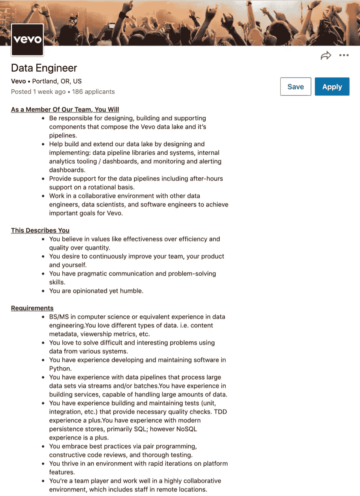](https://www.linkedin.com/jobs/view/1873217656/)[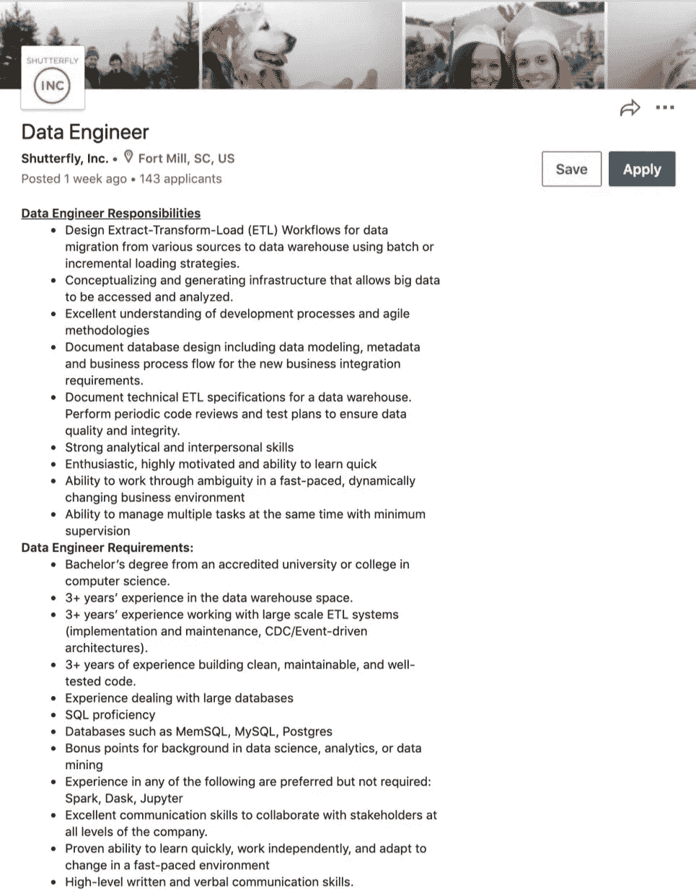](https://www.linkedin.com/jobs/view/1869571581/)

Linkedin 上的数据工程师职位

# 数据分析师

> 3.探索/改造+4。聚合/标签+5。学习/优化

人们总是说，数据分析师是数据科学家甚至初级数据科学家的更商业版本。这个角色也有很多不同的名称:业务分析师、数据分析师、产品分析师、商业智能分析师等等。但总结一下角色，数据分析师一般负责为复杂的业务问题提供解决方案。

在我看来，他们处于自己独特的领域，因为不同的公司会有不同的业务问题，可能需要不同的专业知识或工具来解决。主要是数据分析师利用 Python 中的**数据分析技能或者 R** 提供任务的解决方案；然后，通过强大的**数据可视化技能** **像** **Tableau 或者 Power BI** 进行沟通。SQL 也很重要，因为大多数企业数据都存储在数据库系统中。

```
Below is a generalized job content: (from job posts on Linkedin)**Job description (JD)**• Apply experience in **analytics, data visualization and modeling** to help solve, inform, influence, support, and execute business decisions
• Effectively build data reports and communicate key insights (**metrics and KPIs**) through **internal reports, presentations and dashboards** (**Tableau or Power BI**) to drive business decisions
• Champion and support adoption of **BI tools** across organization
• Perform **ad-hoc analyses** to answer business questions or generate data sets
• Utilize knowledge and experience in **Excel** **database query tools, data warehouse architecture, and** **SQL** to solve business problems
• Effectively **communicate** with external clients and internal teams to deliver customer-centric solutions in a timely fashion**Job requirements**• BA/BS in a field that emphasizes **data analysis and visualization** (e.g. Computer Science, Social Sciences, Physical Sciences, Math, Engineering, or Statistics), or equivalent work experience
• 2+ years of experience with **R, Python**, or a similar scripting language
• 3+ years experience with **SQL** (or similar language aimed at querying relational databases)
• 3+ years of experience working with **data visualization tools** such as **Tableau** or **Power BI** • Experience processing and analyzing data sets, interpreting them **for making business decisions**
• Knowledge with **Excel** (conditional formulas and formatting, charting, etc.)
• Experience with **data management**, specifically with validating and auditing data and reports from multiple systems
• Experience **communicating** **the results of analyses** with product and leadership teams to influence the overall strategy of the product
```

**示例(我假设是相似的)**

*   PayPal — [全栈数据分析师(Braintree 数据分析团队)](https://www.linkedin.com/jobs/view/1870023386/)
*   PlayStation — [数据分析师，消费者体验](https://www.linkedin.com/jobs/view/1862804379/)
*   特斯拉— [财务数据分析师(财务分析和自动化团队)](https://www.linkedin.com/jobs/view/1865185241/)

[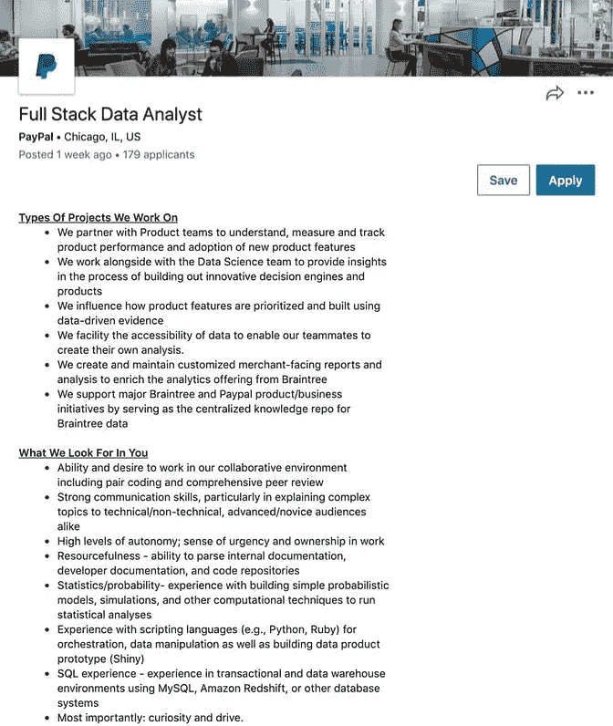](https://www.linkedin.com/jobs/view/1870023386/)[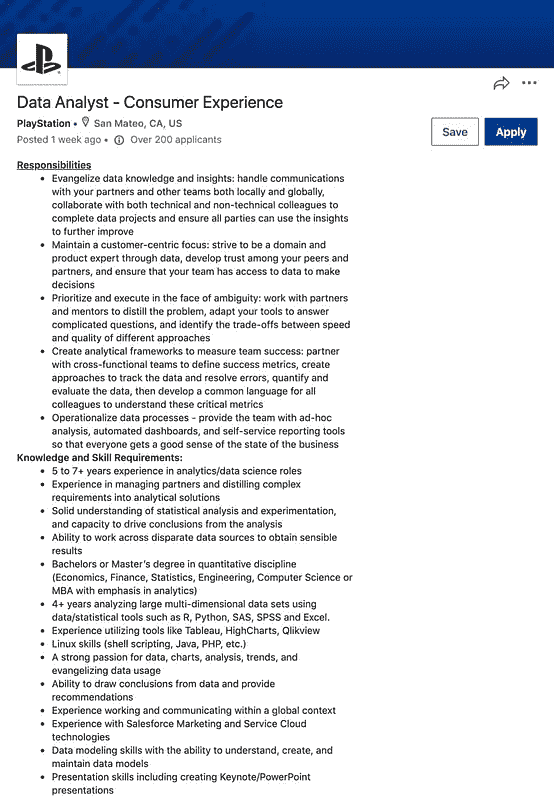](https://www.linkedin.com/jobs/view/1862804379/)[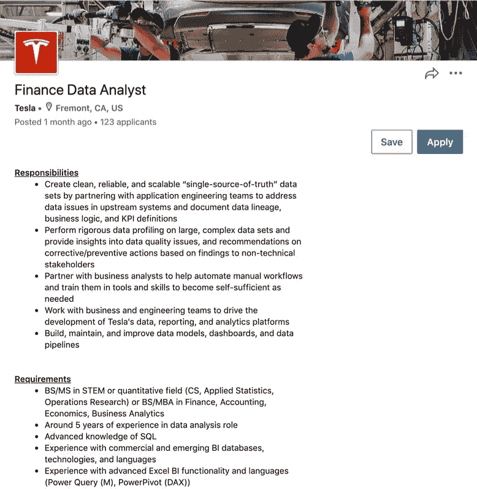](https://www.linkedin.com/jobs/view/1865185241/)

Linkedin 上的数据分析师职位

# 数据科学家(DS)

> 3.探索/改造+4。聚合/标签+5。6.学习/优化

自 2012 年以来，这个头衔是许多人在阅读了*哈佛商业评论*中的“[数据科学家:21 世纪最性感的工作](https://hbr.org/2012/10/data-scientist-the-sexiest-job-of-the-21st-century)”后梦想成为的。我相信大多数人都听说过[丹·艾瑞里](https://www.linkedin.com/in/danariely/)在 **2013** 中的名言:“**大数据就像青少年的性行为**:每个人都在谈论它，没有人真正知道如何去做，每个人都认为其他人都在做，所以每个人都声称自己正在做……”虽然数据科学是一个相对模糊的概念，但随着时间的推移，角色定义框架已经被开发出来，以帮助清除迷雾。[由](https://www.linkedin.com/pulse/one-data-science-job-doesnt-fit-all-elena-grewal/) [Elena Tej Grewal](https://www.linkedin.com/in/elena-grewal/) 在 **2018** 撰写的 Airbnb 文章建议数据科学家(或数据科学工作)可以分为三类:

*   **数据科学家—分析**
*   **数据科学家——算法**
*   **数据科学家—推理**

Jason Jung 最近在 2020 年 5 月 27 日发表的另一篇文章绝对非同寻常！它明确划分了 DS 作业的 4 个领域，并提供了未来数据作业趋势的指南。我还在这篇文章中加入了他的一些观点，使文章更加全面。谢谢！

*   **软件工程**
*   **数据工程**
*   **数据/业务分析**
*   **研究**

## 数据科学家—分析


Airbnb — [数据科学家，分析](https://www.linkedin.com/jobs/view/data-scientist-analytics-at-airbnb-903605532/)

分析领域的数据科学家致力于将数据转化为可理解的信息。他们带来的洞察力可能会推动业务的变化。通过我的观察，他们中的大多数人需要定义与业务相关的问题(**指标和 KPI**)，通过分析发现见解，然后可视化以说服决策。

这些数据科学家更加关注业务分析，他们需要建立**仪表盘和可视化**来交流他们的见解。这就是为什么大多数人选择**力量 BI 或者**画面。 **Python (Matplotlib，Seaborn)和 R (ggplot2，Plotly)** 中的可视化技术也派上了用场。此外，他们还需要精通 **Python、R 和 SQL** 来进行预测建模。一个必须具备的软技能是“**产品感**”，这样他们就可以建立正确的衡量标准来解决正确的问题。我很享受 Airbnb 职位描述中的第一句话:**“信息只有被理解才有价值。”**这只是对这份工作所能实现的目标的一种直截了当的描述！

```
Below is a generalized job content: (from various Airbnb job posts)**Job description (JD)**• Define and evaluate **key metrics** and understand what moves them and why
• Ownership of conceptualizing, developing, and maintaining **dashboards and visualizations**
• Identify critical business problems and create **analytical/modeling framework and solutions**
• Communicate analyses and recommendations to cross functional stakeholders **for decision making**
• Build and maintain **key data sets and dashboards** that empower operational and exploratory analysis**Job requirements**• Professional industry experience in a quantitative analysis role (4+ years preferred)
• Comfortable in **SQL** and some experience with a programming language, with **Python or R** a plus
• Ability to define **relevant metrics** that can guide and influence stakeholders to the appropriate and accurate insights
• Experience or willingness to learn tools to create **data pipelines** using **Airflow**
• Building clear and easy to understand **dashboards (Tableau)** and presentations
• Ability to model and run experiments is a plus for some roles
```

**其他公司的例子(我认为类似)**

*   Adobe — [数据科学家](https://www.linkedin.com/jobs/view/1820511363/)
*   脸书— [数据科学家，分析](https://www.linkedin.com/jobs/view/1866461018/)
*   微软— [数据&应用科学家(客户体验团队)](https://www.linkedin.com/jobs/view/1836594727/)

[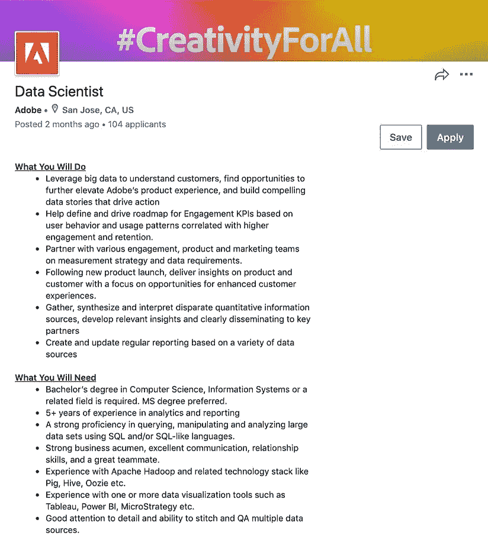](https://www.linkedin.com/jobs/view/1820511363/)[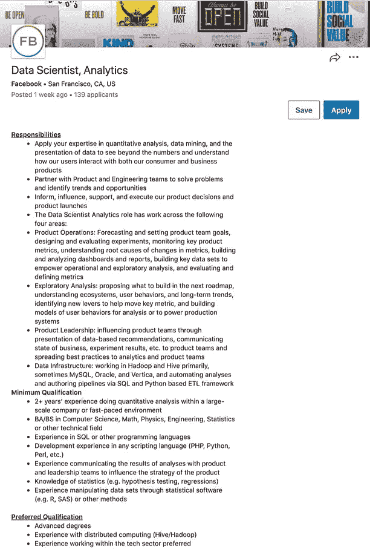](https://www.linkedin.com/jobs/view/1866461018/)[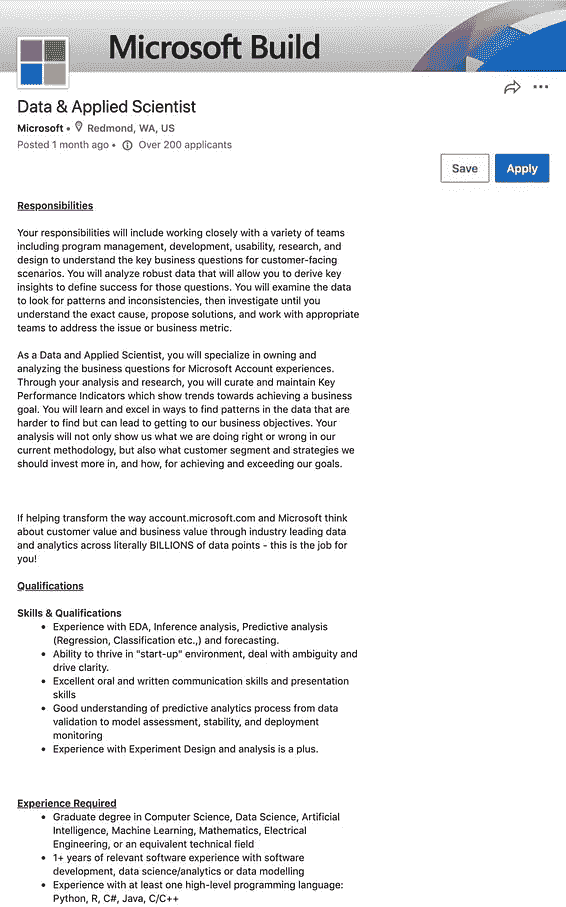](https://www.linkedin.com/jobs/view/1836594727/)

数据科学家 Linkedin 上的分析职位

> 面向机器学习和算法

## 数据科学家—算法


Airbnb — [数据科学家，算法](https://www.linkedin.com/jobs/view/data-scientist-algorithms-at-airbnb-1155510936/)

算法领域的数据科学家是机器学习技术的专家，了解算法背后的数学，能够将新的机器学习模型投入部署。在我看来，他们将最新的算法和分析模型原型化为可用的工具，从而提高数据产品的性能。

更具体地说，这份工作有更多的软件工程方面，所以强大的 **Python 和 R** 技能对于模型构建来说是必不可少的。这些数据科学家还专注于机器学习的**优化技术，如特征工程、特征选择、超参数调优**等。他们可能还需要研究技能来发现行业中的新事物。

```
Below is a generalized job content: (from various Airbnb job posts)**Job description (JD)**• Evaluate **potential approaches** anddetermine **metrics** which are critical for machine learning models
• Work cross functionally with operations and product teams to define and **collect labels for model training**, **optimize effectiveness of manual review**, **and build verifications that scale**
• **Devise optimization models** to make optimal business decisions
• Utilize **Deep Learning techniques** for **advanced feature engineering** **and model building****Job requirements**• 4+ years experience **developing machine learning models at scale from inception** to business impact
• Advanced degree in quantitative field
• Deep understanding of **modern machine learning techniques** and their mathematical underpinning, such as **classification, recommendation systems and natural language processing**
• Experience with **distributed machine learning** **and computing framework** (**Spark, Mahout** or equivalent)
• Strong programming skill (**Python, R, or Scala** preferred)
• Industry experience in **developing deep learning model** is a plus
• Data analytical and **data engineering** experiences is a plus (**Hive, Presto, Spark** preferred)
• Experience **productionizing real-time machine learning model** is a plus
```

**其他公司的例子(我认为类似)**

*   谷歌— [数据科学家，工程](https://www.linkedin.com/jobs/view/1554424901/)
*   Riot Games — [数据科学家，英雄联盟(联盟数据中心队)](https://www.linkedin.com/jobs/view/data-scientist-league-of-legends-at-riot-games-1345178232/)

[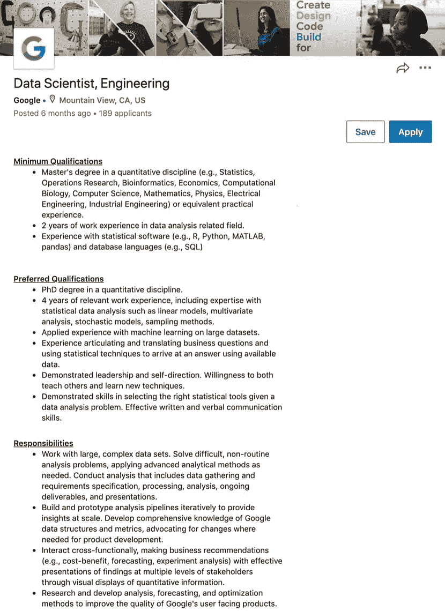](https://www.linkedin.com/jobs/view/1554424901/)[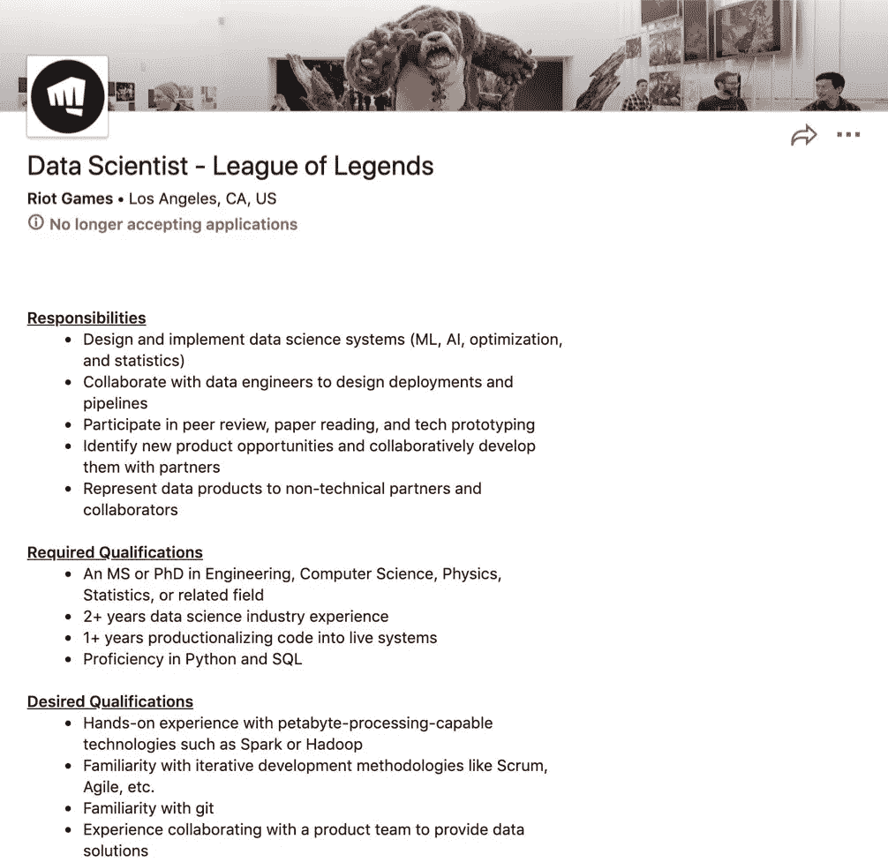](https://www.linkedin.com/jobs/view/data-scientist-league-of-legends-at-riot-games-1345178232/)

数据科学家 Linkedin 上的算法职位

## 数据科学家—推理


Airbnb — [数据科学家，推断](https://www.linkedin.com/jobs/view/data-scientist-inference-at-airbnb-1290647807/)

推理轨道中的数据科学家可以是来自不同领域的专家(例如，统计学家、经济学家、社会科学家等。)，但他们有一个共同的关键技能——统计学。在阅读了几十份工作描述后，我发现他们**进行实验、A/B 测试、权力和重要性测试** **来量化某些措施的影响并确认假设**。这些数据科学家必须处理“假设情景”，这可能是来自分析跟踪数据科学家的业务解决方案。Airbnb 的一个招聘帖子简单地提出了一个问题:**“我们如何理解新事物的影响？”**

要成为一名推理专家，人们应该更加注重在假设设置(未知情况)中应用**统计知识。在问正确的问题时，他们需要用数学、编程和实验结果来支持。我还推荐阅读这三篇 Airbnb 文章，了解更多关于实验的知识:**

*   [](https://medium.com/airbnb-engineering/4-principles-for-making-experimentation-count-7a5f1a5268a)**做实验的 4 个原则**
*   **[**升级 Airbnb 的实验平台**](https://medium.com/airbnb-engineering/https-medium-com-jonathan-parks-scaling-erf-23fd17c91166)**
*   **[**实验报告框架**](https://medium.com/airbnb-engineering/experiment-reporting-framework-4e3fcd29e6c0)**

```
Below is a generalized job content: (from various Airbnb job posts)**Job description (JD)**• Define **key metrics** and their relationships to measure business success
• Design and execute **controlled experiments** to quantify the effects of new features and product changes
• Run **strategic analysis** to help inform the strategic direction
• Staying involved operationally to ensure correct execution of the experiments
• Help our business partners understand **metric trade-offs** and drive influential decisions
• Improve the **statistical methodology** behind our experimentation platform to ensure that our understanding of product changes is rigorous and accurate**Job requirements**• 3–4+ years of professional experience, or an advanced degree in a quantitative field, including Applied Math, Statistics, Operations Research, Economics, or Computer Science
• Solid understanding of **statistics**
• Ability to solve business problems using wide variety of **statistical methods and models**
• Fluency in the core toolkit of Data Science: querying (e.g. **Hive/Pig/SQL**), preprocessing (e.g. **UNIX/Python**), and statistical analysis (e.g. **R/Python**)
• Keen eye for detail and thoughtful investigation of data before relying upon it *(or “What do the data say?” in the 4 Principles)*
```

****其他公司的例子(我认为类似)****

*   **亚马逊— [数据科学家](https://www.linkedin.com/jobs/view/1868608648/)**
*   **Lyft — [数据科学家，决策(科学团队)](https://www.linkedin.com/jobs/view/1749118289/)**

**[](https://www.linkedin.com/jobs/view/1868608648/)****[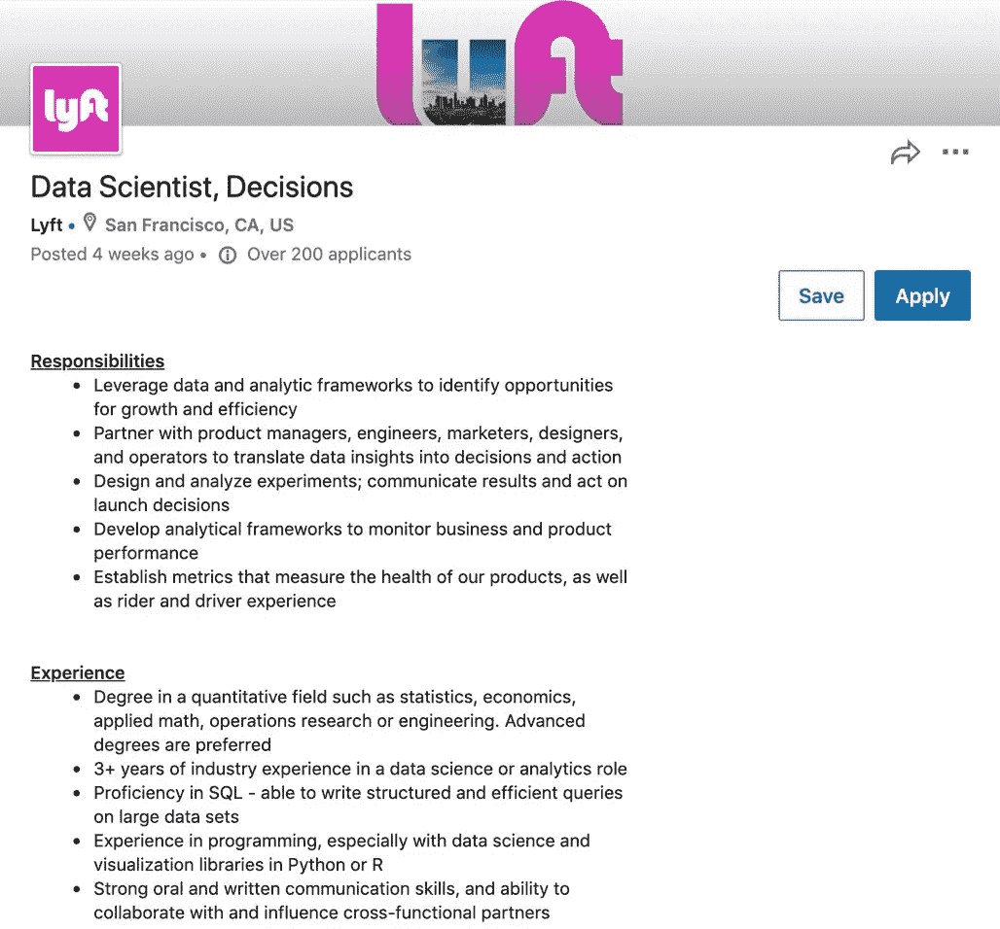](https://www.linkedin.com/jobs/view/1749118289/)

数据科学家 Linkedin 上的推理职位** 

# **机器学习工程师**

> **6.学习/优化**

**机器学习工程师肯定是软件工程的分支但是专攻 ML。我看到许多 mle 的工作描述中有这样的句子:“作为团队中的 SDE……”这份工作的要求是在**数据结构、算法、OOP 和机器学习**方面有坚实的基础，因为 mle 建立工作流或将新的建模概念投入部署。此外， **Python 和 R** 强大的编程基础意味着从头到尾大量的编码工作。我在工作中的想法是，在阅读和理解会议论文后，MLE 将有能力将算法转化为代码！**

```
Below is a generalized job content: (from job posts on Linkedin)**Job description (JD)**• Develop highly scalable systems, algorithms, and tools leveraging **deep learning, data regression, and rule-based models**
• Combine strong **software engineering principles** with machine learning to build scalable, reproducible and easy-to-use end-to-end machine learning workflows for advanced deep learning and computer vision problems
• Lead machine learning **model deployment and production** execution
• Contribute in **research, design, experimentation, development, deployment, monitoring and maintenance of machine learning model lifecycle**
• Research and implement best practices to enhance existing machine learning infrastructure
• Design and develop robust and scalable experimentation approach for **model evaluation****Job requirements**• MS/Ph.D. degree in Computer Science or related quantitative field
• 3+ years of experience in one or more of the following areas: **Machine Learning, Recommendation Systems, Pattern Recognition, Data Mining or Artificial Intelligence** • Deep technical skills in **data engineering, statistics, machine learning, or deep learning** and a passion for making these methods more rigorous, robust and scalable
• 1+ year of experience contributing to the architecture and design (**architecture, design patterns, reliability and scaling**) of new and current systems
• Experience delivering **production grade engineering and machine learning solutions** at different levels of the stack
• Experience building workflows involving machine learning models in production
• Extensive Experience with machine learning libraries and frameworks (e.g. **PyTorch, MXNet, Tensorflow**)
• Practical experience working with and **conducting experiments** on large datasets then turning prototypes into production models in one or more domains
• Knowledge developing and debugging in **C/C++ and Java**
• Experience with scripting languages such as **Perl, Python, PHP, and shell scripts** • Ability to explain and present analyses and machine learning concepts to a technical audience
```

****例子(我假设是相似的)****

*   **Tinder — [参谋机器学习工程师](https://www.linkedin.com/jobs/view/1871357195/)**
*   **丰田研究所— [机器学习工程师](https://www.linkedin.com/jobs/view/1670050057/)**

**[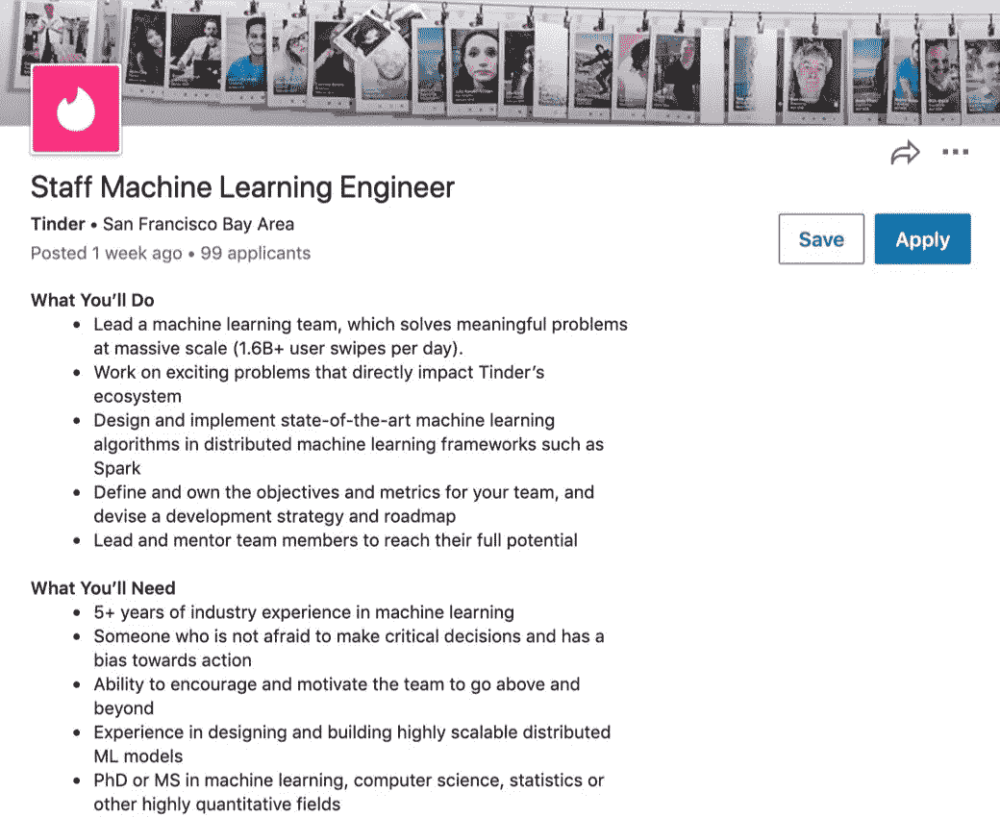](https://www.linkedin.com/jobs/view/1871357195/)****[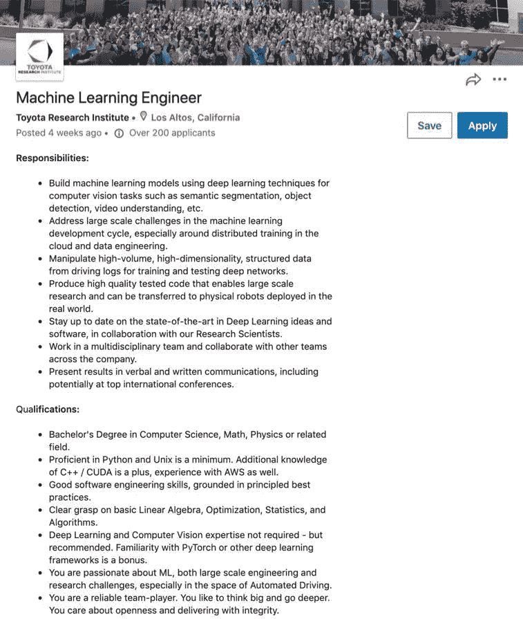](https://www.linkedin.com/jobs/view/1670050057/)

Linkedin 上的机器学习工程师职位** 

# **机器学习研究员(MLR)**

> **6.学习/优化**

**机器学习研究人员在研究环境中工作，大多数是博士。他们可能被称为研究科学家或机器学习研究科学家。他们的总体目标是**深入挖掘 ML 领域，解决机器学习中尚未解决的问题**。由于它们在人工智能需求层次中处于最高位置，大多数小公司起初可能负担不起这种研发奢侈品，但专注于尖端技术的大公司将需要它们进行研究，以改善当前尚未解决的问题。通过**全面的研究训练**，他们可以为各种机器学习领域的复杂问题提供解决方案。**

```
Below is a generalized job content: (from job posts on Linkedin)**Job description (JD)**• Research and develop innovative machine learning strategies for challenging problems with particular focus on **Deep Learning (DL), Computer Vision (CV), Audio Signal Processing (ASP), Natural Language Processing (NLP), optimization and statistical data analysis**
• Identify gaps in the research field, define the research agenda and explore new innovative ideas
• Lead **research publications** for academic conferences and journals
• Designing and developing deep learning and machine learning architectures**Job requirements**• Ph.D. or Ph.D. candidate in **Machine Learning, Computer Science, Statistics**, or a related field
• Track record of research excellence and high-quality scientific publications (e.g. **NeurIPS, CVPR, ICML, ICLR, ICCV**, etc.), published open-source software, or other recognitions for scientific contributions
• Experience generating novel research questions that cross disciplinary boundaries or extend research to a new application domain
• Strong **research background** with experience crafting, prototyping, and delivering solutions
```

****示例(我假设是相似的)****

*   **苹果— [应用机器学习研究员(ML 研究团队)](https://www.linkedin.com/jobs/view/1483159626/)**
*   **字节跳动— [研究科学家，推荐系统](https://www.linkedin.com/jobs/view/research-scientist-recommendation-system-at-bytedance-1792368806/)**
*   **Spotify — [研究科学家，机器学习](https://www.linkedin.com/jobs/view/research-scientist-machine-learning-at-spotify-1332171364/)**

**[](https://www.linkedin.com/jobs/view/1483159626/)****[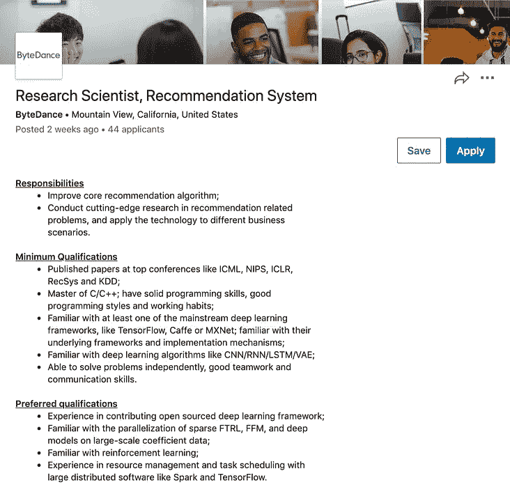](https://www.linkedin.com/jobs/view/research-scientist-recommendation-system-at-bytedance-1792368806/)****[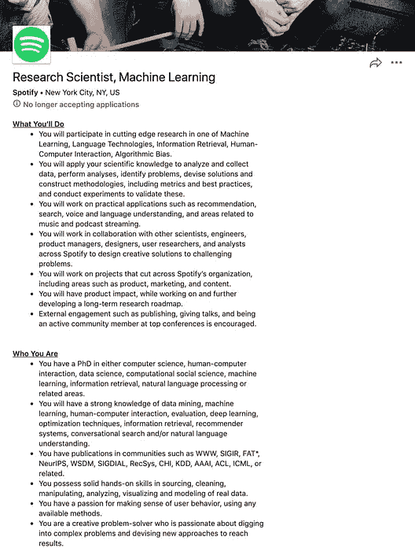](https://www.linkedin.com/jobs/view/research-scientist-machine-learning-at-spotify-1332171364/)

Linkedin 上的机器学习研究员职位** 

# **收场白**

**在经历了各种各样的工作岗位后，我对自己未来想要追求的目标有了更加精确和清晰的认识。你想在数据科学领域做什么？尽管每家公司的工作职能可能不同，但这篇文章为你将来可以瞄准和学习的东西提供了一个开端。如果你对某个工作类型更感兴趣，可以免费填写到谷歌寻找感兴趣的职位或公司！作为一个数据专业的研究生，总有更多的东西需要学习和成长！**

# **参考**

**如果不从下面的文章、视频和报告中挖掘关键思想，这篇文章就不会完整。我已经阅读和观看了他们所有人，以突出大意。谢谢！**

*   **[Elena Tej Grewal](https://www.linkedin.com/in/elena-grewal/) 、[一份数据科学工作不适合所有人、](https://www.linkedin.com/pulse/one-data-science-job-doesnt-fit-all-elena-grewal/) (2018)**
*   **[Jason Jung](https://medium.com/u/a241d4128012?source=post_page-----aec07016659b--------------------------------) ， [**机器学习工程师 vs 数据科学家(数据科学结束了吗？)**](https://towardsdatascience.com/mlevsds-3c89425baabb) (2020)**
*   **[霍马理工](https://joma.io/) **，** [**到底什么是数据科学？由数据科学家**](https://youtu.be/xC-c7E5PK0Y) 讲述(2018)**
*   **[莫妮卡·罗加蒂](https://medium.com/u/b31aba7f4828?source=post_page-----aec07016659b--------------------------------)， [**人工智能需求层次**](https://medium.com/hackernoon/the-ai-hierarchy-of-needs-18f111fcc007) (2017)**
*   **[Workera](https://workera.ai/) ， [**AI 职业道路:让自己走上正轨**](https://workera.ai/resource_downloads/ai_career_pathways/)**