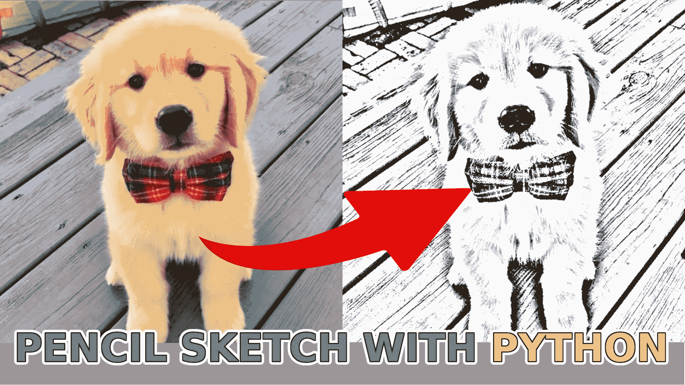
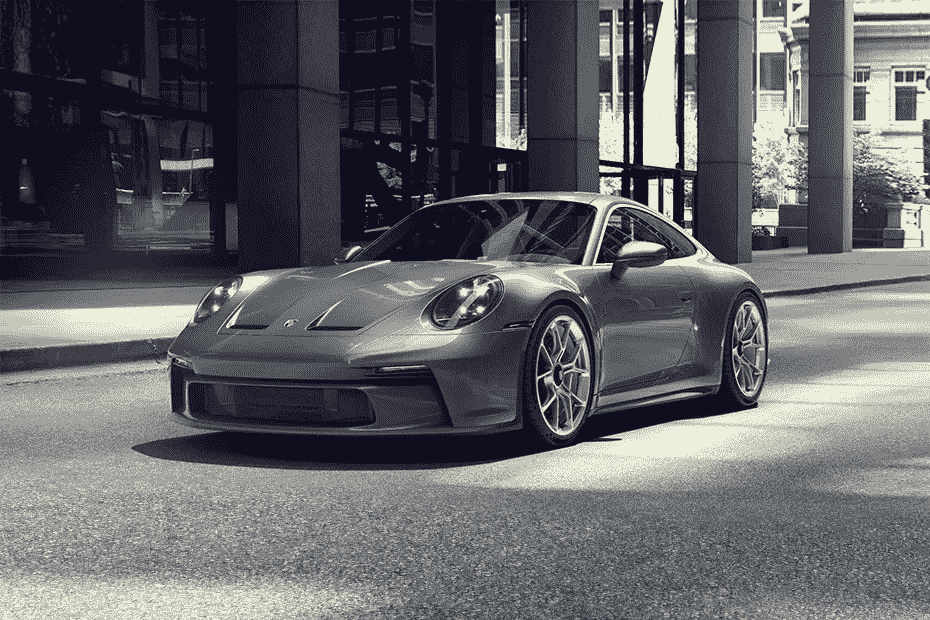
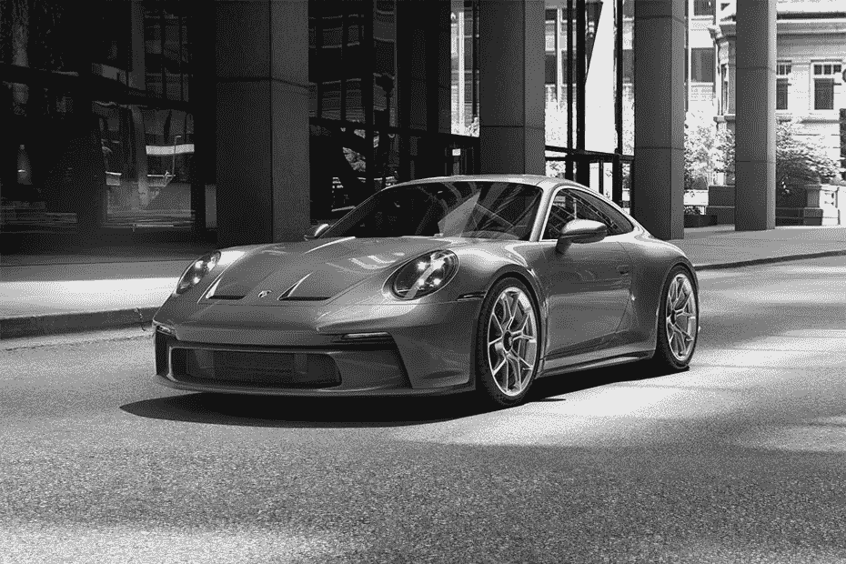
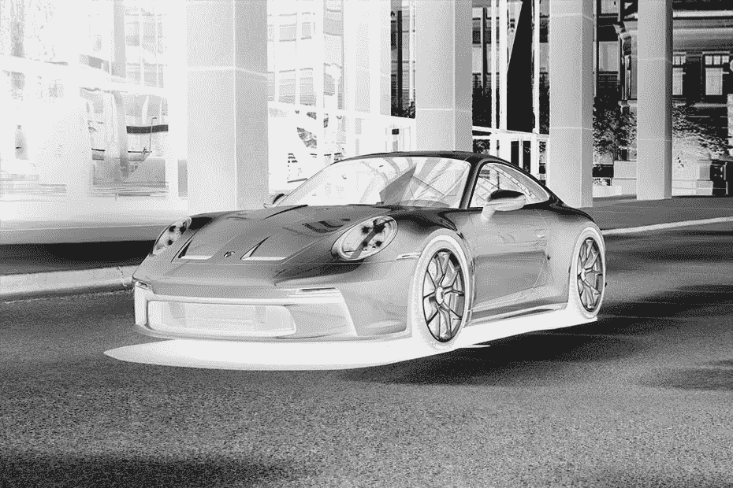
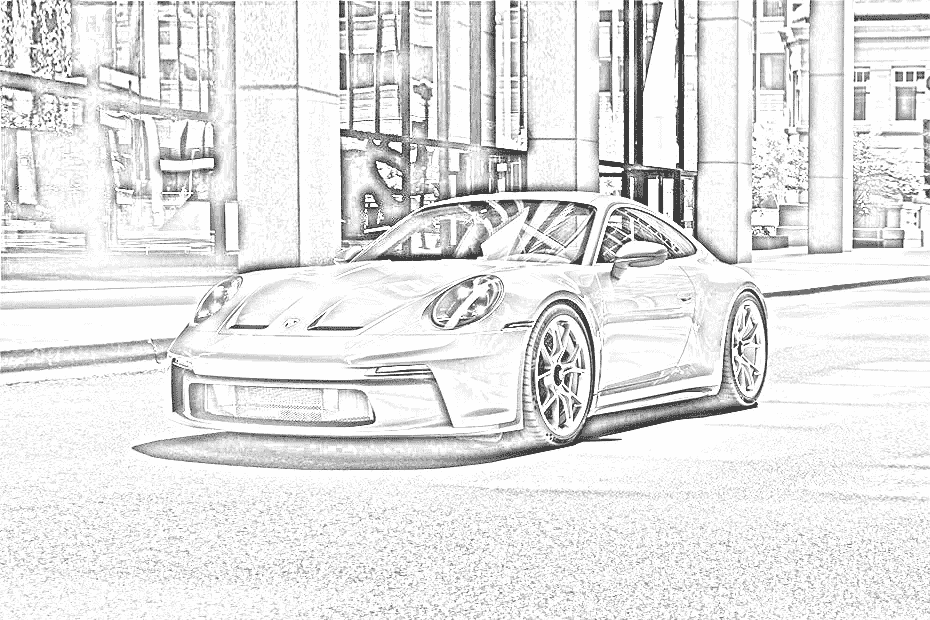
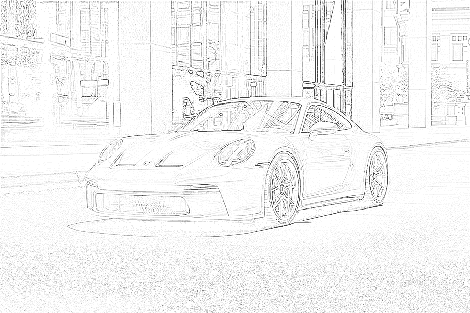

# 使用 Python 的铅笔素描图像

> 原文：<https://pub.towardsai.net/pencil-sketch-image-with-python-d8df27be9037?source=collection_archive---------4----------------------->

## 在本教程中，我将向您展示如何使用 Python 创建一个“铅笔”草图图像，只需几行代码。

**您见过的最先进的数据科学路线图！附带数以千计的免费学习资源和 ChatGPT 集成！**[【https://aigents.co/learn/roadmaps/intro】](https://87v9.short.gy/K93jZA)

我一直对计算机视觉很着迷，尤其是它在快速矩阵乘法中处理图像的能力。在 Python 中，图片是一组数字。所以我们可以做各种矩阵操作来得到令人兴奋的结果。因此，在之前的教程中，我们学习了如何将我们自己从背景中分离出来，检测人脸，并实时完成所有这些工作。在本教程中，我将向您展示如何用几行代码创建一个“铅笔”草图。

这个过程非常简单:

1.  将图像灰度化；
2.  颠倒它的颜色；
3.  模糊反转图像；
4.  将减淡混合应用于模糊的灰度图像。

我们可以选择任何我们想要的图像。但是我将演示如何创建一个可以应用于任何图像、视频或实时流的对象。我这样做是为了扩展我在本系列教程中所做的背景去除项目的功能。

## 导入库

OpenCV 和 Numpy 是这个项目唯一需要的库。我们用下面两行代码导入它们:

## 阅读照片

以下是使用 OpenCV 读取存储在光盘上的图像的命令之一:

该命令读取光盘上当前文件夹中的文件“`image.png`”，并以帧的形式存储在内存中。但正如我提到的，这可以是一系列帧或通过其他方法加载的图像。

## 使用 OpenCV 显示图像

在我们的项目中创建这样一个草图的下一个重要步骤是知道如何快速查看结果，而不用将它们保存在光盘上。以下 OpenCV 命令可用于在屏幕上显示图像:

当执行这些行时，图像将在一个标题为“图像”的新窗口中打开:

## 将图像灰度化

首先，我们需要做的是对图像进行灰度化(转换成黑白)。我们可以用 cv2 库或 numpy 来做。但是 numpy 没有任何内置的灰度函数。但是我们可以很容易地将我们的图像转换成灰度，知道背后的数学原理。但不进行数学计算，公式如下:

这里，我们将 RGB 图像通道乘以适当的值，并将它们连接成一个通道。正因为如此，我们需要返回到 3 层图像；我们用 numpy 堆栈函数来实现。这是我们得到的结果:

## 反转图像

现在我们需要反转图像。当我说反转时，我的意思是白色应该变成黑色，反之亦然。就像从每个图像像素中减去 255 一样简单。因为默认情况下，图像是 8 位的，最多有 256 种色调:

当我们显示反转后的图像或将其保存在光盘上时，我们会收到以下图片:

## 模糊图像

现在我们需要模糊反转的图像。通过对反转图像应用高斯滤波器来执行模糊。这里最重要的是高斯函数或 sigma 的方差。随着 sigma 的增加，图像变得越来越模糊。适马控制色散量，从而控制模糊程度。可以通过反复试验来选择合适的σ值:

模糊图像的结果如下:

## 减淡并合并

[颜色减淡](https://en.wikipedia.org/wiki/Blend_modes)混合模式从反转的顶层中分离出底层。这将根据上层的值使下层变亮。我们有一个模糊的图像，突出了最大胆的边缘。

就是这样！结果如下:

以下是该对象的完整铅笔草图代码:

可以猜测，在模糊过程中，除了`blur_sigma`参数之外，我们没有太多的空间可以使用。我添加了一个额外的函数来锐化图像，以解决这个问题。锐化的结果可以在这个动画 GIF 中看到:

这与模糊处理非常相似，只是现在，我们不是创建一个平均每个像素强度的内核，而是创建一个使像素强度更高的内核，因此人眼更容易看到。

以下是如何使用 PencilSketch 对象作为门廊图像的基本代码:

以上代码的结果你可以看到以下内容:

# 结论:

这是一个非常好的教程，不需要任何深入的 python 知识就可以从任何图像中获得这种惊人的“铅笔”草图风格。在使用 GitHub 中的 my project 文件和 Engine 对象时，您可以轻松地将这种效果应用于任何图像、视频或实时网络摄像机流。

在下一篇教程中，我将讲述一些更加激动人心的东西。我在考虑人脸识别，因为我们已经实现了人脸检测。剩下的——从那张脸上辨认一个人。

感谢阅读！一如既往，本教程给出的所有代码都可以在我的 [GitHub](https://github.com/pythonlessons/background_removal) 页面上找到，并且免费使用！

*原载于*