# 感知器:深度学习的基本神经网络模型

> 原文：<https://pub.towardsai.net/perceptron-a-basic-neural-network-model-for-deep-learning-21aea56e3216?source=collection_archive---------0----------------------->

## [深度学习](https://towardsai.net/p/category/machine-learning/deep-learning)

## 二元类的分类方法

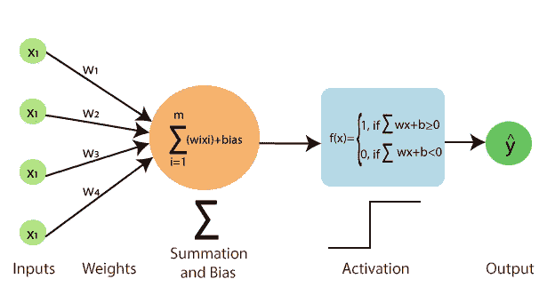

图片[来源](https://www.javatpoint.com/single-layer-perceptron-in-tensorflow)

> ***感知器***

在过去的十年里，世界见证了机器和深度学习技术的爆炸，从个性化的世界到无处不在的专业活动。有了这些技术，我相信你一定听说过或读过神经网络中的术语“感知机”,这是人们可能开始学习神经网络的第一个概念。因此，通过这篇文章，我的重点是展示什么是感知器及其工作。

美国科学家罗森布拉特深受生物神经元及其学习能力的启发，他在 1957 年左右引入了感知机这个术语。罗森布拉特的感知器有一个或多个输入，只有一个输出和一个处理器。

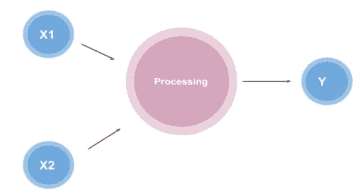

图片[来源](https://towardsdatascience.com/what-is-a-perceptron-basics-of-neural-networks-c4cfea20c590)

感知器的组件包括:输入、权重和偏差、权重和激活函数。让我们考虑单个**神经元**和三个输入( **x1 *，* x2，x3)** 分别乘以权重 **(w1，w2，w3)**，如图所示。

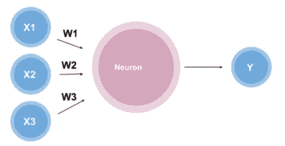

图像[来源](https://towardsdatascience.com/what-is-a-perceptron-basics-of-neural-networks-c4cfea20c590)

产生的输出将由神经元内部的函数给出，该函数使用带有权重的数值(输入)。现在问题来了，这个函数是什么？

```
y = x1w1 + x2w2 + x3w3
```

这个函数称为加权和，因为它是权重和输入的和，在激活函数的帮助下，我们可以将输出设置在某个范围内，比如 0 到 1。这只能通过激活函数来完成，激活函数可以根据提供的一组规则将输入转换为某个输出。

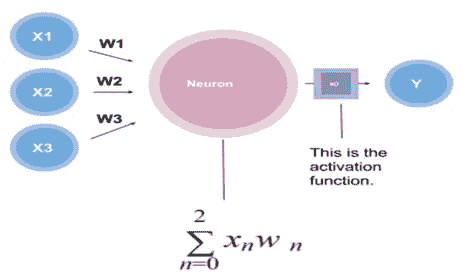

图片[来源](https://towardsdatascience.com/what-is-a-perceptron-basics-of-neural-networks-c4cfea20c590)

> ***激活功能类型***

1.  **逻辑函数:**这种类型的激活函数用于我们想要输出从 0 到 1 的数字。
2.  **双曲正切:**该激活函数用于产生类似于从-1 到 1 的数字的输出。

**物流功能**

物流功能的公式，

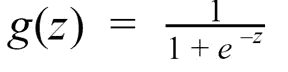

图表看起来是这样的，

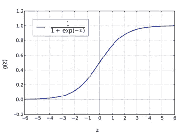

图像[来源](http://Graph source by Geek3 from WIKIMEDIA COMMONS.)

看看点 g(z ),它位于 0 和 1 之间，并且是非线性的。很明显，激活函数既适用于线性图，也适用于非线性图。现在，关于感知器，我们需要知道的最后一件事是偏见。偏差是产生输出之前的一个阈值，它告诉感知器必须到达哪里。因此，最终的神经元方程如下所示:

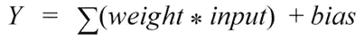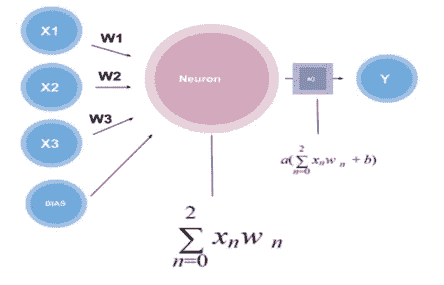

图片[来源](https://towardsdatascience.com/what-is-a-perceptron-basics-of-neural-networks-c4cfea20c590)

请注意，激活函数采用输入和偏差的加权和来创建单个单位输出，当使用逻辑函数时，输出将在 0 和 1 之间可用。

> ***为什么要用感知器？***

众所周知，感知器是神经网络的构建模块，通常用于二进制分类器的监督学习。这可以借助一个非常著名的例子来解释。让我们用一个简单的感知器，我们有某些输入值，如 **x** 和 **y，**然后乘以权重得到 **wx** 和 **wy** 。

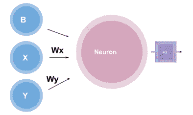

图像[来源](https://towardsdatascience.com/what-is-a-perceptron-basics-of-neural-networks-c4cfea20c590)

现在，让我们创建一个图表，用红点和蓝点表示两种不同类别的数据。

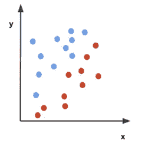

图像[来源](https://towardsdatascience.com/what-is-a-perceptron-basics-of-neural-networks-c4cfea20c590)

注意图中 x 轴标注在输入 **x** 之后，y 轴标注在输入 **y** 之后。

为了区分蓝点和红点类别，我们需要划分数据。

感知器将能够为分类(二进制)创建决策边界，其中决策边界区域在图上分隔不同的数据点。

现在我们看到激活函数的工作，输入值和权重如下所示:

```
**wx** = -0.5
**wy** = 0.5
b = 0
```

现在感知器的功能是:

```
**0.5x + 0.5y = 0**
```

该图将如右图所示。

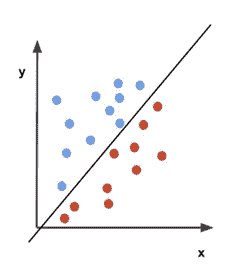

图片[来源](https://towardsdatascience.com/what-is-a-perceptron-basics-of-neural-networks-c4cfea20c590)

我们知道激活函数将产生 0 和 1 之间的输出。因此，在这种情况下，函数可以为蓝点生成 1，为红点生成 0。

数学上我们可以这样理解:

*   如果 0.5x + 0.5y => 0，则蓝点产生 1。
*   如果 0.5x + 0.5y < 0，则对红点产生 0。

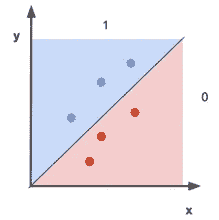

图像[来源](https://towardsdatascience.com/what-is-a-perceptron-basics-of-neural-networks-c4cfea20c590)

现在，我们可以说，感知器也可以使用决策边界进行基本分类。

[](/understand-cnn-basics-with-a-keras-example-in-python-c1fd6c449935) [## 通过 Python 中的 Keras 示例了解 CNN 基础知识

### 用于图像过程分析的深度神经网络算法

pub.towardsai.net](/understand-cnn-basics-with-a-keras-example-in-python-c1fd6c449935) [](/understand-optimizers-in-deep-learning-694f4f0eb048) [## 理解深度学习中的优化器

### 优化器是机器学习的典范

pub.towardsai.net](/understand-optimizers-in-deep-learning-694f4f0eb048) 

> ***感知器 python 编码与理论概念相扣***

感知器的概念是受人脑系统中称为神经元的单个神经细胞的处理的启发。神经元中的信号通过树突传递到细胞体的过程。以同样的方式，人工神经网络中的感知器接收来自训练数据(权重)的输入信号，并将其组合成一个称为激活函数的线性方程。

```
activation = sum(weight_i * x_i) + bias
```

该激活函数然后被转换成类似分类的输出值(预测)。

```
predictionvalue = 1.0 if activation >= 0.0 else 0.0
```

因此，感知器是针对两类(0 & 1)问题的两遍分类算法。

在随机梯度下降的帮助下，感知器算法的权重必须从您的训练数据中估计，然后在每次迭代中，使用下面给出的等式更新权重( **w** ):

```
w = w + learning_rate * (expected — predicted) * x
```

人们可以在使用该算法时下载声纳数据集，文件名为 **sonar.all-data.csv**

**在实现感知器时，我们通常需要给出三个步骤:**

1.  做预测
2.  训练网络权重
3.  建模数据集

## **做出预测**

```
# Make a prediction with weightsdef predict(row, weights):
    activation_value = weights[0]
    for i in range(len(row)-1):
        activation += weights[i + 1] * row[i]
    return 1.0 if activation_value >= 0.0 else 0.0#output:
X1             X2           Y
2.7810836     2.550537003   0
1.465489372   2.362125076   0
3.396561688   4.400293529   0
1.38807019    1.850220317   0
3.06407232    3.005305973   0
7.627531214   2.759262235   1
5.332441248   2.088626775   1
6.922596716   1.77106367    1
8.675418651   -0.242068655  1
7.673756466   3.508563011   1
```

我们使用一个小数据集来测试我们的预测。

```
# Make a prediction with weightsdef predict(row, weights):
    activation_value = weights[0]
    for i in range(len(row)-1):
        activation += weights[i + 1] * row[i]
    return 1.0 if activation_value >= 0.0 else 0.0
```

两个输入值 x1 & x2 和三个权重值**偏差**、 **w1** 和 **w2** 。我们对这些数据采用的激活方程。

```
# Estimate Perceptron weights using SGDdef train_weights(train, l_rate, n_epoch):
    weights_values = [0.0 for i in range(len(train[0]))]
    for epoch in range(n_epoch):
        sum_error = 0.0
        for row in train:
            prediction = predict(row, weights_values)
            error = row[-1] - prediction
            sum_error += error**2
            weights[0] = weights[0] + l_rate * error

            for i in range(len(row)-1):
                weights[i + 1]=weights_values[i +
                          1]+l_rate*error*row[i] print('>epoch=%d, lrate=%.3f, error=%.3f' % (epoch, l_rate
                                                      , sum_error)) return weights_values
```

使用 SGD，我们在上面的函数中计算权重值。

```
# Make a prediction with weightsdef predict(row, weights):
    activation_values = weights[0]
    for i in range(len(row)-1):
        activation += weights[i + 1] * row[i]
    return 1.0 if activation_values >= 0.0 else 0.0# Using SGD to estimate weightsdef train_weights(train, l_rate, n_epoch):
```

> ***感知器模型的应用***

*   分类类型应用
*   文本分类和信息提取
*   形象化
*   语义分析
*   数据压缩
*   加密等等。

> ***感知器的局限性***

*   由于传递函数有限，感知器模型可以输出 1 或 0。
*   通常，这些模型只对向量的线性集合进行分类。

> ***结论***

感知器是单层人工神经网络的模型，其用于二进制分类(两类)的监督学习，或者还可以执行某些计算，以通过给出单个输出来检测包括权重和偏差在内的多输入数据中的特征。

我希望你喜欢这篇文章。通过我的 [LinkedIn](https://www.linkedin.com/in/data-scientist-95040a1ab/) 和 [twitter](https://twitter.com/amitprius) 联系我。

# 推荐文章

1. [8 主动学习 Python 见解收集模块](/8-active-learning-insights-of-python-collection-module-6c9e0cc16f6b?source=friends_link&sk=4a5c9f9ad552005636ae720a658281b1)
2。 [NumPy:图像上的线性代数](/numpy-linear-algebra-on-images-ed3180978cdb?source=friends_link&sk=d9afa4a1206971f9b1f64862f6291ac0)
3。[Python 中的异常处理概念](/exception-handling-concepts-in-python-4d5116decac3?source=friends_link&sk=a0ed49d9fdeaa67925eac34ecb55ea30)
4。[熊猫:处理分类数据](/pandas-dealing-with-categorical-data-7547305582ff?source=friends_link&sk=11c6809f6623dd4f6dd74d43727297cf)
5。[超参数:机器学习中的 RandomSeachCV 和 GridSearchCV](/hyper-parameters-randomseachcv-and-gridsearchcv-in-machine-learning-b7d091cf56f4?source=friends_link&sk=cab337083fb09601114a6e466ec59689)
6。[用 Python 充分解释了线性回归](https://medium.com/towards-artificial-intelligence/fully-explained-linear-regression-with-python-fe2b313f32f3?source=friends_link&sk=53c91a2a51347ec2d93f8222c0e06402)
7。[用 Python](https://medium.com/towards-artificial-intelligence/fully-explained-logistic-regression-with-python-f4a16413ddcd?source=friends_link&sk=528181f15a44e48ea38fdd9579241a78)
充分解释了 Logistic 回归 8。[使用 Numpy 与 Python](/data-distribution-using-numpy-with-python-3b64aae6f9d6?source=friends_link&sk=809e75802cbd25ddceb5f0f6496c9803)
9 进行数据分发。[机器学习中的决策树 vs 随机森林](/decision-trees-vs-random-forests-in-machine-learning-be56c093b0f?source=friends_link&sk=91377248a43b62fe7aeb89a69e590860)
10。[用 Python 实现数据预处理的标准化](/standardization-in-data-preprocessing-with-python-96ae89d2f658?source=friends_link&sk=f348435582e8fbb47407e9b359787e41)