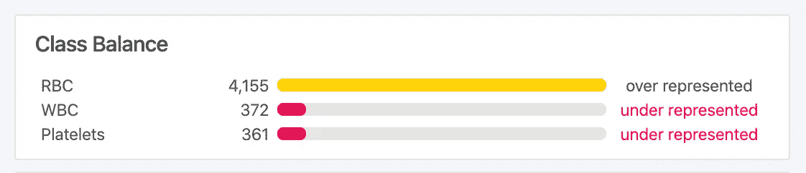
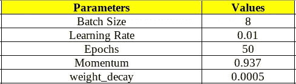
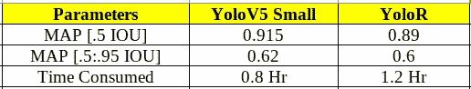

# 性能分析:YoloV5 与 YoloR

> 原文：<https://pub.towardsai.net/performance-analysis-yolov5-vs-yolor-a873001db193?source=collection_archive---------0----------------------->

## [深度学习](https://towardsai.net/p/category/machine-learning/deep-learning)

## 物体检测，哪个最好？？

照片由[马特·诺布尔](https://unsplash.com/@mcnoble?utm_source=unsplash&utm_medium=referral&utm_content=creditCopyText)在 [Unsplash](https://unsplash.com/s/photos/vision-bot?utm_source=unsplash&utm_medium=referral&utm_content=creditCopyText) 上拍摄

# 目录

1.  介绍
2.  YoloV5:真的还是假的？？
3.  尤洛:你看起来只有一个形象
4.  技术性能分析
5.  用例

# 介绍

对象检测是在几个预定义的类别中识别和区分图像中存在的对象的过程。对象检测的过程分为两个步骤:

1.  找出图像中对象的总数
2.  对第一步中提取的对象进行分类，并估计它们的大小

通常有两种类型的对象检测算法:

1.  两阶段目标检测:它涉及目标区域建议，然后是从区域建议和包围盒回归的目标分类。这种检测器实现了最高的精度，但是与其他类型的检测器相比速度较慢。一些这样的对象检测器是 RCNN、fast-RCNN 和 Mask RCNN。
2.  一阶段目标检测:从图像中预测包围盒，取消了目标区域建议步骤。与两级检测器相比，这种检测器非常快，但是在检测小物体时存在困难。快速的推理速度使得一级检测器适合于实时应用。一些这样的探测器是 YOLO、SSD 和 YoloR。

在了解了不同类型的物体探测器后，问题出现了:

> “哪一个最好？?"

从这么多算法中选择一个是非常令人困惑的。决策依赖于许多因素，并因每个用例而异。一些应用可能需要更快的推理速度，而一些应用需要精确的检测。对于第一种情况，应该选择一级检测器，而对于后一种情况，应该选择两级检测器。但是，从各自的类别中哪一个是最好的。为了进行相同的测试，我进行了两个一级对象检测器(即 YoloV5 和 YoloR)的性能分析。

# YoloV5:真的还是假的？？

2020 年 Ultralytics 发布 YoloV5 本身就是一个很大的争议。《约罗》的前三个版本由约瑟夫·雷德蒙和阿里·法尔哈迪出版。后来，约瑟夫中止了计算机视觉的研究。接着，YoloV4 由延续 Joseph Redmon 传统的 Alexey Bochkovskiy 推出。Yolo 的前四个版本是与同行评审的研究论文一起发表的，这与 YoloV5 的情况不同。Ultralytics 声称 YoloV5 的推理速度为 140 FPS，而 YoloV4 的推理速度为 50 FPS。他们还声称 YoloV5 的大小比 YoloV4 小 90%。

Alexey Bochkovskiy 和其他几位人工智能研究人员声称这是一种误导，因为 YoloV5 没有任何支持文件，他们表示这种比较是不准确的。后来，Ultralytics 的首席执行官兼创始人 Glenn Jocher 表示，他和他的团队将很快发表研究论文，以支持 YoloV5，但这尚未完成。

[YoloV5 参考值](https://github.com/ultralytics/yolov5)

# 尤洛:你看起来只有一个形象

《约略》于 2021 年初由简-王尧、何一豪和廖宏远出版。基本上就是隐性知识和显性知识相结合的概念。人类通过视觉、听觉和经验获得显性知识，而隐性知识是从过去的经验和潜意识学习中获得的。顾名思义，YoloR 被开发来使用图像的一种表示执行多项任务。颜色对象检测从深层获得显性知识，从浅层获得隐性知识。该体系结构将两种表示结合起来形成一种表示，这种表示可以进一步用于服务各种任务。

[约洛参考](https://github.com/WongKinYiu/yolor)

# **性能分析**

这是 YoloV5(你只看一次)和 YoloR(你只看一次表示)的性能分析。这两个模型都是在具有相同超参数的相同数据集上训练的。

## 资料组

该数据集包含最初由 [cosmicad](https://github.com/cosmicad/dataset) 和[aksha lambda](https://github.com/akshaylamba/all_CELL_data)开源的血细胞图像。共有 364 幅图像，分为三类，即红细胞、白细胞和血小板。三个类别大约有 4888 个标签。

Roboflow 的 BCCD 数据集[来源](https://public.roboflow.com/object-detection/bccd/)

## 超参数

如下所述，两个模型都考虑了很少的超参数。

来源:作者图片

## 韵律学

平均精度是评估两个模型性能的标准。第一个是以 0.5 作为 IOU 阈值的映射。而第二个是 IOU 阈值在 0.5 至 0.95 范围内以 0.05 为步长变化的图的平均值。

很明显，这两个模型在验证数据集上表现得一样好。训练时用的 Google collab GPU:**12GB 内存的 Nvidia k80。**

来源:作者图片

## 分析

**约洛夫 5** :在测试数据集上有更好的性能，尽管与约洛夫
约洛夫有几乎相同的地图:推理有更多的假阴性特征

# 用例

近年来，对象检测已经被分解成几个对企业有用的用例。其中一些是:

1.  自动驾驶汽车:检测街道上的其他车辆和行人，并计算汽车与其他物体之间的距离。此外，检测街道上的招牌，以确保自动驾驶机器人没有违反任何驾驶规则。
2.  闭路电视监控:对象检测可以使智能视频监控在没有任何人工参与的情况下检测可疑活动。此外，在存储 CCTV 摄像机的连续记录时，内存是一个大问题。这也可以通过对象检测来解决，其中当任何人进入帧中时开始记录。
3.  医学科学:在柯维德·疫情时代，物体探测对人类帮助很大。一些行业采用了这种机制来检测游客是否戴着口罩，是否保持安全距离。
4.  品牌列表:公司花钱在直播的体育比赛中展示他们的品牌名称和标志。在这种情况下，对象检测用于分析向观众显示品牌名称和标志的比赛时间线。

训练脚本和推理输出可以在这里找到

 [## GitHub-DhruvGangwani/yolov 5 _ vs _ YoloR

### 此时您不能执行该操作。您已使用另一个标签页或窗口登录。您已在另一个选项卡中注销，或者…

github.com](https://github.com/DhruvGangwani/YoloV5_vs_YoloR) 

## 结论

在这篇博客中，我已经解释了 YoloV5 和 YoloR 的性能分析。从指标和性能来看，很明显 YoloV5 要好得多。这个博客包含了对象检测算法的技术方面，但是理解对象检测算法的架构方面也很重要。所以我会强烈推荐大家去读 Neptune.ai 的[物体检测算法和库](https://neptune.ai/blog/object-detection-algorithms-and-libraries)，一站式了解几个这样的算法。

**谢谢。**