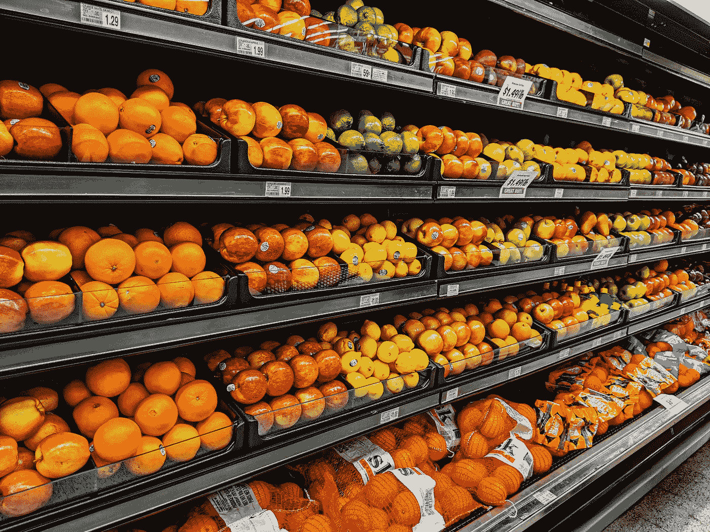
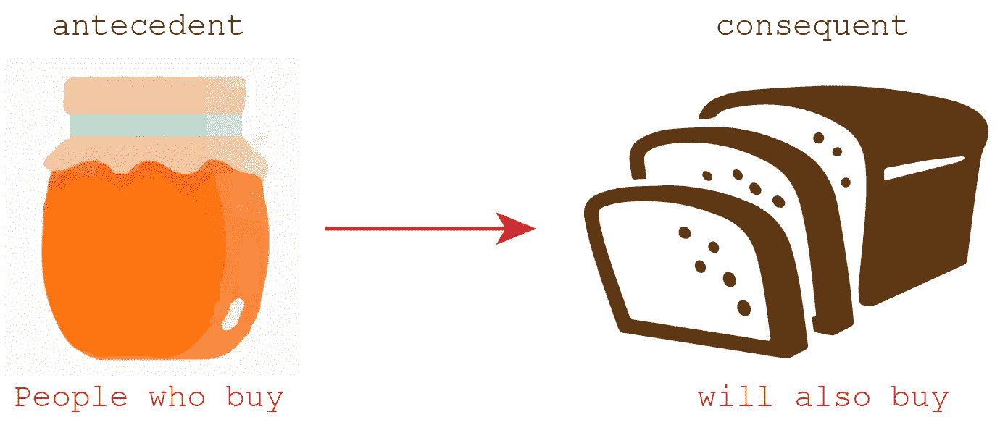
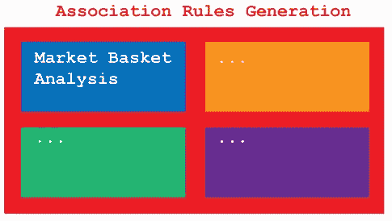
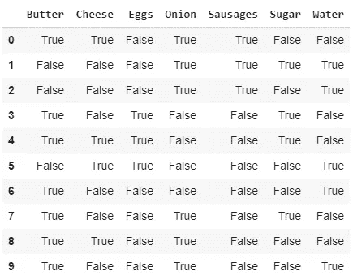
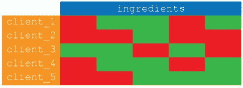
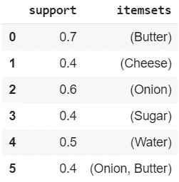
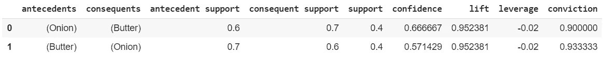
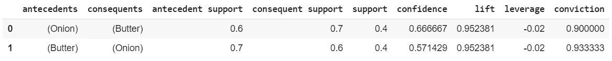

# 使用机器学习执行购物篮分析

> 原文：<https://pub.towardsai.net/performing-a-market-basket-analysis-with-machine-learning-94b5514ce1cb?source=collection_archive---------2----------------------->

## Apriori，关联分析，[机器学习](https://towardsai.net/p/category/machine-learning)

## 用 AI 提升营销。完整的代码[可在我的 Github 回购](https://github.com/arditoibryan/Projects/tree/master/20200629_Market_Basket_Analysis)

无监督学习有 3 个主要部分:聚类、降维和关联。虽然我做了一些编辑和简化，你可以在这个源码找到原始代码[。](https://rasbt.github.io/mlxtend/user_guide/frequent_patterns/association_rules/)



照片由 [gemma](https://unsplash.com/@_gemmajade?utm_source=medium&utm_medium=referral) 在 [Unsplash](https://unsplash.com?utm_source=medium&utm_medium=referral) 上拍摄

通常，关联分析的目标是找到以下关系:



# 澄清术语

经过几次搜索，我发现很多人把关联分析和购物篮分析混为一谈。如果我没理解错的话，关联分析(也叫关联规则生成、亲和度分析、关联规则挖掘……只是为了让事情更简单)指的是一类问题。



## 市场篮子分析

在这一类别中，购物篮分析代表了其中的一个子类别，当每个消费者购买的商品有许多清单时，它就会被应用。例如，同样的方法适用于**观看的电影**。不同的关联问题需要使用不同的关联子部分，这些子部分不会在市场篮分析中进行分类。

为了执行购物篮分析，我将使用臭名昭著的 apriori 算法。

# 步伐

幸运的是，构建该算法的步骤非常简单:

1.  安装模块
2.  导入库
3.  准备数据集
4.  提取频繁项目集
5.  提取关联规则
6.  提取规则
7.  定义阈值并提取最终关联

# 1.安装模块

我将使用 pip 导入模块。

```
! pip install mlxtend
! pip install xlrd
```

# 2.导入库

Scikit-Learn 不支持 apriori 算法。我将使用名为 mlxtend 的 python 库的扩展。

```
import pandas as pd
from mlxtend.preprocessing import TransactionEncoder
from mlxtend.frequent_patterns import apriori
from mlxtend.frequent_patterns import association_rules
```

# 3.准备数据集

因为我想概述这个问题的简化版本，我发现互联网上唯一兼容的数据集有成千上万的信息。我将自己创建一个数据集，这样您可以更好地了解它是如何工作的。

```
#Onion, Sausages, Cheese, Water, Butter, Sugar, Eggs
df = [['Onion', 'Sausages', 'Cheese', 'Butter'],
      ['Onion', 'Sausages', 'Water', 'Sugar'],
      ['Onion', 'Water', 'Sausages'],
      ['Butter', 'Sugar', 'Eggs'],
      ['Butter', 'Sugar', 'Eggs', 'Cheese'],
      ['Water', 'Cheese', 'Eggs'],
      ['Water', 'Butter'],
      ['Onion', 'Butter', 'Sugar'],
      ['Onion', 'Butter', 'Cheese'],
      ['Onion', 'Butter', 'Water'],
      ]
df = pd.DataFrame(df)
df
```



这是我们数据集的格式:成分作为特征，客户作为行

## 将数据帧转换为兼容列表

实际上，数据集在转换成数据帧之前就已经准备好了。然而，这篇文章的重点是向你说明什么是购物篮分析的组成部分。因为您可能会从存储在 pandas 数据框架中的信息开始，这将在将来证明是有用的(如果不感兴趣，您可以跳过)。

```
#1\. conversione in list: il problema che ha None values
df = dataset.values.tolist()
df
[['Onion', 'Sausages', 'Cheese', 'Butter'],
 ['Onion', 'Sausages', 'Water', 'Sugar'],
 ['Onion', 'Water', 'Sausages', None],
 ['Butter', 'Sugar', 'Eggs', None],
 ['Butter', 'Sugar', 'Eggs', 'Cheese'],
 ['Water', 'Cheese', 'Eggs', None],
 ['Water', 'Butter', None, None],
 ['Onion', 'Butter', 'Sugar', None],
 ['Onion', 'Butter', 'Cheese', None],
 ['Onion', 'Butter', 'Water', None]]
```

转换后，如你所见，我们的列表中仍然没有值。如果我们把它提供给模型，Apriori 将抛出一个错误。

```
#Removing None values in list, 2 dimensions
df_ = list()
for _ in df:
  #using list comprehension 
  _ = [x for x in _ if x is not None]
  df_.append(_)
df = df_
df
[['Onion', 'Sausages', 'Cheese', 'Butter'],
 ['Onion', 'Sausages', 'Water', 'Sugar'],
 ['Onion', 'Water', 'Sausages'],
 ['Butter', 'Sugar', 'Eggs'],
 ['Butter', 'Sugar', 'Eggs', 'Cheese'],
 ['Water', 'Cheese', 'Eggs'],
 ['Water', 'Butter'],
 ['Onion', 'Butter', 'Sugar'],
 ['Onion', 'Butter', 'Cheese'],
 ['Onion', 'Butter', 'Water']]
```

我使用 **df_** 重新创建了列表，但是删除了 None 值。因为 DataFrame 是使用二维嵌套列表构建的，所以如果您想在多维列表中不删除任何内容，则此算法不适用。

```
#one_hot encoding (boolean output)
te = TransactionEncoder()
te_ary = te.fit(df).transform(df)
df = pd.DataFrame(te_ary, columns=te.columns_)
df
```

Scikit-Learn 不支持 apriori 算法，为此我安装了 **mlxtend** 。它将把二维列表转换成 one_hot 编码的数据帧。

如上所述，这应该是最终结果:



对于每一个顾客来说，买一种食材就相当于真，而不是买假。正如您所注意到的，apriori 算法不考虑数量，而只考虑产品是否被购买。

# 4.提取频繁项目集

```
frequent_itemsets = apriori(df, min_support=0.4, use_colnames=True)
frequent_itemsets
```



# 5.提取关联规则

在所有项目中，我将选择最低置信度为 0.4 的项目:

```
association_rules(frequent_itemsets, metric="confidence", min_threshold=0.4)
```



# 6.提取规则

通过这一步，我将对 0.7 的升力施加一个最小阈值:

```
rules = association_rules(frequent_itemsets, metric="lift", min_threshold=.7)
```



# 7.定义阈值并提取最终关联

```
rules["antecedent_len"] = rules["antecedents"].apply(lambda x: len(x))
```


正如我们所看到的，买洋葱的人可能会买黄油，这个规则也适用，反之亦然。

## 根据具体情况做出选择

如果您想基于阈值选择关联规则，您会发现这个算法很有用。

```
rules[ (rules['antecedent_len'] >= 1) &
       (rules['confidence'] > 0.75) &
       (rules['lift'] > 1.2) ]
```

## 根据成分进行选择

```
#select the ones you want
rules[rules['antecedents'] == {'Onion'}]
```