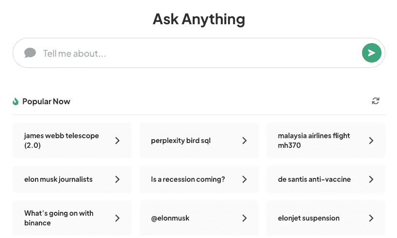
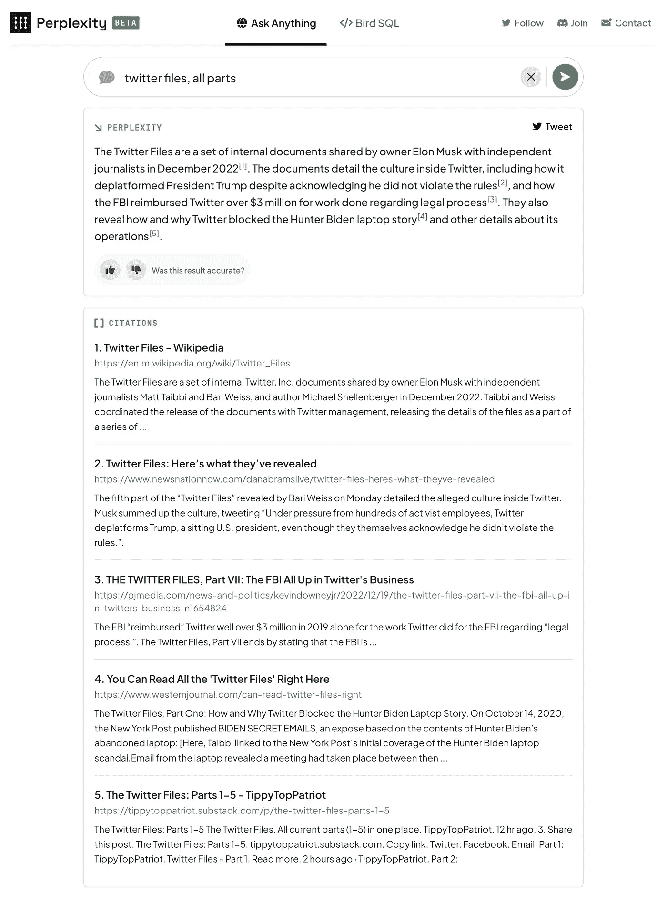
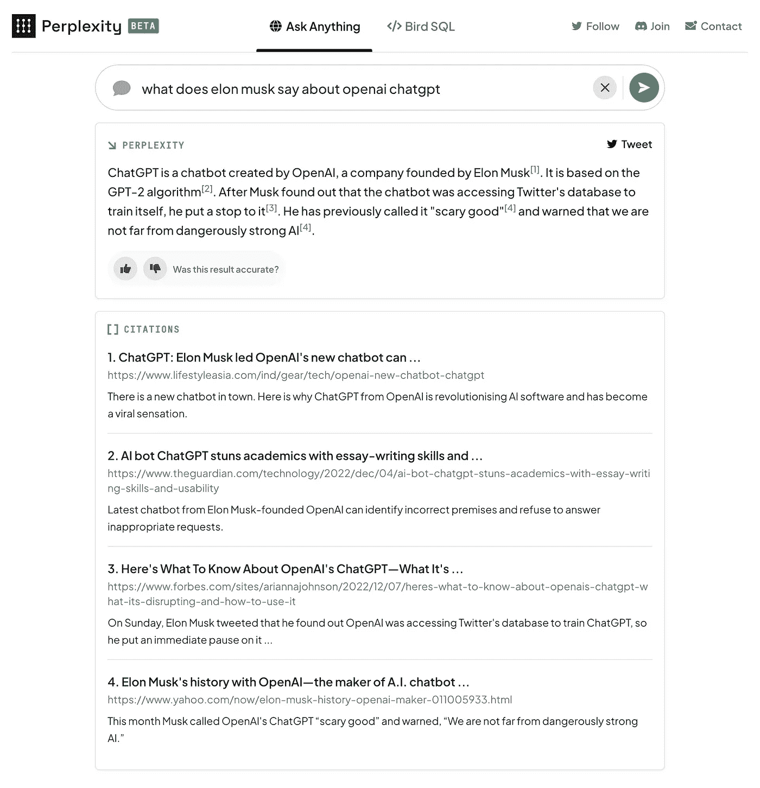
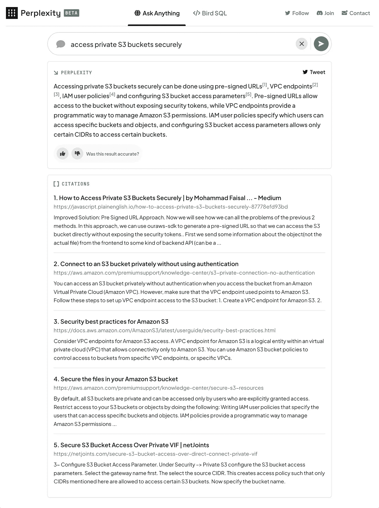

# 困惑问:由人工智能驱动的改变游戏规则的搜索工具

> 原文：<https://pub.towardsai.net/perplexity-ask-a-game-changing-search-tool-powered-by-ai-eb0da75ce87b?source=collection_archive---------0----------------------->

[https://www.perplexity.ai/](https://www.perplexity.ai/)

很高兴分享一个改变游戏规则的工具，它改进了我的信息搜索过程——[困惑问](https://www.perplexity.ai/)。在大型语言模型(比如 OpenAI API)和搜索引擎的支持下，perferency 为我的查询提供了快速和解释性的结果。虽然准确性取决于搜索结果和人工智能能力，但我发现它是一个有价值的资源，甚至取代了谷歌的困惑，成为我的首选搜索引擎。

# 困惑问答简介

performance Ask 是一个新的搜索界面，它使用先进的人工智能技术，如 OpenAI 的 GPT-3 模型，提供对问题的直接回答以及搜索结果的总结和引用。这与传统的搜索引擎有很大的不同，传统的搜索引擎只是提供一个链接列表，允许用户快速轻松地找到他们需要的信息，而不必点击多个页面或搜索不相关的结果。

performance Ask 的突出特点之一是包含了搜索结果的引用。这是验证所提供信息准确性的重要工具，有助于确保用户不会被不正确或误导的信息所误导。在这种情况下，performance Ask 类似于 Google PageRank 算法，它使用引用作为确定网页质量和相关性的方法。

# 困惑的例子问在行动中

但是困惑问不仅仅是一个寻找信息的有用工具——它还可以提供见解并揭示有趣或意想不到的结果。例如，当我搜索“ **twitter 文件，所有部分**”时，performance Ask 提供了 twitter 所有者埃隆马斯克(Elon Musk)在 2022 年 12 月与独立记者分享的内部文件摘要，以及进一步信息的引用。这份总结披露了 Twitter 运营的细节，包括它如何让特朗普总统下台，以及联邦调查局如何偿还 Twitter 超过 300 万美元的法律程序工作。

twitter 文件，所有部分——困惑地问

我进行的另一个有趣的搜索是“**埃隆·马斯克对 OpenAI ChatGPT 有什么看法**”performance Ask 提供了由马斯克创建的 OpenAI 创建的聊天机器人的总结，以及它与 GPT-2 算法的关系。该摘要还提到，马斯克阻止了聊天机器人访问 Twitter 的数据库来训练自己，他之前称之为“可怕的好”，并警告说，我们离危险的强大人工智能不远了。

埃隆·马斯克对 open ai ChatGPT——困惑问怎么说

困惑询问对于寻找问题的实际解决方案也很有用，例如当我搜索“**安全地访问私有 S3 桶**”时，困惑询问提供了安全地访问私有 S3 桶的不同方法的摘要，包括预签名的 URL、VPC 端点、IAM 用户策略和配置 S3 桶访问参数。

安全地访问私有 S3 存储桶—困惑地问

# 搜索的未来

除了有价值的搜索功能，performance Ask 还有其他一些显著的特性。它不包括分散注意力的广告，不需要注册或登录即可使用。它也不会收集个人信息，这使它成为一种安全和私密的信息搜索方式。

随着人工智能的不断进步和更强大的语言模型变得可用，我们很可能会看到更多创新的搜索工具，如 performance Ask。这些技术有可能极大地增强我们在网上查找和验证信息的能力，并可能在塑造搜索的未来方面发挥重要作用。

# 结论

总之，performance Ask 是一个改变游戏规则的工具，有可能彻底改变我们访问和评估在线信息的方式。它使用先进的人工智能技术，并包含搜索结果的引用，使其成为快速准确地找到所需信息的宝贵资源。performance Ask 有可能重塑搜索的未来，绝对值得一试。

我鼓励读者自己尝试困惑问，看看它如何能改善他们的信息搜索过程。请记住不要输入个人信息，并注意可能会出现攻击性或危险的内容。困惑是不承担任何责任的内容产生。因此，如果你正在寻找一个新的和改进的方法来搜索信息，给困惑问一个尝试，看看它如何能改变你的信息搜索过程。