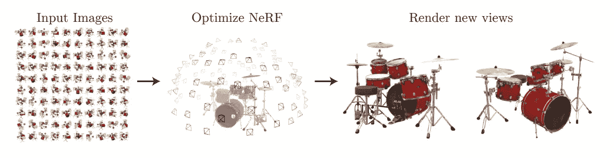
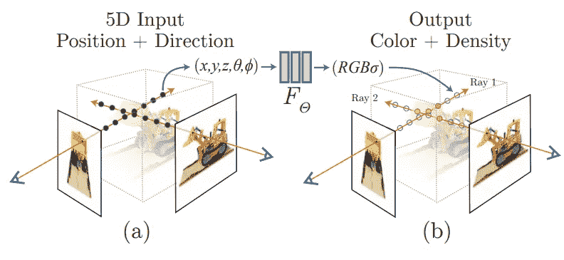
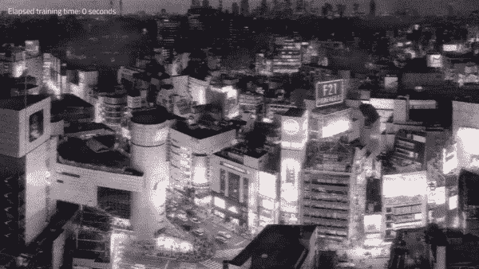

# 照片到 3D 场景只需几毫秒

> 原文：<https://pub.towardsai.net/photos-to-3d-scenes-in-milliseconds-a247cb2e890e?source=collection_archive---------0----------------------->

## 英伟达研究中心解释说

> 最初发表于 [louisbouchard.ai](https://www.louisbouchard.ai/nvidia-photos-into-3d-scenes/) ，前两天在[我的博客](https://www.louisbouchard.ai/nvidia-photos-into-3d-scenes/)上读到的！

## 观看视频

好像拍一张照片还不是一个足够具有挑战性的技术能力，我们现在正在做相反的事情:从照片中模拟世界。我已经介绍了令人惊叹的基于人工智能的模型，这些模型可以拍摄图像并将其转化为高质量的场景。一项具有挑战性的任务包括在二维图片世界中拍摄一些图像，以创建物体或人在现实世界中的样子。你可以很容易地看到这项技术对于许多行业是多么有用，比如视频游戏、动画电影或广告。拍几张照片，立即有一个现实的模型插入到您的产品。结果比我在 2020 年报道的第一个模型 NeRF 有了显著的提高。这种改进不仅仅是关于结果的质量。NVIDIA 甚至做得更好。

不仅质量相当，甚至更好，而且在不到两年的研究时间内，速度提高了 1000 多倍。这就是人工智能研究的步伐:质量和效率的指数级增长。这是这个领域如此不可思议的一个重要因素。如果你错过了几天，你将会失去新的技术和结果的质量，这就是为什么我第一次开始写这些文章，为什么你应该跟随我的工作！；)看看那些 3D 模型就知道了……

结果使用[瞬间 Nerf](https://nvlabs.github.io/instant-ngp/assets/mueller2022instant.pdf) 。

这些很酷的模型只需要十几张照片，人工智能就能猜出缺失的地方，并在几秒钟内创造出这种美。用 NeRF 制作这样的东西需要几个小时。让我们深入了解他们是如何在如此短的时间内在如此多的方面取得如此大的进步的。

## 反向渲染

Instant NeRF 攻击反向渲染的任务，这包括从图片渲染 3D 表示，在这种情况下，十几个，近似对象的真实形状以及光线在其上的行为，以便它在任何新场景中都看起来逼真。

这里 NeRF 代表神经辐射场。我将只做一个 NeRFs 如何工作的快速概述，因为我已经在多个视频中介绍了这种网络，我邀请您观看更多细节和更好的理解。

神经辐射场。图片来自 [NeRF 纸](https://arxiv.org/abs/2003.08934)。

很快，NeRF 是一种神经网络。他们将图像和相机设置作为输入，并学习如何产生图像中物体或场景的初始 3D 表示，使用从监督学习设置中学习的参数微调该表示。这意味着我们需要一个 3D 对象和一些不同已知角度的图像来训练它，网络将学习重新创建该对象。为了获得尽可能好的效果，我们需要一张来自多个视角的照片，如上图所示，以确保我们捕捉到了物体的所有或大部分侧面。我们训练这个网络来理解一般物体的形状和光辐射。我们要求它学习如何根据之前看到的东西来填充缺失的部分，以及光线在 3D 世界中对它们的反应。

使用 [Instant Nerf](https://nvlabs.github.io/instant-ngp/assets/mueller2022instant.pdf) 的结果。

基本上，这就像让你画一个人，而不给出手上的任何细节。根据你的知识，你会自动假设这个人有五个手指。这对我们来说很容易，因为我们有多年的经验，而目前的人工智能缺乏的一个重要东西是我们的智力。我们可以在没有链接的地方创建链接，做许多不可思议的事情。另一方面，人工智能需要特定的规则，或者至少是可以遵循的例子，这就是为什么我们需要在训练阶段给它一个物体在现实世界中的样子，以进行改进。

然后，在这样一个训练过程之后，你只需要在推断的时候输入相机角度的图像，它就能在几个小时内生成最终的模型…

我说了几个小时吗？

很抱歉我还在 2021 年。现在几秒钟就能完成。

NVIDIA 的这个名为 Instant NeRF 的新版本确实比一年前的 NeRF 版本快 1000 倍。为什么？因为多分辨率散列网格编码。多什么？多分辨率散列网格编码。他们用这句话解释得很清楚；

> 我们通过一种多功能的新输入编码来降低这一成本，这种编码允许在不牺牲质量的情况下使用较小的网络，从而显著减少浮点和存储器访问操作的数量。[1]

简而言之，它们改变了 NeRF 网络如何看待输入，因此我们最初的 3D 模型预测，在保持输出质量相同的同时，使用更小的神经网络，使其更容易消化，信息效率更高。使用较小的网络保持如此高的质量是可能的，因为我们不仅在训练期间学习了 NeRF 网络的权重，而且还预先学习了我们转换这些输入的方式。

图片来自[报](https://nvlabs.github.io/instant-ngp/assets/mueller2022instant.pdf)。

因此，使用经过训练的函数(这里是步骤 1 到 4)对输入进行转换，在哈希表中进行压缩，以非常快速地集中于有价值的信息，然后在步骤 5 中发送到一个小得多的网络，因为输入现在类似地小得多。它们将任何类型的值存储在一个表中，表中的键指示这些值的存储位置，以便进行高效的并行修改，并在训练和推理过程中消除大数组的查找时间。这种转变和更小的网络是 Instant NeRF 如此之快的原因，也是它出现在本文中的原因。

瞧！这就是 NVIDIA 现在如何能够在几秒钟内生成这样的 3D 模型！在视频中观看更多结果[！](https://youtu.be/UHQZBQOVAIU)

如果这还不够酷，我说它可以存储任何类型的值，这意味着这种技术不仅可以用于 NeRFs，还可以用于其他超级酷的应用程序，如 gigapixel 图像，这些应用程序变得非常高效。

结果使用[的瞬间 Nerf](https://nvlabs.github.io/instant-ngp/assets/mueller2022instant.pdf) 。

当然，这只是这篇新论文的概述，它以一种新颖的方式攻击这个超级有趣的任务。我邀请您阅读他们的优秀论文，了解关于多分辨率散列网格编码方法及其实现的更多技术细节。这篇论文及其代码的链接在下面的参考文献中。

我希望你喜欢这篇文章，如果你喜欢，请考虑订阅[频道](https://youtu.be/UHQZBQOVAIU)来支持我在 YouTube 上的工作，并评论你对这篇摘要的看法。我很想看看你的想法！

## 参考

*   NVIDIA 的博文:[https://blogs . NVIDIA . com/blog/2022/03/25/instant-nerf-research-3d-ai/](https://blogs.nvidia.com/blog/2022/03/25/instant-nerf-research-3d-ai/)
*   英伟达的视频:[https://NV labs . github . io/instant-ngp/assets/mueller 2022 instant . MP4](https://nvlabs.github.io/instant-ngp/assets/mueller2022instant.mp4)
*   论文:托马斯·穆勒、亚历克斯·埃文斯、克里斯托夫·席德和亚历山大·凯勒，2022，“多分辨率哈希编码的即时神经图形原语”，[https://NV labs . github . io/Instant-ngp/assets/mueller 2022 Instant . pdf](https://nvlabs.github.io/instant-ngp/assets/mueller2022instant.pdf)
*   项目链接:[https://nvlabs.github.io/instant-ngp/](https://nvlabs.github.io/instant-ngp/)
*   代码:[https://github.com/NVlabs/instant-ngp](https://github.com/NVlabs/instant-ngp)
*   我的时事通讯(一个新的人工智能应用每周解释给你的电子邮件！):[https://www.louisbouchard.ai/newsletter/](https://www.louisbouchard.ai/newsletter/)