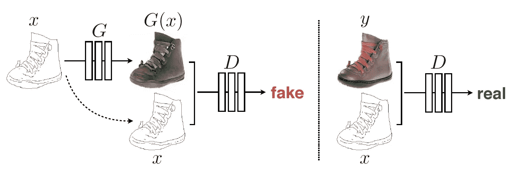
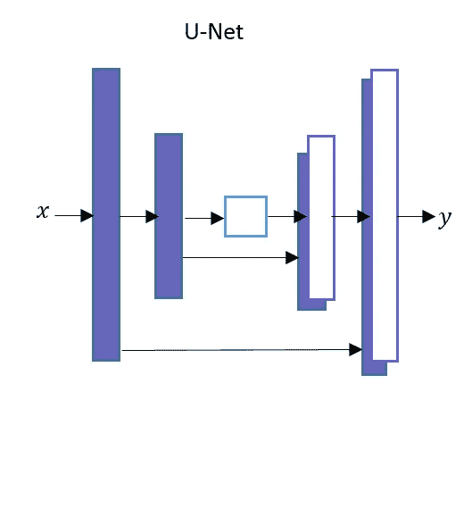
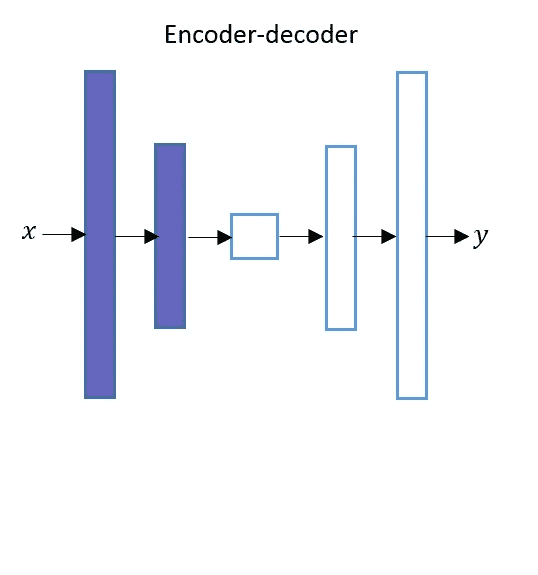
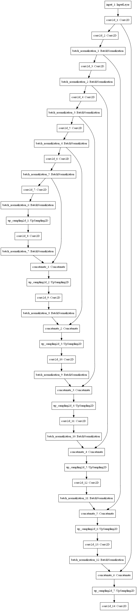
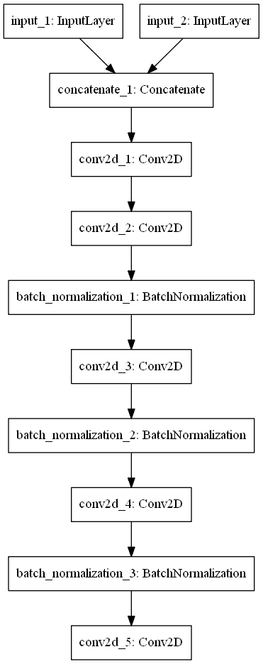
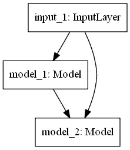
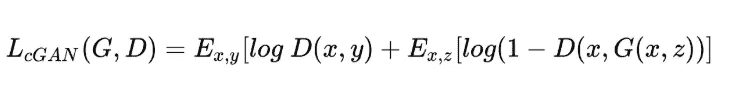
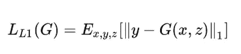
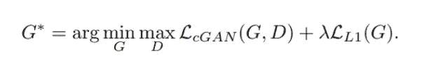

# Pix2Pix 网络，一个使用条件 GANs(cgan)的图像到图像的翻译

> 原文：<https://pub.towardsai.net/pix2pix-network-an-image-to-image-translation-using-conditional-gans-cgans-8a08b661d206?source=collection_archive---------0----------------------->

## **pix 2 pix 简介 cGANs |** [**走向 AI**](https://towardsai.net)

# 介绍

[**Pix2Pix**](https://arxiv.org/pdf/1611.07004.pdf) 网络基本上是一个**条件 GANs****【cGAN】**学习从输入图像到输出图像的映射。你可以在我之前的帖子[这里](https://medium.com/datadriveninvestor/an-introduction-to-conditional-gans-cgans-727d1f5bb011)和它的应用[这里](https://medium.com/towards-artificial-intelligence/face-aging-using-conditional-gans-an-introduction-to-age-cgans-machine-learning-8a4a6a100201)阅读**条件句**。在这篇文章中，我将试着解释一下 [**Pix2Pix**](https://arxiv.org/pdf/1611.07004.pdf) 网络。

[https://arxiv.org/pdf/1611.07004.pdf](https://arxiv.org/pdf/1611.07004.pdf)

**图像到图像转换**是将图像的一种表示转换成另一种表示的过程。

# 发电机网络

**发电机**网络采用基于 [**U-Net**](https://arxiv.org/pdf/1505.04597.pdf) 的架构。 **U-Net 的**架构类似于**自动编码器**网络，除了一点不同。 **U-Net** 和**自动编码器**网络都有两个网络**编码器**和**解码器。**

# **优信网络架构图**

**优信网的架构**

*   **U-Net 的**网络在**编码器**层和**解码器**层之间有跳跃连接。
*   如图所示，第一层**编码器的输出直接通过**传到最后一层**解码器**，第二层**编码器**的输出传到倒数第二层**解码器**，以此类推。
*   我们来考虑一下，如果 **U-Net 的**(包括中间层)总共有 N 层，那么从**编码器**网络的第 k *层到**解码器**网络的第(N-k+1)层会有一个跳跃连接。其中 1 ≤ k ≤ N/2。*

# **自动编码器架构图**

**自动编码器的架构**

*   如图所示**自动编码器**在**编码器**层和**解码器**层之间没有跳跃连接。

# **发电机的架构**

*   发电机 T21 网络由这两个网络组成。
*   **编码器**网络是一个下采样器。
*   **解码器**网络是一个上采样器。

**发电机的结构**

# **发电机的编码器架构**

*   **发生器**网络的**编码器**网络有七个卷积块。
*   每个卷积块都有一个卷积层，后跟一个 LeakyRelu 激活函数。
*   除了第一卷积层之外，每个卷积块还具有批量归一化层。

# **发生器的解码器架构**

*   **发生器**网络的**解码器**网络有七个上采样卷积块。
*   每个上采样卷积块具有上采样层，其后是卷积层、批量归一化层和 ReLU 激活函数。

这里是一个**发电机**网络中的六个跳跃连接。串联沿着通道轴发生。

*   第一个**编码器**模块的输出连接到第六个**解码器**模块。
*   第二个**编码器**模块的输出连接到第五个**解码器**模块。
*   第三个**编码器**模块的输出连接到第四个**解码器**模块。
*   第四个**编码器**模块的输出连接到第三个**解码器**模块。
*   第五个**编码器**模块的输出连接到第二个**解码器**模块。
*   第 6 个**编码器**模块的输出连接到第 1 个**解码器**模块。

# 鉴别器**的架构**

鉴频器网络采用 [**PatchGAN**](https://arxiv.org/pdf/1604.04382.pdf) 架构。PatchGAN 网络包含五个卷积块。

**鉴频器架构**

# 甘**的架构**

**甘的建筑**

# **Pix2Pix** 网络培训

Pix2Pix 是一个条件 GANs。条件 GANs 的损失函数可以写成如下形式。

**条件甘的损失函数**

我们必须最小化重建图像和原始图像之间的损失。为了使图像不那么模糊，我们可以使用 **L1** 或 **L2** 正则化。

*   L1 正则化是每个数据点的绝对误差之和。
*   L2 正则化是每个数据点的平方损失之和。
*   对于单个图像，L1 正则化损失函数可以如下所示。

**L1 正则化损失函数**

其中 y 是原始图像，G(x，z)是由**生成器**网络生成的图像。L1 损失通过原始图像的所有像素值和生成图像的所有像素值之间的所有绝对差的总和来计算。

**Pix2Pix** 的最终损失函数如下所示。

**Pix2Pix 的总损失函数**

**伴随 jupyter 本帖的笔记本可以在**[**Github**](https://github.com/nitwmanish/Pix2Pix-Network-An-Image-To-Image-Translation-Using-Conditional-GANs)**上找到。**

# 结论

**Pix2Pix cGANs** 可用于将黑色&白色图像转换为彩色图像，将草图转换为照片，将白天图像转换为夜晚图像，将卫星图像转换为地图图像。

***我希望这篇文章能帮助你开始构建自己的*pix 2 pix*cgan。我认为它至少会提供一个关于*pix 2 pix*cgan 的很好的解释和理解。***