# 你需要知道的流行数据科学 Python 包

> 原文：<https://pub.towardsai.net/popular-data-science-python-packages-you-need-to-know-5c5d24c3f8be?source=collection_archive---------2----------------------->

## 不要错过这些套餐


照片由[丹尼尔·阿克谢诺夫](https://unsplash.com/es/@nebe3etogo?utm_source=medium&utm_medium=referral)在 [Unsplash](https://unsplash.com?utm_source=medium&utm_medium=referral) 上拍摄

都快年底了，数据普及还是势不可挡。在过去的一年中，许多数据 Python 包都得到了非常好的开发，并帮助了许多数据人员。

这里有几个你应该知道的流行的 Python 包，以确保你得到所有优秀的 Python 包。

# 1.达斯克

Dask 是一个用于并行计算的 Python 包，构建在 Pandas、Numpy 等流行包之上。Dask 有两个主要特点:

1.  **任务调度**用于自动化任务和调度活动，
2.  **大数据采集**用于并行数据处理数据。

总之，Dask 简化了 Pandas Python 包，比如数据框对象。不过，您可以通过并行化流程来调度活动并获得更快的执行时间。

让我们试试 Dask 的简单函数。但是首先，我们必须安装软件包(Anaconda 已经默认安装了 Dask)。

```
#Install dask completely
python -m pip install "dask[complete]"

#Install dask core only
python -m pip install dask
```

首先，我们可以启动 Dask 仪表板来监控我们与 Dask 的活动。

```
import dask
from dask.distributed import Client, progress

client = Client(processes=False, threads_per_worker=2,
                n_workers=1, memory_limit='2GB')
client
```

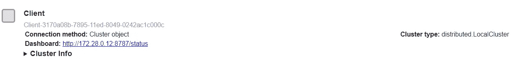

作者图片

如果我们单击 dashboard 链接，我们将看到下图。

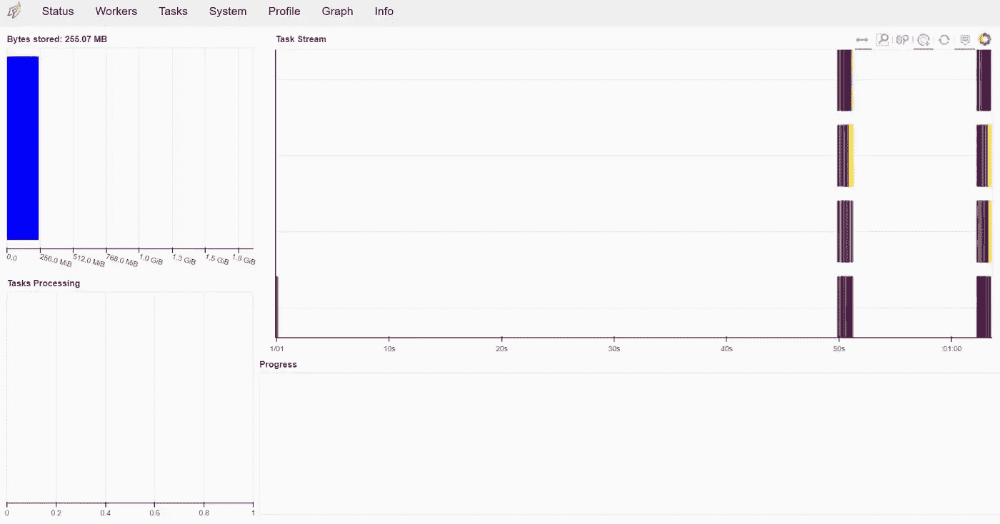

作者图片

您可以摆弄一下仪表板，看看它的功能，但是让我们试试 Dask 数据处理功能。我们可以从熊猫对象创建一个 dask 数据框。

```
import dask.dataframe as dd

index = pd.date_range("2022-01-01", periods=2400, freq="1H")
df = pd.DataFrame({"a": np.arange(2400), "b": list("abcaddbe" * 300)}, index=index)
ddf = dd.from_pandas(df, npartitions=10)
ddf
```

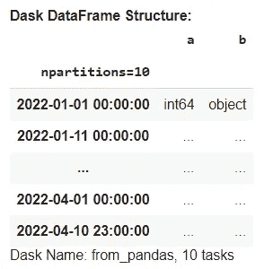

作者图片

Dask 数据框类似于 Pandas 数据框，但它是惰性的，这意味着结果不会显示在 Jupyter 笔记本上。为了显示数据框对象，我们需要用`compute`方法运行它。

```
ddf.compute()
```

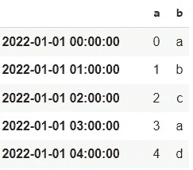

作者图片

Dask 数据框中的数据选择方法也类似于熊猫。

```
ddf[ddf['a'] >500].compute()
```

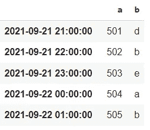

作者图片

Dask 是关于并行化的快速计算。当我们拥有大数据并需要高计算性能时，Dask 非常适合使用。然而，较小的数据更适合用熊猫来处理。

如果对 Dask 感兴趣，请参考文档以进一步了解。

# 2.骗子

[Faker](https://github.com/joke2k/faker) 是一个 Python 包，通过简单的步骤生成合成数据。它是基本包之一，成为许多高级数据合成包的基础。

我们试试 Faker，看看效果如何。首先，我们需要安装软件包。

```
pip install faker
```

使用 Faker 包的第一步是初始化`Faker`类。

```
from faker import Faker
fake = Faker()
```

课程开始后，我们会尝试各种方法来生成合成数据。

```
print('Synthetic Name: ', fake.name())
print('\n')
print('Synthetic Address: ', fake.address())
print('\n')
print('Synthetic Text: ', fake.text())
```

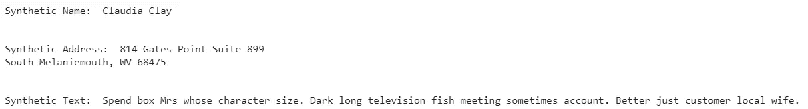

作者图片

分别使用`name`、`address`和`text`方法，我们得到不同的合成数据。每次我们运行这个方法，我们都会得到一些新的东西。

Faker 并不局限于上面的例子，因为我们还可以用 Faker 生成更多的变量；比如银行，信用评分等等。如果你想探索更多，请参考[文档](https://faker.readthedocs.io/en/stable/)。

# 3.德威治

[Dulwich](https://www.dulwich.io/) 是一个不依赖 Git 文件和协议实现 Git 的 Python 包。这个包完全使用 Python 访问 Git 功能，没有任何麻烦。

让我们试试这个包就知道了。首先，我们需要安装德威治。

```
pip install dulwich
```

在 Git 上使用 Dulwich 将遵循类似的过程。因此，让我们尝试启动存储库。

```
from os import mkdir
import sys
from dulwich.repo import Repo

mkdir("myrepo")
repo = Repo.init("myrepo")
repo
```

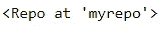

作者图片

上面的代码将启动一个名为“myrepo”的存储库。接下来，让我们尝试转移我们创建的文件。

```
df.to_csv('train1.csv', index = False)
repo.stage([b"train1.csv"])
```

在上面的例子中，我们创建了一个 CSV 文件，并将其存放到我们的存储库中。然后，我们用下面的代码提交文件。

```
commit_id = repo.do_commit(b"The first commit")
```

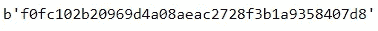

作者图片

提交将为我们提供稍后用于版本控制的 ID。如果我们想看到提交消息，我们可以使用下面的代码。

```
repo[commit_id].message
```

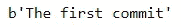

作者图片

最后，如果我们想访问 Git 日志，我们可以使用下面的代码。

```
from dulwich import porcelain
porcelain.log('myrepo', max_entries=1)
```

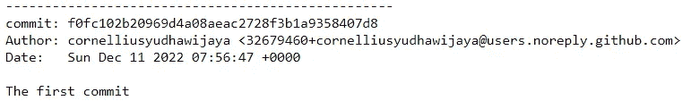

作者图片

如果您想了解全部功能，可以访问这里的文档。

# 4.钟摆

[Pendulum](https://pendulum.eustace.io/) 是一个 Python 包，使日期时间数据处理变得容易。它旨在用一个更直观的函数替换标准的 datetime 类函数。

让我们从安装包开始。

```
pip install pendulum
```

在下面的例子中，我们可以用下面的代码初始化我们的时区并访问时间来改变它。

```
import pendulum
now = pendulum.now("Asia/Jakarta")# Changing timezone

now.to_iso8601_string()# Day Shifting
now.add(days=2)
```

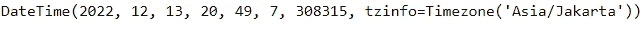

作者图片

有了钟摆，也很容易进行日期迭代来获取您想要的数据。

```
dt = pendulum.now()

period = dt - dt.subtract(days=7)

for dt in period:
    print(dt)
```

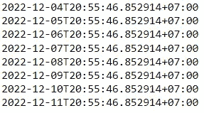

作者图片

你可以用钟摆做更多的事情。请参考[文档](https://pendulum.eustace.io/docs/)了解更多信息。

# 5.硒

Selenium 是一个 Python 包，用于自动化浏览器活动。它可以自动完成任何 web 浏览活动，从打开浏览器、点击按钮、登录、收集数据等等。您可以像在 web 浏览器中一样自动执行活动。

让我们从安装包开始。

```
pip install selenium
```

要打开特定的浏览器，Selenium 需要下载驱动程序。你可以参考[文档](https://pypi.org/project/selenium/)了解所有浏览器细节，但是我会使用`chromedrive_autoinstaller`包来自动下载 Chrome 驱动程序。

```
from selenium import webdriver
import chromedriver_autoinstaller

chromedriver_autoinstaller.install() 
```

比如我想打开 Teepublic 网站，点击登录按钮。为此，我使用下面的代码。

```
from selenium import webdriver

option = webdriver.ChromeOptions()

# Create new Instance of Chrome
browser = webdriver.Chrome(chrome_options=option)

browser.get('https://www.teepublic.com')
browser.find_element(By.LINK_TEXT, "Log In").click()
```

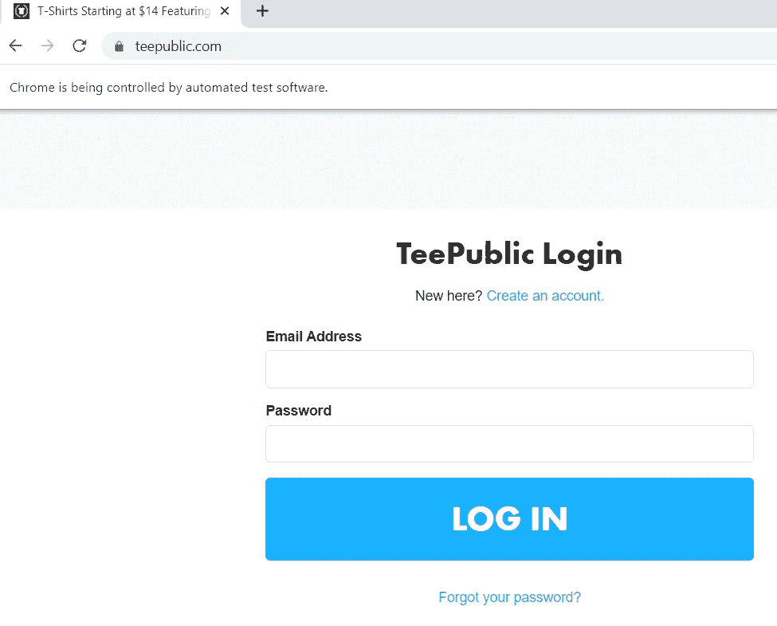

作者图片

你仍然可以用硒做很多事情。从[文档](https://www.selenium.dev/documentation/)中了解更多信息。另外，关于 Selenium 实现的例子，请参考本文[中的](https://medium.com/geekculture/automate-redbubble-design-publishing-with-python-e19485401966)。

# **结论**

已经开发了许多流行的数据科学 Python 包，以下是一些对您的数据工作流有所帮助的包:

1.  达斯克
2.  骗子
3.  德威治
4.  钟摆
5.  硒

希望有帮助！

> *如果您不是作为中等会员订阅，请考虑通过* [*我的推荐*](https://cornelliusyudhawijaya.medium.com/membership) *订阅。*