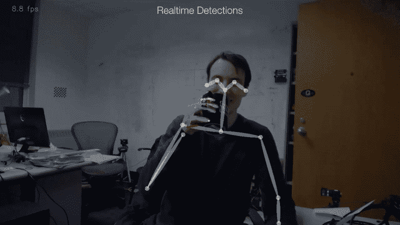
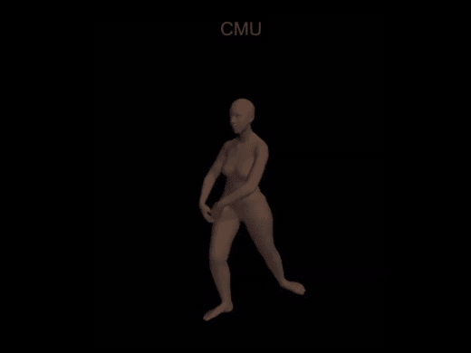
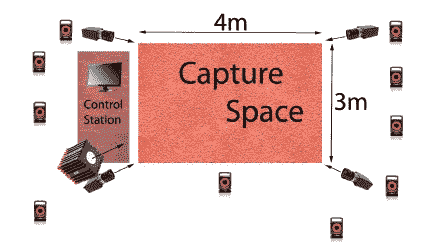
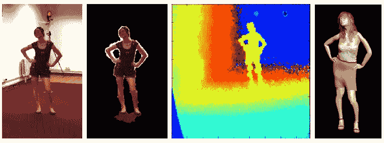
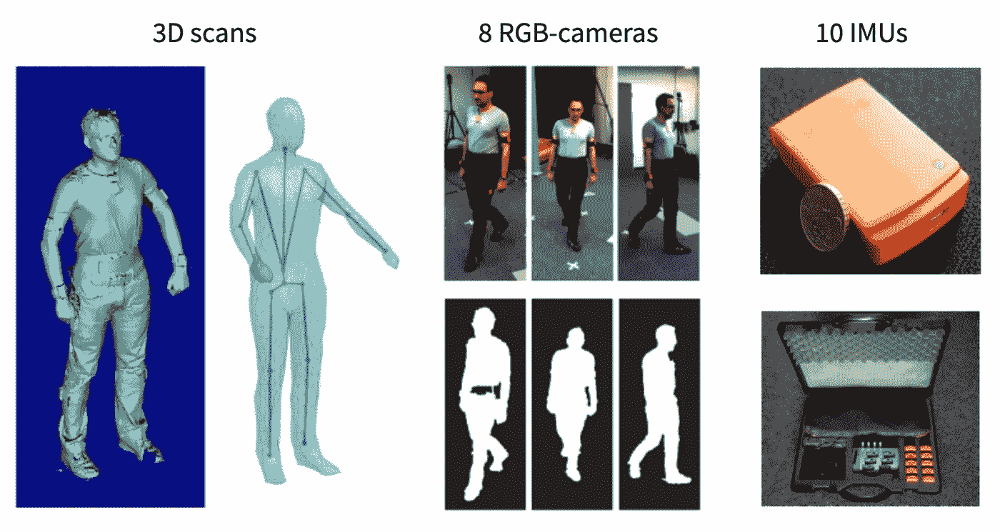
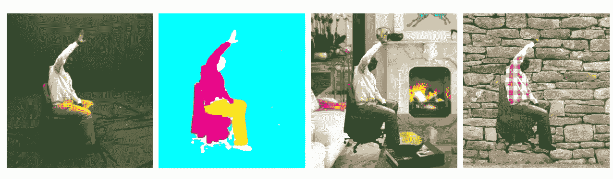
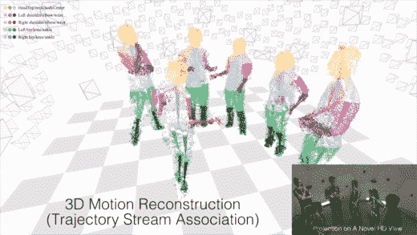
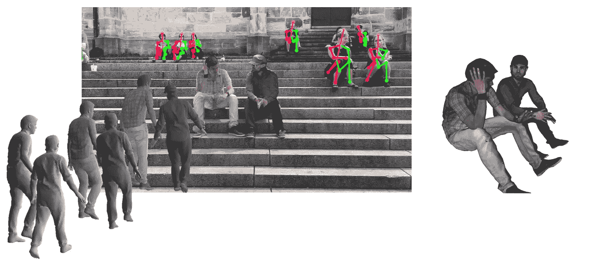

# 三维人体姿态估计的流行数据集

> 原文：<https://pub.towardsai.net/popular-datasets-for-3d-human-pose-estimation-a309b5700f9c?source=collection_archive---------1----------------------->

## [计算机视觉](https://towardsai.net/p/category/computer-vision)

## 获取解释和创建您自己的数据集的知识

由[卡米洛·希门尼斯](https://unsplash.com/@camstejim?utm_source=medium&utm_medium=referral)在 [Unsplash](https://unsplash.com?utm_source=medium&utm_medium=referral) 上拍摄的照片

> “有了 3D，你就能沉浸在这个世界中”
> ——李安(2003 年《绿巨人》的导演)

# 介绍

人体姿态估计(HPE)任务旨在从给定的传感器输入中获得人体的姿态。
这一研究领域可应用于许多应用，如*动作/活动* *识别*、*动作检测*、*人体跟踪、* [*移动应用*](https://github.com/CMU-Perceptual-Computing-Lab/openpose) 和*虚拟现实*。

来源:图片由 [OpenPose](https://github.com/CMU-Perceptual-Computing-Lab/openpose) 提供

基于建立我们的对象的位置所必需的参数，这个研究领域可以分为 **2D** 和 **3D** 人体姿态估计。

*   **2D·HPE**从单目图像和视频中计算出人体关节的位置。
*   **3D HPE** 从图像或其他输入源计算 3D 空间中人体关节的位置。

得益于深度学习技术，HPE 实现快速进步( [Loper et al .，2015](https://www.researchgate.net/publication/287815055_SMPL_a_skinned_multi-person_linear_model)；[金泽等人，2018](https://arxiv.org/abs/1712.06584) 。
数据集和所有深度学习技术一样，扮演着重要的角色。
*在本文中，我们将一起来看看最流行的可用公共数据集的概述。*
*这将让我们看到，在以后的时间里，这种评价方法能够理解 SOTA 最近的表现。*

> **免责声明:**在本文中，我们将仅限于分析 3D 案例

# 三维人体姿态估计数据集

下面呈现的数据集是使用**运动捕捉** **(MoCap)系统**捕捉的。但是，还有其他方法可以为 HPE 3D 创建数据集。举几个例子:

*   **:包含单个合成人的视频，真实背景不变。它包含身体部分分割、深度、光流和表面法线的注释。该数据集采用 SMPL 身体模型来生成身体姿势和形状**
*   **[**聚敛数据集**](https://amass.is.tue.mpg.de/) :是人体运动的大型数据库，通过在公共框架和参数化内表示不同的基于光学标记的运动捕捉数据集来统一它们。**

****

**来源:[迈克尔·布莱克](https://www.youtube.com/channel/UCqNJuPO0tyV6eWfYB7lcsvw)**

## **使用 MoCap 系统创建的数据集**

**下面我将展示一些使用 MoCap 系统创建的最流行的数据集。这些系统由几个摄像头组成，可以记录人体的运动，以便立即或推迟分析，这要归功于复制。
这些将分为:**

****I)单人** : HumanEva-I & II，Human3.6，TNT15，MPI-INF-3DHP**

****II)多人**:全景，3DPW**

## **I)单人数据集**

## **HumanEva-I 和 II 数据集**

**["HumanEva-I](http://humaneva.is.tue.mpg.de/) "[1]数据集包含 7 个校准的视频序列(4 个灰度和 3 个彩色)，这些序列与从 ViconPeak 的运动捕捉系统获得的 3D 身体姿态同步。
该数据库包含 4 名受试者执行的 6 种常见动作(如行走、慢跑、打手势等)。)在 3m×2m 的捕获区域中。数据集包含训练集、验证集和测试集。
“HumanEva-II”是用于测试的 human EVA-I 数据集的扩展，包含 2 个执行动作组合的对象。**

## **Human3.6 数据集**

**[该数据集](http://vision.imar.ro/human3.6m/description.php) [2]是使用基于精确标记的运动捕捉系统( [Vicon](https://www.vicon.com/) )在室内实验室设置(4m x 3m)中收集的，记录了 11 名专业演员(6 名男性和 5 名女性)进行的 17 项日常活动，例如:等待、坐在椅子上、打电话、坐着时的活动等。
主要捕获设备包括 10 台运动摄像机、1 台飞行时间传感器和 4 台数码摄像机。**

****

**显示拍摄区域以及视频、MoCAP 和 t of 摄像机位置的平面图。来源:图片由卡特林·约内斯库等人提供。**

**所提供的注释包括每个动作的 3D 关节位置、关节角度、人边界框和 3D 激光扫描。**

****

**从左到右:RGB 图像、人的轮廓(边界框也是可用的)、飞行时间(深度)数据、3D 姿势数据。来源:图片由卡特林·约内斯库等人提供。**

## **TNT15 数据集**

**[TNT15 数据集](https://www.tnt.uni-hannover.de/project/TNT15/) [3]由视频数据、从 8 个校准的 RGB 摄像机获得的多视图序列组成。轮廓，通过背景减法获得的二值分割图像。IMU 数据，10 个 IMU 的方位和加速度数据。投影矩阵，所有 8 台摄像机的摄像机参数。以及每个演员的网格、3D 激光扫描和配准的网格。
这个数据集记录了 4 个演员进行的 5 项活动(动态出拳、跳跃和滑雪练习、旋转手臂、原地跑步、行走)。
该数据集包含 13k 帧(每个人的二值分割图像、3D 激光扫描和注册网格)。**

****

**来源:图片来自 [tnt](https://www.tnt.uni-hannover.de/project/TNT15/)**

****MPI-INF-3d HP** [数据集](http://gvv.mpi-inf.mpg.de/3dhp-dataset/)【4】是用无标记多摄像机 MoCap 系统(TheCaptury)在室内和室外场景中采集的。它包含来自 14 个不同视图的超过 130 万个帧。记录八名受试者(4 名女性和 4 名男性)进行的 8 项活动(例如，行走/站立、锻炼、坐着、蹲下/伸展、在地板上、运动、其他)。)**

****

**MPI-INF-3DHP 数据集。来源:图片由 Mehta 等人提供。**

## **II)多人数据集**

## **全景数据集**

**[全景](http://domedb.perception.cs.cmu.edu/)【5】是使用多视图系统通过无标记运动捕捉进行捕捉的，该系统包含:**

*   **480 个 VGA 摄像机，640 x 480 分辨率，25 fps，它们之间使用硬件时钟进行同步**
*   **31 台高清摄像机，1920 x 1080 分辨率，30 fps，使用硬件时钟相互同步，时序与 VGA 摄像机一致**
*   **10 个 Kinect 传感器。1920 x 1080 (RGB)、512 x 424(深度)、30 fps，它们之间以及与其他传感器之间的时序一致**
*   **5 台 DLP 投影仪。与高清摄像机同步**

****

**来源:[韩星](https://www.youtube.com/watch?v=wb32z_xwk0c)**

**目前 panoptic 有 65 个序列和 150 万个 3D 骨架。**

## **3DPW 数据集**

**野外数据集[6]中的 3D 姿态是野外中第一个具有用于评估的精确 3D 姿态的数据集。它是在自然环境中用一个手持相机拍摄的。三维注释估计从 IMU 附在受试者的肢体与提出的方法视频惯性 Poser。
数据集包括:60 个视频序列，2D 姿态注释，用我们的方法获得的 3D 姿态，序列中每一帧的相机姿态，3D 身体扫描& 3D 人物模型，以及 18 个不同服装变化的 3D 模型。**

****

**3DPW 数据集。来源:图片由 V.Marcard 等人提供。**

# **结论**

**在本文中，我们看到了最流行的三维人体姿态估计数据集。
我希望这篇文章对那些计划创建自己的 3D 人体姿态估计数据集的人有所帮助和启发。**

**感谢阅读我的文章。如有任何问题或信息，您可以通过 [LinkedIn](https://www.linkedin.com/in/kouatemuhamed/) 联系我**

## **参考资料:**

*   **[1] [Signal 等，“Humaneva:用于评估关节式人体运动的同步视频和运动捕捉数据集和基线算法”(2010)](https://link.springer.com/article/10.1007%2Fs11263-009-0273-6)**
*   **[2] [约内斯库等，“自然环境中三维人体感知的大规模数据集和预测方法”(2014)](http://vision.imar.ro/human3.6m/pami-h36m.pdf)**
*   **[3] V. Marcard 等人，“[多模态运动捕捉数据集 TNT 15](https://www.tnt.uni-hannover.de/project/TNT15/TNT15_documentation.pdf)”(2016)**
*   **[4] [Mehta 等人，“使用改进的 CNN 监督在野外进行单目 3D 人体姿态估计”(2017)](https://arxiv.org/pdf/1611.09813.pdf)**
*   **[5] [Joo 等人，“全景工作室:用于社交互动捕捉的大规模多视角系统”(2017)](https://ieeexplore.ieee.org/abstract/document/8187699?casa_token=tbxHnb8pCs0AAAAA:pTOouYYGYdVK2oyHPxGsksjWt6hQth6UX2My7IL84HjqwNON1eJ2SWd_N8aNyzlJMZm0nbg9gA)**
*   **[6] [V. Marcard 等人，“使用 IMUs 和移动摄像机恢复野外精确的 3D 人体姿势”(2018)](https://virtualhumans.mpi-inf.mpg.de/papers/vonmarcardECCV18/vonmarcardECCV18.pdf)**
*   **[打开姿势](https://github.com/CMU-Perceptual-Computing-Lab/openpose)**
*   **[积累三维人体运动数据集](https://www.youtube.com/watch?v=cceRrlnTCEs&feature=emb_title)**
*   **[CMU 全景工作室:简介(短版)](https://www.youtube.com/watch?v=wb32z_xwk0c)**
*   **【陈等.“单目人体姿态估计:基于深度学习的方法综述”(2020)**
*   **【王等。【基于 RGB-D 的深度学习人体运动识别研究综述】(2018)**