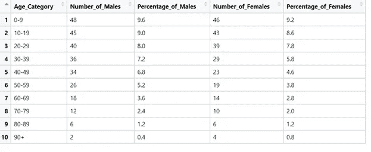
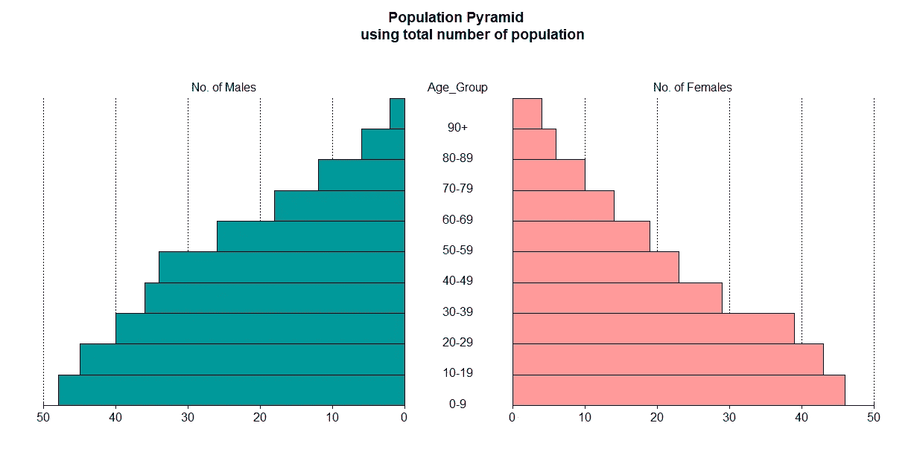
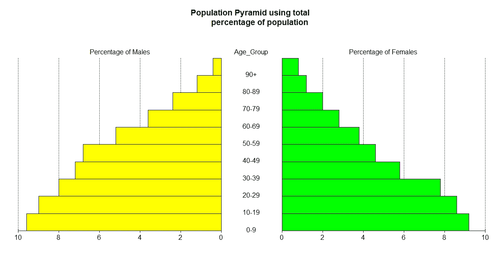
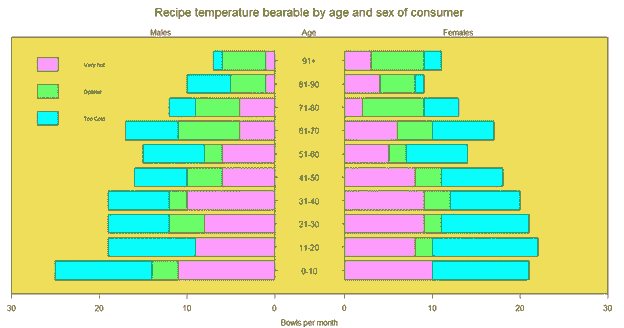

# 人口金字塔——使用 R

> 原文：<https://pub.towardsai.net/population-pyramid-interesting-visualization-of-population-statistics-using-r-a16d60b0da15?source=collection_archive---------2----------------------->

## [数据可视化](https://towardsai.net/p/category/data-visualization)


尤金·特卡琴科拍摄的 Unsplash 照片

T 当我们试图通过视觉来解决和交流技术复杂性时,“一张图片胜过千言万语”这句谚语总是受到考验。这些视觉效果总是倾向于增加对挑战的理解和感知，并奖励我们以前从未想过的洞察力。开发这种可视化背后的驱动力是从数据中挤出最大的价值和信息，以供进一步分析。事实上，这是所有专家在各自领域的最高目标。

“人口金字塔”就是这样一种形象。

但是

这些人口金字塔是什么？

和

它们带来了什么好处？

让我们详细了解一下。

人口统计学家广泛使用人口金字塔作为了解特定区域内人口组成或结构的工具。区域可以代表一个城市、一个国家、一个地区或一个全球。生态学家、社会学家和经济学家也在他们的学科/领域广泛使用它们来研究和比较人口。

**定义:人口金字塔**

> 人口金字塔是给定时间段内选定人口的年龄和性别构成/分布的解释性图形表示。
> 
> 它们通常也被称为年龄-性别金字塔或年龄-性别图，因为它们具体代表了选定空间内人口的年龄和性别结构。金字塔的名字来源于它们通常的形状，大部分是三角形。然而，根据人口的年龄和性别构成，形状会有所不同。

**人口金字塔的特征**

1.人口金字塔显示了划分为不同年龄组的总人口，这些年龄组又进一步细分为男性和女性。

2.金字塔代表了人口构成的不同组成组群。

3.一般来说，可以根据年龄-性别分布创建三种类型的人口金字塔——扩张型、收缩型和稳定型。

4.膨胀代表人口的较大数量或百分比

在较年轻的年龄组，紧缩显示较低的数字或

年轻年龄组和固定年龄组的人口百分比

接近平稳表示以下各项的数量或百分比大致相等

几乎所有年龄段。

5.该图从底部(金字塔的底部)最年轻的年龄组开始，到顶部(金字塔的顶点)最年长的年龄组。

6.人口生育率是影响金字塔形状的最重要参数，因为每位父母生育的子女数量越多，金字塔的基数就越大，人口的中位年龄就越年轻。

7.死亡率也会对形状产生影响，但影响比生育率小得多，但也更复杂。

8.底部较宽的金字塔意味着较年轻的年龄组在人口中占相当大的比例，而顶部较窄或较尖意味着较老的年龄组在人口中占相当小的比例。

**人口金字塔的好处**

1.人口金字塔提供了大量关于生育率、死亡率、移民、男女比例、受抚养人人数(儿童、老人等)的信息。)，以及所选区域范围内的其他人口动态。

2.它们揭示了人口在一段时间内的增长或下降，并为跟踪和填充因重大事件(如疾病、灾难和其他危机)引起的重大人口变化奠定了基础。这反过来又使研究人员能够根据模式预测经济需求，表明该地区的发展水平状况，并能够方便地比较未来和历史趋势。

3.人口金字塔对于检查历史和当前人口趋势以及预测未来趋势以规划未来发展非常有用。反过来，这有助于政府和私营部门根据人口需求规划特定地区的服务分配。

4.多个人口金字塔可用于比较不同国家或选定人口群体的模式。

5.人口金字塔是非常方便的工具，并提供非常有效的图形表示。他们最大的优势在于几乎每个人都容易理解，不管他们的统计和数学技能如何。

**解读人口金字塔**

人口金字塔包含相互堆叠的成对背靠背条形图，以显示每个年龄组中男性和女性的数量或百分比。代表遵循一个惯例，男性显示在左侧，女性显示在右侧。横轴表示人口的数量或百分比，纵轴表示年龄组。有一条垂直线位于中央(即图的中间)，将男性代表与女性代表分开。年龄通常分为 5 岁左右。最下面的条形代表最年轻的年龄组，最上面的条形代表最年长的年龄组。水平条的长度描述了所选人群中特定年龄组中男性或女性的数量或百分比。如果女性较多，中轴右侧的条形比右侧的条形长，反之亦然。

如果人口金字塔用于比较，那么按照相同的比例绘制人口金字塔是很重要的，并且还应该描绘相同的年龄类别。

更进一步，让我们现在讨论如何使用“R”语言创建这样的金字塔？

**方法 1(使用‘R’中的‘金字塔’包)**

```
*#Building Population pyramid*
*#install.packages("pyramid")*
library(pyramid)
library(utils)*# Read Population pyramid data frame*
Pyramid_DF <- read_xlsx("Pyramid_data_frame.xlsx" )View(Pyramid_DF)*# Building pyramid based on Number of Males and Females*
Pyramid_DF1 <- data.frame(Pyramid_DF$Number_of_Males,Pyramid_DF$Number_of_Females,Pyramid_DF$Age_Category)pyramid(Pyramid_DF1, Rcol="#FF9999", Lcol = "#009999",main = "Population Pyramid 
        using total number of population",
        Llab="No. of Males", Rlab="No. of Females", Clab="Age_Group")*# Building pyramid based on Percentage of Males and Females*
Pyramid_DF2 <- data.frame(Pyramid_DF$Percentage_of_Males,Pyramid_DF$Percentage_of_Females,Pyramid_DF$Age_Category)pyramid(Pyramid_DF2, Rcol="green", Lcol = "yellow",main = "Population Pyramid using total 
        percentage of population",
        Llab="Percentage of Males", Rlab="Percentage of Females", Clab="Age_Group")
```

表格形式的数据框表示



人口金字塔截图



图像描绘了总人口的人口金字塔(男性+女性的数量)



图像描绘了总人口的人口金字塔(男性+女性的百分比)

**方法 2(使用‘R’中的‘plotrix’包)**

```
library(plotrix)
Male.pop<-c(3.2,3.5,3.6,3.6,3.5,3.5,3.9,3.7,3.9,3.5,3.2,2.8,2.2,1.8,
            1.5,1.3,0.7,0.4)
Female.pop<-c(3.2,3.4,3.5,3.5,3.5,3.7,4,3.8,3.9,3.6,3.2,2.5,2,1.7,1.5,
              1.3,1,0.8)
agelabels<-c("0-4","5-9","10-14","15-19","20-24","25-29","30-34",
             "35-39","40-44","45-49","50-54","55-59","60-64","65-69","70-74",
             "75-79","80-44","85+")
mcol<-color.gradient(c(0,0,0.5,1),c(0,0,0.5,1),c(1,1,0.5,1),18)
fcol<-color.gradient(c(1,1,0.5,1),c(0.5,0.5,0.5,1),c(0.5,0.5,0.5,1),18)
par(mar=pyramid.plot(Male.pop,Female.pop,labels=agelabels,
                     main="Population pyramid",lxcol=mcol,rxcol=fcol,
                     gap=0.5,show.values=TRUE))
# three column matrices (Expanding pyramid beyond male-female numbers )
avtemp<-c(seq(11,2,by=-1),rep(2:6,each=2),seq(11,2,by=-1))
malechef<-matrix(avtemp+sample(-2:2,30,TRUE),ncol=3)
femalechef<-matrix(avtemp+sample(-2:2,30,TRUE),ncol=3)
# group by age
agegrps<-c("0-10","11-20","21-30","31-40","41-50","51-60",
           "61-70","71-80","81-90","91+")
oldmar<-pyramid.plot(malechef,femalechef,labels=agegrps,
                     unit="Bowls per month",lxcol=c("#ff99ff","#66ff66","#00ffff"),
                     rxcol=c("#ff99ff","#66ff66","#00ffff"),laxlab=c(0,10,20,30),
                     raxlab=c(0,10,20,30),top.labels=c("Males","Age","Females"),gap=4,
                     do.first="plot_bg(\"#eedd55\")")
# put a box around it
box()# giving  a title
mtext("Recipe temperature bearable by age and sex of consumer",3,2,cex=1.5)
# Putting a legend
legend(par("usr")[1],11,c("Very hot","Optimal","Too Cold"),
       fill=c("#ff99ff","#66ff66","#00ffff"), bty = 'n',cex = 0.7)
# Restore the margins and background
par(mar=oldmar,bg="transparent")
```

人口金字塔截图



图像描绘了根据人口承受的配方温度进一步扩展的总人口的人口金字塔

我希望通过上面的代码和视觉效果，这个概念是清晰的。

**最后的想法**

在处理年龄性别分布时，人口金字塔是非常方便的工具，经常被人口学家、研究人员、生态学家、社会学家等使用。它们提供了非常有效的图形演示。也许他们最大的优点是，不管统计和数学技能如何，他们很容易被几乎每个人理解。

感谢阅读！！！

你可以在媒体上跟踪我

LinkedIn: [Supriya Ghosh](https://www.linkedin.com/in/supriya-ghosh)

还有推特: [@isupriyaghosh](https://twitter.com/isupriyaghosh)