# 使用 Python 进行投资组合管理——投资组合分配

> 原文：<https://pub.towardsai.net/portfolio-management-using-python-part-1-portfolio-allocation-df0fe9147ab?source=collection_archive---------3----------------------->

## [编程](https://towardsai.net/p/category/programming)

## 了解投资组合分配并通过 Python 语言实现它的指南。


照片由克莱班克斯( [Unsplash](https://unsplash.com/photos/TuVChJ1P0IY) )拍摄

# 什么是投资组合？

金融投资的集合就是一个投资组合。金融投资可以是现金、股票、债券、商品和任何其他现金等价物。

# 什么是投资组合配置？

根据用户的投资目标、风险容忍度和投资期限平衡投资组合资产的风险和回报的投资策略称为投资组合配置。

# 如何用 python 实现？

**→进口包装**

熊猫之类的基本包会进口。与它一起，Quandl 包被导入以获取数据。

```
**>>> import** pandas **as** pd
**>>> import** quandl
**>>> import** matplotlib.pyplot **as** plt
**>>> %**matplotlib inline
```

**→数据**

开始和结束日期已确定，在此期间将提取和处理数据。

```
>>> start **=** pd.to_datetime('2014-01-01')
>>> end **=** pd.to_datetime('2016-01-01')
```

然后提取三家公司的数据。他们是脸书、苹果和推特。由于将使用第 11 列来完成分析，因此获得了调整为关闭的第 11 列。

```
>>> fb **=** quandl.get('WIKI/FB.11',start_date**=**start, end_date**=**end)
>>> twtr **=** quandl.get('WIKI/TWTR.11',start_date**=**start, end_date**=**end)
>>> aapl **=** quandl.get('WIKI/AAPL.11',start_date**=**start, end_date**=**end)>>> fb.head()
```

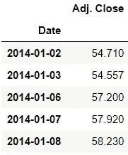

```
>>> twtr.head()
```

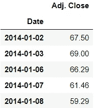

```
>>> aapl.head()
```

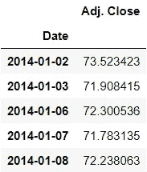

**→查找退货**

因此，首先将计算标准化回报，即每个指数的调整后收盘值除以调整后收盘值的初始值。

```
**>>> for** s_df **in** (fb,twtr,aapl):
        s_df['Normalized Return'] **=** s_df['Adj. Close']**/**s_df.iloc[0]['Adj. Close']>>> fb.head()
```

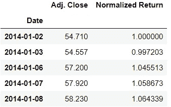

**→分配**

现在让我们假设这三只股票的分配。50%的资金分配给脸书股票，30%的资金分配给 Twitter 股票，20%的资金分配给苹果股票。所以现在分配是通过百分比乘以收益得出的。

```
**>>> for** s_df, allocation **in** zip((fb,twtr,aapl),[0.5,0.3,0.2]):
        s_df['Allocation'] **=** s_df['Normalized Return']*****allocation>>> fb.head()
```

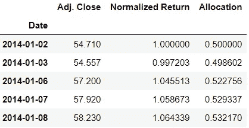

**→位置值**

假设投入 10 万卢比。因此，根据这一点，将计算位置值，这是分配和投资的乘积。

```
>>> investment **=** 100000**>>> for** s_df **in** (fb,twtr,aapl):
        s_df['Position value'] **=** s_df['Allocation'] ***** investment>>> fb.head()
```

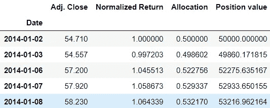

因此，可以得出的结论是，在 2014 年 1 月 2 日，50000/-被分配给脸书，然后在股票下跌的第二天，这笔钱变成大约 49860/-在第三天，它再次上升到大约 52275/-。以此类推，随着日子的变化，钱的价值不断上升和下降。

现在让我们看看所有股票的头寸价值。

```
>>> position_values **=** pd.concat([fb['Position value'],
>>> twtr['Position value'],aapl['Position value']],axis**=**1)>>> position_values.head()
```


```
>>> position_values.columns **=** ['Facebook position values','Twitter position values', 'Apple position values']>>> position_values.head()
```

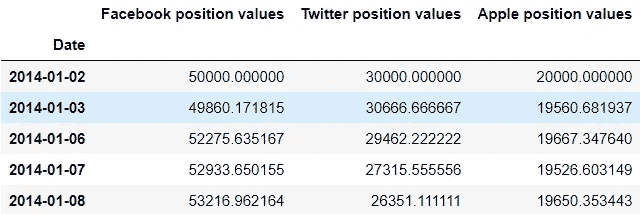

现在可以通过对所有股票头寸值求和来计算总头寸。

```
>>> position_values['Total position value'] **=** position_values.sum(axis**=**1)>>> position_values.head()
```

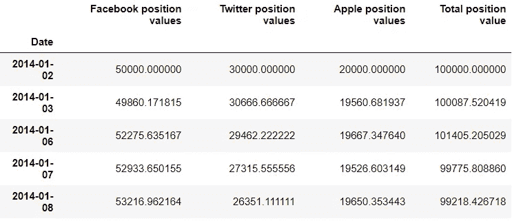

```
>>> position_values.tail()
```

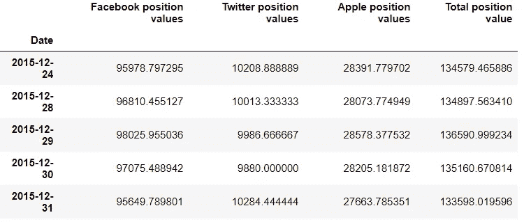

因此，从上述价值观来看，投资脸书和苹果将被证明是有益的，因为投资会带来更多回报。但是投资 Twitter 是亏损的。

**→绘图**

所以记住最初的投资是 10 万卢比，通过绘图，我们可以想象到期末这笔钱是增加了还是减少了，以及它的趋势。

```
>>> position_values['Total position value'].plot(figsize**=**(10,8))
>>> plt.title('Total portfolio value')
```

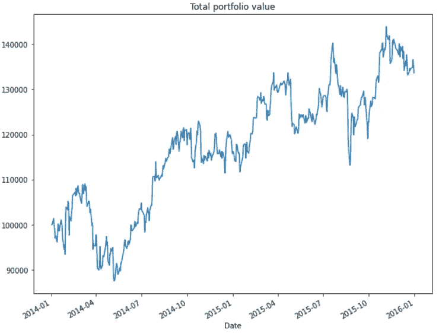

所以到期末，钱的价值大约是 130 万卢比。

股票位置值也可以单独绘制，以了解股票如何增长。

```
>>> position_values.drop('Total position value',axis**=**1).plot(figsize**=**(10,8))
```

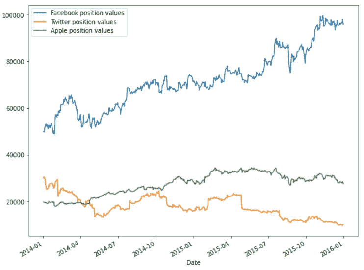

所以脸书的股票呈上升趋势，而其他两只股票没有太大的变化。事实上，Twitter 有下滑的趋势。

**→投资组合统计**

可以计算各种统计数据，如每日回报、平均每日回报和标准差。这些统计数据也有助于确定夏普比率。

```
>>> position_values.head()
```

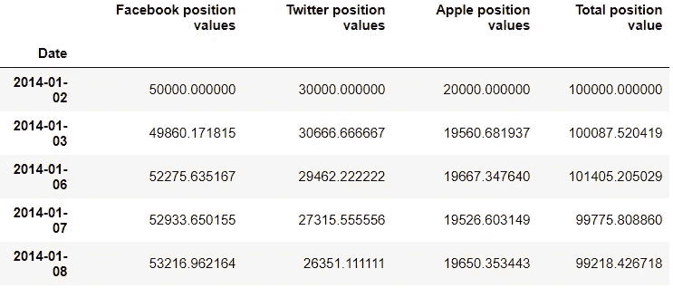

为了计算每日回报，将使用 pandas 函数“pct_change”。它计算当前元素和前一个元素之间的百分比变化。要移动的周期为 1。

```
>>> position_values['Daily return'] **=** position_values['Total position value'].pct_change(1)
>>> position_values.head()
```

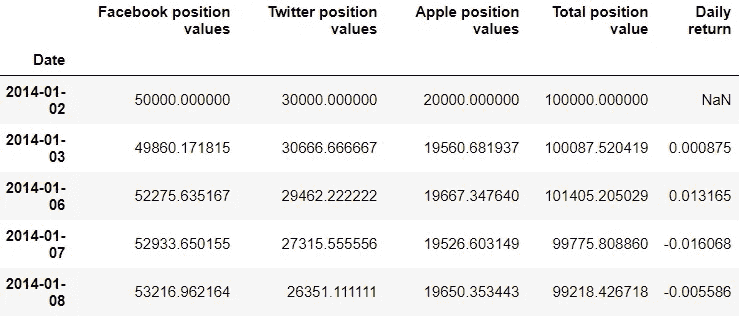

平均日收益率可以通过对日收益率调用 mean()函数得到。

```
>>> position_values['Daily return'].mean()
0.0007122766289206966
```

标准差可以通过调用每日回报的“std()”函数来计算。

```
>>> position_values['Daily return'].std()
0.01651000095519752
```

**→夏普比率**

夏普比率是每单位波动率的无风险利率的平均回报率。波动性是投资组合价格的波动。夏普比率有助于确定与风险相比的投资回报。

夏普比率的值越大，风险调整后的回报就越有吸引力。夏普比率的公式为:

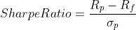

**其中:**

Rp=投资组合的回报

Rf =无风险利率

*σp*=投资组合超额收益的标准差

这里单位无风险利率被认为是 0。

```
>>> sharpe_r **=** position_values['Daily return'].mean()**/**position_values['Daily return'].std()
>>> sharpe_r
0.04314213129687704
```

年度夏普比率可以通过将“k”值乘以夏普比率来计算。“k”值是营业天数的根。有 252 天进行贸易业务，因此 k=252。

```
>>> annual_sharpe_r **=** sharpe_r ***** (252******0.5)
>>> annual_sharpe_r
0.6848601026449987
```

夏普比率大于 1 通常被认为是一个好的值。高于 2 比率很好，高于 3 的比率很好。

> *参考笔记本* [*此处*](https://github.com/jayashree8/Finance_Trading_In_Python/blob/main/Portfolio%20management/Portfolio%20allocation.ipynb) *。*

> *联系我:*[*LinkedIn*](https://www.linkedin.com/in/jayashree-domala8/)
> 
> *查看我的其他作品:* [*GitHub*](https://github.com/jayashree8)