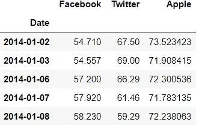
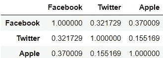
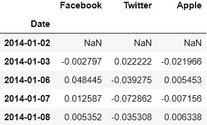
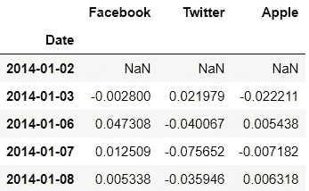
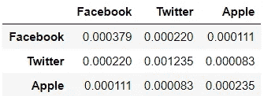
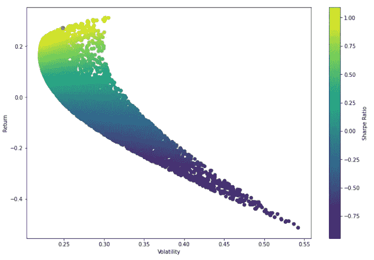
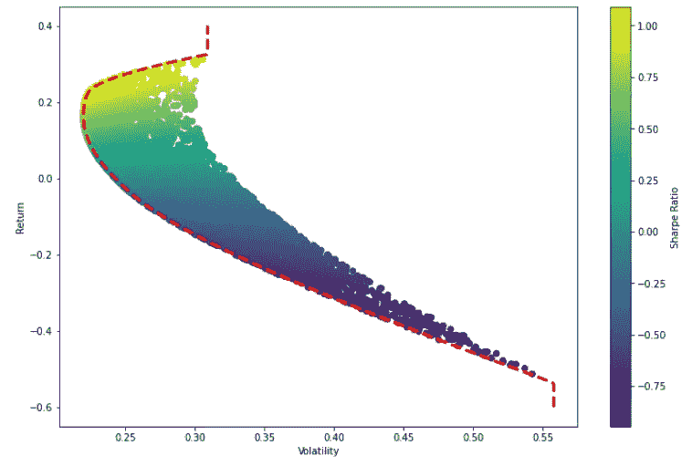

# 使用 Python 进行投资组合管理——投资组合优化

> 原文：<https://pub.towardsai.net/portfolio-management-using-python-portfolio-optimization-8a90dd2a21d?source=collection_archive---------1----------------------->

## [数据分析](https://towardsai.net/p/category/data-analysis)，[编程](https://towardsai.net/p/category/programming)

## 了解投资组合优化并通过 Python 语言实现它的指南。


斯科特·格雷厄姆摄( [Unsplash](https://unsplash.com/photos/5fNmWej4tAA)

# 什么是投资组合优化？

投资组合优化是从所有投资组合中选择最佳投资组合的过程。

# 投资组合优化是怎么做的？

天真的方法是选择一组随机分配，并找出哪一个具有最好的夏普比率。这被称为蒙特卡罗模拟，其中随机地给投资组合中的每种证券分配一个权重，然后计算平均每日回报和每日回报的标准差。这有助于计算随机选择的分配的夏普比率。

要了解更多夏普比率，请查看我以前的文章:

[](https://jayashree8.medium.com/portfolio-management-using-python-part-1-portfolio-allocation-df0fe9147ab) [## 使用 Python 的项目组合管理:第 1 部分——项目组合分配

### 了解投资组合分配并通过 Python 语言实现它的指南。

jayashree8.medium.com](https://jayashree8.medium.com/portfolio-management-using-python-part-1-portfolio-allocation-df0fe9147ab) 

但天真的方法是花时间，所以使用优化算法，工作在极小值的概念。夏普比率越高，风险调整后的回报越高，投资组合选择越好。因此直觉是最大化夏普比率，这意味着优化器应该最小化负夏普比率。优化算法将根据夏普比率为投资组合分配最佳权重。

# 如何用 Python 实现？

**→导入包**

像 pandas、numpy 和 matplotlib 这样的基础包都是导入的。导入 quandl 包是为了获取数据。

```
**>>> import** numpy **as** np
**>>> import** pandas **as** pd
**>>> import** matplotlib.pyplot **as** plt
**>>> import** quandl
**>>> %**matplotlib inline
```

**→数据**

开始和结束日期已确定，在此期间将提取和处理数据。

```
>>> start **=** pd.to_datetime('2014-01-01')
>>> end **=** pd.to_datetime('2016-01-01')
```

然后提取了脸书、苹果和 Twitter 三家公司的数据。由于将对第 11 列进行分析，因此将获得调整为关闭的第 11 列。然后，这 3 只股票被组合成一个单一的数据框架。

```
>>> fb **=** quandl.get('WIKI/FB.11',start_date**=**start, end_date**=**end)
>>> twtr **=** quandl.get('WIKI/TWTR.11',start_date**=**start, end_date**=**end)
>>> aapl **=** quandl.get('WIKI/AAPL.11',start_date**=**start, end_date**=**end)>>> df **=** pd.concat([fb,twtr,aapl],axis**=**1)
>>> df.columns **=** ['Facebook','Twitter','Apple']>>> df.head()
```



**→统计**

1)平均每日回报

使用百分比变化函数，可以找到股票的平均日收益率。

```
>>> df.pct_change(1).mean()Facebook    0.001480
Twitter    -0.001520
Apple       0.000762
dtype: float64
```

2)股票之间的相关性

利用平均日收益率，可以确定股票之间的相关性。

```
>>> df.pct_change(1).corr()
```



3)算术回报

百分比变化法给出了算术回报。

```
>>> arith_returns **=** df.pct_change(1)
>>> arith_returns.head()
```



4)对数收益

对数函数给出对数回报。

```
>>> log_returns **=** np.log(df**/**df.shift(1))
>>> log_returns.head()
```



> 要了解算术回报和对数回报之间的区别以及为什么使用对数回报，请查看下面的文章:

[](https://chandlerfang.com/2017/01/09/arithmetic-vs-logarithmic-rates-of-return/) [## 算术回报率与对数回报率

### 假设你持有一支从 100 美元涨到 105 美元的股票。通常，这被报道为 5%的回报。…的公式

chandlerfang.com](https://chandlerfang.com/2017/01/09/arithmetic-vs-logarithmic-rates-of-return/) 

5)协方差

协方差函数给出协方差。

```
>>> log_returns.cov()
```



# 优化方法——随机化

**→给股票分配随机权重**

权重被随机分配给股票，并确保它们的总和为 1。为了确保它们加起来等于 1，通过除以权重之和来重新平衡权重。

```
>>> print('The stocks are: ',df.columns)
>>> np.random.seed(200)
>>> weights **=** np.array(np.random.random(3))
>>> weights **=** weights**/**np.sum(weights)
>>> print('Random weights: ',weights)The stocks are:  Index(['Facebook', 'Twitter', 'Apple'], dtype='object')
Random weights:  [0.53580931 0.12809422 0.33609646]
```

**→寻找预期收益**

预期收益是以对数的形式给出的。回报乘以权重，然后乘以工作日数，即 252。

```
>>> expected_return **=** np.sum((log_returns.mean()***** weights) ***** 252)
>>> expected_return0.16004629405548906
```

**→求期望方差**

预期差异表示波动性。将 252 天的协方差乘以权重，然后与权重进行点积。然后最后求平方根。

```
>>> expected_vol **=** np.sqrt(np.dot(weights.T,np.dot(log_returns.cov()*****252,weights)))
>>> expected_vol0.24233721586475374
```

**→寻找夏普比率**

夏普比率是预期收益和预期波动性的比值。

```
>>> sharpe_r **=** expected_return**/**expected_vol
>>> sharpe_r0.6604280464491656
```

分配随机权重来寻找夏普比率的整个过程只进行了一次。但理想情况下，我们需要用不同的权重组合多次重复这个过程，以找到最佳分配。因此，整个过程使用“for”循环运行多次。

```
>>> np.random.seed(200)*# Initalization of variables* >>> portfolio_number **=** 7000
>>> weights_total **=** np.zeros((portfolio_number,len(df.columns)))
>>> returns **=** np.zeros(portfolio_number)
>>> volatility **=** np.zeros(portfolio_number)
>>> sharpe **=** np.zeros(portfolio_number)**>>> for** i **in** range(portfolio_number):
        *# Random weights* weights **=** np.array(np.random.random(3))
        weights **=** weights**/**np.sum(weights)
        *# Append weight* weights_total[i,:] **=** weights *# Expected return* returns[i] **=** np.sum((log_returns.mean()***** weights) ***** 252) *# Expected volume* volatility[i] **=** np.sqrt(np.dot(weights.T,
        np.dot(log_returns.cov()*****252,weights))) *# Sharpe ratio* sharpe[i] **=** returns[i]**/**volatility[i]
```

夏普比率数组中的最大值与其索引一起被找到。夏普比率的最大值表示分配的最佳组合。

```
>>> max_sharpe **=** sharpe.max()
>>> max_sharpe
1.091492698172807>>> max_sharpe_index **=** sharpe.argmax()
>>> max_sharpe_index
343
```

权重、回报和波动性是在夏普比率最大的指数上找到的。

```
>>> max_sharpe_weights **=** weights_total[343,:]
>>> max_sharpe_weights
array([6.71707148e-01, 2.83931652e-04, 3.28008920e-01])>>> max_sharpe_return **=** returns[max_sharpe_index]
>>> max_sharpe_return
0.2714466221609141>>> max_sharpe_vol **=** volatility[max_sharpe_index]
>>> max_sharpe_vol
0.24869302617903377
```

**→情节**

根据得出的夏普比率绘制回报率与波动率的关系图，得出子弹形图。与此同时，夏普比率最高的点标有一个红点。

```
>>> plt.figure(figsize**=**(12,8))
>>> plt.scatter(volatility,returns,c**=**sharpe)
>>> plt.colorbar(label**=**'Sharpe Ratio')
>>> plt.xlabel('Volatility')
>>> plt.ylabel('Return')>>> plt.scatter(max_sharpe_vol,max_sharpe_return,c**=**'red',s**=**50)
```



# 优化方法—数学

定义了一个函数，它接受权重并返回回报、波动率和夏普比率。

```
**>>> def** stats(weights):
        weights **=** np.array(weights)
        expected_return **=** np.sum((log_returns.mean()***** 
        weights) ***** 252)
        expected_vol **=** np.sqrt(np.dot(weights.T,
        np.dot(log_returns.cov()*****252,weights)))
        sharpe_r **=** expected_return**/**expected_vol
        **return** np.array([expected_return,expected_vol,sharpe_r])
```

python SciPy 模块将用于创建数学优化函数。

```
**>>> from** scipy.optimize **import** minimize
```

优化思想是最小化负夏普比率。因此创建了一个函数，该函数否定了使用上面创建的函数获得的夏普比率。

```
**>>> def** sr_negate(weights):
        neg_sr **=** stats(weights)[2] ***** **-**1
        **return** neg_sr
```

接下来，必须检查权重之和等于 1 的条件。因此为此也创建了一个函数。权重相加，然后减 1。如果返回值为 0，则总和为 1。

```
**>>> def** weight_check(weights):
        weights_sum **=** np.sum(weights)
        **return** weights_sum **-** 1
```

接下来要做的是定义约束、界限和初始猜测。约束接受一个字典元组，其中第一个元素将类型描述为一个方程(因为“weight_check”函数通过求解一个方程返回值)，第二个元素将函数描述为“weight_check”。由于权重可以在 0 到 1 的范围内，因此相应地设置了界限，并且还提到了初始猜测。

```
>>> constraints **=** ({'type':'eq','fun':weight_check})
>>> bounds **=** ((0,1),(0,1),(0,1))
>>> initial_guess **=** [0.3,0.3,0.4]
```

现在所有这些变量都通过了 scipy 的最小化函数。它采用必须最小化的函数，接着是初始猜测，然后是用于执行最小化的求解器。所用的解算器将是序列最小二乘规划(SLSQP)解算器，因为它用于最基本的任务。然后还提到了边界和约束。

```
>>> results **=** minimize(sr_negate,initial_guess,method**=**'SLSQP',
    bounds**=**bounds,constraints**=**constraints)
>>> resultsfun: -1.0927303413720688
     jac: array([ 1.26287341e-04,  2.89727578e+00, -2.90006399e-04])
 message: 'Optimization terminated successfully'
    nfev: 20
     nit: 5
    njev: 5
  status: 0
 success: True
       x: array([6.96661817e-01, 3.01299784e-15, 3.03338183e-01])
```

现在，值“x”包含权重的优化分配，它被提取出来，然后通过“stats”函数传递，该函数返回回报率、波动率和夏普比率。

```
>>> wt **=** results.x
>>> wt
array([6.96661817e-01, 3.01299784e-15, 3.03338183e-01])>>> stats(wt)
array([0.27569923, 0.25230308, 1.09273034])
```

**→绘制有效边界**

有效边界是一组最优投资组合，对于给定的预期回报水平，这些投资组合具有最高的预期回报和最低的风险。

设置边界水平(回报水平),对于 200 个点取值从-0.6 到 0.4，因为先前获得的子弹形图上的回报具有相同的范围。

```
>>> frontier_return **=** np.linspace(**-**0.6,0.4,200)
```

然后，下一步必须最小化易失性，为其定义一个函数，该函数将在稍后定义约束时使用。

```
**>>> def** min_vol(weights):
        vol **=** stats(weights)[1]
        **return** vol
```

接下来要做的是迭代通过边界，也就是收益，通过调用 scipy minimize 函数计算每个收益的最小波动率。定义约束条件时，会检查权重，并找出回报和预期回报之间的差异。和最初的猜测一样，方法和界限保持不变。minimize 函数返回一个函数值，它是最小的易失性，它将被保存在一个数组中。

```
>>> frontier_volatility **=** []**>>> for** exp_return **in** frontier_return:
        constraints **=** ({'type':'eq','fun':weight_check},{'type':'eq','fun':**lambda** x: stats(x)[0]**-**exp_return})
        result **=** minimize(min_vol,initial_guess,method**=**'SLSQP',
        bounds**=**bounds,constraints**=**constraints)
        frontier_volatility.append(result['fun'])
```

现在使用前沿回报和波动数组，有效前沿可以和之前用子弹形图得到的最初猜测一起画出来。

```
>>> plt.figure(figsize**=**(12,8))
>>> plt.scatter(volatility,returns,c**=**sharpe)
>>> plt.colorbar(label**=**'Sharpe Ratio')
>>> plt.xlabel('Volatility')
>>> plt.ylabel('Return')>>> plt.plot(frontier_volatility,frontier_return,'r--',linewidth**=**3)
```



有效边界告诉我们，对于每个期望的波动水平，可以获得的最佳回报是什么。

> *这里指笔记本*[](https://github.com/jayashree8/Finance_Trading_In_Python/blob/main/Portfolio%20management/Portfolio%20optimization.ipynb)**。**

> **联系我:*[*LinkedIn*](https://www.linkedin.com/in/jayashree-domala8/)*
> 
> **查看我的其他作品:* [*GitHub*](https://github.com/jayashree8)*